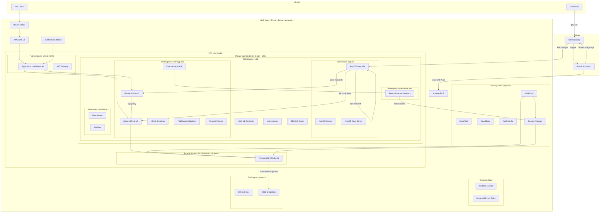
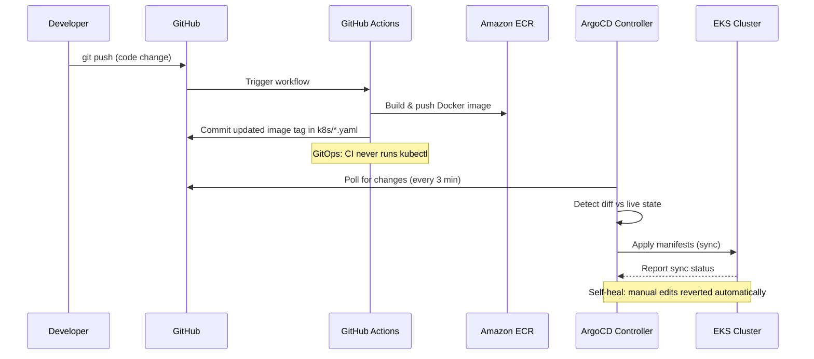
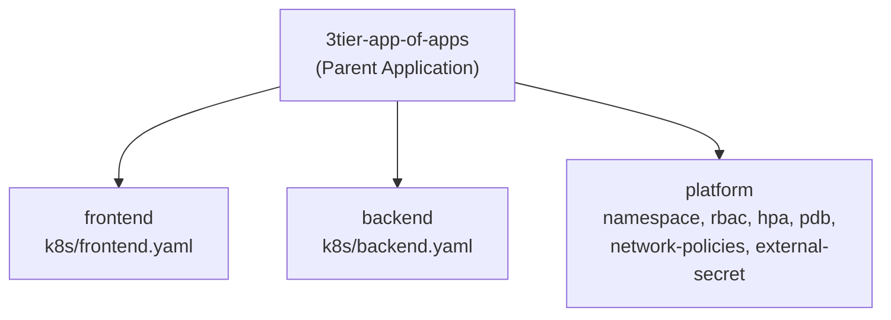
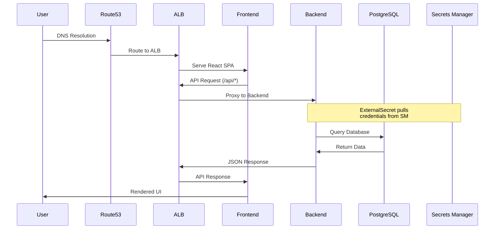
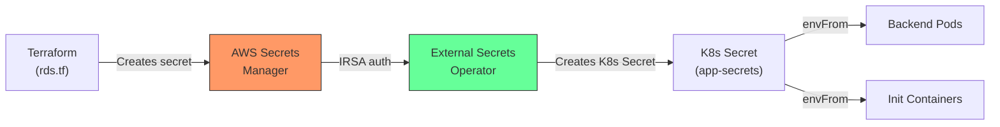

# Architecture Design Document

## 3-Tier DevOps Quiz Application on AWS EKS

**Author:** Pushparaj Naik | **Version:** 2.0 | **Date:** 2026-04-29

---

## 1. Executive Summary

This document describes the architecture of a production-ready 3-tier web application deployed on AWS EKS with a **GitOps** workflow powered by ArgoCD. The system consists of a React frontend, Flask REST API backend, and PostgreSQL database, designed with AWS Well-Architected Framework principles and regulatory compliance (GDPR, SOC2, EU/USA regulations).

**What changed in v2.0:** Added ArgoCD-based GitOps deployment model, External Secrets Operator, remote Terraform state, and GitHub Actions CI/CD pipeline.

## 2. Architecture Diagram

## 3. GitOps Architecture

### App-of-Apps Pattern

| Component | ArgoCD App | Source Path | Auto-Sync | Self-Heal |
|---|---|---|---|---|
| Parent | `3tier-app-of-apps` | `argocd/apps/` | ✅ | ✅ |
| Frontend | `frontend` | `k8s/frontend.yaml` | ✅ | ✅ |
| Backend | `backend` | `k8s/backend.yaml` | ✅ | ✅ |
| Platform | `platform` | `k8s/*.yaml` (shared) | ✅ | ✅ |

## 4. Well-Architected Framework Alignment

### 4.1 Security Pillar

| Control | Implementation |
|---------|---------------|
| Encryption at Rest | KMS for RDS, EKS secrets, EBS volumes, S3 buckets |
| Encryption in Transit | TLS via ACM + ALB, inter-service HTTPS |
| Identity & Access | IRSA for service accounts, OIDC for CI/CD |
| Network Security | Private subnets, Security Groups, Network Policies |
| Secrets Management | **External Secrets Operator → AWS Secrets Manager** (no base64 in Git) |
| Audit Logging | CloudTrail (multi-region), VPC Flow Logs |
| Threat Detection | GuardDuty with K8s audit logs |
| Key Rotation | Automatic KMS key rotation enabled |
| State Security | **S3 with KMS encryption + DynamoDB locking** |

### 4.2 Reliability Pillar

| Control | Implementation |
|---------|---------------|
| Multi-AZ | RDS Multi-AZ (prod), EKS across 2 AZs |
| Auto-scaling | HPA (CPU 50%, Memory 70%), 2-5 replicas |
| Pod Disruption | PDB with minAvailable=1 |
| Health Checks | Liveness + Readiness probes on all pods |
| Backup & Recovery | 7-day RDS retention, cross-region snapshots |
| DR Strategy | RPO < 1hr, RTO < 4hr (see Section 7) |
| **Drift Detection** | **ArgoCD self-healing — reverts manual changes automatically** |
| **State Locking** | **DynamoDB prevents concurrent Terraform runs** |

### 4.3 Operational Excellence

| Control | Implementation |
|---------|---------------|
| IaC | 100% Terraform with modules |
| **GitOps** | **ArgoCD App-of-Apps — Git is single source of truth** |
| **CI/CD** | **GitHub Actions → ECR → Git commit → ArgoCD sync** |
| Monitoring | Prometheus + Grafana stack |
| Alerting | CloudWatch alarms (RDS CPU, storage) |
| Logging | EKS control plane logs (90-day retention) |
| **Continuous Reconciliation** | **ArgoCD polls every 3 min, reverts drift** |

### 4.4 Cost Optimization

| Control | Implementation |
|---------|---------------|
| Right-sizing | t3.medium nodes, db.t3.micro RDS |
| Auto-scaling | HPA prevents over-provisioning |
| Storage | gp3 volumes (20% cheaper than gp2) |
| Environment-aware | Conditional Multi-AZ, deletion protection |
| **State Storage** | **S3 with PAY_PER_REQUEST DynamoDB** |

### 4.5 Performance Efficiency

| Control | Implementation |
|---------|---------------|
| Caching | Nginx static file serving with try_files |
| Load Balancing | ALB with path-based routing |
| Resource Limits | CPU/memory requests and limits set |
| Performance Insights | RDS Performance Insights enabled |
| **Storage Driver** | **EBS CSI driver for persistent volumes** |

## 5. Compliance Matrix

| Regulation | Requirement | Implementation |
|-----------|-------------|----------------|
| **GDPR** | Data encryption | KMS encryption at rest, TLS in transit |
| **GDPR** | Audit trail | CloudTrail with 365-day retention |
| **GDPR** | Data residency | Configurable region deployment |
| **GDPR** | Right to erasure | Database delete APIs available |
| **GDPR** | **No secrets in plaintext** | **External Secrets Operator (no base64 in Git)** |
| **SOC2** | Access control | RBAC, least-privilege IAM policies |
| **SOC2** | Monitoring | GuardDuty, CloudWatch, Prometheus |
| **SOC2** | Change management | **GitOps — all changes auditable via Git history** |
| **SOC2** | Incident response | SNS alerting, CloudWatch alarms |
| **SOC2** | **Configuration drift** | **ArgoCD self-healing — unauthorized changes reverted** |
| **EU/USA** | Network security | VPC isolation, Security Groups, Network Policies |
| **EU/USA** | Configuration compliance | AWS Config recorder |

## 6. Network Architecture

| Subnet | CIDR | Purpose | Access |
|--------|------|---------|--------|
| Public-1 | 10.0.1.0/24 | ALB, NAT Gateway | Internet-facing |
| Public-2 | 10.0.2.0/24 | ALB (Multi-AZ) | Internet-facing |
| Private-1 | 10.0.3.0/24 | EKS Worker Nodes | Via NAT Gateway |
| Private-2 | 10.0.4.0/24 | EKS Worker Nodes (Multi-AZ) | Via NAT Gateway |
| RDS-1 | 10.0.5.0/24 | PostgreSQL RDS | EKS subnets only |
| RDS-2 | 10.0.6.0/24 | PostgreSQL RDS (Multi-AZ) | EKS subnets only |

## 7. Disaster Recovery Strategy

| Parameter | Value |
|-----------|-------|
| **DR Tier** | Pilot Light |
| **RPO** | < 1 hour (automated RDS backups) |
| **RTO** | < 4 hours (Terraform re-deploy) |
| **Primary Region** | ap-south-1 (Mumbai) |
| **DR Region** | us-east-1 (N. Virginia) |

### Recovery Procedures

1. **Database**: Restore from latest automated snapshot or cross-region copy
2. **EKS**: Re-deploy via Terraform in DR region
3. **Application**: ArgoCD auto-syncs from Git — no manual `kubectl` needed
4. **Failback**: Reverse replication after primary recovery

## 8. Data Flow

## 9. Secrets Flow (External Secrets Operator)

**Security guarantees:**
- ❌ No secrets stored in Git (not even base64)
- ✅ Credentials fetched at runtime from AWS Secrets Manager
- ✅ Auto-rotated every 1 hour via `refreshInterval`
- ✅ Audit trail via CloudTrail
- ✅ KMS encryption for secrets at rest
