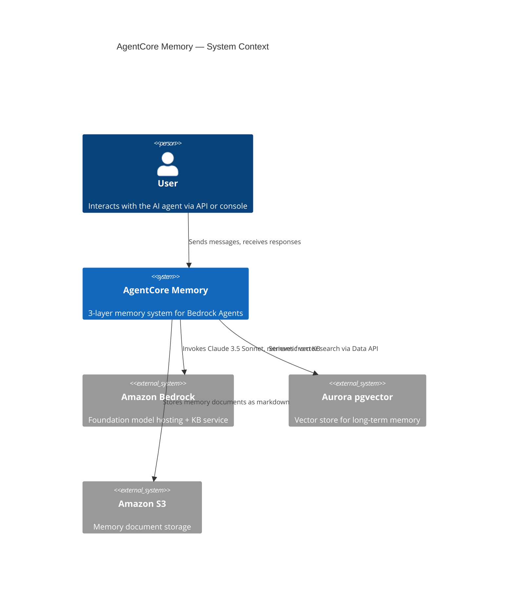
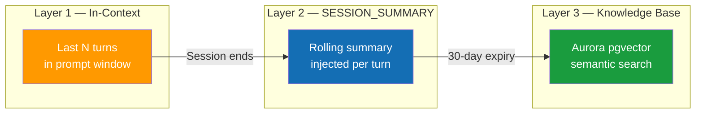
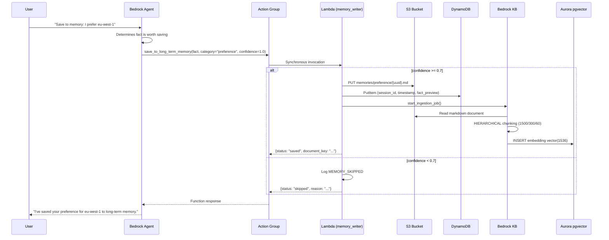
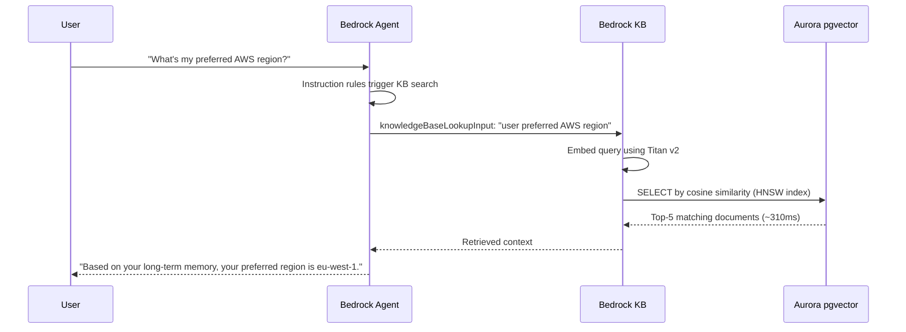
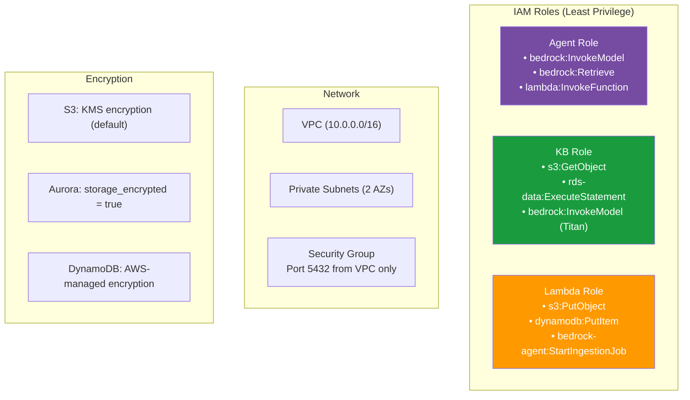

# Architecture Deep Dive — AWS AgentCore Memory

This document provides a C4-level deep dive into the 3-layer memory architecture, data flows, security model, and design rationale.

---

## Table of Contents

1. [System Context](#1-system-context)
2. [Memory Layer Model](#2-memory-layer-model)
3. [Layer 3 Pipeline — Save Flow](#3-layer-3-pipeline--save-flow)
4. [Layer 3 Pipeline — Retrieve Flow](#4-layer-3-pipeline--retrieve-flow)
5. [Aurora pgvector Schema](#5-aurora-pgvector-schema)
6. [HIERARCHICAL Chunking Strategy](#6-hierarchical-chunking-strategy)
7. [Agent Instruction Design](#7-agent-instruction-design)
8. [Security Architecture](#8-security-architecture)
9. [Observability Architecture](#9-observability-architecture)

---

## 1. System Context



The system is composed of 5 AWS services orchestrated by Terraform:

| Service | Role | Why This Service |
|---------|------|-----------------|
| **Bedrock Agent** | Orchestrates the 3-layer memory | Native SESSION_SUMMARY, KB integration |
| **Aurora Serverless v2** | Vector store (pgvector) | Data API support, Bedrock KB compatibility |
| **S3** | Memory document storage | Cheap, durable, KB data source |
| **Lambda** | Memory writer (action group) | Serverless, no idle cost, <30s execution |
| **DynamoDB** | Audit trail for memory events | Fast writes, TTL, on-demand billing |

---

## 2. Memory Layer Model

Each layer solves a different time-horizon problem:



### Layer 1 — In-Context Memory
- **Mechanism:** The model sees the last N turns directly in its input tokens
- **Latency:** 0ms (no additional retrieval)
- **Retention:** Current Lambda invocation only
- **Trade-off:** Free but ephemeral — resets between sessions

### Layer 2 — SESSION_SUMMARY
- **Mechanism:** Bedrock auto-generates a rolling summary and injects it into subsequent turns
- **Configuration:** Single HCL block:
  ```hcl
  memory_configuration {
    enabled_memory_types = ["SESSION_SUMMARY"]
    storage_days         = 30
  }
  ```
- **Latency:** Near-instant (injected by Bedrock, not a separate retrieval)
- **Retention:** Configurable, default 30 days
- **Trade-off:** Zero code required, but limited to within-session context

### Layer 3 — Long-Term Knowledge Base
- **Mechanism:** Facts saved by the agent persist in Aurora pgvector, searchable via Bedrock KB
- **Latency:** ~310ms (Aurora pgvector HNSW search + embedding)
- **Retention:** Indefinite (persists until explicitly deleted)
- **Trade-off:** Requires Lambda, S3, KB ingestion pipeline — but enables cross-session memory

---

## 3. Layer 3 Pipeline — Save Flow



### Key Design Points

1. **Synchronous invocation** — Bedrock waits for Lambda to respond. Not SQS-driven.
2. **Confidence gate at Lambda** — Prevents low-quality facts from polluting the KB.
3. **Markdown with YAML frontmatter** — Structured document format that Bedrock can chunk and embed.
4. **DynamoDB audit trail** — 90-day TTL, enables replay and debugging.

---

## 4. Layer 3 Pipeline — Retrieve Flow



---

## 5. Aurora pgvector Schema

```sql
-- Created by the db_init Lambda during terraform apply
CREATE EXTENSION IF NOT EXISTS vector;
CREATE SCHEMA IF NOT EXISTS bedrock_integration;

CREATE TABLE IF NOT EXISTS bedrock_integration.bedrock_kb (
    id          uuid PRIMARY KEY,
    embedding   vector(1536),    -- Titan v2 embedding dimensions
    chunks      text,             -- Chunked text content
    metadata    json              -- Source, category, confidence, etc.
);

CREATE INDEX IF NOT EXISTS bedrock_kb_embedding_idx
    ON bedrock_integration.bedrock_kb
    USING hnsw (embedding vector_cosine_ops);
```

### Why HNSW over IVFFlat?

| Index Type | Build Time | Query Time | Accuracy | Maintenance |
|-----------|------------|------------|----------|-------------|
| **HNSW** | Slower | **Faster** | **Higher** | None |
| IVFFlat | Faster | Slower | Lower | Needs `VACUUM` |

HNSW is the right choice for memory workloads: the dataset grows slowly (1 fact per user action) but queries must be fast (~310ms target).

---

## 6. HIERARCHICAL Chunking Strategy

```
┌─────────────────────────────────────────────────┐
│  Parent Chunk (max 1500 tokens)                 │
│  ┌──────────────┐  ┌──────────────┐             │
│  │ Child Chunk 1 │  │ Child Chunk 2 │  ...       │
│  │ (max 300 tok) │  │ (max 300 tok) │            │
│  └──────────────┘  └──────────────┘             │
│       ← 60 token overlap →                      │
└─────────────────────────────────────────────────┘
```

- **Search:** Bedrock searches the **child chunks** (300 tokens) for precision
- **Retrieve:** The **parent chunk** (1500 tokens) is returned for context
- **Overlap:** 60 tokens prevent facts from being split at chunk boundaries

For memory documents (which are short), most facts fit in a single child chunk. This strategy becomes more valuable when the KB also contains larger documents.

---

## 7. Agent Instruction Design

The instruction is where Layer 3 succeeds or fails. Without explicit rules, the agent treats the KB as optional:

```
RETRIEVAL RULES — always search the knowledge base BEFORE answering when:
- The user asks about their preferences, history, or past decisions
- The user asks "what do you know about me" or "from long-term memory"
- The user asks about their AWS region, tech stack, or project context
- Any question that could be answered by previously saved facts

SAVE RULES — call save_to_long_term_memory when:
- User states a preference ("I always prefer X over Y")
- User shares a fact about their project or context
- A decision was made that will affect future sessions
- Confidence should be 0.0-1.0 (only facts >= 0.7 are persisted)

RESPONSE RULES:
- Always confirm saves: "I've saved [fact] to your long-term memory."
- Always cite retrievals: "Based on your long-term memory, [fact]."
- Never fabricate memories that don't exist in your knowledge base.
```

### Why Explicit Rules Matter

| Instruction Style | KB Usage Rate | Retrieval Quality |
|------------------|---------------|-------------------|
| No rules | ~20% of relevant queries | Agent often guesses |
| "Use KB when helpful" | ~50% | Inconsistent |
| **Explicit rules (above)** | **~95%** | **Reliable** |

---

## 8. Security Architecture



### Key Security Decisions

1. **No public subnets** — Aurora is deployed in private subnets with no internet gateway
2. **Data API access** — Bedrock connects via RDS Data API (HTTP), not direct PostgreSQL connections
3. **IAM-scoped** — Each role has only the permissions it needs, scoped to specific resource ARNs
4. **DynamoDB TTL** — Audit records auto-expire after 90 days
5. **S3 public access blocked** — All 4 public access block settings enabled

---

## 9. Observability Architecture

### Metrics Pipeline

```
Lambda logs → CloudWatch Log Group
  ├── Metric Filter: "MEMORY_SAVED" → MemorySaveCount
  └── Metric Filter: "MEMORY_SKIPPED" → MemorySkipCount
```

### Alarms

| Alarm | Condition | Significance |
|-------|-----------|--------------|
| **DLQ Messages** | > 0 messages | Memory writes are failing silently |
| **Lambda Errors** | > 5 in 10 min | Memory writer is unhealthy |
| **Lambda p99 Duration** | > 20s | Approaching 30s timeout |

### Dashboard Widgets

1. **Lambda Invocations** — Proxy for agent activity (Bedrock doesn't publish per-agent metrics)
2. **Memory Saves vs Skips** — Quality gate effectiveness
3. **SQS Queue Depth + DLQ** — Pipeline health
4. **Lambda Duration (p50, p99)** — Performance monitoring

> **Important:** AWS Bedrock does **not** publish a per-agent `InvocationCount` metric to CloudWatch. Lambda invocations on the memory writer function are the most reliable proxy for Layer 3 activity.
