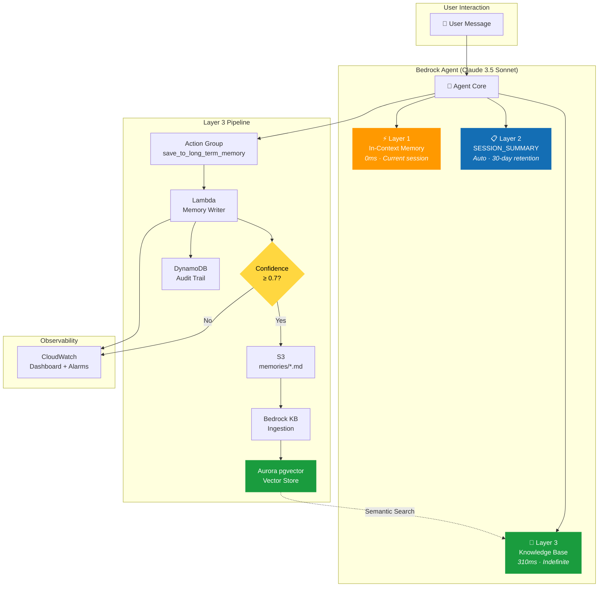
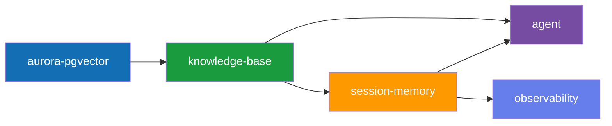

# 🧠 AWS AgentCore Memory

> **Build AI Agents That Actually Remember** — A production-grade 3-layer memory system for Amazon Bedrock Agents using Aurora pgvector, SESSION_SUMMARY, and in-context memory. Fully deployed with Terraform.

[](https://www.terraform.io/)
[](https://aws.amazon.com/bedrock/)
[](https://www.python.org/)
[](https://aws.amazon.com/rds/aurora/)

---

## The Problem

Most AI agents suffer from **goldfish memory** — every conversation starts from zero. A user tells the agent their preferred AWS region, their tech stack, their deployment conventions. Next session? All of it is gone.

This is not a model limitation. It is an **architecture problem**, and Amazon Bedrock gives you the tools to solve it properly.

---

## Architecture — 3-Layer Memory System



### Layer Comparison

| Dimension | ⚡ Layer 1 — In-Context | 📋 Layer 2 — SESSION_SUMMARY | 🧠 Layer 3 — Knowledge Base |
|-----------|------------------------|-------------------------------|------------------------------|
| **Latency** | 0ms | ~50ms | ~310ms |
| **Retention** | Current invocation | 30 days | Indefinite |
| **Cross-Session** | ❌ | Within session | ✅ All sessions |
| **Setup** | Zero config | 1 HCL block | Lambda + KB + Aurora |
| **Cost** | Free (prompt tokens) | Free (Bedrock-managed) | ~$43/mo (Aurora dominant) |

---

## Infrastructure Modules

```
terraform/
├── bootstrap/               # S3 state bucket + DynamoDB lock table
└── main/
    ├── main.tf              # Root module wiring
    └── modules/
        ├── aurora-pgvector/ # Aurora Serverless v2 + pgvector extension
        ├── knowledge-base/  # Bedrock KB backed by Aurora + S3 data source
        ├── agent/           # Bedrock Agent + SESSION_SUMMARY + Action Group
        ├── session-memory/  # Lambda writer + DynamoDB + SQS + DLQ
        └── observability/   # CloudWatch dashboard + 3 alarms
```

### Module Dependency Graph



---

## Quick Start

### Prerequisites

- AWS CLI configured with sufficient permissions
- Terraform ≥ 1.5
- Python 3.12+

### 1. Bootstrap the Terraform State Backend

```bash
cd terraform/bootstrap
terraform init && terraform apply
```

### 2. Update Backend Configuration

Edit `terraform/main/backend.tf` — replace `REPLACE_WITH_ACCOUNT_ID` with your actual AWS account ID.

### 3. Deploy the Full Stack (~15 min)

```bash
cd terraform/main
terraform init
terraform apply -var='aurora_master_password=<your-secure-password>'
```

> ⚠️ **zsh Gotcha:** If your password contains `!` or `#`, wrap it in **single quotes**. zsh interprets `!` as history expansion.

### 4. Prepare & Alias the Agent

```bash
# Get the agent ID from Terraform output
AGENT_ID=$(terraform output -raw agent_id)
ALIAS_ID=$(terraform output -raw agent_alias_id)

# Prepare a new version (required after any agent change)
aws bedrock-agent prepare-agent --agent-id $AGENT_ID
```

### 5. Run the Demo

```bash
cd ../..
python3 src/demo/agent_demo.py \
  --agent-id $AGENT_ID \
  --alias-id $ALIAS_ID \
  --layer all
```

---

## Cost Breakdown

| Service | Config | Monthly Cost | Notes |
|---------|--------|-------------|-------|
| **Aurora Serverless v2** | 0.5 ACU min | ~$43 | Dominant cost. Set `min_capacity = 0` to pause |
| **Bedrock KB** | Per query | ~$0.25/1K queries | Charged per embedding on retrieval |
| **Lambda** | On-demand | ~$0 | Essentially free at small scale |
| **S3** | Memory docs | ~$0 | Negligible for document storage |
| **DynamoDB** | On-demand | ~$0 | Negligible at this scale |

> 💡 **Cost Tip:** For dev environments, set `aurora_min_capacity = 0` to let Aurora pause after inactivity (~25s cold start on first query).

---

## API Reference — Memory Writer Lambda

### Action Group Event

```json
{
  "function": "save_to_long_term_memory",
  "sessionId": "session-abc-123",
  "parameters": [
    {"name": "fact", "value": "I prefer eu-west-1 for production"},
    {"name": "category", "value": "preference"},
    {"name": "confidence", "value": "0.95"}
  ]
}
```

### Categories

| Category | Description | Example |
|----------|-------------|---------|
| `preference` | User preferences | "I prefer Terraform over CDK" |
| `project_context` | Project-specific facts | "Using Python 3.12 with FastAPI" |
| `decision` | Decisions made | "We chose Aurora over DynamoDB for vectors" |
| `user_profile` | User identity facts | "My name is Pushparaj, I'm a DevOps engineer" |

### Confidence Gate

- **≥ 0.7** → `MEMORY_SAVED` — Written to S3, DynamoDB, KB ingestion triggered
- **< 0.7** → `MEMORY_SKIPPED` — Logged only, not persisted

---

## Test Suite

```bash
# Set up environment
python3 -m venv .venv && source .venv/bin/activate
pip install pytest boto3

# Run all 81 tests with rich HTML dashboard
pytest
```

### Test Categories

| Category | Tests | Validates |
|----------|-------|-----------|
| **Lambda Handler** | 23 | Confidence gate, response format, S3 docs, DynamoDB records |
| **Terraform** | 33 | Module structure, content validation, root wiring |
| **Integration** | 25 | Full save flow, category routing, multi-session, source code |

---

## Key Design Decisions

1. **enable_http_endpoint = true** — Non-negotiable. Bedrock KB uses RDS Data API, not persistent connections.

2. **HIERARCHICAL chunking** (1500/300/60) — Child chunks searched for precision, parent chunks retrieved for context.

3. **Confidence threshold at Lambda** — Prevents casual statements from polluting the knowledge base.

4. **No `eu.` prefix on model ID** — Cross-region inference profiles work for `InvokeModel`, NOT for agent `foundation_model`.

5. **Simple substring metric filters** — Lambda's Python logger uses tab-separated output; field-position patterns never match.

---

## References

- [AgentCore Memory Deep Dive](https://romanceresnak.dev/articles/agentcore-memory) — Original article by Roman Čerešňák
- [AWS Bedrock Agents Documentation](https://docs.aws.amazon.com/bedrock/latest/userguide/agents.html)
- [Aurora pgvector Extension](https://docs.aws.amazon.com/AmazonRDS/latest/AuroraUserGuide/AuroraPostgreSQL.Extensions.html#AuroraPostgreSQL.Extensions.pgvector)

---

## License

MIT — See [ARCHITECTURE.md](ARCHITECTURE.md) for deep-dive technical documentation and [RUNBOOK.md](RUNBOOK.md) for operations guide.

**Built by Pushparaj Naik** | Standalone project — no external dependencies on sibling repos.
