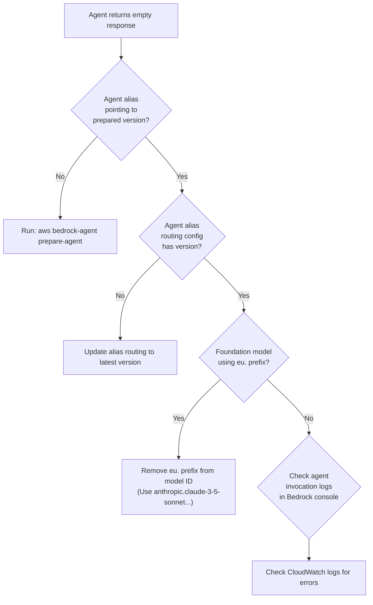
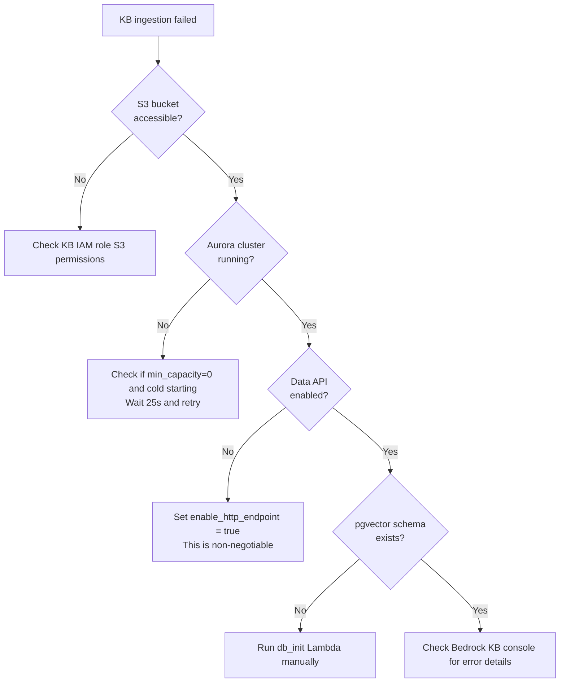
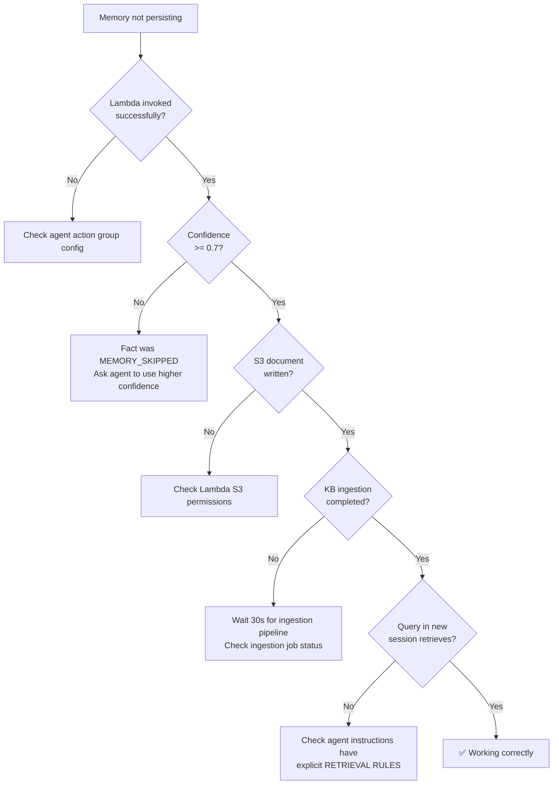

# Runbook — AWS AgentCore Memory Operations Guide

> Operational procedures, troubleshooting flowcharts, and day-2 operations for the AgentCore Memory system.

---

## Table of Contents

1. [Pre-Deployment Checklist](#1-pre-deployment-checklist)
2. [Deployment Procedures](#2-deployment-procedures)
3. [Day-2 Operations](#3-day-2-operations)
4. [Monitoring & Alerting](#4-monitoring--alerting)
5. [Troubleshooting Flowcharts](#5-troubleshooting-flowcharts)
6. [Disaster Recovery](#6-disaster-recovery)
7. [Cost Optimization](#7-cost-optimization)
8. [Known Limitations & Gotchas](#8-known-limitations--gotchas)

---

## 1. Pre-Deployment Checklist

### AWS Account Requirements

- [ ] AWS account with Bedrock access enabled
- [ ] Bedrock model access granted for `anthropic.claude-3-5-sonnet-20241022-v2:0`
- [ ] Bedrock model access granted for `amazon.titan-embed-text-v2:0`
- [ ] Sufficient IAM permissions for Terraform (Admin or specific policy below)
- [ ] AWS CLI v2 configured with valid credentials

### Service Quotas to Verify

| Service | Quota | Default | Required |
|---------|-------|---------|----------|
| Aurora Serverless v2 | Clusters per account | 40 | 1 |
| Bedrock | Knowledge Bases | 10 | 1 |
| Bedrock | Agents | 10 | 1 |
| Lambda | Concurrent executions | 1000 | 1 |
| S3 | Buckets per account | 100 | 2 |

### Minimum IAM Permissions

```json
{
  "Version": "2012-10-17",
  "Statement": [
    {
      "Effect": "Allow",
      "Action": [
        "rds:*", "rds-data:*",
        "bedrock:*", "bedrock-agent:*",
        "lambda:*", "s3:*",
        "dynamodb:*", "sqs:*",
        "cloudwatch:*", "logs:*",
        "iam:CreateRole", "iam:AttachRolePolicy",
        "iam:PutRolePolicy", "iam:PassRole",
        "iam:DeleteRole", "iam:DetachRolePolicy",
        "iam:DeleteRolePolicy",
        "ec2:CreateVpc", "ec2:CreateSubnet",
        "ec2:CreateSecurityGroup", "ec2:*"
      ],
      "Resource": "*"
    }
  ]
}
```

---

## 2. Deployment Procedures

### 2.1 Initial Deployment

```bash
# Step 1: Bootstrap state backend
cd terraform/bootstrap
terraform init
terraform apply -auto-approve

# Step 2: Note your account ID
ACCOUNT_ID=$(aws sts get-caller-identity --query Account --output text)
echo "Account ID: $ACCOUNT_ID"

# Step 3: Update backend.tf with your account ID
sed -i '' "s/REPLACE_WITH_ACCOUNT_ID/$ACCOUNT_ID/" ../main/backend.tf

# Step 4: Deploy full stack (~15 min for Aurora cluster)
cd ../main
terraform init
terraform apply -var="aurora_master_password='YourSecureP@ssw0rd'"

# Step 5: Save outputs
terraform output > ../../deployment_outputs.txt

# Step 6: Prepare the agent version
AGENT_ID=$(terraform output -raw agent_id)
aws bedrock-agent prepare-agent --agent-id $AGENT_ID

# Step 7: Verify
python3 ../../src/demo/agent_demo.py \
  --agent-id $AGENT_ID \
  --alias-id $(terraform output -raw agent_alias_id) \
  --layer layer1
```

### 2.2 Updating the Agent

After any change to agent instructions, action groups, or KB associations:

```bash
# 1. Apply Terraform changes
terraform apply -var="aurora_master_password='YourSecureP@ssw0rd'"

# 2. Prepare a new agent version (REQUIRED)
aws bedrock-agent prepare-agent --agent-id $AGENT_ID

# 3. Get the new version number
NEW_VERSION=$(aws bedrock-agent list-agent-versions \
  --agent-id $AGENT_ID \
  --query 'agentVersionSummaries[-1].agentVersion' \
  --output text)

# 4. Update the alias to point to the new version
ALIAS_ID=$(terraform output -raw agent_alias_id)
aws bedrock-agent update-agent-alias \
  --agent-id $AGENT_ID \
  --agent-alias-id $ALIAS_ID \
  --agent-alias-name live \
  --routing-configuration "[{\"agentVersion\": \"$NEW_VERSION\"}]"
```

### 2.3 Teardown

```bash
# Destroy the main stack
cd terraform/main
terraform destroy -var="aurora_master_password='YourSecureP@ssw0rd'"

# Destroy bootstrap (if needed)
cd ../bootstrap
terraform destroy
```

> ⚠️ **Warning:** Aurora's `prevent_destroy = false` (if set to true, you must remove the lifecycle block first).

---

## 3. Day-2 Operations

### 3.1 Re-Ingest Knowledge Base

If the S3 data source has been updated manually:

```bash
KB_ID=$(terraform -chdir=terraform/main output -raw knowledge_base_id)
DS_ID=$(aws bedrock-agent list-data-sources \
  --knowledge-base-id $KB_ID \
  --query 'dataSourceSummaries[0].dataSourceId' \
  --output text)

aws bedrock-agent start-ingestion-job \
  --knowledge-base-id $KB_ID \
  --data-source-id $DS_ID
```

### 3.2 View Memory Documents

```bash
BUCKET=$(terraform -chdir=terraform/main output -raw memory_bucket_name)

# List all memories
aws s3 ls s3://$BUCKET/memories/ --recursive

# Read a specific memory
aws s3 cp s3://$BUCKET/memories/preference/some-uuid.md -
```

### 3.3 Query DynamoDB Audit Trail

```bash
TABLE=$(terraform -chdir=terraform/main output -raw dynamodb_table_name)

# Get all events for a session
aws dynamodb query \
  --table-name $TABLE \
  --key-condition-expression "session_id = :sid" \
  --expression-attribute-values '{":sid": {"S": "session-abc"}}' \
  --output table
```

### 3.4 Scale Aurora

```bash
# Modify scaling in variables
terraform apply \
  -var="aurora_master_password='YourSecureP@ssw0rd'" \
  -var="aurora_min_capacity=0" \
  -var="aurora_max_capacity=8"
```

---

## 4. Monitoring & Alerting

### CloudWatch Dashboard

Access the dashboard at:
```
https://console.aws.amazon.com/cloudwatch/home?region=eu-west-1#dashboards:name=agentcore-memory
```

### Alarm Response Procedures

#### 🔴 DLQ Messages > 0

**Meaning:** Memory writes are failing and landing in the dead letter queue.

**Response:**
1. Check SQS DLQ messages: `aws sqs receive-message --queue-url <DLQ_URL>`
2. Check Lambda logs: `aws logs tail /aws/lambda/agentcore-memory-memory-writer --since 1h`
3. Common causes:
   - S3 bucket permissions changed
   - KB ingestion quota exceeded
   - DynamoDB write capacity throttled (unlikely with on-demand)
4. Fix the root cause, then redrive DLQ messages

#### 🟡 Lambda Errors > 5

**Meaning:** Memory writer is failing repeatedly.

**Response:**
1. Check recent errors: `aws logs filter-log-events --log-group-name /aws/lambda/agentcore-memory-memory-writer --filter-pattern "ERROR"`
2. Common causes:
   - IAM permission changes
   - S3 bucket deleted or renamed
   - Network connectivity (VPC endpoints removed)
3. Check CloudWatch metrics for correlated spikes

#### 🟡 Lambda p99 > 20s

**Meaning:** Memory writer is slow, approaching 30s timeout.

**Response:**
1. Check Aurora cold start (if `min_capacity = 0`, first query takes ~25s)
2. Check KB ingestion job status
3. Check S3 latency
4. Consider increasing `min_capacity` to 0.5 to avoid cold starts

---

## 5. Troubleshooting Flowcharts

### "Agent Returns Empty Response"



### "KB Ingestion Failed"



### "Memory Not Persisting Across Sessions"



---

## 6. Disaster Recovery

### Terraform State Recovery

```bash
# If state file is corrupted, restore from S3 versioning
BUCKET=$(aws sts get-caller-identity --query Account --output text)
aws s3api list-object-versions \
  --bucket agentcore-memory-tfstate-$BUCKET \
  --prefix agentcore-memory/terraform.tfstate

# Restore a specific version
aws s3api get-object \
  --bucket agentcore-memory-tfstate-$BUCKET \
  --key agentcore-memory/terraform.tfstate \
  --version-id <version-id> \
  terraform.tfstate.backup
```

### Aurora Snapshot Restore

```bash
# List available snapshots
aws rds describe-db-cluster-snapshots \
  --db-cluster-identifier agentcore-memory

# Restore from snapshot
aws rds restore-db-cluster-from-snapshot \
  --db-cluster-identifier agentcore-memory-restored \
  --snapshot-identifier <snapshot-id> \
  --engine aurora-postgresql
```

### Memory Document Recovery

All memory documents are in S3 with versioning enabled. Even deleted documents can be recovered:

```bash
aws s3api list-object-versions \
  --bucket $BUCKET \
  --prefix memories/ \
  --query 'DeleteMarkers[].{Key:Key,VersionId:VersionId}'
```

---

## 7. Cost Optimization

### Development Environment

```hcl
# In terraform/main/variables.tf or as -var overrides:
aurora_min_capacity = 0     # Aurora pauses after inactivity (~$0/mo idle)
aurora_max_capacity = 2     # Lower max for dev
```

> **Trade-off:** First query after pause takes ~25s (Aurora cold start).

### Production Tips

1. **Share Aurora cluster** across multiple KBs if running several agents
2. **DynamoDB TTL** is already set to 90 days — old audit records auto-delete
3. **S3 Lifecycle rules** — Add if memory documents grow beyond expectations
4. **Reserved capacity** — Consider Aurora Reserved Instances for production

### Monthly Cost Estimates

| Profile | Aurora Config | Monthly Cost |
|---------|-------------|-------------|
| **Dev/Demo** | min=0, max=2 | ~$5 (mostly idle) |
| **Small Prod** | min=0.5, max=4 | ~$45 |
| **Active Prod** | min=2, max=8 | ~$170 |

---

## 8. Known Limitations & Gotchas

### Critical

| Issue | Impact | Workaround |
|-------|--------|-----------|
| **No `eu.` prefix for agents** | `validationException` at invocation | Use `anthropic.claude-3-5-sonnet-20241022-v2:0` (no region prefix) |
| **`enable_http_endpoint` required** | KB cannot reach Aurora at all | Always set to `true` |
| **Agent alias cannot point to DRAFT** | Agent invocation fails | Must `prepare-agent` + update alias after every change |

### Operational

| Issue | Impact | Workaround |
|-------|--------|-----------|
| **No Terraform auto-prepare** | Manual step after every `terraform apply` | Script the `prepare-agent` + `update-agent-alias` commands |
| **KB ingestion not instant** | ~30s before new facts are searchable | Inform users to wait, or implement polling |
| **zsh special characters** | `!` and `#` in passwords fail | Wrap Aurora password in single quotes |
| **Lambda log format** | Tab-separated, breaks field-position patterns | Use simple substring metric filters (`MEMORY_SAVED`) |

### Architecture

| Limitation | Description |
|-----------|-------------|
| **No per-agent CloudWatch metrics** | Bedrock doesn't publish `InvocationCount` per agent |
| **SESSION_SUMMARY within session only** | Cannot access Layer 2 summary from a different session |
| **Single-region** | Aurora cluster is region-bound; no cross-region replication built in |

---

## Appendix: Useful Commands

```bash
# Check agent status
aws bedrock-agent get-agent --agent-id $AGENT_ID --query 'agent.agentStatus'

# List agent versions
aws bedrock-agent list-agent-versions --agent-id $AGENT_ID

# Check KB ingestion status
aws bedrock-agent list-ingestion-jobs --knowledge-base-id $KB_ID --data-source-id $DS_ID

# Tail Lambda logs
aws logs tail /aws/lambda/agentcore-memory-memory-writer --follow

# Check Aurora capacity
aws rds describe-db-clusters \
  --db-cluster-identifier agentcore-memory \
  --query 'DBClusters[0].ServerlessV2ScalingConfiguration'

# Count memory documents
aws s3 ls s3://$BUCKET/memories/ --recursive --summarize | tail -2
```
