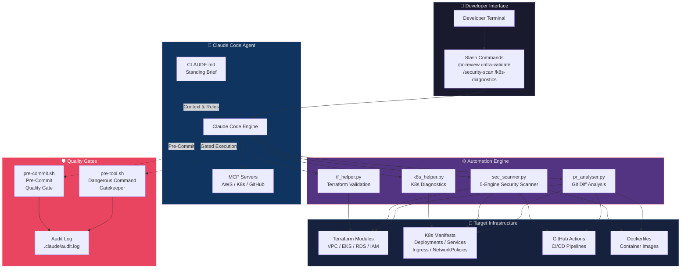
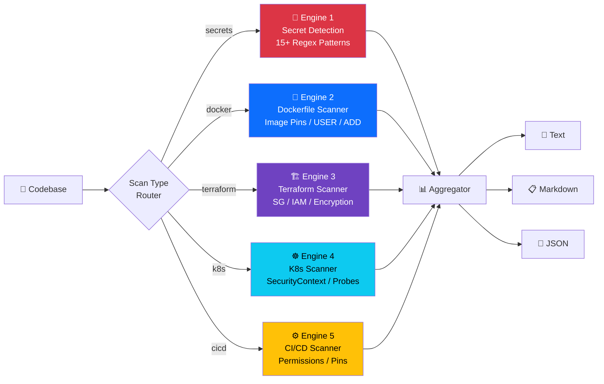
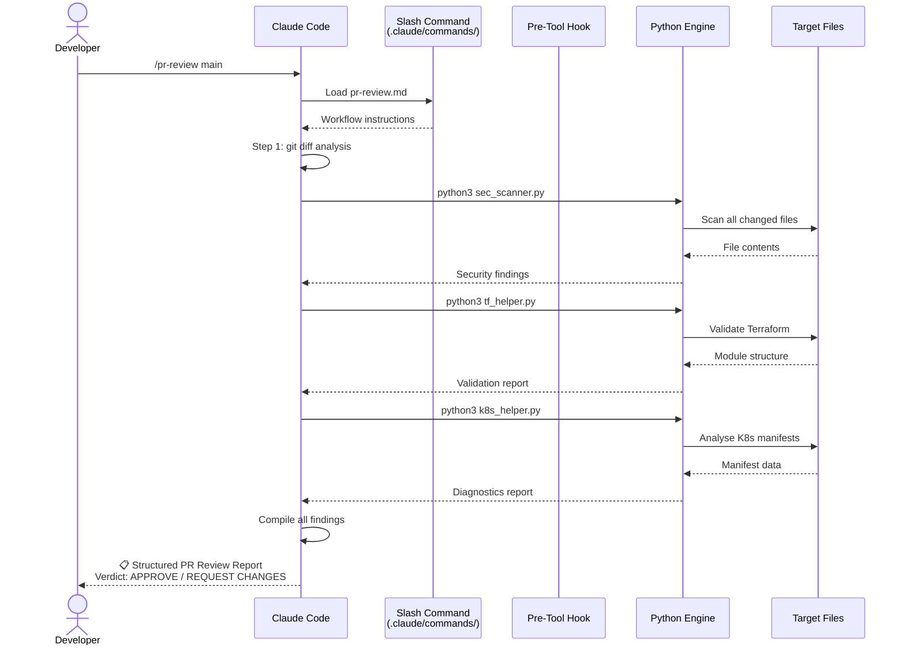
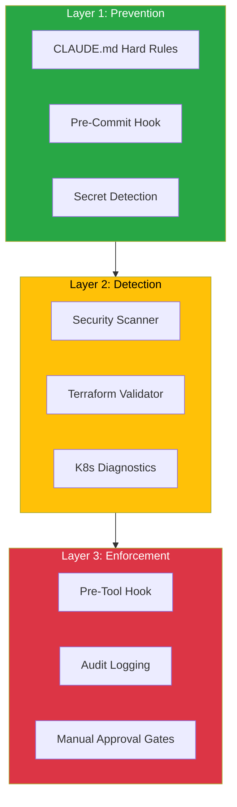

<div align="center">

# 🤖 Claude DevOps — Autonomous AI-Driven Infrastructure Workflows

**Shift from prompting to orchestrating — let your AI agent own the entire DevOps pipeline.**

[](https://python.org)
[](https://terraform.io)
[](https://kubernetes.io)
[](https://aws.amazon.com)
[](https://claude.ai)
[](LICENSE)

</div>

---

## 📖 Table of Contents

- [🎯 Objective](#-objective)
- [🏛️ Architecture Overview](#️-architecture-overview)
- [🧠 The Five Primitives](#-the-five-primitives)
- [📦 Project Structure](#-project-structure)
- [⚡ Quick Start](#-quick-start)
- [🔧 Custom Slash Commands](#-custom-slash-commands)
- [🐍 Automation Scripts](#-automation-scripts)
- [🛡️ Quality Gate Hooks](#️-quality-gate-hooks)
- [📋 CLAUDE.md — The Standing Brief](#-claudemd--the-standing-brief)
- [🔄 Workflow Examples](#-workflow-examples)
- [🔒 Security Model](#-security-model)
- [📊 Report Formats](#-report-formats)
- [🗺️ Roadmap](#️-roadmap)
- [🙏 Credits & References](#-credits--references)

---

## 🎯 Objective

> **"Stop babysitting your automation. Configure your AI agent once. Let it execute."**

This project implements a paradigm shift in DevOps engineering — moving from **manually prompting an AI for code snippets** to **configuring an autonomous agent that owns the entire workflow**. Inspired by the article *["How I Built My Own DevOps Workflows with Claude Code (And You Should Too)"](https://medium.com/@keshrianjani20/how-i-built-my-own-devops-workflows-with-claude-code-and-you-should-too-17177a9fe522)* by Anjani Keshri.

### The Problem

Traditional DevOps workflows involve:
- 🔁 **Repetitive manual checks** — running the same linters, validators, and scanners over and over
- 🧩 **Context fragmentation** — switching between 10+ CLI tools, each with different syntax
- 🐌 **Slow feedback loops** — waiting for CI pipelines to catch issues that could be caught locally
- 🤹 **Cognitive overload** — remembering security best practices across Terraform, Kubernetes, Docker, and CI/CD simultaneously

### The Solution

**Claude DevOps** wires an AI agent directly into your infrastructure workflows:

```
┌─────────────────────────────────────────────────────────────────┐
│                                                                 │
│   BEFORE: Developer → Manual CLI → Copy/Paste → Hope it works  │
│                                                                 │
│   AFTER:  Developer → /pr-review main → ☕ → Structured Report  │
│                                                                 │
└─────────────────────────────────────────────────────────────────┘
```

The agent understands your repository structure, applies your team's specific rules, and executes multi-step validations autonomously — producing rich, actionable reports instead of raw CLI output.

---

## 🏛️ Architecture Overview

### High-Level System Architecture



### Security Scanner Architecture (5 Engines)



### Slash Command Execution Flow



---

## 🧠 The Five Primitives

This framework is built on **five key primitives** that transform Claude Code from a chatbot into an autonomous DevOps engine:

| # | Primitive | What It Does | This Project's Implementation |
|---|-----------|-------------|------------------------------|
| 1 | **`CLAUDE.md`** | Permanent context loaded every session | Stack rules, security policies, naming conventions, dangerous command list |
| 2 | **Custom Slash Commands** | Reusable, parameterised workflows | `/pr-review`, `/infra-validate`, `/security-scan`, `/k8s-diagnostics` |
| 3 | **Hooks** | Automated guardrails on agent actions | `pre-tool.sh` (blocks destructive commands), `pre-commit.sh` (quality gate) |
| 4 | **Agentic Pipelines** | End-to-end automated execution | `diff → scan → validate → report` workflows |
| 5 | **MCP Servers** | Direct tool integration | AWS CLI, kubectl, terraform, GitHub API |

### Why This Matters

```
┌──────────────────────────────────────────────────────────────────┐
│  Traditional AI Usage          │  Agentic AI (This Project)     │
│────────────────────────────────│────────────────────────────────│
│  "Write me a Terraform file"  │  "Validate ALL my Terraform"   │
│  One-shot code generation     │  Multi-step pipeline execution │
│  Copy → Paste → Debug         │  Execute → Report → Iterate    │
│  Generic templates            │  Context-aware, repo-specific  │
│  No safety guardrails         │  Gated, audited, controlled    │
└──────────────────────────────────────────────────────────────────┘
```

---

## 📦 Project Structure

```
Claude_devops/
│
├── CLAUDE.md                              # 🧠 Standing Brief — permanent agent context
├── README.md                              # 📖 This file
│
├── .claude/
│   └── commands/                          # 🎮 Custom Slash Commands
│       ├── pr-review.md                   # /pr-review [branch]
│       ├── infra-validate.md              # /infra-validate [dir]
│       ├── security-scan.md               # /security-scan [dir]
│       └── k8s-diagnostics.md             # /k8s-diagnostics [dir]
│
├── scripts/                               # 🐍 Python Automation Engines
│   ├── pr_analyser.py                     # Git diff analysis & risk scoring
│   ├── sec_scanner.py                     # 5-engine security scanner
│   ├── tf_helper.py                       # Terraform structure validation
│   └── k8s_helper.py                      # K8s manifest diagnostics
│
├── hooks/                                 # 🛡️ Quality Gate Hooks
│   ├── pre-tool.sh                        # Dangerous command gatekeeper
│   └── pre-commit.sh                      # Pre-commit quality checks
│
└── examples/                              # 📂 Sample Infrastructure for Demo & Testing
    ├── terraform/                         # Sample Terraform (VPC, EKS, SG)
    │   ├── main.tf
    │   ├── variables.tf
    │   └── outputs.tf
    ├── k8s/                               # Sample K8s manifests
    │   ├── backend.yaml
    │   └── frontend.yaml
    ├── docker/                            # Sample Dockerfile
    │   └── Dockerfile
    └── .github/workflows/                 # Sample CI/CD pipeline
        └── ci.yml
```

---

## ⚡ Quick Start

### Prerequisites

| Tool | Required | Purpose |
|------|----------|---------|
| **Python 3.11+** | ✅ Yes | Runs automation scripts (zero external deps) |
| **Git** | ✅ Yes | Version control and diff analysis |
| **Claude Code** | ✅ Yes | AI agent runtime |
| **Terraform CLI** | ⬜ Optional | Enhanced TF validation (scripts work without it) |
| **kubectl** | ⬜ Optional | Live cluster diagnostics |
| **AWS CLI** | ⬜ Optional | Cloud resource interaction |

### Installation

```bash
# 1. Clone the repository (if not already done)
git clone https://github.com/pushparajnaik/Claude_devops.git
cd Claude_devops

# 2. Verify Python scripts work (zero external dependencies!)
python3 scripts/sec_scanner.py --path ./examples --format markdown
python3 scripts/k8s_helper.py --path ./examples/k8s --format markdown
python3 scripts/tf_helper.py --path ./examples/terraform --format markdown

# 3. Install pre-commit hook (optional)
cp hooks/pre-commit.sh .git/hooks/pre-commit
chmod +x .git/hooks/pre-commit

# 4. Open Claude Code in the project
# The CLAUDE.md will be automatically loaded!
```

### First Run

Once Claude Code is open in this repository:

```bash
# Run a full security scan on the included examples
/security-scan ./examples

# Review your PR changes
/pr-review main

# Validate the sample Terraform
/infra-validate ./examples/terraform

# Check the sample K8s manifests
/k8s-diagnostics ./examples/k8s
```

---

## 🔧 Custom Slash Commands

### `/pr-review [branch]`

> **Act as a Senior DevOps Engineer conducting a comprehensive PR review.**

Performs a 7-step automated review:

| Step | Action | Tools Used |
|------|--------|-----------|
| 1 | Git diff analysis & categorisation | `git diff`, `pr_analyser.py` |
| 2 | Secret/credential scanning | `sec_scanner.py` |
| 3 | Terraform validation | `tf_helper.py`, `terraform validate` |
| 4 | Docker security checks | `sec_scanner.py` (Docker engine) |
| 5 | Kubernetes manifest review | `k8s_helper.py` |
| 6 | CI/CD pipeline verification | `sec_scanner.py` (CI/CD engine) |
| 7 | Structured report generation | Aggregated verdict |

**Output:** A comprehensive report with a clear `### Verdict: APPROVE / REQUEST CHANGES` and actionable findings.

---

### `/infra-validate [dir]`

> **Act as an Infrastructure Architect validating Terraform for production readiness.**

| Check | Description |
|-------|-------------|
| 📁 Module structure | `main.tf`, `variables.tf`, `outputs.tf` presence |
| 🔧 Syntax validation | `terraform validate` or static parsing |
| 🏷️ Tag compliance | Required tags: Environment, Project, ManagedBy, Owner |
| 🔐 Security posture | SG rules, IAM policies, encryption settings |
| 📦 State configuration | S3 backend, DynamoDB locking, versioning |
| 🔗 Dependency graph | Module dependency mapping and circular reference detection |

---

### `/security-scan [dir]`

> **Act as a Security Engineer performing thorough static analysis.**

Runs **5 specialised scanning engines** in a single pass:

| Engine | Targets | Key Checks |
|--------|---------|-----------|
| 🔑 Secrets | All files | AWS keys, GitHub tokens, SSH keys, DB credentials (15+ patterns) |
| 🐳 Docker | Dockerfiles | `:latest` tags, USER directive, ADD vs COPY, secrets in ARG/ENV |
| 🏗️ Terraform | `.tf` files | Open SGs, IAM wildcards, disabled encryption, public S3 |
| ☸️ Kubernetes | YAML manifests | runAsNonRoot, privilege escalation, resource limits, image pins |
| ⚙️ CI/CD | Workflow files | Permissions blocks, action pins, credential handling |

**Exit codes:** `0` = secure, `1` = high-severity findings, `2` = critical findings.

---

### `/k8s-diagnostics [dir]`

> **Act as a Kubernetes Platform Engineer reviewing for production readiness.**

| Category | Checks |
|----------|--------|
| 🔐 Security | runAsNonRoot, allowPrivilegeEscalation, readOnlyRootFilesystem, capabilities |
| 📊 Resources | CPU/memory requests, CPU/memory limits |
| ❤️ Health | readinessProbe, livenessProbe, startupProbe |
| 🐳 Images | Tag pinning (no `:latest`), pull policy |
| 📈 HA | Replica count, PDB, HPA, pod anti-affinity |
| 🌐 Networking | Service types, Ingress TLS, NetworkPolicy coverage |
| 🔑 RBAC | ServiceAccount usage, Role scoping |

---

## 🐍 Automation Scripts

All scripts are **zero-dependency** — they use only the Python standard library. No `pip install` required.

### `sec_scanner.py`

```bash
# Full scan of entire project
python3 scripts/sec_scanner.py --path . --format markdown

# Scan only Terraform files
python3 scripts/sec_scanner.py --path ./examples/terraform --type terraform --format json

# Scan only Kubernetes manifests
python3 scripts/sec_scanner.py --path ./examples/k8s --type k8s --format text

# Scan only for secrets
python3 scripts/sec_scanner.py --path . --type secrets --format markdown
```

### `k8s_helper.py`

```bash
# Analyse all K8s manifests
python3 scripts/k8s_helper.py --path ./examples/k8s --format markdown

# JSON output for CI integration
python3 scripts/k8s_helper.py --path ./examples/k8s --format json
```

### `tf_helper.py`

```bash
# Validate all Terraform modules
python3 scripts/tf_helper.py --path ./examples/terraform --format markdown

# Point to any external project's Terraform
# python3 scripts/tf_helper.py --path /path/to/your/infra --format text
```

### `pr_analyser.py`

```bash
# Compare current branch against main
python3 scripts/pr_analyser.py --base main --format markdown

# Analyse specific files
python3 scripts/pr_analyser.py --files examples/terraform/main.tf examples/k8s/backend.yaml --format json
```

---

## 🛡️ Quality Gate Hooks

### `pre-tool.sh` — Dangerous Command Gatekeeper

This hook intercepts potentially destructive commands and **blocks execution** until explicit human approval is given.

**Blocked commands include:**

| Category | Commands |
|----------|----------|
| 🏗️ Terraform | `terraform apply`, `terraform destroy`, `terraform import`, `terraform state rm` |
| ☸️ Kubernetes | `kubectl delete namespace`, `kubectl delete deployment`, `kubectl drain` |
| ☁️ AWS | `aws iam delete`, `aws s3 rb`, `aws ec2 terminate-instances`, `aws rds delete` |
| 🔧 System | `rm -rf`, `git push --force`, `git reset --hard` |
| 🐳 Docker | `docker system prune`, `docker volume prune` |
| ⎈ Helm | `helm uninstall`, `helm delete` |

**All decisions are logged** to `.claude/audit.log` for compliance tracking.

### `pre-commit.sh` — Pre-Commit Quality Gate

Runs **5 automated checks** before every git commit:

```
╔══════════════════════════════════════════════════════════════════╗
║  🔍 Claude DevOps Pre-Commit Quality Gate                       ║
╚══════════════════════════════════════════════════════════════════╝

[1/5] Secret Scanning ............... ✅ PASS
[2/5] Terraform Formatting .......... ✅ PASS
[3/5] Python Linting ................ ✅ PASS
[4/5] YAML Validation ............... ✅ PASS
[5/5] File Hygiene .................. ⚠️  WARN — Large file detected

═══════════════════════════════════════════════════════════════════
  ✅ Passed: 4  ⚠️  Warnings: 1  ❌ Failed: 0  (Total: 5)

  COMMIT ALLOWED with warnings — please review above items
═══════════════════════════════════════════════════════════════════
```

**Installation:**

```bash
# Option 1: Copy to .git/hooks
cp hooks/pre-commit.sh .git/hooks/pre-commit && chmod +x .git/hooks/pre-commit

# Option 2: Configure git hooks path
git config core.hooksPath Claude_devops/hooks
```

---

## 📋 CLAUDE.md — The Standing Brief

The `CLAUDE.md` file is the **brain** of the agent. It's automatically loaded at every Claude Code session and provides:

| Section | Purpose |
|---------|---------|
| **Project Context** | Stack description, technology versions, directory layout |
| **Hard Rules** | Security policies, formatting standards, mandatory practices |
| **Naming Conventions** | Consistent naming across Terraform, K8s, Python, and AWS |
| **Dangerous Commands** | Explicit list of commands requiring manual approval |
| **Response Format** | Standardised report templates for consistent output |

> **💡 Pro Tip:** Place subdirectory-specific `CLAUDE.md` files in deeper directories
> (e.g., `./infra/modules/CLAUDE.md`) for layered, contextual guidance without
> cluttering the root file.

---

## 🔄 Workflow Examples

### Example 1: Full PR Review Pipeline

```bash
# Developer completes a feature branch
git checkout feature/add-monitoring
# ... makes changes to infra/main.tf, k8s/backend.yaml, .github/workflows/ci.yml ...

# Run the autonomous PR review
/pr-review main

# Claude Code automatically:
# 1. Runs git diff to identify 3 changed files
# 2. Categorises: Infrastructure(1), Kubernetes(1), CI/CD(1)
# 3. Runs sec_scanner.py → finds :latest image tag in backend.yaml
# 4. Runs tf_helper.py → validates module structure
# 5. Runs k8s_helper.py → flags missing startupProbe
# 6. Checks CI/CD workflow → permissions block present ✅
# 7. Generates comprehensive report with verdict
```

### Example 2: Pre-Deployment Infrastructure Validation

```bash
# Before running terraform apply
/infra-validate ./examples/terraform

# Claude Code:
# 1. Discovers Terraform modules
# 2. Validates structure (main.tf, variables.tf, outputs.tf)
# 3. Checks tag compliance across all resources
# 4. Maps module dependency graph
# 5. Flags any security misconfigurations
# 6. Produces structured validation report
```

### Example 3: Security Audit Before Production Release

```bash
# Comprehensive security sweep
/security-scan .

# 5 engines scan the entire codebase:
# → Secrets engine: checks 15+ credential patterns
# → Docker engine: validates all Dockerfiles
# → Terraform engine: checks SG/IAM/encryption
# → K8s engine: validates security contexts
# → CI/CD engine: verifies pipeline hygiene
```

---

## 🔒 Security Model

### Defence in Depth



### Principles

| Principle | Implementation |
|-----------|---------------|
| **Least Privilege** | MCP servers scoped to dev credentials; IAM checks enforce minimal permissions |
| **Defence in Depth** | 3-layer model: prevention → detection → enforcement |
| **Audit Trail** | All dangerous command decisions logged to `.claude/audit.log` |
| **Human in the Loop** | Destructive commands require explicit `yes` confirmation |
| **Zero Trust** | Every commit, PR, and deployment is scanned — no implicit trust |
| **Shift Left** | Catch issues at development time, not in production |

---

## 📊 Report Formats

All scripts support three output formats:

| Format | Flag | Best For |
|--------|------|----------|
| **Text** | `--format text` | Terminal output, quick reads |
| **Markdown** | `--format markdown` | PR comments, documentation, Claude reports |
| **JSON** | `--format json` | CI/CD integration, programmatic consumption |

### Example Markdown Report Output

```markdown
## 🔒 Security Scan Report
**Scan Path:** `/path/to/project`
**Files Scanned:** 45
**Total Findings:** 3

### ⚠️ HIGH (1)
| # | Rule        | Category  | File          | Line | Description                          |
|---|-------------|-----------|---------------|------|--------------------------------------|
| 1 | K8S-IMG-001 | Kubernetes| backend.yaml  | 38   | Image uses :latest tag               |

### 📝 MEDIUM (2)
| # | Rule        | Category  | File          | Line | Description                          |
|---|-------------|-----------|---------------|------|--------------------------------------|
| 1 | DOC-USR-001 | Docker    | Dockerfile    | 0    | No USER directive                    |
| 2 | DOC-IGN-001 | Docker    | Dockerfile    | 0    | .dockerignore not found              |

### 📊 Summary
| Severity | Count |
|----------|-------|
| 🚨 Critical | 0 |
| ⚠️ High | 1 |
| 📝 Medium | 2 |
| **Total** | **3** |

### Verdict: AT RISK
```

---

## 🗺️ Roadmap

- [x] CLAUDE.md standing brief with comprehensive rules
- [x] Custom slash commands (`/pr-review`, `/infra-validate`, `/security-scan`, `/k8s-diagnostics`)
- [x] Python automation scripts (sec_scanner, k8s_helper, tf_helper, pr_analyser)
- [x] Quality gate hooks (pre-tool, pre-commit)
- [ ] MCP server integration for live AWS/K8s cluster diagnostics
- [ ] `/incident-triage` command for automated log analysis
- [ ] `/cost-optimise` command for AWS cost recommendations
- [ ] `/drift-detect` command for Terraform state drift detection
- [ ] Integration with Slack/Teams for automated notifications
- [ ] Dashboard web UI for visualising scan results over time

---

## 🙏 Credits & References

| Resource | Link |
|----------|------|
| **Original Inspiration** | [How I Built My Own DevOps Workflows with Claude Code](https://medium.com/@keshrianjani20/how-i-built-my-own-devops-workflows-with-claude-code-and-you-should-too-17177a9fe522) by Anjani Keshri |
| **Claude Code Docs** | [Anthropic Claude Code Documentation](https://docs.anthropic.com/en/docs/claude-code) |
| **Model Context Protocol** | [MCP Specification](https://modelcontextprotocol.io/) |
| **Terraform Best Practices** | [HashiCorp Terraform Docs](https://developer.hashicorp.com/terraform) |
| **K8s Security** | [Kubernetes Pod Security Standards](https://kubernetes.io/docs/concepts/security/pod-security-standards/) |

---

<div align="center">

**Built with ❤️ by [Pushparaj Naik](https://github.com/pushparajnaik)**

*Automating the automation layer — so you can focus on what matters.*

</div>
