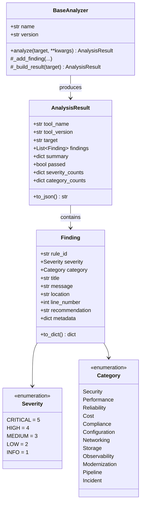
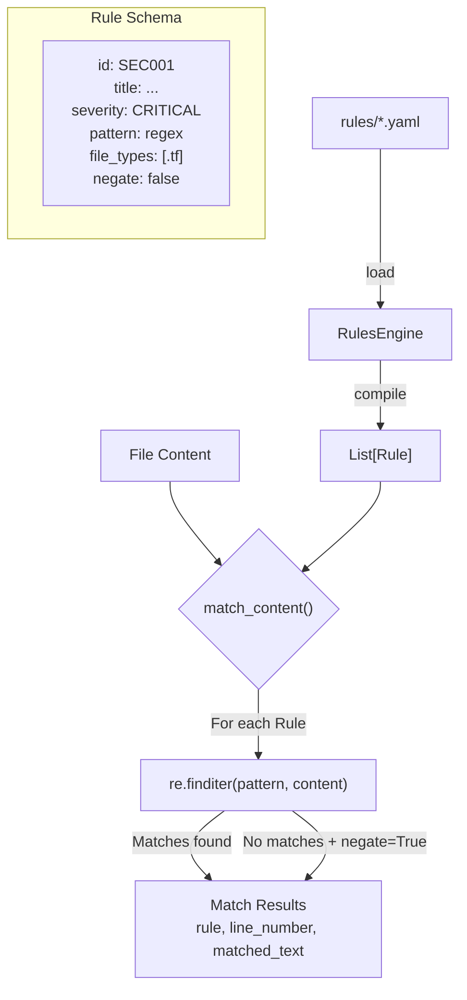
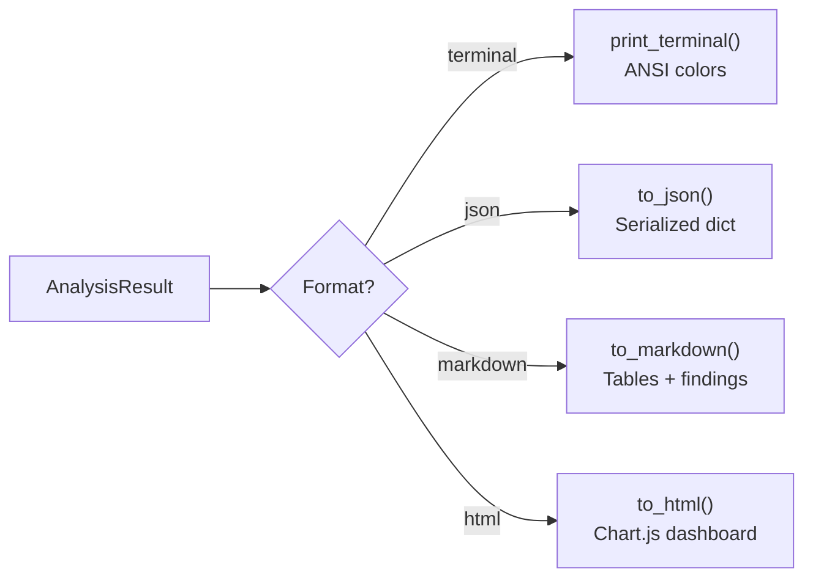
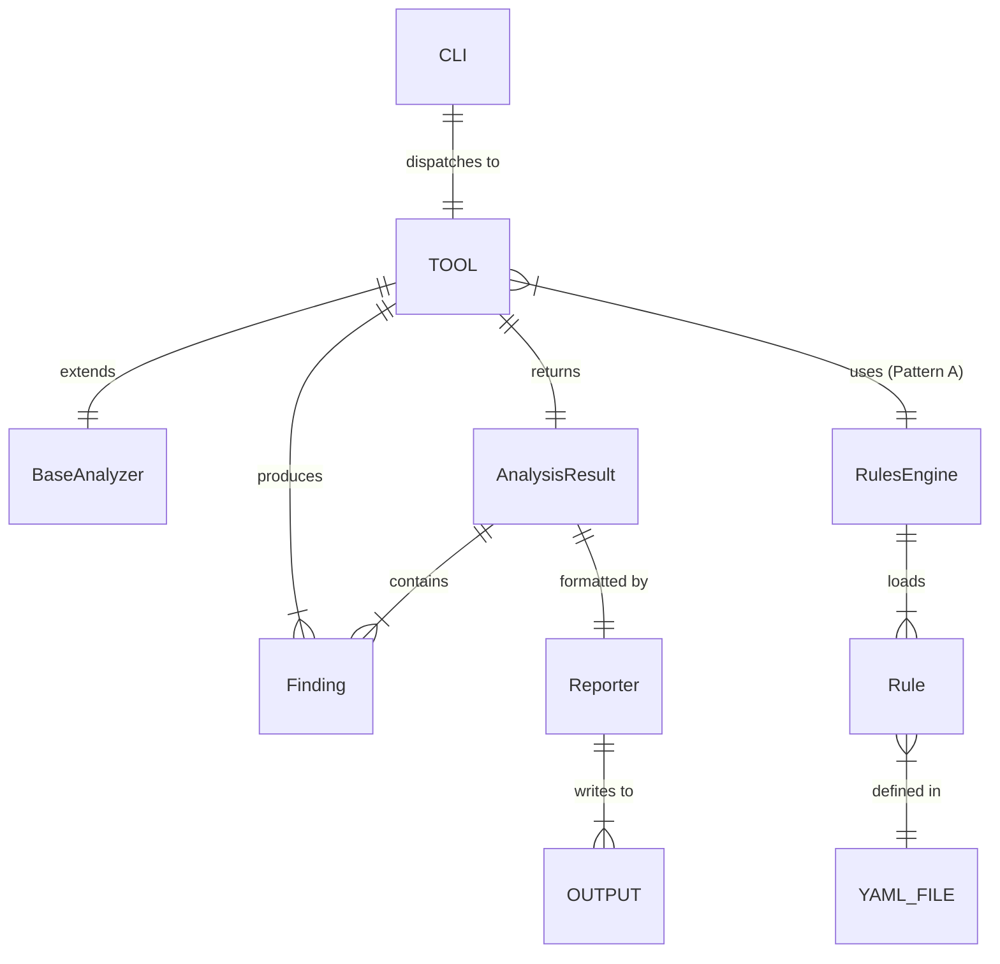

# 🏗️ Architecture & Design Document

> Claude DevOps Debug Toolkit — Deep-Dive Technical Design

---

## 1. System Overview

The toolkit is a **modular, pluggable analysis framework** designed around four architectural layers:

```
┌─────────────────────────────────────────────────────────────┐
│ Layer 4: CLI Interface (cli.py)                             │
│   argparse → tool dispatch → result formatting → exit code  │
├─────────────────────────────────────────────────────────────┤
│ Layer 3: Tool Layer (tools/*.py)                            │
│   10 specialized analyzers, each extending BaseAnalyzer     │
├─────────────────────────────────────────────────────────────┤
│ Layer 2: Core Framework (core/*.py)                         │
│   BaseAnalyzer │ RulesEngine │ Reporter │ FileUtils          │
├─────────────────────────────────────────────────────────────┤
│ Layer 1: Rules & Data (rules/*.yaml, samples/*)             │
│   Declarative detection rules │ Sample test fixtures         │
└─────────────────────────────────────────────────────────────┘
```

---

## 2. Core Framework Design

### 2.1 Finding Model

Every detection across all 10 tools produces a `Finding` object with a uniform schema:



### 2.2 Pass/Fail Logic

A result is considered **FAILED** if any finding has severity `CRITICAL` or `HIGH`:

```python
@property
def passed(self) -> bool:
    return not any(
        f.severity in (Severity.CRITICAL, Severity.HIGH)
        for f in self.findings
    )
```

The CLI maps this to exit codes: `0` = PASSED, `1` = FAILED — enabling CI/CD gate integration.

### 2.3 Rules Engine Architecture



**Key design decisions:**
- **Regex-based:** Fast, predictable, easy to write and debug
- **YAML-defined:** Non-engineers (security, compliance teams) can contribute rules
- **Negate mode:** Flag when a pattern is **NOT** found (e.g., "missing encryption")
- **File type filtering:** Rules only run against relevant file extensions

---

## 3. Tool Architecture Patterns

### Pattern A: Rules-Based Analyzers (5 tools)

Tools: Security Scanner, K8s Troubleshooter, Cost Optimizer, Server Config Analyzer, Pipeline Debugger

```
Files → discover_files() → read_file() → RulesEngine.match_content()
                                              │
                                              ▼
                                    _add_finding() per match
                                              │
                                              ▼
                                    _build_result() → AnalysisResult
```

These tools load rules from YAML and run them against file content. Adding new detections requires only a YAML change.

### Pattern B: Regex Pattern Analyzers (3 tools)

Tools: Incident Triage, Legacy Modernizer, Release Notes Generator

These tools use inline Python regex patterns (not YAML rules) because their pattern matching is more context-sensitive:

- **Incident Triage:** Patterns need to count occurrences and correlate across multiple log entries
- **Legacy Modernizer:** Python-specific patterns that are language-aware
- **Release Notes:** Conventional commit parsing with structured extraction

### Pattern C: Template Generators (2 tools)

Tools: IaC Generator, Runbook Generator

These tools **generate** output rather than scanning for issues. They use Jinja2 templates (IaC Generator) or structured string builders (Runbook Generator).

---

## 4. Reporter System

### 4.1 Output Format Pipeline



### 4.2 HTML Dashboard

The HTML reporter generates a self-contained dashboard with:
- **Doughnut chart:** Severity distribution (CRITICAL/HIGH/MEDIUM/LOW/INFO)
- **Bar chart:** Category breakdown (Security, Cost, Reliability, etc.)
- **Data table:** All findings with severity badges, location, and recommendations
- **Dark theme:** Professional look with responsive layout

Technology: Vanilla HTML + CSS + Chart.js (loaded from CDN).

---

## 5. Data Model ERD



---

## 6. Extension Points

### 6.1 Adding a New Tool

```python
# 1. Create tools/compliance_checker.py
class ComplianceChecker(BaseAnalyzer):
    name = "Compliance Checker"
    version = "1.0.0"

    def __init__(self):
        super().__init__()
        self.engine = RulesEngine()
        self.engine.load_file("rules/compliance_rules.yaml")

    def analyze(self, target, **kwargs):
        # ... scan files, match rules, add findings
        return self._build_result(target)

# 2. Register in cli.py
TOOLS["compliance"] = ("Compliance Checker", ComplianceChecker)

# 3. Add rules/compliance_rules.yaml
# 4. Add samples and tests
```

### 6.2 Adding a New Output Format

```python
# In core/reporter.py
def to_csv(result: AnalysisResult, output_path=None) -> str:
    # ... format as CSV
    pass
```

### 6.3 Adding Rules to Existing Tools

Edit any `rules/*.yaml` file — no code changes required:

```yaml
- id: SEC099
  title: My Custom Rule
  severity: HIGH
  category: Security
  pattern: 'my_regex_pattern'
  message: "Description"
  recommendation: "Fix instructions"
  file_types: [".tf"]
```

---

## 7. Performance Characteristics

| Metric | Value |
|--------|-------|
| Full test suite (70 tests) | 0.33 seconds |
| Security scan (1 file, 18 rules) | < 10ms |
| K8s scan (1 file, 17 rules) | < 10ms |
| IaC generation (4 Terraform files) | < 50ms |
| Runbook generation | < 30ms |
| Memory footprint | < 50 MB |

### Why So Fast?

1. **No API calls:** Everything runs locally
2. **Compiled regex:** Patterns compiled once, reused per file
3. **Lazy file reading:** Files read on demand, not cached
4. **No AST parsing:** Regex-based matching avoids building full syntax trees

---

## 8. Security Considerations

### What This Tool Does NOT Do
- ❌ Does not execute any scanned code
- ❌ Does not make network requests (except Chart.js CDN in HTML reports)
- ❌ Does not modify any scanned files
- ❌ Does not store or transmit any data externally

### What This Tool DOES Do
- ✅ Reads files on disk (read-only)
- ✅ Writes report files (only to specified output paths)
- ✅ Runs git commands (read-only: `git log`, `git diff`)
- ✅ Generates Terraform files (only IaC Generator, to specified output dir)

---

## 9. Future Roadmap

| Feature | Priority | Description |
|---------|----------|-------------|
| Sarif output | High | Standard format for security findings (GitHub/VS Code integration) |
| Custom rule sets | High | Load rules from external directories |
| Baseline/suppress | Medium | Ignore known findings (baseline file) |
| Watch mode | Medium | Continuously re-scan on file changes |
| Multi-cloud | Low | GCP and Azure rule sets |
| AST parsing | Low | More accurate Python/HCL analysis |
