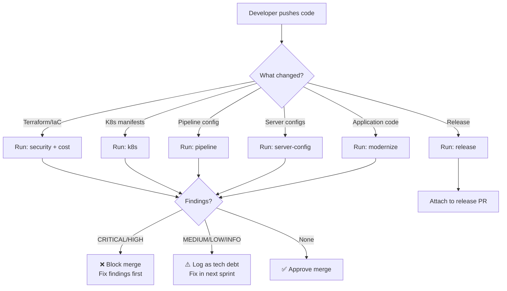
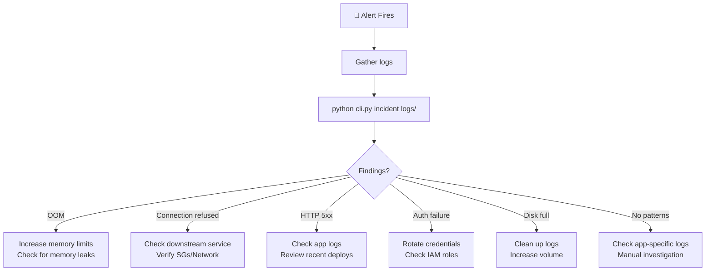

# 📖 Operations & Runbook Guide

> Claude DevOps Debug Toolkit — Operations Manual for Day-to-Day Usage

---

## Table of Contents

1. [Installation & Setup](#1-installation--setup)
2. [Day-to-Day Operations](#2-day-to-day-operations)
3. [Tool-by-Tool Runbook](#3-tool-by-tool-runbook)
4. [CI/CD Integration](#4-cicd-integration)
5. [Rule Management](#5-rule-management)
6. [Troubleshooting the Toolkit](#6-troubleshooting-the-toolkit)
7. [Maintenance Procedures](#7-maintenance-procedures)
8. [Team Onboarding](#8-team-onboarding)

---

## 1. Installation & Setup

### 1.1 Prerequisites

| Requirement | Version | Check Command |
|-------------|---------|---------------|
| Python | 3.9+ | `python3 --version` |
| pip | Latest | `pip --version` |
| Git | 2.x+ (for release notes tool) | `git --version` |

### 1.2 Fresh Installation

```bash
# Step 1: Navigate to project
cd /path/to/Claude_devops_debug

# Step 2: Create virtual environment
python3 -m venv .venv

# Step 3: Activate
source .venv/bin/activate    # macOS/Linux
# .venv\Scripts\activate     # Windows

# Step 4: Install dependencies
pip install -r requirements.txt

# Step 5: Verify — all 70 tests must pass
python -m pytest tests/ -v
```

### 1.3 Post-Installation Validation

```bash
# Run each tool against sample data
python cli.py security samples/terraform/
python cli.py k8s samples/kubernetes/bad_deployment.yaml
python cli.py pipeline samples/pipelines/github_actions_fail.log
python cli.py cost samples/terraform/
python cli.py server-config samples/server_configs/nginx_bad.conf
python cli.py modernize samples/legacy_code/
python cli.py runbook samples/terraform/ --output reports/runbook.md
python cli.py iac-gen samples/service_descriptions/order_api.yaml
```

**Expected:** All commands run without Python errors. Security/K8s/Cost tools should FAIL (exit 1) because samples are intentionally bad.

---

## 2. Day-to-Day Operations

### 2.1 Recommended Workflow



### 2.2 Quick Reference Card

| I want to... | Command |
|--------------|---------|
| Scan Terraform for security issues | `python cli.py security ./terraform/` |
| Check K8s manifests for problems | `python cli.py k8s ./k8s/manifests/` |
| Debug a failed CI/CD build | `python cli.py pipeline /path/to/build.log` |
| Find cost savings in infrastructure | `python cli.py cost ./terraform/` |
| Validate Nginx config before deploy | `python cli.py server-config /etc/nginx/nginx.conf` |
| Check legacy code for anti-patterns | `python cli.py modernize ./src/` |
| Generate a deployment runbook | `python cli.py runbook ./infra/ -o runbook.md` |
| Create release notes | `python cli.py release ./ --version v2.1.0` |
| Generate Terraform from description | `python cli.py iac-gen service.yaml -o ./terraform/` |
| Triage a production incident | `python cli.py incident /var/log/app/error.log` |
| Get an HTML dashboard report | Add `--format html --output report.html` to any command |

### 2.3 Understanding Exit Codes

| Exit Code | Meaning | Action |
|-----------|---------|--------|
| `0` | PASSED — No CRITICAL or HIGH findings | ✅ Proceed |
| `1` | FAILED — CRITICAL or HIGH findings found | ❌ Review and fix before proceeding |

---

## 3. Tool-by-Tool Runbook

### 3.1 Security Scanner

**When to run:** Before every Terraform PR merge. In CI/CD on every push to `main`.

```bash
# Basic scan
python cli.py security ./terraform/

# Generate HTML report for the team
python cli.py security ./terraform/ -f html -o reports/security-$(date +%Y%m%d).html

# JSON output for CI/CD pipeline integration
python cli.py security ./terraform/ -f json -o reports/security.json
```

**Interpreting Results:**

| Severity | Action Required |
|----------|----------------|
| 🔴 CRITICAL | **Immediate fix required.** Hardcoded secrets, SSH open to world. Block deployment. |
| 🟠 HIGH | **Fix before merge.** Open SGs, public S3, unencrypted storage. |
| 🟡 MEDIUM | **Fix within sprint.** Missing VPC flow logs, outdated configs. |
| 🔵 LOW | **Track as tech debt.** Informational findings. |

**Common Findings & Fixes:**

| Finding | Quick Fix |
|---------|-----------|
| `SEC001` Hardcoded AWS key | Use `aws_secretsmanager_secret` or env vars |
| `SEC010` SG open to 0.0.0.0/0 | Restrict to `var.allowed_cidr_blocks` |
| `SEC020` Public S3 bucket | Add `aws_s3_bucket_public_access_block` |
| `SEC030` Unencrypted EBS | Set `encrypted = true`, add KMS key |
| `SEC040` IAM wildcard `*` | Scope to specific actions and ARNs |

---

### 3.2 K8s Troubleshooter

**When to run:** Before deploying any K8s manifest to staging/production.

```bash
# Scan a single manifest
python cli.py k8s ./deployment.yaml

# Scan entire K8s directory
python cli.py k8s ./k8s/manifests/ -f html -o reports/k8s.html
```

**Common Findings & Fixes:**

| Finding | Quick Fix |
|---------|-----------|
| `K8S021` Privileged container | Remove `privileged: true` from securityContext |
| `K8S020` Running as root | Add `runAsNonRoot: true` and `runAsUser: 1000` |
| `K8S030` Latest tag | Pin to specific version: `nginx:1.25.3` |
| `K8S050` Single replica | Set `replicas: 3` for production |
| `K8S023` Host network | Remove `hostNetwork: true` unless CNI plugin |

---

### 3.3 Cost Optimizer

**When to run:** Monthly review, or before any major infrastructure change.

```bash
# Scan and generate savings report
python cli.py cost ./terraform/ -f html -o reports/cost-review-$(date +%Y%m).html

# JSON for tracking savings over time
python cli.py cost ./terraform/ -f json -o reports/cost.json
```

**Interpreting Savings Estimates:**

> ⚠️ Savings estimates are **rough approximations**. Use AWS Cost Explorer and Compute Optimizer for precise numbers.

| Rule | Typical Monthly Savings |
|------|------------------------|
| Right-size oversized instances | $50–$300 |
| Previous-gen → current-gen | $20–$50 per instance |
| gp2 → gp3 EBS volumes | $20 per volume |
| Remove unnecessary NAT Gateways | $32 per gateway |
| Disable Multi-AZ in non-prod | $100–$400 per RDS instance |

---

### 3.4 CI/CD Pipeline Debugger

**When to run:** When a CI/CD pipeline fails and you need quick diagnosis.

```bash
# Download the failed build log first, then:
python cli.py pipeline /path/to/failed-build.log

# Or pipe directly (save log first)
gh run view <run-id> --log > build.log
python cli.py pipeline build.log
```

**Interpreting Results:**

The tool identifies the **type of failure** and **suggests the fix**:

| Pattern | Root Cause | Fix |
|---------|-----------|-----|
| `PIPE001` npm ERR/pip failed | Dependency conflict | Pin versions, check lock file |
| `PIPE003` Docker build failed | Dockerfile error | Check base image, COPY paths |
| `PIPE004` 403/401/Access Denied | Auth error | Rotate token, check IAM role |
| `PIPE005` Timeout | Slow step | Increase timeout, add caching |
| `PIPE006` OOMKilled | Memory exhaustion | Increase runner memory |

---

### 3.5 Server Config Analyzer

**When to run:** Before deploying any Nginx/Apache config change.

```bash
python cli.py server-config /etc/nginx/nginx.conf
python cli.py server-config /etc/nginx/sites-available/
```

---

### 3.6 Legacy Code Modernizer

**When to run:** During code review of legacy modules, or as part of modernization sprints.

```bash
python cli.py modernize ./legacy-service/src/
```

**Priority matrix for findings:**

| Severity | Fix When |
|----------|----------|
| CRITICAL (`eval`, hardcoded creds) | **Immediately** — security risk |
| HIGH (`os.system`, `pickle`) | **This sprint** — injection/deserialization risk |
| MEDIUM (bare except, print statement) | **Next sprint** — code quality |
| LOW (old formatting, type() checks) | **Opportunistic** — during related changes |

---

### 3.7 Runbook Generator

**When to run:** After infrastructure changes, when onboarding new team members.

```bash
python cli.py runbook ./terraform/ --output docs/runbook.md
python cli.py runbook ./k8s/ --output docs/k8s-runbook.md
```

**Post-generation steps:**
1. Review the generated runbook
2. Customize placeholder values (`<name>`, `<namespace>`, etc.)
3. Add team-specific contacts to incident response section
4. Store in team wiki/Confluence
5. Review and update quarterly

---

### 3.8 IaC Generator

**When to run:** When bootstrapping new services/infrastructure.

```bash
# 1. Create a service description YAML
cat > my-service.yaml << 'EOF'
service:
  name: payment-api
  environment: production
infrastructure:
  vpc:
    cidr: "10.0.0.0/16"
    azs: 3
    nat_gateway: true
  compute:
    type: eks
    cluster_name: payment-cluster
    node_groups:
      - name: app
        instance_type: m6g.large
        min_size: 2
        max_size: 8
        desired_size: 3
  database:
    type: aurora-postgresql
    engine_version: "15.4"
    instance_class: db.r6g.large
    instances: 2
    encrypted: true
    backup_retention: 7
tags:
  team: payments
  managed_by: terraform
EOF

# 2. Generate Terraform
python cli.py iac-gen my-service.yaml --output ./terraform/generated/

# 3. Review and customize generated files
ls -la ./terraform/generated/
# → main.tf, eks.tf, database.tf, storage.tf
```

**Post-generation steps:**
1. Review generated files for your specific requirements
2. Add backend configuration (`backend.tf`)
3. Create `terraform.tfvars` with environment-specific values
4. Run `terraform init && terraform plan`

---

### 3.9 Release Notes Generator

**When to run:** Before each release.

```bash
# From conventional commit history
python cli.py release ./ --version v2.1.0 --output CHANGELOG.md

# From a log file
python cli.py release commits.log --version v2.1.0
```

**Tip:** Use [Conventional Commits](https://www.conventionalcommits.org/) format for best results:
```
feat(api): add user authentication endpoint
fix(db): resolve connection pool exhaustion
docs: update README with deployment instructions
BREAKING CHANGE: remove legacy v1 API endpoints
```

---

### 3.10 Incident Triage

**When to run:** During production incidents for quick root cause analysis.

```bash
# Analyze application logs
python cli.py incident /var/log/app/error.log

# Analyze a directory of logs
python cli.py incident /var/log/app/ -f html -o reports/incident.html
```

**Incident response workflow:**



---

## 4. CI/CD Integration

### 4.1 GitHub Actions

```yaml
name: DevOps Security Gate

on:
  pull_request:
    paths:
      - 'terraform/**'
      - 'k8s/**'

jobs:
  security-scan:
    runs-on: ubuntu-latest
    steps:
      - uses: actions/checkout@v4

      - name: Setup Python
        uses: actions/setup-python@v5
        with:
          python-version: '3.11'

      - name: Install toolkit
        run: |
          cd Claude_devops_debug
          pip install -r requirements.txt

      - name: Security Scan
        run: |
          cd Claude_devops_debug
          python cli.py security ../terraform/ -f json -o security.json

      - name: K8s Scan
        run: |
          cd Claude_devops_debug
          python cli.py k8s ../k8s/ -f json -o k8s.json

      - name: Cost Review
        run: |
          cd Claude_devops_debug
          python cli.py cost ../terraform/ -f markdown -o cost.md
        continue-on-error: true  # Don't block on cost findings

      - name: Upload Reports
        uses: actions/upload-artifact@v4
        if: always()
        with:
          name: devops-reports
          path: Claude_devops_debug/*.json
```

### 4.2 GitLab CI

```yaml
devops-scan:
  stage: test
  image: python:3.11-slim
  script:
    - cd Claude_devops_debug
    - pip install -r requirements.txt
    - python cli.py security ../terraform/ -f json -o security.json
    - python cli.py k8s ../k8s/ -f json -o k8s.json
  artifacts:
    when: always
    paths:
      - Claude_devops_debug/*.json
    expire_in: 30 days
```

### 4.3 Pre-Commit Hook

```bash
#!/bin/bash
# .git/hooks/pre-commit

# Run security scan on staged Terraform files
staged_tf=$(git diff --cached --name-only --diff-filter=ACM | grep '\.tf$')
if [ -n "$staged_tf" ]; then
    echo "🔒 Running security scan..."
    cd Claude_devops_debug
    source .venv/bin/activate
    python cli.py security ../terraform/ 2>/dev/null
    if [ $? -ne 0 ]; then
        echo "❌ Security scan FAILED — fix CRITICAL/HIGH findings before committing"
        exit 1
    fi
    echo "✅ Security scan passed"
fi
```

---

## 5. Rule Management

### 5.1 Adding a Custom Rule

```bash
# 1. Open the relevant rules file
vim rules/security_rules.yaml

# 2. Add your rule at the bottom
```

```yaml
  - id: SEC099
    title: Missing DynamoDB Encryption
    severity: HIGH
    category: Security
    pattern: 'resource\s+"aws_dynamodb_table"'
    message: "DynamoDB table may not have encryption configured."
    recommendation: "Add server_side_encryption block with KMS key."
    file_types: [".tf"]
```

```bash
# 3. Add a test
vim tests/test_security_scanner.py

# 4. Run tests to verify
python -m pytest tests/test_security_scanner.py -v
```

### 5.2 Disabling a Rule

```yaml
  - id: SEC051
    title: Flow Logs Not Enabled
    enabled: false    # ← Disable without removing
```

### 5.3 Rule Severity Guide

| Severity | Use When |
|----------|----------|
| `CRITICAL` | Immediate security risk, data exposure, credentials leak |
| `HIGH` | Security weakness, non-compliant config, reliability risk |
| `MEDIUM` | Best practice violation, potential issue, suboptimal config |
| `LOW` | Minor improvement, cosmetic, nice-to-have |
| `INFO` | Informational only, no action needed |

---

## 6. Troubleshooting the Toolkit

### 6.1 Common Issues

| Problem | Cause | Fix |
|---------|-------|-----|
| `ModuleNotFoundError: No module named 'yaml'` | Dependencies not installed | `pip install -r requirements.txt` |
| `No such file or directory` | Wrong path | Use absolute path or run from project root |
| Tests fail after adding rules | Regex error in new rule | Test regex at regex101.com first |
| HTML report doesn't show charts | No internet (CDN blocked) | Chart.js loads from CDN; use JSON/Markdown offline |
| Tool reports 0 findings | Wrong file extension | Check `file_types` in rule definition matches your files |
| `venv not activated` | Shell didn't source venv | Run `source .venv/bin/activate` |

### 6.2 Debugging a Rule

```bash
# Test a regex pattern against a file
python3 -c "
import re
content = open('samples/terraform/insecure_main.tf').read()
matches = re.findall(r'YOUR_PATTERN_HERE', content, re.MULTILINE | re.IGNORECASE)
print(f'Found {len(matches)} matches: {matches}')
"
```

### 6.3 Checking Rule Loading

```python
# Verify rules are loaded
python3 -c "
from core.rules_engine import RulesEngine
engine = RulesEngine()
count = engine.load_file('rules/security_rules.yaml')
print(f'Loaded {count} rules')
for r in engine.rules:
    print(f'  [{r.severity.value:8s}] {r.id}: {r.title}')
"
```

---

## 7. Maintenance Procedures

### 7.1 Updating Dependencies

```bash
# Quarterly or when vulnerabilities reported
source .venv/bin/activate
pip install --upgrade -r requirements.txt
python -m pytest tests/ -v  # Verify nothing breaks
```

### 7.2 Adding New Sample Data

When adding new test fixtures:
1. Place files in the appropriate `samples/` subdirectory
2. Ensure the sample contains the patterns your tests expect
3. Add corresponding tests in `tests/test_*.py`
4. Run the full test suite

### 7.3 Test Maintenance Checklist

| Task | Frequency |
|------|-----------|
| Run full test suite | On every change |
| Review and update rules | Monthly |
| Update sample data | When new patterns emerge |
| Regenerate HTML dashboard | After test changes |
| Review false positives | Quarterly |

### 7.4 Backup & Recovery

The toolkit is stateless — no database or persistent state to backup. Everything is in the Git repository:

```bash
# The only things you need to preserve:
git add rules/*.yaml      # Custom rules
git add samples/           # Custom test data
git add tests/             # Custom tests
git commit -m "chore: update custom rules"
```

---

## 8. Team Onboarding

### 8.1 New Engineer Onboarding Checklist

- [ ] Clone the repository
- [ ] Run installation steps (Section 1.2)
- [ ] Run all 70 tests — verify green
- [ ] Run each tool against sample data (Section 1.3)
- [ ] Read this runbook (especially Section 2 and 3)
- [ ] Add the pre-commit hook (Section 4.3)
- [ ] Try adding a custom rule (Section 5.1)

### 8.2 Training Exercises

**Exercise 1: Find and fix security issues**
```bash
python cli.py security samples/terraform/
# Review each finding and write the fix in a separate .tf file
```

**Exercise 2: Scan your own infrastructure**
```bash
python cli.py security /path/to/your/terraform/
python cli.py k8s /path/to/your/k8s/manifests/
python cli.py cost /path/to/your/terraform/
```

**Exercise 3: Add a custom rule**
1. Think of a security check your team needs
2. Write the regex pattern
3. Add it to `rules/security_rules.yaml`
4. Create a sample that triggers it
5. Add a test that verifies detection

---

> **Document Version:** 1.0 | **Last Updated:** May 2026 | **Author:** Built for Pushparaj Naik
