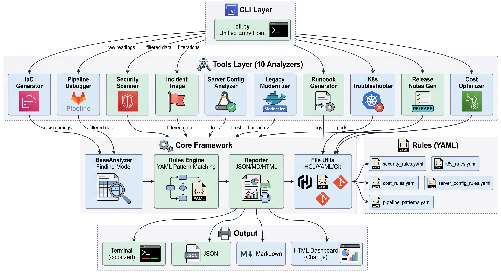
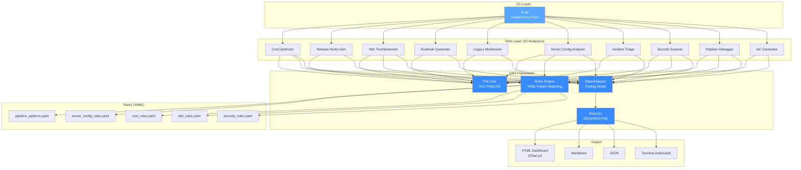
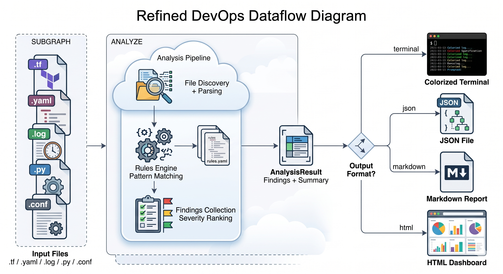
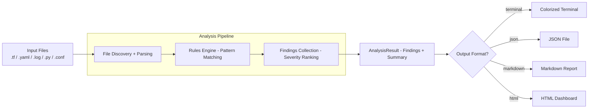

# 🔧 Claude DevOps Debug Toolkit

> **10-in-1 DevOps Automation Toolkit** — Scan, Debug, Optimize, and Generate infrastructure code with zero external API dependencies.

[](https://www.python.org/downloads/)
[]()
[](LICENSE)

---

## 📋 Table of Contents

- [Overview](#overview)
- [Architecture](#architecture)
- [The 10 Tools](#the-10-tools)
- [Quick Start](#quick-start)
- [Installation](#installation)
- [Usage Guide](#usage-guide)
- [Design Philosophy](#design-philosophy)
- [Project Structure](#project-structure)
- [Rules Engine](#rules-engine)
- [Testing](#testing)
- [Extending the Toolkit](#extending-the-toolkit)

---

## Overview

This toolkit implements **10 essential DevOps automation tools** inspired by real-world use cases from the article *"10 Ways DevOps Engineers Are Using Claude Code Right Now"*. Each tool is designed to solve a specific pain point in the DevOps lifecycle:

```
┌──────────────────────────────────────────────────────────────┐
│                    DevOps Lifecycle Coverage                  │
│                                                              │
│   PLAN        BUILD        TEST       DEPLOY     OPERATE     │
│   ┌────┐     ┌────┐      ┌────┐     ┌────┐     ┌────┐      │
│   │IaC │────▶│Pipe│─────▶│Sec │────▶│Run │────▶│Inci│      │
│   │Gen │     │line│      │Scan│     │book│     │dent│      │
│   └────┘     └────┘      └────┘     └────┘     └────┘      │
│                                                              │
│   ┌────┐     ┌────┐      ┌────┐     ┌────┐     ┌────┐      │
│   │Cost│     │K8s │      │Srv │     │Rel │     │Leg │      │
│   │Opt │     │Trbl│      │Cfg │     │Note│     │Mod │      │
│   └────┘     └────┘      └────┘     └────┘     └────┘      │
└──────────────────────────────────────────────────────────────┘
```

### Key Differentiators

| Feature                  | This Toolkit                   | Cloud-hosted tools       |
| ------------------------ | ------------------------------ | ------------------------ |
| **API Dependency** | ❌ None — runs 100% offline   | ✅ Requires API keys     |
| **Cost**           | Free                           | $$/month                 |
| **Customizable**   | YAML-based rules you own       | Vendor-locked rules      |
| **Speed**          | 0.33s for 70 tests             | Seconds per API call     |
| **Privacy**        | Code never leaves your machine | Sent to external servers |

---

## Architecture

### High-Level System Architecture





### Data Flow





---

## The 10 Tools

### Tool 1: 🏗️ IaC Generator

Generate production-ready Terraform from YAML service descriptions.

```bash
python cli.py iac-gen samples/service_descriptions/order_api.yaml --output output/
```

**What it generates:**

- `main.tf` — VPC, subnets, NAT Gateway, flow logs
- `eks.tf` — EKS cluster with managed node groups
- `database.tf` — Aurora PostgreSQL cluster
- `storage.tf` — S3 buckets with encryption, versioning, lifecycle policies

**Input format:**

```yaml
service:
  name: order-api
  environment: production
infrastructure:
  vpc:
    cidr: "10.0.0.0/16"
    azs: 3
  compute:
    type: eks
    node_groups:
      - name: general
        instance_type: m6g.large
        min_size: 2
        max_size: 10
```

---

### Tool 2: 🔍 CI/CD Pipeline Debugger

Parse failed build logs, identify the exact failure point, and suggest fixes.

```bash
python cli.py pipeline samples/pipelines/github_actions_fail.log
```

**Detects:** Dependency failures, test failures, Docker build errors, auth errors, timeouts, OOM, disk space, network issues, Terraform errors, linting failures.

**Supports:** GitHub Actions, GitLab CI, Jenkins, CircleCI, Bitbucket Pipelines (auto-detected).

---

### Tool 3: 🔒 Security Scanner

Scan Terraform/IaC files for 18+ security violations.

```bash
python cli.py security samples/terraform/ --format html --output reports/security.html
```

**Rules include:**

| Category   | Rules                                                       |
| ---------- | ----------------------------------------------------------- |
| Secrets    | Hardcoded AWS keys, passwords, private keys                 |
| Network    | Open SGs (0.0.0.0/0), SSH/RDP open to world, all ports open |
| S3         | Public ACLs, no encryption, no versioning                   |
| Encryption | Unencrypted EBS, RDS, disabled logging                      |
| IAM        | Wildcard actions/resources                                  |
| Compliance | CloudTrail disabled, missing VPC flow logs                  |

---

### Tool 4: 🚨 Incident Triage Analyzer

Analyze application logs to narrow down root cause during incidents.

```bash
python cli.py incident /var/log/app/production.log
```

**Detects 10 error patterns:** OOM, connection failures, HTTP 5xx, disk exhaustion, stack traces, auth failures, deadlocks, slow queries, rate limiting, TLS errors.

---

### Tool 5: ⚙️ Server Config Analyzer

Validate Nginx, Apache, and systemd configurations.

```bash
python cli.py server-config samples/server_configs/nginx_bad.conf
```

**Checks:** Server tokens, SSL/TLS protocols, security headers, directory listing, logging, large upload sizes, root execution, restart policies.

---

### Tool 6: 🔄 Legacy Code Modernizer

Detect anti-patterns in Python and Shell scripts.

```bash
python cli.py modernize samples/legacy_code/
```

**Detects 18+ patterns:**

- **Security:** `eval()`, `pickle`, `os.system()`, `shell=True`, hardcoded credentials
- **Python 2:** `print` statement, `urllib`, `unicode()`
- **Quality:** Bare except, silenced exceptions, no context manager, mutable defaults
- **Shell:** Backtick substitution, unquoted variables, missing `set -e`

---

### Tool 7: 📋 Runbook Generator

Auto-generate operational runbooks from Terraform or K8s manifests.

```bash
python cli.py runbook samples/terraform/ --output reports/runbook.md
```

**Generated sections:** Infrastructure inventory, deployment procedure, health checks, scaling procedures, rollback plan, incident response (SEV-1 through SEV-4), maintenance windows.

---

### Tool 8: ☸️ K8s Troubleshooter

Scan Kubernetes manifests for 17+ misconfigurations.

```bash
python cli.py k8s samples/kubernetes/bad_deployment.yaml --format html
```

**Rules include:**

| Category      | Checks                                           |
| ------------- | ------------------------------------------------ |
| Resources     | Missing requests/limits                          |
| Probes        | Missing liveness/readiness probes                |
| Security      | Root user, privileged, hostNetwork, hostPID      |
| Images        | `latest` tag, no tag, no pull policy           |
| Best Practice | Missing namespace/labels, single replica, no PDB |

---

### Tool 9: 📝 Release Notes Generator

Generate structured CHANGELOG from git history (conventional commits).

```bash
python cli.py release /path/to/git/repo --version v2.0.0
```

**Groups commits by:** 🚀 Features, 🐛 Bug Fixes, ⚡ Performance, ♻️ Refactoring, 📚 Documentation, 🔧 CI/CD, 💥 Breaking Changes.

---

### Tool 10: 💰 Cost Optimizer

Identify AWS cost savings opportunities in Terraform configs.

```bash
python cli.py cost samples/terraform/ --format html --output reports/cost.html
```

**Detects:**

| Issue                         | Est. Savings |
| ----------------------------- | ------------ |
| Oversized EC2 instances       | ~$150/mo     |
| Previous-gen types (m4→m6g)  | ~$30/mo      |
| gp2 → gp3 EBS migration      | ~$20/vol     |
| Unnecessary NAT Gateways      | ~$32/ea      |
| Multi-AZ in non-production    | ~$200/mo     |
| No auto-scaling               | ~$100/mo     |
| Missing S3 lifecycle policies | ~$15/bucket  |

---

## Quick Start

```bash
# Clone and setup
cd Claude_devops_debug
python3 -m venv .venv
source .venv/bin/activate
pip install -r requirements.txt

# Run any tool
python cli.py security samples/terraform/
python cli.py k8s samples/kubernetes/bad_deployment.yaml
python cli.py cost samples/terraform/ --format html --output reports/cost.html

# Run all tests
python -m pytest tests/ -v --html=reports/dashboard.html --self-contained-html
```

---

## Installation

### Prerequisites

- Python 3.9+
- pip

### Setup

```bash
# 1. Create virtual environment
python3 -m venv .venv
source .venv/bin/activate    # macOS/Linux
# .venv\Scripts\activate     # Windows

# 2. Install dependencies
pip install -r requirements.txt

# 3. Verify installation
python -m pytest tests/ -v
```

### Dependencies

| Package         | Purpose                      |
| --------------- | ---------------------------- |
| `pyyaml`      | YAML rule parsing            |
| `rich`        | Terminal formatting          |
| `click`       | CLI framework                |
| `jinja2`      | Terraform template rendering |
| `pytest`      | Test framework               |
| `pytest-html` | HTML test reports            |

---

## Usage Guide

### CLI Syntax

```
python cli.py <tool> <target> [--format FORMAT] [--output PATH]
```

| Argument     | Description                                                                                                                                 |
| ------------ | ------------------------------------------------------------------------------------------------------------------------------------------- |
| `tool`     | One of:`iac-gen`, `pipeline`, `security`, `incident`, `server-config`, `modernize`, `runbook`, `k8s`, `release`, `cost` |
| `target`   | File or directory to analyze                                                                                                                |
| `--format` | Output:`terminal` (default), `json`, `markdown`, `html`                                                                             |
| `--output` | Save report to file path                                                                                                                    |

### Output Formats

```bash
# Terminal (colorized, default)
python cli.py security samples/terraform/

# JSON (for CI/CD integration)
python cli.py security samples/terraform/ -f json -o reports/scan.json

# Markdown (for PRs/documentation)
python cli.py security samples/terraform/ -f markdown -o reports/scan.md

# HTML Dashboard (with Chart.js visualizations)
python cli.py security samples/terraform/ -f html -o reports/scan.html
```

### CI/CD Integration

```yaml
# GitHub Actions example
- name: Security Scan
  run: |
    python cli.py security ./terraform/ -f json -o security-report.json
    # Exit code 1 = CRITICAL/HIGH findings → fail the pipeline
```

---

## Design Philosophy

### 1. Zero External Dependencies

Every tool runs **100% offline**. No API keys, no cloud accounts, no internet connection required. This ensures:

- **Speed:** Sub-second analysis (0.33s for 70 tests)
- **Privacy:** Your code never leaves your machine
- **Reliability:** Works in air-gapped environments

### 2. YAML-Driven Rules Engine

All detection rules are defined in human-readable YAML files in the `rules/` directory. This makes it trivial to:

- Add new rules without touching Python code
- Disable rules by setting `enabled: false`
- Share rule sets across teams
- Version control your security/compliance policies

### 3. Uniform Analysis Model

Every tool follows the same pattern:

```
Input → Analyzer.analyze() → AnalysisResult → Reporter.format()
```

- **Finding:** `{rule_id, severity, category, title, message, location, recommendation}`
- **Severity:** CRITICAL > HIGH > MEDIUM > LOW > INFO
- **Result:** Pass/Fail based on presence of CRITICAL or HIGH findings

### 4. Extensible Plugin Architecture

Adding a new tool requires only:

1. Create `tools/my_tool.py` extending `BaseAnalyzer`
2. Add rules to `rules/my_rules.yaml` (optional)
3. Register in `cli.py`'s `TOOLS` dict
4. Add sample data and tests

---

## Project Structure

```
Claude_devops_debug/
├── cli.py                         # Unified CLI (entry point)
├── pyproject.toml                 # Project metadata
├── requirements.txt               # Dependencies
│
├── core/                          # Shared framework
│   ├── analyzer.py                # BaseAnalyzer, Finding, AnalysisResult
│   ├── reporter.py                # Terminal, JSON, Markdown, HTML formatters
│   ├── rules_engine.py            # YAML-based regex rules engine
│   └── file_utils.py              # File discovery, HCL/YAML parsers, git utils
│
├── tools/                         # 10 analyzer tools
│   ├── iac_generator.py           # Terraform generation from YAML
│   ├── pipeline_debugger.py       # CI/CD log analysis
│   ├── security_scanner.py        # IaC security scanning
│   ├── incident_triage.py         # Log-based incident triage
│   ├── server_config_analyzer.py  # Nginx/Apache/systemd validation
│   ├── legacy_modernizer.py       # Code anti-pattern detection
│   ├── runbook_generator.py       # Operational runbook generation
│   ├── k8s_troubleshooter.py      # K8s manifest scanning
│   ├── release_notes_generator.py # CHANGELOG generation
│   └── cost_optimizer.py          # AWS cost optimization
│
├── rules/                         # Detection rules (YAML)
│   ├── security_rules.yaml        # 18 security rules
│   ├── k8s_rules.yaml             # 17 K8s rules
│   ├── cost_rules.yaml            # 10 cost optimization rules
│   ├── server_config_rules.yaml   # 11 server config rules
│   └── pipeline_patterns.yaml     # 10 pipeline failure patterns
│
├── samples/                       # Sample inputs for testing
│   ├── terraform/                 # Insecure Terraform (intentional)
│   ├── kubernetes/                # Bad K8s manifests (intentional)
│   ├── pipelines/                 # Failed build logs
│   ├── server_configs/            # Bad Nginx configs
│   ├── legacy_code/               # Legacy Python 2 scripts
│   └── service_descriptions/      # IaC generator inputs
│
├── tests/                         # Pytest suite (70 tests)
│   ├── conftest.py                # Shared fixtures
│   ├── test_iac_generator.py      # 6 tests
│   ├── test_pipeline_debugger.py  # 5 tests
│   ├── test_security_scanner.py   # 10 tests
│   ├── test_incident_triage.py    # 7 tests
│   ├── test_server_config_analyzer.py  # 7 tests
│   ├── test_legacy_modernizer.py  # 8 tests
│   ├── test_runbook_generator.py  # 6 tests
│   ├── test_k8s_troubleshooter.py # 8 tests
│   ├── test_release_notes_generator.py  # 6 tests
│   └── test_cost_optimizer.py     # 7 tests
│
└── reports/                       # Generated reports (HTML dashboards)
```

---

## Rules Engine

### Rule Format

```yaml
rules:
  - id: SEC001                    # Unique rule ID
    title: Hardcoded AWS Access Key
    severity: CRITICAL             # CRITICAL | HIGH | MEDIUM | LOW | INFO
    category: Security             # Security | Cost | Reliability | etc.
    pattern: '(?:AKIA|ASIA)[A-Z0-9]{16}'  # Regex pattern
    message: "AWS access key found hardcoded"
    recommendation: "Use IAM roles or Secrets Manager"
    file_types: [".tf", ".yaml"]   # File extensions to scan
    enabled: true                  # Toggle rule on/off
    negate: false                  # true = flag when pattern is NOT found
```

### Current Rule Coverage

| Rule File                    | Count        | Categories                                         |
| ---------------------------- | ------------ | -------------------------------------------------- |
| `security_rules.yaml`      | 18           | Secrets, Network, S3, Encryption, IAM, Compliance  |
| `k8s_rules.yaml`           | 17           | Resources, Probes, Security, Images, Namespace, HA |
| `cost_rules.yaml`          | 10           | EC2, EBS, S3, NAT, RDS, Scaling, Logs              |
| `server_config_rules.yaml` | 11           | Nginx, Apache, Systemd                             |
| `pipeline_patterns.yaml`   | 10           | Dependencies, Tests, Docker, Auth, Timeout, OOM    |
| **Total**              | **66** |                                                    |

---

## Testing

### Run All Tests

```bash
source .venv/bin/activate
python -m pytest tests/ -v --html=reports/dashboard.html --self-contained-html
```

### Test Coverage by Tool

| Tool                    | Tests        | Status                            |
| ----------------------- | ------------ | --------------------------------- |
| IaC Generator           | 6            | ✅ All Pass                       |
| Pipeline Debugger       | 5            | ✅ All Pass                       |
| Security Scanner        | 10           | ✅ All Pass                       |
| Incident Triage         | 7            | ✅ All Pass                       |
| Server Config Analyzer  | 7            | ✅ All Pass                       |
| Legacy Modernizer       | 8            | ✅ All Pass                       |
| Runbook Generator       | 6            | ✅ All Pass                       |
| K8s Troubleshooter      | 8            | ✅ All Pass                       |
| Release Notes Generator | 6            | ✅ All Pass                       |
| Cost Optimizer          | 7            | ✅ All Pass                       |
| **Total**         | **70** | **✅ 70/70 Passed (0.33s)** |

### HTML Test Dashboard

After running tests with `--html`, open `reports/dashboard.html` in a browser for an interactive test results dashboard.

---

## Extending the Toolkit

### Adding a New Rule

1. Edit the appropriate `rules/*.yaml` file
2. Add a new rule entry following the schema
3. Add a sample that triggers the rule to `samples/`
4. Add a test in the corresponding `tests/test_*.py`

### Adding a New Tool

```python
# tools/my_new_tool.py
from core.analyzer import BaseAnalyzer, AnalysisResult, Severity, Category

class MyNewTool(BaseAnalyzer):
    name = "My New Tool"
    version = "1.0.0"

    def analyze(self, target: str, **kwargs) -> AnalysisResult:
        # Your analysis logic
        self._add_finding(
            "MY001", Severity.HIGH, Category.SECURITY,
            "Issue title", "Issue description",
            recommendation="How to fix it"
        )
        return self._build_result(target)
```

Register in `cli.py`:

```python
TOOLS["my-tool"] = ("My New Tool", MyNewTool)
```

---

## License

MIT License — Built by Pushparaj Naik
