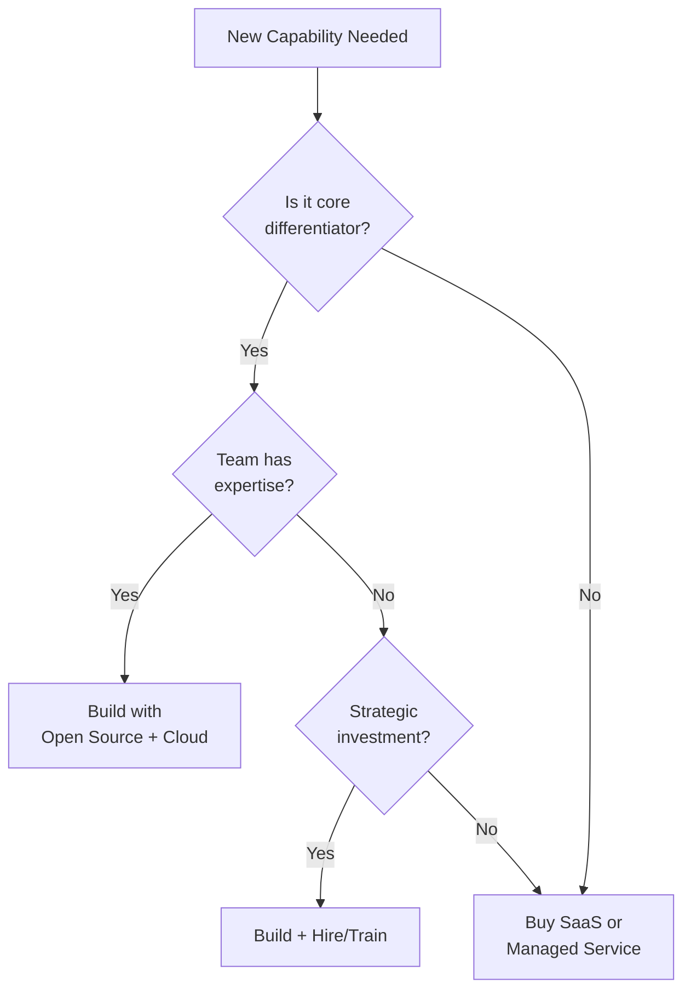

# 🎯 Accenture — Technology Strategy & Roadmap Architect (Director Level)

> **Role:** Technology Strategy & Roadmap Architect | **Level:** Director-equivalent
> **Core Skill:** Cloud Technology Architecture | **Prepared for:** Pushparaj Naik
> **Focus:** Strategic advisory, north star vision, transformation roadmaps, client-facing leadership

---

## How This Differs From a Hands-On Manager Role

| Dimension | Sr. Cloud Manager (UST) | Strategy Architect / Director (Accenture) |
|-----------|------------------------|------------------------------------------|
| **Primary Output** | Running infrastructure | Strategy decks, blueprints, roadmaps |
| **Audience** | Engineering teams | CTO, CIO, Board, Client leadership |
| **Success Metric** | Uptime, MTTR, deploy frequency | Business transformation outcomes |
| **Day-to-Day** | Terraform, EKS, incidents | Workshops, advisory, stakeholder alignment |
| **Technical Depth** | Deep in implementation | Broad across domains, deep in architecture |
| **Influence Model** | Direct team management | Advisory & influence without authority |

---

## Table of Contents

1. [Technology Vision & North Star](#1-technology-vision--north-star)
2. [Target State Blueprints](#2-target-state-blueprints)
3. [Roadmap Design & Execution](#3-roadmap-design--execution)
4. [Cloud Technology Architecture](#4-cloud-technology-architecture)
5. [Cloud Migration Strategy](#5-cloud-migration-strategy)
6. [Cloud Security & Compliance](#6-cloud-security--compliance)
7. [Stakeholder Management & Advisory](#7-stakeholder-management--advisory)
8. [Industry Trends & Emerging Technologies](#8-industry-trends--emerging-technologies)
9. [Workshop Facilitation & Cross-Team Leadership](#9-workshop-facilitation--cross-team-leadership)
10. [Behavioral & Leadership (Director Level)](#10-behavioral--leadership-director-level)

---

## 1. Technology Vision & North Star

### Q1. How do you define a "North Star" technology vision for an enterprise client?

**Answer:**

A North Star is the **aspirational end-state** that guides every technology decision over 3-5 years. It's not a project plan — it's a compass.

**My Framework — "VOICE":**

| Element | Question It Answers | Example |
|---------|-------------------|---------|
| **V**alue Outcome | What business value does technology unlock? | "Reduce time-to-market from 6 months to 2 weeks" |
| **O**perating Model | How will the org build, run, and govern technology? | "Product-oriented teams, platform engineering, SRE" |
| **I**nfrastructure Paradigm | Where and how does compute, data, and networking run? | "Cloud-native on AWS, serverless-first, API-driven" |
| **C**apabilities | What platform capabilities are needed? | "Self-service developer platform, AI/ML pipeline, observability" |
| **E**volution Path | How do we get from here to there? | "Phased migration, strangler-fig pattern, cloud centers of excellence" |

**Process to Build It:**

1. **Discovery (2 weeks):** Stakeholder interviews (CTO, VP Eng, Product, Finance, Security), current-state assessment, technology landscape inventory
2. **Analysis (2 weeks):** Gap analysis (current vs. desired), industry benchmarking, constraint mapping (budget, talent, regulatory)
3. **Synthesis (1 week):** Draft the North Star document — 1-page vision + 5-page detail
4. **Validation (1 week):** Workshop with leadership team, stress-test against scenarios
5. **Publish & Socialize:** Executive briefing, engineering town hall, embed in OKRs

**Critical Rule:** The North Star must be **technology-agnostic enough to survive 3 years** but **specific enough to make decisions today**. Saying "we'll be cloud-native" is too vague. Saying "we'll run on EKS 1.29 with Karpenter" is too specific. The right level: "Container-orchestrated microservices with autoscaling, deployed via GitOps, observable end-to-end."

---

### Q2. How do you ensure a technology vision stays aligned with business strategy?

**Answer:**

Technology vision is only valuable if it **accelerates business outcomes**. I maintain alignment through:

**1. Business Capability Mapping:**

```
Business Goal: "Enter 3 new markets in 18 months"
    └── Business Capability: Multi-region product delivery
        └── Technology Capability: Global infrastructure (multi-region AWS)
            └── Architecture Decision: Aurora Global Database, CloudFront, Route 53 geo-routing
```

Every technology investment traces back to a business capability. If it doesn't, it shouldn't be funded.

**2. Dual-Track Governance:**

- **Strategic track:** Quarterly alignment with CxO on business priorities → technology implications
- **Execution track:** Monthly architecture review board to ensure decisions align with the North Star

**3. Anti-Drift Mechanisms:**

- Architecture Decision Records (ADRs) — Every significant choice documented with context and alternatives
- "North Star Test" — Before approving any initiative: "Does this move us toward or away from the North Star?"
- Annual vision refresh — Business context changes; the vision must adapt

**4. Communication Rhythm:**

| Audience | Format | Frequency |
|----------|--------|-----------|
| Board / CxO | Executive summary (2 pages) | Quarterly |
| VP / Directors | Roadmap review deck | Monthly |
| Engineering | Architecture blog + town hall | Bi-weekly |
| New hires | Onboarding architecture walkthrough | Continuous |

---

### Q3. Give an example of a North Star vision you've defined

**Answer:**

**Client Context:** A large financial services company with 200+ applications running on-premises, 18-month release cycles, and growing competitive pressure from digital-native fintechs.

**North Star Vision:**

> *"By 2027, every customer-facing product will be delivered through cloud-native, API-first microservices on AWS, deployed multiple times per day through automated pipelines, with real-time observability and security embedded at every layer. Our technology platform will be a competitive advantage — not a constraint."*

**Quantified Targets:**

| Dimension | Current State | Target State (3-Year) |
|-----------|--------------|----------------------|
| Deployment frequency | Quarterly | Daily |
| Lead time (code → prod) | 4 months | < 4 hours |
| Infrastructure provisioning | 6 weeks (ticket-based) | 15 minutes (self-service) |
| MTTR for SEV-1 | 4 hours | < 30 minutes |
| Cloud workload % | 5% | 80% |
| Manual operational tasks | 70% | < 10% |
| Security vulnerabilities in prod | Unknown | Zero Critical/High |

**Key Architectural Principles:**

1. **Cloud-native first** — AWS managed services over self-managed, serverless over servers
2. **API-first** — Every capability exposed as a versioned API
3. **Automate everything** — Infrastructure, testing, security, compliance
4. **Observable by design** — Metrics, logs, traces built-in, not bolted-on
5. **Secure by default** — Zero-trust networking, encryption everywhere, shift-left security

---

### Q4. How do you handle resistance to a technology transformation vision?

**Answer:**

Resistance is **rational** — it usually stems from fear of job loss, comfort with current skills, or bad past experiences. I address it at three levels:

**Executive Resistance ("We can't afford this"):**

- Present the **cost of inaction**: competitive risk, technical debt interest, talent attrition
- Show phased investment model: "Invest $X in Phase 1, validate ROI, then scale"
- Benchmark against competitors and industry leaders
- Frame as business transformation, not technology project

**Middle Management Resistance ("This will disrupt my team"):**

- Co-create the roadmap with them — they own execution
- Show how transformation **elevates** their role (from firefighting to engineering)
- Provide training and certification budget
- Quick wins in first 90 days to build confidence

**Engineering Resistance ("We tried this before and it failed"):**

- Acknowledge past failures honestly — "What went wrong and what's different now?"
- Start with a pilot — low-risk, high-visibility application
- Pair experienced cloud architects with traditional teams
- Celebrate early adopters publicly

**Key Principle:** I never force transformation top-down. I create **pull** by making the new way clearly better than the old way — faster, easier, more enjoyable for engineers.

---

### Q5. How do you differentiate between a technology strategy and a technology roadmap?

**Answer:**

| Dimension | Strategy | Roadmap |
|-----------|----------|---------|
| **What it answers** | "Why" and "What" | "How" and "When" |
| **Time horizon** | 3-5 years | 12-18 months (rolling) |
| **Audience** | CxO, Board | VP Eng, Directors, Architects |
| **Format** | Vision document + principles | Timeline with milestones and dependencies |
| **Granularity** | Directional (principles, patterns) | Specific (projects, teams, quarters) |
| **Change frequency** | Annually | Quarterly updates |
| **Example statement** | "We will adopt a cloud-native, API-first architecture" | "Q3: Migrate payment service to EKS. Q4: Decompose order service" |

**The strategy is the destination. The roadmap is the GPS route.** You need both — a strategy without a roadmap is a dream, a roadmap without a strategy is a random walk.

---

## 2. Target State Blueprints

### Q6. How do you design a target-state architecture blueprint?

**Answer:**

**Blueprint Structure — Five Layers:**

```
┌─────────────────────────────────────────────────┐
│  5. Process & Governance Layer                   │
│     DevOps, SRE, FinOps, Security Operations     │
├─────────────────────────────────────────────────┤
│  4. Application & Data Layer                     │
│     Microservices, APIs, Data Lake, AI/ML        │
├─────────────────────────────────────────────────┤
│  3. Platform Layer                               │
│     EKS, Serverless, CI/CD, Observability        │
├─────────────────────────────────────────────────┤
│  2. Infrastructure Layer                         │
│     VPC, Compute, Storage, Networking, CDN       │
├─────────────────────────────────────────────────┤
│  1. Foundation Layer                             │
│     Multi-Account, IAM, Compliance, Cost Mgmt    │
└─────────────────────────────────────────────────┘
```

**For Each Layer, I Define:**

1. **Current state** — What exists today (architecture diagrams, tech inventory)
2. **Target state** — What it should look like in 18-24 months
3. **Gap analysis** — Delta between current and target
4. **Principles** — Non-negotiable rules (e.g., "No public databases," "All APIs must be versioned")
5. **Technology choices** — Specific AWS services, open-source tools, 3rd party
6. **Dependency map** — What must be built before this layer can be implemented

**Deliverable:** A visual blueprint (typically in Lucidchart or draw.io) accompanied by a 15-20 page architecture document with ADRs for major decisions.

---

### Q7. Walk through a target blueprint for a modern cloud-native enterprise platform

**Answer:**

**Layer 1 — Foundation:**

```
AWS Organizations
├── Management Account (billing, SCPs, SSO)
├── Security OU (GuardDuty, Security Hub, CloudTrail aggregation)
├── Infrastructure OU (Transit Gateway, DNS, shared networking)
├── Workload OUs (Dev → Staging → Prod per business domain)
└── Sandbox OU (developer experimentation, budget-capped)

Governance: SCPs, Config Rules, Conformance Packs, tagging policy
Identity: IAM Identity Center (SSO) + MFA + IRSA for workloads
Cost: AWS Budgets, Cost Anomaly Detection, Savings Plans, tagging
```

**Layer 2 — Infrastructure:**

```
Networking: Hub-spoke VPC via Transit Gateway, PrivateLink, no public subnets for data
Compute: EKS (Karpenter), Fargate (burst), Lambda (event-driven)
Storage: S3 (tiered), EBS gp3, EFS (shared), Aurora Serverless v2
CDN/Edge: CloudFront + WAF + Shield Advanced
DNS: Route 53 with health checks, failover, geo-routing
```

**Layer 3 — Platform:**

```
Container Platform: EKS with managed addons, Karpenter, Istio service mesh
CI/CD: GitHub Actions → ECR → ArgoCD (GitOps) → Progressive delivery (Flagger)
Observability: Prometheus + Grafana (metrics), Fluent Bit → OpenSearch (logs), X-Ray (traces)
Secret Management: Secrets Manager + External Secrets Operator
IaC: Terraform with module registry, Atlantis for PR-based applies
```

**Layer 4 — Application & Data:**

```
Application Pattern: Microservices, event-driven (EventBridge + SQS), API Gateway
Data Platform: S3 Data Lake → Glue ETL → Athena / Redshift Serverless
AI/ML: SageMaker for training, Bedrock for GenAI, Lambda for inference
APIs: API Gateway + OpenAPI specs + versioning strategy
```

**Layer 5 — Process & Governance:**

```
DevOps: DORA metrics, automated testing pyramid, feature flags
SRE: SLO/SLI framework, error budgets, on-call rotation, chaos engineering
FinOps: Chargeback model, monthly cost reviews, right-sizing cadence
Security: DevSecOps pipeline, vulnerability SLAs, compliance automation
```

---

### Q8. How do you handle the gap between current state and target state when the gap is massive?

**Answer:**

**The "Big Bang" approach always fails.** I use a phased model I call **"Horizons":**

| Horizon | Timeframe | Focus | Risk Appetite |
|---------|-----------|-------|---------------|
| **H1 — Foundation** | 0-6 months | Landing zone, IaC, CI/CD, first workload migrated | Low risk, high confidence |
| **H2 — Scale** | 6-18 months | Migrate 60% of workloads, platform maturity, observability | Moderate risk, proven patterns |
| **H3 — Transform** | 18-36 months | Cloud-native refactoring, AI/ML, advanced patterns | Higher risk, innovation focus |

**Key Tactics:**

1. **Strangler Fig Pattern** — Don't rewrite; incrementally migrate functionality behind an API facade
2. **Two-Pizza Teams** — Each team owns a bounded context end-to-end
3. **Platform-as-a-Product** — Internal developer platform with self-service, so workload teams move independently
4. **Value-Based Sequencing** — Migrate/modernize highest-business-value workloads first, not easiest
5. **Celebrate Progress** — Quarterly "State of the Platform" town hall showing metrics improvement

**Anti-Patterns I Avoid:**

- ❌ "Let's rewrite everything" — Always fails, always over budget
- ❌ "Let's migrate the easy stuff first" — Doesn't prove the hard architectural patterns
- ❌ "We'll figure out governance later" — Creates shadow IT and security gaps

---

### Q9. How do you make technology choices for a target blueprint (build vs buy vs SaaS)?

**Answer:**

**Decision Framework:**



**Evaluation Criteria:**

| Factor | Build | Buy (SaaS) | Managed Service |
|--------|-------|-----------|-----------------|
| **Time to value** | Months | Days-Weeks | Weeks |
| **Customization** | Full control | Limited | Moderate |
| **Operational burden** | High (you own it) | None | Low |
| **Cost model** | CapEx + OpEx | OpEx (subscription) | OpEx (usage) |
| **Lock-in risk** | Low | Medium-High | Medium |
| **When to choose** | Core differentiator | Commodity functions | Infrastructure needs |

**Examples of my decisions:**

- **CI/CD:** Buy (GitHub Actions) — Not a differentiator, best-in-class SaaS
- **Container Platform:** Managed Service (EKS) — Need control but not operational burden of self-managed K8s
- **Observability:** Build on open-source (Prometheus/Grafana) + Managed (CloudWatch) — Need customization for domain-specific dashboards
- **Authentication:** Buy (Auth0 / Cognito) — Security-critical, no reason to build
- **Core Business Logic:** Build — This IS the differentiator

---

## 3. Roadmap Design & Execution

### Q10. How do you structure a technology transformation roadmap?

**Answer:**

**Roadmap Anatomy:**

```
                    Q1 2026          Q2 2026         Q3 2026         Q4 2026
                 ┌──────────────┬──────────────┬──────────────┬──────────────┐
Foundation       │ Landing Zone │ IaC Modules  │ Governance   │ FinOps       │
                 │ Multi-Account│ CI/CD Golden │ Policy-as-   │ Chargeback   │
                 │ Setup        │ Paths        │ Code         │ Model        │
                 ├──────────────┼──────────────┼──────────────┼──────────────┤
Migration        │ Assessment   │ Wave 1:      │ Wave 2:      │ Wave 3:      │
                 │ & Planning   │ 5 apps       │ 15 apps      │ 25 apps      │
                 │              │ (Pilot)      │ (Scale)      │ (Accelerate) │
                 ├──────────────┼──────────────┼──────────────┼──────────────┤
Modernization    │              │ API Gateway  │ Event-Driven │ AI/ML        │
                 │              │ + First      │ Architecture │ Platform     │
                 │              │ Microservice │              │              │
                 ├──────────────┼──────────────┼──────────────┼──────────────┤
People           │ Hire 3 Cloud │ AWS Cert     │ SRE Practice │ CCoE        │
                 │ Engineers    │ Program      │ Established  │ Mature       │
                 └──────────────┴──────────────┴──────────────┴──────────────┘
```

**Roadmap Principles:**

1. **Multi-swim-lane** — Infrastructure, Migration, Modernization, People run in parallel
2. **Dependency-aware** — Landing zone must complete before first migration wave
3. **Value milestones** — Every quarter has a demonstrable business outcome
4. **Buffer built in** — 20% capacity reserved for unknowns and technical debt
5. **Rolling horizon** — Next quarter is detailed, Q+2 is directional, Q+3 is aspirational

---

### Q11. How do you prioritize initiatives on a transformation roadmap?

**Answer:**

**Prioritization Matrix — RICE adapted for transformation:**

| Factor | Weight | How to Measure |
|--------|--------|----------------|
| **R**evenue Impact | 30% | Direct revenue enablement or cost reduction |
| **I**nfrastructure Dependency | 25% | How many other initiatives depend on this? |
| **C**omplexity/Risk | 25% | Team readiness, technical risk, organizational change |
| **E**xecutive Sponsorship | 20% | Does a CxO champion this? (Without sponsorship, it stalls) |

**Additional Sequencing Rules:**

1. **Foundation before migration** — Landing zone, IAM, networking before workloads
2. **Pilot before scale** — Prove patterns with 1-2 apps before migrating 50
3. **People alongside technology** — Training must precede or parallel technology rollout
4. **Quick wins early** — 1-2 visible wins in first 90 days to build organizational momentum
5. **Security is not a phase** — It's embedded in every phase from day 1

**Stakeholder Prioritization Workshop:**

- I facilitate a weighted-scoring exercise with 8-12 senior stakeholders
- Each initiative scored on the 4 factors above
- Consensus-driven, but I provide a recommended sequencing as a starting point
- Output: Prioritized backlog with quarterly milestones

---

### Q12. How do you track and communicate roadmap progress?

**Answer:**

**Three Levels of Reporting:**

| Audience | Format | Frequency | Content |
|----------|--------|-----------|---------|
| **CxO / Board** | Executive Dashboard (1-page) | Monthly | RAG status, key milestones, risks, budget |
| **VP / Directors** | Roadmap Review (deck) | Bi-weekly | Detailed progress, blockers, dependency changes |
| **Engineering** | Sprint Demo + Metrics | Weekly | Working software, DORA metrics, velocity |

**Executive Dashboard Template:**

```
╔══════════════════════════════════════════════════════════╗
║  Cloud Transformation — May 2026 Status Report           ║
╠══════════════════════════════════════════════════════════╣
║  Overall Status: 🟢 ON TRACK                            ║
║                                                          ║
║  Milestones:                                             ║
║  ✅ Landing Zone — Complete                              ║
║  ✅ Wave 1 Migration (5 apps) — Complete                 ║
║  🟡 Wave 2 Migration (15 apps) — 60% complete           ║
║  ⬜ Platform Self-Service — Not started (Q3)             ║
║                                                          ║
║  Key Metrics:                                            ║
║  • 35 of 200 apps migrated (17.5%)                      ║
║  • Cloud spend: $45K/mo (within $50K budget)            ║
║  • Deployment frequency: 3x/day (up from 1x/month)      ║
║  • Zero SEV-1 incidents since migration                  ║
║                                                          ║
║  Top Risk: Database migration complexity for legacy ERP  ║
║  Mitigation: Engaged AWS Professional Services for DMS   ║
╚══════════════════════════════════════════════════════════╝
```

**RAG Criteria I Use:**

- 🟢 **Green:** On track, on budget, risks mitigated
- 🟡 **Amber:** 1-2 week delay or budget risk, mitigation plan in place
- 🔴 **Red:** > 2 week delay, budget overrun, or blocked dependency — escalation required

---

### Q13. How do you handle roadmap changes when business priorities shift mid-execution?

**Answer:**

**Priority shifts are inevitable. A rigid roadmap is a failed roadmap.**

**My approach — "Rolling Wave Planning":**

1. **Next quarter:** Committed (teams staffed, work in progress)
2. **Quarter after:** Planned (scope defined, resources identified)
3. **Beyond that:** Aspirational (directional, subject to change)

**When a shift happens:**

1. **Assess impact** — What's the blast radius? Which in-flight work is affected?
2. **Present trade-offs** — "We can do X, but we must drop or defer Y. Here's the impact of each option."
3. **Never say 'Yes, and'** — Always "Yes, instead of." Roadmaps have fixed capacity.
4. **Rebaseline formally** — Updated roadmap published, communicated to all stakeholders
5. **Protect foundational work** — Never sacrifice security, observability, or platform stability for feature urgency

**Example:** Client's CEO announced an acquisition — need to integrate a new company's tech stack in 6 months. We:

- Deferred the AI/ML platform (H3) by 2 quarters
- Accelerated multi-account and networking work (needed for integration)
- Brought in additional contractors for integration-specific tasks
- Published a revised roadmap within 1 week

---

## 4. Cloud Technology Architecture

### Q14. How do you evaluate and recommend cloud service models (IaaS vs PaaS vs SaaS)?

**Answer:**

**The Cloud Maturity Spectrum:**

```
IaaS ────────────────── PaaS ────────────────── SaaS
(Most Control)                                   (Least Control)
(Most Operational Burden)                        (Least Burden)

EC2, VPC, EBS          EKS, RDS, Lambda          Salesforce, Datadog, Auth0
"You manage almost      "You manage app,          "You manage config,
 everything"             cloud manages platform"    vendor manages everything"
```

**Decision Matrix:**

| Factor | IaaS | PaaS | SaaS |
|--------|------|------|------|
| **Use when** | Custom OS/network, legacy lift-and-shift | Modern applications, managed databases | Commodity business functions |
| **Team skill** | Strong sysadmin/infra | Developer-centric | Business/functional users |
| **Time to market** | Weeks-months | Days-weeks | Hours-days |
| **Customization** | Full | Moderate | Limited |
| **Examples** | EC2, VPC, EBS | EKS, Aurora, Lambda, SQS | Datadog, PagerDuty, Confluence |

**My Guiding Principle:** Move **up the stack** whenever possible. The less infrastructure you manage, the more time you invest in business differentiation.

**Maturity Progression for a Typical Client:**

- **Year 1:** IaaS (lift-and-shift to EC2) — 60% of workloads
- **Year 2:** PaaS (containerize on EKS, managed databases) — 70% of workloads
- **Year 3:** Serverless/SaaS (Lambda, Fargate, managed services) — 40%+ of new workloads

---

### Q15. How do you design scalable and resilient cloud architectures?

**Answer:**

**Resilience Design Patterns:**

| Pattern | What It Solves | AWS Implementation |
|---------|---------------|-------------------|
| **Multi-AZ** | Single-AZ failure | ALB + EKS across 3 AZs + Aurora Multi-AZ |
| **Circuit Breaker** | Cascading failures | App Mesh / Istio + retry policies |
| **Bulkhead** | Resource contention | Separate EKS node pools per criticality |
| **Queue-Based Load Leveling** | Traffic spikes | SQS + Lambda (absorbs bursts) |
| **Event Sourcing** | Data consistency | EventBridge + DynamoDB Streams |
| **Saga Pattern** | Distributed transactions | Step Functions for orchestration |
| **Strangler Fig** | Legacy modernization | API Gateway routing between old and new |

**Scalability Patterns:**

| Dimension | Pattern | AWS Service |
|-----------|---------|-------------|
| **Compute** | Horizontal scaling | EKS HPA + Karpenter |
| **Database** | Read replicas + sharding | Aurora Replicas + DynamoDB |
| **Cache** | Layered caching | CloudFront → API GW cache → ElastiCache |
| **Async Processing** | Event-driven + queuing | SQS → Lambda, EventBridge → Step Functions |
| **Static Assets** | CDN edge caching | CloudFront + S3 origin |
| **API** | Rate limiting + throttling | API Gateway usage plans |

**Architecture Validation:**

- I validate every architecture against the AWS Well-Architected Framework's 6 pillars
- Failure Mode Analysis: "What happens if this AZ goes down? This service fails? This database corrupts?"
- Load test target state before going live (k6 or Locust against staging at 2x expected peak)

---

### Q16. Explain event-driven architecture and when you'd recommend it

**Answer:**

**What:** Components communicate through events rather than direct calls. Producers don't know about consumers. Events are facts about something that happened.

**AWS Event-Driven Stack:**

```
Event Source → EventBridge → Target(s)
                  ↓
              SQS Queue → Lambda → DynamoDB
                  ↓
              SNS Topic → Multiple Subscribers
                  ↓
              Step Functions → Complex Workflows
```

**When to Recommend:**

- ✅ High-throughput, variable traffic (events buffer naturally)
- ✅ Loose coupling required (teams deploy independently)
- ✅ Complex workflows with multiple steps (order processing, claim handling)
- ✅ Real-time data processing (IoT, clickstream, fraud detection)
- ✅ Fan-out patterns (one event triggers 5 different systems)

**When NOT to:**

- ❌ Simple CRUD applications (overkill)
- ❌ Strong consistency required (events are eventually consistent)
- ❌ Team lacks event-driven experience (learning curve is steep)

**Key Design Considerations:**

1. **Idempotency** — Consumers must handle duplicate events safely
2. **Ordering** — SQS FIFO for ordered processing, standard SQS when order doesn't matter
3. **Dead Letter Queues** — Every queue needs a DLQ for failed messages
4. **Schema Evolution** — Use EventBridge Schema Registry for event versioning
5. **Observability** — Distributed tracing (X-Ray) is essential; events are hard to debug without it

---

### Q17. How do you architect for data-intensive workloads on AWS?

**Answer:**

**Data Architecture Pattern — Lakehouse:**

```
Sources → Ingestion → Storage → Processing → Serving → Consumption
                                                        
Databases   Kinesis    S3 Data    Glue ETL    Redshift    QuickSight
APIs        DMS        Lake       Spark       Athena      Grafana
IoT         AppFlow    (Parquet)  Lambda      OpenSearch   ML Models
SaaS        EventBridge           Step Fn     API GW      Bedrock
```

**Storage Tiers:**

| Tier | Service | Use Case | Cost |
|------|---------|----------|------|
| **Hot** | DynamoDB, ElastiCache | Real-time queries, caching | $$$ |
| **Warm** | Aurora, RDS | Transactional workloads | $$ |
| **Cold** | S3 Standard | Analytics, data lake | $ |
| **Archive** | S3 Glacier | Compliance retention | ¢ |

**Key Architectural Decisions:**

1. **S3 as the center of gravity** — All data lands in S3, everything reads from S3
2. **Schema-on-read** — Store in Parquet/ORC, schema applied at query time (Athena/Glue)
3. **Decouple ingestion from processing** — Kinesis buffers real-time, S3 batches
4. **Govern with Lake Formation** — Column-level access control, audit logging
5. **Cost optimization** — S3 Intelligent Tiering, Athena with partitioned tables, Redshift Serverless

---

## 5. Cloud Migration Strategy

### Q18. What is your approach to enterprise cloud migration?

**Answer:**

**The 7-R Framework:**

| Strategy | Description | When to Use | Effort | Modernization |
|----------|-------------|-------------|--------|---------------|
| **Retire** | Decommission | Unused applications | Minimal | N/A |
| **Retain** | Keep on-prem | Regulatory, mainframe | None | None |
| **Rehost** | Lift-and-shift (EC2) | Quick migration, minimal change | Low | None |
| **Replatform** | Lift-and-reshape | Move to managed services (RDS, ECS) | Medium | Moderate |
| **Repurchase** | Replace with SaaS | CRM, ITSM, HR | Medium | Full |
| **Refactor** | Re-architect | Core differentiators, cloud-native | High | Full |
| **Relocate** | VMware → VMware Cloud on AWS | Large VM estates, minimal disruption | Low | None |

**My Phased Approach:**

**Phase 0 — Assessment (4-6 weeks):**

- Application portfolio inventory (CMDB or manual)
- Dependency mapping (AWS Application Discovery Service)
- 7-R classification for each application
- TCO analysis: on-prem vs. cloud per workload
- Risk assessment: compliance, data sovereignty, integration dependencies

**Phase 1 — Foundation (6-8 weeks):**

- Landing zone (Control Tower / custom)
- Networking (Transit Gateway, VPN/Direct Connect to on-prem)
- IaC modules (Terraform)
- CI/CD golden path
- Security baseline (GuardDuty, Config, CloudTrail)

**Phase 2 — Migration Waves (4-6 months):**

- Wave 1: 3-5 apps (low-risk, high-visibility, prove the pattern)
- Wave 2: 15-20 apps (scale the factory, use lessons from Wave 1)
- Wave 3: 30-50 apps (accelerate with automation, parallel teams)

**Phase 3 — Optimization (ongoing):**

- Right-sizing, Savings Plans, Spot adoption
- Modernization backlog (replatform → refactor progressively)
- Decommission on-prem infrastructure as apps migrate

---

### Q19. How do you build a "migration factory" to accelerate at scale?

**Answer:**

**Migration Factory Model:**

```
                    ┌─────────────────────────────┐
                    │       Migration Factory       │
                    │                               │
                    │  ┌─────────┐ ┌─────────────┐ │
 Application  ──→  │  │ Assess  │→│ Migrate     │ │  ──→  Cloud-Hosted
 Portfolio          │  │ & Plan  │ │ & Validate  │ │       Application
                    │  └─────────┘ └─────────────┘ │
                    │                               │
                    │  Automation:                   │
                    │  • IaC Templates (Terraform)  │
                    │  • CI/CD Golden Paths          │
                    │  • Testing Frameworks          │
                    │  • Runbook Library              │
                    └─────────────────────────────┘
```

**Factory Components:**

1. **Standardized Runbooks** — Step-by-step for each migration pattern (Rehost, Replatform)
2. **IaC Module Library** — Pre-built Terraform modules for common patterns (VPC, EKS, RDS, ALB)
3. **CI/CD Templates** — One-click pipeline setup for each language/framework
4. **Testing Automation** — Smoke tests, integration tests, performance benchmarks
5. **Intake Form** — Standardized questionnaire for each application (dependencies, data volume, compliance)
6. **Velocity Metrics** — Track apps/week migrated, defects post-migration, rollback rate

**Scaling from 5 to 50 apps:**

- Wave 1: 1 team, 5 apps, 6 weeks → Establish patterns
- Wave 2: 2 teams, 15 apps, 6 weeks → Reuse patterns, fix gaps
- Wave 3: 4 teams, 30 apps, 6 weeks → Full parallelization
- Target velocity: **5-10 apps per week** at peak with a mature factory

---

### Q20. How do you handle data migration to the cloud?

**Answer:**

**Data Migration Decision Tree:**

| Data Size | Approach | Service | Duration |
|-----------|----------|---------|----------|
| < 10 TB | Online transfer | AWS DMS / DataSync | Hours-Days |
| 10-100 TB | Hybrid (online + offline) | DMS + Snowball Edge | Days-Weeks |
| > 100 TB | Offline transfer | AWS Snowball / Snow Family | Weeks |
| Continuous | CDC (Change Data Capture) | DMS with ongoing replication | Continuous |

**Database Migration Strategy:**

| Source | Target | Approach |
|--------|--------|----------|
| Oracle → PostgreSQL | Aurora PostgreSQL | DMS + Schema Conversion Tool (SCT) |
| SQL Server → PostgreSQL | Aurora PostgreSQL | DMS + SCT + manual stored proc rewrite |
| Oracle → Oracle | RDS Oracle | DMS (homogeneous, simpler) |
| MongoDB → DocumentDB | DocumentDB | DMS with MongoDB-compatible target |
| Custom files → S3 | S3 Data Lake | DataSync or Transfer Family |

**Key Considerations:**

1. **Cut-over strategy:** Blue-green with DMS CDC → Test on target → Switch DNS → Decommission source
2. **Data validation:** Row counts, checksums, application-level verification
3. **Downtime window:** DMS CDC minimizes downtime to minutes (final sync + DNS switch)
4. **Compliance:** Data encryption in transit (TLS) and at rest (KMS), no data in public S3

---

## 6. Cloud Security & Compliance

### Q21. How do you integrate security into a cloud transformation strategy?

**Answer:**

**Security is not a workstream — it's a property of every workstream.**

**"Secure by Design" Principles:**

1. **Identity-First Architecture:**
   - Zero-trust networking: No implicit trust based on network location
   - Every API call authenticated + authorized
   - IAM Identity Center for humans, IRSA/IAM Roles for machines
   - No long-lived credentials anywhere

2. **Defense in Depth:**

   ```
   Edge: WAF + Shield + CloudFront
   Network: VPC + Security Groups + NACLs + PrivateLink
   Compute: IMDSv2 + Pod Security Standards + Container scanning
   Data: KMS encryption + S3 bucket policies + RDS SSL enforcement
   Identity: MFA + SCPs + Permission Boundaries
   Detection: GuardDuty + Security Hub + CloudTrail
   ```

3. **Shift-Left Security:**
   - SAST/SCA in CI pipeline (block on Critical findings)
   - IaC scanning (Checkov/tfsec) in Terraform plan
   - Container image scanning (Trivy) before ECR push
   - Secret scanning (gitleaks) pre-commit

4. **Compliance Automation:**
   - AWS Config Rules for continuous compliance monitoring
   - Conformance Packs for SOC 2, PCI DSS, HIPAA
   - AWS Audit Manager for evidence collection
   - Auto-remediation via EventBridge → Lambda for common misconfigurations

---

### Q22. How do you present cloud security posture to a Board or CxO?

**Answer:**

**Executive Security Dashboard — 1 Page:**

```
╔══════════════════════════════════════════════════════════╗
║  Cloud Security Posture — May 2026                       ║
╠══════════════════════════════════════════════════════════╣
║                                                          ║
║  Security Score: 92/100 (AWS Security Hub)                ║
║  Trend: ↑ from 78 in January                             ║
║                                                          ║
║  Critical Findings:  0  (down from 12 in Q1)             ║
║  High Findings:      3  (remediation in progress)        ║
║                                                          ║
║  Compliance:                                             ║
║  • CIS Benchmark: 94% compliant                         ║
║  • SOC 2: Audit-ready                                    ║
║  • Data Encryption: 100% at rest, 100% in transit        ║
║                                                          ║
║  Key Wins This Month:                                    ║
║  • Eliminated all public S3 buckets (was 7)              ║
║  • Enforced MFA on 100% of human identities              ║
║  • GuardDuty threat detection: 0 confirmed threats       ║
║                                                          ║
║  Top Risk: 3 legacy applications without WAF protection  ║
║  Mitigation: WAF rollout completing in 2 weeks           ║
╚══════════════════════════════════════════════════════════╝
```

**Key Principles for Board Communication:**

1. **Quantify** — "92/100 score" not "we're doing well"
2. **Trend** — Show improvement over time (the delta matters more than the absolute)
3. **Compare** — Benchmark against industry peers when possible
4. **Risk language** — Frame as business risk, not technical jargon ("data breach exposure" not "public S3 bucket")
5. **Action-oriented** — Every risk has a mitigation with a deadline

---

## 7. Stakeholder Management & Advisory

### Q23. How do you influence technology decisions when you don't have direct authority?

**Answer:**

**Influence Framework — "DATA":**

| Approach | Description | When to Use |
|----------|-------------|-------------|
| **D**ata-Driven | Present benchmarks, TCO analysis, industry reports | With CFOs, analytical leaders |
| **A**lignment | Map tech decisions to their OKRs/KPIs | With business unit leaders |
| **T**rust | Build credibility through small wins first | With skeptical stakeholders |
| **A**dvocates | Find internal champions to amplify your message | With large organizations |

**Practical Tactics:**

1. **Speak their language:** With a CFO, talk TCO and ROI. With a CISO, talk risk and compliance. With a CTO, talk architecture and velocity.
2. **Pre-wire decisions:** Never surprise stakeholders in a meeting. Share your recommendation 1:1 first, get feedback, adjust.
3. **Options, not ultimatums:** Present 3 options (Recommended + 2 alternatives) with trade-offs. Let them choose.
4. **Document decisions:** ADRs with context, options considered, and rationale. This prevents revisiting.
5. **Celebrate their wins:** When a decision you influenced succeeds, credit the decision-maker publicly.

---

### Q24. How do you manage competing priorities from multiple business stakeholders?

**Answer:**

**Scenario:** Product team wants new features. Security wants compliance remediation. Infrastructure wants modernization. All want engineering time.

**My Approach:**

1. **Make the trade-offs visible:**
   Create a prioritization matrix and share it transparently:

   ```
   | Initiative          | Business Value | Risk if Deferred | Effort | Sponsor    |
   |---------------------|---------------|-----------------|--------|------------|
   | Feature X           | High          | Medium          | Large  | VP Product |
   | PCI Compliance Fix  | Medium        | Critical        | Small  | CISO       |
   | EKS Upgrade         | Low           | High (EOL)      | Medium | VP Eng     |
   ```

2. **Use a shared prioritization framework:**
   - Weighted scoring in a workshop with all stakeholders present
   - "Disagree and commit" on the final ordering
   - Revisit quarterly, not weekly

3. **Capacity allocation model:**
   - 60% feature work (business value)
   - 20% technical debt / modernization
   - 10% security / compliance
   - 10% innovation / learning

4. **Escalation protocol:** If stakeholders can't agree, escalate to the shared executive sponsor with a clear recommendation and trade-off analysis.

---

### Q25. How do you facilitate a technology strategy workshop with senior leaders?

**Answer:**

**Workshop Structure (Full Day):**

| Time | Activity | Output |
|------|----------|--------|
| **09:00-09:30** | Context Setting | Shared understanding of business objectives |
| **09:30-10:30** | Current State Assessment | Pain points, constraints, successes |
| **10:30-10:45** | Break | |
| **10:45-12:00** | North Star Visioning | Draft vision statement + architectural principles |
| **12:00-13:00** | Lunch | |
| **13:00-14:30** | Target State Blueprint | Layered architecture (5-layer model) |
| **14:30-14:45** | Break | |
| **14:45-16:00** | Roadmap Prioritization | Sequenced initiatives with dependencies |
| **16:00-16:30** | Risks & Next Steps | Top 5 risks, action items, governance model |

**Facilitation Techniques:**

1. **Pre-Work:** Send a 1-page brief with current state summary 1 week before
2. **Sticky Notes / Miro:** Silent brainstorming before group discussion (prevents HiPPO bias)
3. **Dot Voting:** Democratic prioritization (each person gets 5 dots to vote on initiatives)
4. **Parking Lot:** Capture off-topic but important items without derailing
5. **Timeboxing:** Every activity has a strict timebox. I'm the clock.

**Post-Workshop Deliverable (within 1 week):**

- Executive summary (2 pages)
- Vision statement + architectural principles
- Target state blueprint (visual)
- Prioritized roadmap (timeline view)
- Risk register with mitigations
- Governance model recommendation

---

## 8. Industry Trends & Emerging Technologies

### Q26. What emerging technology trends should enterprise CTOs be paying attention to?

**Answer:**

**Tier 1 — Act Now (Proven, Competitive Advantage):**

| Trend | Why It Matters | AWS Service |
|-------|---------------|-------------|
| **Generative AI / LLM Integration** | Every enterprise will embed AI into products within 2 years | Bedrock, SageMaker, Lambda |
| **Platform Engineering** | Developer experience determines velocity; internal platforms are the new competitive moat | EKS, CDK, Service Catalog |
| **FinOps Maturity** | Cloud costs grow 30% annually without governance | Cost Explorer, Budgets, Kubecost |

**Tier 2 — Experiment (Emerging, Strategic Value):**

| Trend | Why It Matters | AWS Service |
|-------|---------------|-------------|
| **AI Agents (Agentic AI)** | Autonomous AI agents that plan, execute, and learn — next frontier beyond chatbots | Bedrock Agents, AgentCore |
| **Serverless-Everything** | Operational burden approaching zero for more workload types | Aurora Serverless v2, Fargate, Lambda |
| **Sustainability / Green Cloud** | Regulatory pressure + ESG reporting requirements | Graviton, S3 Intelligent Tiering, Customer Carbon Footprint Tool |

**Tier 3 — Watch (Early Stage, High Potential):**

| Trend | Why It Matters |
|-------|---------------|
| **Quantum Computing** | Cryptographic risk (harvest-now-decrypt-later) + optimization use cases |
| **Edge AI** | Real-time inference at IoT edge, autonomous systems |
| **Digital Twins** | Manufacturing, supply chain, infrastructure simulation |

**How I stay current:**

- AWS re:Invent keynotes + breakout sessions (annual)
- Gartner Hype Cycle for Cloud Platform Services
- ThoughtWorks Technology Radar (quarterly)
- Hands-on POCs in sandbox accounts (I build, not just read)

---

### Q27. How do you evaluate whether a new technology is ready for enterprise adoption?

**Answer:**

**Technology Readiness Assessment — "PRISM":**

| Factor | Question | Red Flag |
|--------|----------|----------|
| **P**roduction Readiness | Is it GA (not preview/beta)? SLA published? | "Preview" label, no SLA |
| **R**eference Customers | Are comparable enterprises using it in production? | Only startups or only the vendor's case studies |
| **I**ntegration Complexity | Does it work with our existing stack? | Requires replacing 3 existing tools |
| **S**kill Availability | Can we hire/train for this technology? | Fewer than 100 job postings globally |
| **M**aturity of Ecosystem | Community, documentation, tooling, support | Sparse docs, inactive GitHub, no Stack Overflow answers |

**My Rule:** For production workloads, technology must score GREEN on at least 4 of 5 factors. For POCs, 3 of 5 is acceptable.

---

### Q28. Where does AI/GenAI fit in a cloud technology strategy?

**Answer:**

**AI Integration Model:**

```
                    ┌─────────────────────────────────────┐
                    │        AI-Powered Enterprise         │
                    ├─────────────────────────────────────┤
Tier 3 (Transform) │  AI Agents, Autonomous Workflows     │
                    │  Custom fine-tuned models             │
                    │  AI-driven decision systems           │
                    ├─────────────────────────────────────┤
Tier 2 (Enhance)   │  AI-assisted development (Copilots)  │
                    │  Intelligent search (RAG + KB)        │
                    │  Automated content generation         │
                    ├─────────────────────────────────────┤
Tier 1 (Foundation)│  Cloud infrastructure for AI          │
                    │  Data platform (S3 Data Lake)         │
                    │  MLOps pipeline (SageMaker)           │
                    └─────────────────────────────────────┘
```

**Recommended AWS AI Stack:**

- **Foundation Models:** Bedrock (Claude, Titan, Mistral — no model hosting required)
- **RAG Pattern:** Bedrock Knowledge Base + Aurora pgvector + S3 document store
- **AI Agents:** Bedrock Agents with action groups (tool use, memory, multi-step reasoning)
- **Custom Training:** SageMaker for proprietary model fine-tuning
- **Inference:** Lambda + Bedrock for serverless inference at scale

**Strategic Guidance for Clients:**

1. Start with **pre-trained models** (Bedrock) — don't train custom models unless necessary
2. Invest in **data quality** — AI is only as good as the data it's trained on / retrieves
3. Build **responsible AI guardrails** — Bedrock Guardrails for content filtering, PII detection
4. **Measure ROI** — Track time savings, quality improvements, customer satisfaction delta
5. **Don't chase hype** — Not every problem needs GenAI; sometimes a well-designed search query is enough

---

## 9. Workshop Facilitation & Cross-Team Leadership

### Q29. How do you engage multiple teams and drive cross-functional decisions?

**Answer:**

**Operating Model — "Hub and Spoke":**

```
                    ┌──────────────┐
                    │  You (Hub)   │
                    │  Strategy &  │
                    │  Architecture│
                    └──────┬───────┘
           ┌───────────────┼───────────────┐
           │               │               │
    ┌──────┴──────┐ ┌──────┴──────┐ ┌──────┴──────┐
    │ Product     │ │ Engineering │ │ Security    │
    │ Teams       │ │ Platform    │ │ & Compliance│
    └─────────────┘ └─────────────┘ └─────────────┘
```

**Engagement Model:**

| Forum | Cadence | Participants | Purpose |
|-------|---------|-------------|---------|
| **Architecture Review Board** | Bi-weekly | All tech leads | Approve architecture decisions |
| **Strategy Alignment** | Monthly | CTO + VPs | Roadmap progress + priority adjustments |
| **Working Group** | Weekly per topic | SMEs | Deep-dive on specific topics (e.g., data migration) |
| **Town Hall** | Monthly | All engineers | Strategy updates, demos, Q&A |
| **1:1 Advisory** | As needed | Individual leaders | Private coaching, pre-wiring decisions |

**Cross-Team Decision-Making:**

1. **RACI for every decision:** Who's Responsible, Accountable, Consulted, Informed
2. **RFC Process:** Major decisions go through a Request for Comments (written, asynchronous, time-bounded)
3. **ADRs:** Architecture Decision Records capture context, options, and rationale
4. **Disagree and Commit:** After healthy debate, the team commits. No side-channel undermining.

---

### Q30. How do you handle a situation where two teams have conflicting architectural approaches?

**Answer:**

**Step 1: Understand Both Sides**

- Meet each team separately to understand their reasoning, constraints, and concerns
- Ask: "What problem are you solving? What will break if you don't do it your way?"

**Step 2: Facilitate a Joint Session**

- Present both approaches side by side on a shared board
- Evaluate against shared criteria:
  - Alignment with North Star principles
  - Total cost of ownership
  - Team skill availability
  - Maintenance burden over 3 years
  - Security and compliance implications

**Step 3: Find Common Ground**

- Often, the conflict is about **different assumptions**, not different goals
- Making assumptions explicit resolves 70% of conflicts

**Step 4: Make a Decision**

- If consensus emerges, document and move forward
- If not, I make a recommendation with clear rationale (that's the role of a Strategy Architect)
- Escalate to Architecture Review Board only if teams can't align after a facilitated session

**Step 5: Codify**

- Publish an ADR documenting the decision, alternatives considered, and why
- This prevents the same debate from recurring in 6 months

---

## 10. Behavioral & Leadership (Director Level)

### Q31. Why are you interested in a Strategy & Roadmap Architect role at Accenture?

**Answer:**

Three reasons:

1. **Scale of Impact:** At Accenture, I'd work across multiple clients and industries, applying patterns I've honed over 13+ years. The ability to transform an entire enterprise's technology landscape — not just one team — is what excites me.

2. **Strategy + Execution:** I've spent my career bridging the gap between architecture whiteboards and running production systems. This role lets me define the vision AND ensure it's implementable — because I've built these systems myself.

3. **Cloud is at an inflection point:** With GenAI, serverless maturity, and platform engineering converging, the next 3 years will reshape how enterprises think about technology. I want to be at the table where those transformation strategies are defined.

---

### Q32. What's the biggest technology transformation you've led?

**Answer:**

**Situation:** Led the cloud transformation for a financial services enterprise with 200+ applications, 18-month release cycles, and a 30-person technology team reluctant to change.

**What I Did:**

1. **Defined the North Star:** "Cloud-native, API-first, daily deployments" — approved by the CTO
2. **Built the Blueprint:** 5-layer architecture covering foundation → platform → application → data → process
3. **Designed the Roadmap:** 3-horizon plan (Foundation → Scale → Transform) over 24 months
4. **Established the Factory:** Reusable Terraform modules, CI/CD golden paths, migration runbooks
5. **Led the People Change:** Hired 10 cloud engineers, upskilled 20 existing engineers, established on-call practices

**Results:**

- 150 of 200 apps migrated (75%) in 18 months
- Release cycle: 18 months → daily deployments
- Infrastructure cost: 35% reduction (right-sizing, Spot, Savings Plans)
- MTTR: 4 hours → 20 minutes
- Zero data breaches during or after migration

---

### Q33. How do you handle a client who has unrealistic expectations?

**Answer:**

**Principle: Don't say "no" — say "here's what's possible."**

**Example:** Client CTO says: "We want to migrate 200 applications to the cloud in 6 months."

**My Response:**

1. **Acknowledge the ambition:** "That's a bold and exciting goal. Let me show you what's achievable."

2. **Present data:**
   - Industry benchmark: 5-10 apps/week at peak with a mature migration factory
   - Ramp-up time: 6-8 weeks before the factory reaches peak velocity
   - Realistic target: 80-100 apps in 6 months, all 200 in 12 months

3. **Offer options:**

   | Option | Timeline | Risk | Cost |
   |--------|----------|------|------|
   | A: All 200 in 6 months | Aggressive | Very High (quality, security) | $$$$$ |
   | B: 100 in 6 months, 200 in 12 | Balanced | Moderate | $$$ |
   | C: 200 in 12 months, optimized | Conservative | Low | $$ |

4. **Recommend Option B** with clear reasoning: "Option B gets the highest-value apps live in 6 months while maintaining quality. Option A risks security gaps and technical debt that will cost more to fix later."

5. **Let them decide** — They own the risk. I provide the data.

---

### Q34. Describe a time you had to influence a CxO to change their technology strategy

**Answer:**

**Situation:** A client CIO was committed to a hybrid cloud strategy with 50/50 AWS/on-premises split, primarily due to sunk cost in a recently built data center.

**My Approach:**

1. **Listened first:** Spent 2 hours understanding the CIO's concerns — sunk cost, data sovereignty worries, vendor lock-in fears, and board commitments.

2. **Reframed the problem:** "The question isn't whether to use the data center — it's whether the data center should run new workloads or only existing ones."

3. **Built the TCO model:**
   - New workloads on-prem: $2.1M over 3 years (servers, licenses, staff)
   - New workloads on AWS: $1.4M over 3 years (managed services, reduced ops)
   - Savings: $700K + faster time-to-market (quantified at $1.2M revenue acceleration)

4. **Proposed a compromise:** "All new workloads go cloud-native on AWS. Existing workloads remain on-prem until natural refresh cycles. This maximizes your data center investment while accelerating innovation."

5. **Built social proof:** Connected the CIO with a peer CIO from a similar industry who had done the same transition.

**Outcome:** CIO adopted the "cloud-first for new, hybrid for existing" strategy. Within 18 months, 70% of new workloads were on AWS, and three on-prem workloads were voluntarily migrated by teams who saw the benefits.

---

### Q35. How do you stay current with technology trends?

**Answer:**

**Structured Learning System:**

| Channel | Frequency | Focus |
|---------|-----------|-------|
| **AWS re:Invent + Summits** | Annually + quarterly | New services, roadmaps, customer stories |
| **ThoughtWorks Tech Radar** | Quarterly | Adopt/Trial/Assess/Hold categorization |
| **Gartner / Forrester** | Monthly | Strategic trends, market positioning |
| **Hands-on Building** | Weekly (2-3 hrs) | Personal projects — e.g., I recently built AgentCore Memory (3-layer AI agent memory on Bedrock) |
| **Tech Community** | Weekly | Reddit r/aws, Hacker News, engineering blogs |
| **AWS Blog + What's New** | Daily (5 min) | Service updates, new features |
| **Certifications** | Annually | AWS SA Pro, DevOps Pro, Security Specialty |

**Key Principle:** I don't just read about technology — I build with it. My recent projects (Claude DevOps workflows, AgentCore Memory system) are fully functional, tested, and documented. This ensures my recommendations come from hands-on experience, not just slide decks.

---

### Q36. How do you measure the success of a technology transformation?

**Answer:**

**Measurement Framework — Four Lenses:**

**1. Business Outcomes:**

- Revenue impact (new products launched, time-to-market reduction)
- Cost efficiency (infrastructure spend, operational labor)
- Customer experience (latency, availability, NPS)

**2. Engineering Velocity (DORA Metrics):**

| Metric | Before | Target |
|--------|--------|--------|
| Deployment frequency | Monthly | Daily |
| Lead time for changes | 4 weeks | < 1 day |
| Time to restore service | 4 hours | < 30 min |
| Change failure rate | 20% | < 5% |

**3. Platform Maturity:**

- % of workloads on cloud
- % of infrastructure managed by IaC
- % of deployments fully automated
- Mean time to provision new environment

**4. People & Culture:**

- Team satisfaction score (quarterly survey)
- Cloud certifications obtained
- Voluntary attrition rate
- Recruitment attractiveness (offer acceptance rate)

**Reporting:** Monthly scorecard to CxO, quarterly deep-dive to the board. Always show trends, not just absolutes.

---

### Q37. What's your leadership philosophy?

**Answer:**

**Five Principles:**

1. **Clarity over charisma:** My job is to make complex technology decisions clear — to engineers, to executives, to clients. If people don't understand the strategy, it won't be executed.

2. **Influence through competence:** At the Director/Advisory level, you don't have a "deploy" button. Your credibility comes from being right more often than wrong, and from building things yourself so you can credibly advise others.

3. **Decisions with reversibility:** I categorize decisions as:
   - **One-way doors** (irreversible): Deliberate extensively (database choice, cloud provider, architecture pattern)
   - **Two-way doors** (reversible): Decide fast, iterate (tool choice, process changes)

4. **Build leaders, not followers:** I measure my success by how independently my teams operate when I'm not in the room. If they need me for every decision, I've failed.

5. **Operationalize, don't just strategize:** A strategy document that sits in a drawer is worthless. Every strategy must have: measurable outcomes, a responsible owner, a timeline, and a review cadence.

---

## Bonus: Quick-Fire Questions for Director-Level Interviews

### Strategy

- **Q:** What's the difference between enterprise architecture and solution architecture? → **A:** Enterprise architecture is the city plan — zoning laws, road networks, utilities. Solution architecture is the building plan — a specific structure that conforms to city codes. I operate at the enterprise level, setting the standards that solution architects follow.

- **Q:** How do you handle technical debt at a strategic level? → **A:** Treat it like financial debt — track it on a balance sheet, pay interest (operational burden), and make conscious decisions about when to pay it down vs. when to borrow more. Allocate 20% of engineering capacity to debt reduction, prioritized by risk.

- **Q:** Serverless vs containers — which do you recommend? → **A:** Not either/or. Containers (EKS) for long-running, stateful, complex services. Serverless (Lambda, Fargate) for event-driven, stateless, spiky workloads. The answer depends on the workload, not a blanket strategy.

### Advisory

- **Q:** How do you build trust with a new client? → **A:** Listen 80%, talk 20% in the first two meetings. Deliver one actionable insight in the first session that shows you understand their context. Follow up with a 1-page summary within 24 hours. Trust = competence + reliability + empathy.

- **Q:** How do you handle scope creep in advisory engagements? → **A:** Document the original scope with clear deliverables. When new requests come, say: "Great idea. That's a separate workstream. Let me scope it and we can discuss priority vs. the current plan." Make the trade-off visible.

### Accenture-Specific

- **Q:** How do you see Accenture's role in cloud transformation? → **A:** Accenture bridges the gap between strategy and execution at scale. Most consultancies do one or the other. Accenture can define the North Star, build the platform, migrate the workloads, and operate them — end-to-end. That's rare and valuable, especially for large enterprises that need a partner, not just an advisor.

- **Q:** How do you balance Accenture's client interests with technology vendor partnerships? → **A:** Client interest always comes first — that's how you build a long-term relationship. When recommending technology, I present vendor-neutral options with transparent trade-offs. If AWS is the right choice, I recommend AWS. If a client's existing investment in a different platform makes sense, I acknowledge that. Credibility comes from objectivity.

---

> **Last Updated:** May 2026 | **Prepared for:** Pushparaj Naik | **Target Role:** Technology Strategy & Roadmap Architect (Director), Accenture
