# 🧊 Kubernetes — The Complete Guide (Basics → Advanced)

> **From "What is a Pod?" to "How does Istio mTLS work with ArgoCD on EKS"**
> Written for engineers who want to truly understand — not just memorize commands.

---

## Table of Contents

| #  | Section                                                                                                          | Level           |
| -- | ---------------------------------------------------------------------------------------------------------------- | --------------- |
| 1  | [What is Kubernetes &amp; Why](#1-what-is-kubernetes--why)                                                          | 🟢 Basic        |
| 2  | [Architecture — Control Plane &amp; Worker Nodes](#2-architecture--control-plane--worker-nodes)                    | 🟢 Basic        |
| 3  | [Pods — The Atomic Unit](#3-pods--the-atomic-unit)                                                                 | 🟢 Basic        |
| 4  | [Workload Controllers — Deployments, ReplicaSets, StatefulSets, DaemonSets, Jobs](#4-workload-controllers)         | 🟢 Basic        |
| 5  | [Namespaces — Virtual Clusters](#5-namespaces--virtual-clusters)                                                   | 🟢 Basic        |
| 6  | [Networking — How Everything Talks](#6-networking--how-everything-talks)                                           | 🟡 Intermediate |
| 7  | [Services — ClusterIP, NodePort, LoadBalancer, ExternalName](#7-services--the-4-types)                             | 🟡 Intermediate |
| 8  | [Ingress &amp; Ingress Controllers](#8-ingress--ingress-controllers)                                                | 🟡 Intermediate |
| 9  | [Storage — PV, PVC, StorageClass, CSI (EBS Driver)](#9-storage--pv-pvc-storageclass-csi)                           | 🟡 Intermediate |
| 10 | [Configuration — ConfigMaps &amp; Secrets](#10-configuration--configmaps--secrets)                                 | 🟢 Basic        |
| 11 | [RBAC — Who Can Do What](#11-rbac--who-can-do-what)                                                                | 🟡 Intermediate |
| 12 | [Security — Pod Security, Network Policies, IRSA](#12-security--pod-security-network-policies-irsa)                | 🔴 Advanced     |
| 13 | [Custom Resource Definitions (CRDs) &amp; Operators](#13-custom-resource-definitions-crds--operators)               | 🔴 Advanced     |
| 14 | [Istio Service Mesh](#14-istio-service-mesh)                                                                        | 🔴 Advanced     |
| 15 | [Observability — FluentBit, Prometheus, Grafana](#15-observability--fluentbit-prometheus-grafana)                  | 🟡 Intermediate |
| 16 | [ArgoCD — GitOps Deployments](#16-argocd--gitops-deployments)                                                      | 🔴 Advanced     |
| 17 | [Autoscaling — HPA, VPA, Karpenter](#17-autoscaling--hpa-vpa-karpenter)                                            | 🔴 Advanced     |
| 18 | [Helm — Package Manager](#18-helm--package-manager)                                                                | 🟡 Intermediate |
| 19 | [Putting It All Together — Full EKS Stack](#19-putting-it-all-together--full-eks-stack)                            | 🔴 Advanced     |
| 20 | [Troubleshooting — Cluster, Node, Pod &amp; Service Issues](#20-troubleshooting--cluster-node-pod--service-issues) | 🔴 Advanced     |
| 21 | [AWS EKS — Contrast &amp; Similarity with Vanilla K8s](#21-aws-eks--contrast--similarity-with-vanilla-k8s)         | 🟡 Intermediate |

---

## 1. What is Kubernetes & Why

### The Problem It Solves

Before Kubernetes:

```
Developer: "Here's my app in a Docker container"
Ops Team:  "Cool. Which server? How many copies? What if it crashes?
            How do we update it? What about load balancing? SSL?
            Auto-scaling? Health checks? Secret management?"
Developer: "...I just wrote a Dockerfile"
```

**Kubernetes automates ALL of the above.** It's a **container orchestration platform** — you tell it WHAT you want (desired state), and it figures out HOW to make it happen.

### The Mental Model

Think of Kubernetes like a **hotel management system:**

| Hotel Concept           | Kubernetes Equivalent    |
| ----------------------- | ------------------------ |
| The hotel building      | The cluster              |
| Front desk (management) | Control plane            |
| Hotel rooms             | Worker nodes             |
| Guests                  | Containers (inside Pods) |
| Room assignments        | Scheduling               |
| Room service menu       | Services & Ingress       |
| "Do Not Disturb" sign   | Pod Disruption Budgets   |
| Security cameras        | Monitoring & logging     |
| Key cards               | RBAC & secrets           |

---

## 2. Architecture — Control Plane & Worker Nodes

### The Big Picture

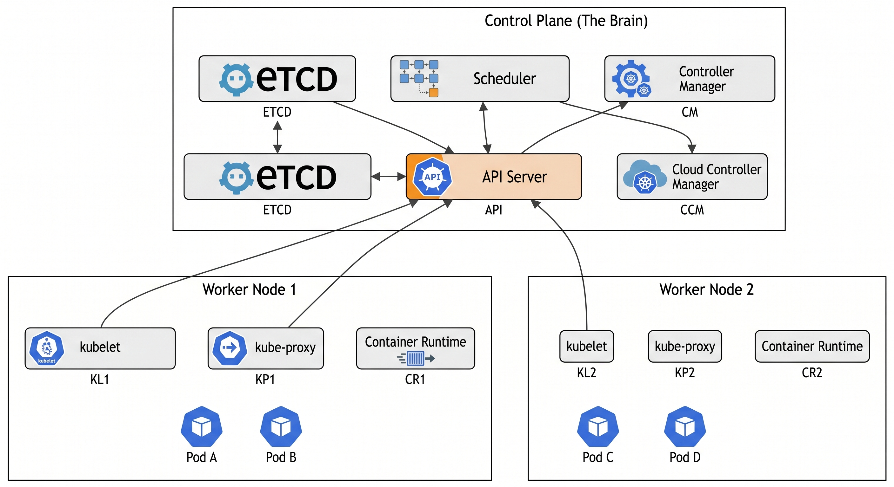

```mermaid

```

### Control Plane Components (The Brain)

| Component                          | What It Does                                                                                                                  | Analogy                                                          |
| ---------------------------------- | ----------------------------------------------------------------------------------------------------------------------------- | ---------------------------------------------------------------- |
| **API Server**               | Every request goes through here — kubectl, controllers, nodes. It's the ONLY component that talks to etcd.                   | The hotel front desk — every request goes through it            |
| **etcd**                     | Distributed key-value store. Holds ALL cluster state — pods, services, secrets, configs. If etcd dies, the cluster is blind. | The hotel's master reservation book                              |
| **Scheduler**                | When a new pod is created, the scheduler picks which node it runs on based on resources, affinity, taints/tolerations.        | The bellhop who assigns rooms to guests                          |
| **Controller Manager**       | Runs control loops: "Are there 3 replicas running? No? Create one." Each controller (ReplicaSet, Deployment, etc.) is a loop. | The hotel manager doing rounds: "Is everything as it should be?" |
| **Cloud Controller Manager** | Talks to AWS: creates load balancers, manages EBS volumes, knows about EC2 instances.                                         | The hotel's external vendor coordinator                          |

### Worker Node Components

| Component                   | What It Does                                                                                                                            |
| --------------------------- | --------------------------------------------------------------------------------------------------------------------------------------- |
| **kubelet**           | Agent on every node. Receives pod specs from the API server, tells the container runtime to start/stop containers. Reports node health. |
| **kube-proxy**        | Manages network rules on each node. Implements Services (ClusterIP, NodePort) by programming iptables/IPVS rules.                       |
| **Container Runtime** | Actually runs containers. Usually `containerd` (Docker is deprecated as a runtime since K8s 1.24).                                    |

### How a Pod Gets Created — The Full Flow

```mermaid
sequenceDiagram
    participant U as kubectl / CI/CD
    participant A as API Server
    participant E as etcd
    participant S as Scheduler
    participant K as kubelet (Node)
    participant C as Container Runtime

    U->>A: kubectl apply -f pod.yaml
    A->>A: Authenticate & Authorize (RBAC)
    A->>A: Admission Controllers (validate/mutate)
    A->>E: Store Pod spec (status: Pending)
    A->>S: "New unscheduled Pod!"
    S->>S: Score nodes (resources, affinity, taints)
    S->>A: "Bind Pod to Node 2"
    A->>E: Update Pod (nodeName: node-2)
    A->>K: "You have a new Pod to run"
    K->>C: "Start container from image nginx:1.25"
    C->>C: Pull image, create container
    K->>A: "Pod is Running"
    A->>E: Update Pod (status: Running)
```

> **Key Insight:** The API server is the ONLY component that reads/writes etcd. Everything else communicates through the API server. This is the security boundary of the cluster.

### What's Different in EKS?

In Amazon EKS, the **control plane is fully managed by AWS:**

- You NEVER see or manage etcd, API server, scheduler, or controller manager
- AWS runs them across 3 AZs for high availability
- You only manage **worker nodes** (or use Fargate for serverless pods)
- The API server endpoint can be public, private, or both

---

## 3. Pods — The Atomic Unit

### What is a Pod?

A Pod is the **smallest deployable unit** in Kubernetes. It's NOT a container — it's a **wrapper around one or more containers** that share:

- The same network namespace (same IP address, can talk via `localhost`)
- The same storage volumes
- The same lifecycle (created and destroyed together)

```
┌─────────────────── Pod ──────────────────────┐
│                                               │
│   ┌──────────┐    ┌──────────┐               │
│   │ Container│    │ Sidecar  │               │
│   │ (nginx)  │    │ (fluentbit)│              │
│   │ Port 80  │    │ Port 2020│               │
│   └──────────┘    └──────────┘               │
│                                               │
│   Shared Network: 10.0.1.15                   │
│   Shared Volume: /var/log/app                 │
│                                               │
└───────────────────────────────────────────────┘
```

### Pod YAML — Anatomy

```yaml
apiVersion: v1              # API group/version
kind: Pod                   # What are we creating?
metadata:
  name: my-app              # Name of this pod
  namespace: production     # Which namespace (virtual cluster)
  labels:                   # Key-value tags (used by Services to find pods)
    app: my-app
    version: v1
spec:
  containers:
  - name: app               # Container name (not the pod name)
    image: nginx:1.25        # Docker image
    ports:
    - containerPort: 80      # Port the app listens on
    resources:
      requests:              # MINIMUM resources guaranteed
        cpu: "100m"          # 100 millicores = 0.1 CPU
        memory: "128Mi"      # 128 MiB
      limits:                # MAXIMUM resources allowed
        cpu: "500m"
        memory: "256Mi"
    livenessProbe:           # "Is the container alive?"
      httpGet:
        path: /healthz
        port: 80
      initialDelaySeconds: 10
      periodSeconds: 5
    readinessProbe:          # "Is the container ready for traffic?"
      httpGet:
        path: /ready
        port: 80
      initialDelaySeconds: 5
      periodSeconds: 3
    env:                     # Environment variables
    - name: DB_HOST
      value: "aurora.cluster.us-east-1.rds.amazonaws.com"
    volumeMounts:
    - name: logs
      mountPath: /var/log/app
  volumes:
  - name: logs
    emptyDir: {}             # Ephemeral volume (dies with the pod)
```

### Pod Lifecycle

```
Pending → ContainerCreating → Running → Succeeded/Failed
                                  ↓
                            CrashLoopBackOff (container keeps crashing and restarting)
```

| Phase                      | What's Happening                                                                                              |
| -------------------------- | ------------------------------------------------------------------------------------------------------------- |
| **Pending**          | Scheduler is choosing a node, or image is being pulled                                                        |
| **Running**          | At least one container is running                                                                             |
| **Succeeded**        | All containers exited with code 0 (for Jobs)                                                                  |
| **Failed**           | At least one container exited with non-zero code                                                              |
| **CrashLoopBackOff** | Container crashes repeatedly; K8s waits progressively longer before restarting (10s, 20s, 40s... up to 5 min) |

### Probes — How K8s Knows Your App is Healthy

| Probe                    | Question                         | What Happens If It Fails                                                            |
| ------------------------ | -------------------------------- | ----------------------------------------------------------------------------------- |
| **livenessProbe**  | "Is your process alive?"         | K8s**kills and restarts** the container                                       |
| **readinessProbe** | "Are you ready for traffic?"     | K8s**removes** the pod from the Service endpoint (no traffic)                 |
| **startupProbe**   | "Have you finished starting up?" | Disables liveness/readiness probes until startup completes (for slow-starting apps) |

> **Critical Rule:** Always set both liveness and readiness probes. Without readiness probes, K8s sends traffic to pods that aren't ready yet, causing errors during deployments.

---

## 4. Workload Controllers

You almost NEVER create Pods directly. Instead, you use **controllers** that manage Pods for you.

### Deployment (most common)

```yaml
apiVersion: apps/v1
kind: Deployment
metadata:
  name: api
spec:
  replicas: 3                    # Run 3 copies
  strategy:
    type: RollingUpdate          # Update without downtime
    rollingUpdate:
      maxSurge: 1                # At most 4 pods during update (3+1)
      maxUnavailable: 0          # Never go below 3 running pods
  selector:
    matchLabels:
      app: api                   # "Manage pods with label app=api"
  template:                      # Pod template (what each replica looks like)
    metadata:
      labels:
        app: api
    spec:
      containers:
      - name: api
        image: my-registry/api:v2.1.0
        ports:
        - containerPort: 8080
```

**What happens when you update the image?**

```
Deployment (manages) → ReplicaSet v2 (creates) → Pod v2, Pod v2, Pod v2
                       ReplicaSet v1 (scales down) → Pod v1 (terminating)
```

The Deployment creates a NEW ReplicaSet, scales it up, and scales the OLD one down. This is how **rolling updates** work.

### Controller Comparison

| Controller            | Use Case                               | Pod Identity                             | Storage              | Ordering                        |
| --------------------- | -------------------------------------- | ---------------------------------------- | -------------------- | ------------------------------- |
| **Deployment**  | Stateless apps (APIs, web servers)     | Random (interchangeable)                 | Ephemeral            | No                              |
| **StatefulSet** | Databases, Kafka, ZooKeeper            | Stable (`pod-0`, `pod-1`, `pod-2`) | Persistent (per-pod) | Yes (ordered creation/deletion) |
| **DaemonSet**   | One pod per node (logging, monitoring) | One per node                             | Node-level           | No                              |
| **Job**         | One-time batch tasks                   | Runs to completion                       | Ephemeral            | No                              |
| **CronJob**     | Scheduled tasks                        | Runs on schedule                         | Ephemeral            | No                              |

### StatefulSet — For Stateful Apps

```yaml
apiVersion: apps/v1
kind: StatefulSet
metadata:
  name: postgres
spec:
  serviceName: postgres          # Headless service for DNS
  replicas: 3
  selector:
    matchLabels:
      app: postgres
  template:
    metadata:
      labels:
        app: postgres
    spec:
      containers:
      - name: postgres
        image: postgres:15
        volumeMounts:
        - name: data
          mountPath: /var/lib/postgresql/data
  volumeClaimTemplates:          # Each pod gets its OWN persistent volume
  - metadata:
      name: data
    spec:
      accessModes: ["ReadWriteOnce"]
      storageClassName: gp3
      resources:
        requests:
          storage: 20Gi
```

**Why StatefulSet for databases?**

- Pod names are stable: `postgres-0`, `postgres-1`, `postgres-2` (not random suffixes)
- Ordered startup: `postgres-0` starts first (becomes primary), then `postgres-1`, then `postgres-2`
- Each pod gets its OWN persistent volume that survives pod restart
- Headless service provides DNS: `postgres-0.postgres.default.svc.cluster.local`

### DaemonSet — One Pod Per Node

```yaml
apiVersion: apps/v1
kind: DaemonSet
metadata:
  name: fluent-bit
spec:
  selector:
    matchLabels:
      app: fluent-bit
  template:
    metadata:
      labels:
        app: fluent-bit
    spec:
      containers:
      - name: fluent-bit
        image: fluent/fluent-bit:3.0
        volumeMounts:
        - name: varlog
          mountPath: /var/log
      volumes:
      - name: varlog
        hostPath:
          path: /var/log
```

**Use cases:** FluentBit (log collection), Prometheus node-exporter, kube-proxy, CSI node drivers.

---

## 5. Namespaces — Virtual Clusters

### What Are Namespaces?

Namespaces partition a cluster into **logical groups**. Think of them as **folders** — same cluster, separate spaces.

```
Cluster
├── kube-system          (K8s system components: CoreDNS, kube-proxy)
├── kube-public          (Public resources, readable by everyone)
├── default              (Where your stuff goes if you don't specify)
├── production           (Your prod workloads)
├── staging              (Your staging workloads)
├── monitoring           (Prometheus, Grafana, FluentBit)
└── argocd               (ArgoCD controllers)
```

### Why Use Namespaces?

1. **Team isolation:** Team A's resources separated from Team B's
2. **Resource quotas:** Limit CPU/memory per namespace
3. **RBAC scoping:** "Developer X can deploy to staging but not production"
4. **Network policies:** "Production pods cannot talk to staging pods"
5. **Cost allocation:** Track costs per namespace (Kubecost)

### Resource Quotas

```yaml
apiVersion: v1
kind: ResourceQuota
metadata:
  name: team-a-quota
  namespace: team-a
spec:
  hard:
    requests.cpu: "10"           # Team A can request up to 10 CPU total
    requests.memory: "20Gi"
    limits.cpu: "20"
    limits.memory: "40Gi"
    pods: "50"                   # Max 50 pods in this namespace
    services.loadbalancers: "2"  # Max 2 load balancers
```

### DNS Within Namespaces

```
# Short name (same namespace):
curl http://my-service

# Full name (cross-namespace):
curl http://my-service.production.svc.cluster.local
#          ──────────  ──────────  ───  ─────────────
#          Service     Namespace   svc   cluster domain
```

---

## 6. Networking — How Everything Talks

### The Four Networking Problems K8s Solves

```
1. Container-to-Container  →  Shared network namespace (localhost)
2. Pod-to-Pod              →  Flat network (every pod gets a unique IP)
3. Pod-to-Service          →  Virtual IPs via kube-proxy
4. External-to-Service     →  LoadBalancer / Ingress
```

### Pod-to-Pod Networking

**Kubernetes Rule:** Every pod gets a unique IP address, and every pod can reach every other pod directly (no NAT).

```
┌─────────────────── Node 1 ─────────────────────┐
│                                                  │
│  Pod A (10.0.1.5)  ◄──────────►  Pod B (10.0.1.6)│
│                                                  │
└──────────────────────┬───────────────────────────┘
                       │ (flat L2/L3 network)
┌──────────────────────┴───────────────────────────┐
│                                                  │
│  Pod C (10.0.2.3)  ◄──────────►  Pod D (10.0.2.4)│
│                                                  │
└─────────────────── Node 2 ─────────────────────┘
```

Pod A can reach Pod D at `10.0.2.4` directly — no port mapping, no NAT.

### CNI — Container Network Interface

The CNI plugin implements the pod network. In EKS:

| CNI Plugin                      | How It Works                                 | Pros                                                   | Cons                                        |
| ------------------------------- | -------------------------------------------- | ------------------------------------------------------ | ------------------------------------------- |
| **AWS VPC CNI** (default) | Each pod gets a real VPC IP from your subnet | Pods are directly routable from VPC (RDS, ElastiCache) | IP exhaustion in large clusters             |
| **Calico**                | Overlay network (VXLAN)                      | More IPs, network policies                             | Overlay adds latency; pods not VPC-routable |
| **Cilium**                | eBPF-based networking                        | High performance, advanced network policies            | Newer, steeper learning curve               |

**EKS VPC CNI deep dive:**

```
EC2 Instance (Node)
├── eth0 (primary ENI) — Node IP: 10.0.1.100
├── ENI 1
│   ├── 10.0.1.5  → assigned to Pod A
│   ├── 10.0.1.6  → assigned to Pod B
│   └── 10.0.1.7  → assigned to Pod C
└── ENI 2
    ├── 10.0.1.8  → assigned to Pod D
    └── 10.0.1.9  → (available)
```

Each ENI can hold a limited number of IPs (depends on instance type). This is why **larger instances can run more pods**.

### IP Exhaustion Solutions

| Solution                    | How It Helps                                                   |
| --------------------------- | -------------------------------------------------------------- |
| **Prefix Delegation** | Assigns /28 prefix (16 IPs) instead of single IPs per ENI slot |
| **Custom Networking** | Pods use different subnets than nodes (larger CIDR)            |
| **Secondary CIDR**    | Add `100.64.0.0/16` to VPC for pod networking                |

---

## 7. Services — The 4 Types

### The Problem Services Solve

Pods are **ephemeral** — they get new IPs every time they restart. You can't hardcode pod IPs. Services provide a **stable endpoint** that routes to healthy pods.

```
Before Services:                    With Services:
App → Pod IP 10.0.1.5 (dead!)      App → Service (my-svc:80)
                                         │
                                         ├→ Pod 10.0.1.5 ✅
                                         ├→ Pod 10.0.2.3 ✅
                                         └→ Pod 10.0.1.8 ✅
```

### How Services Find Pods — Labels & Selectors

```yaml
# The Service
apiVersion: v1
kind: Service
metadata:
  name: api-service
spec:
  selector:
    app: api              # "Route traffic to pods with label app=api"
  ports:
  - port: 80              # Service listens on port 80
    targetPort: 8080       # Forward to container port 8080

# The Pods (created by a Deployment)
metadata:
  labels:
    app: api              # ← This label matches the selector above
```

### The 4 Service Types — Explained Visually

```
┌────────────────────────────────────────────────────────────────┐
│                                                                │
│  External Internet                                             │
│       │                                                        │
│       ▼                                                        │
│  ┌──────────────┐                                              │
│  │ LoadBalancer  │  Type 4: Creates an AWS ALB/NLB             │
│  │ (ELB/ALB/NLB)│  External traffic → Node → Pod              │
│  └──────┬───────┘                                              │
│         │                                                      │
│         ▼                                                      │
│  ┌──────────────┐                                              │
│  │  NodePort     │  Type 3: Opens a port on EVERY node         │
│  │  (30000-32767)│  Access via NodeIP:NodePort                 │
│  └──────┬───────┘                                              │
│         │                                                      │
│         ▼                                                      │
│  ┌──────────────┐                                              │
│  │  ClusterIP    │  Type 2: Internal-only virtual IP           │
│  │  (default)    │  Only reachable from inside the cluster     │
│  └──────┬───────┘                                              │
│         │                                                      │
│         ▼                                                      │
│  ┌──────────────┐                                              │
│  │    Pods       │  The actual containers                      │
│  └──────────────┘                                              │
│                                                                │
│  Type 1: ExternalName — Just a DNS alias (CNAME)              │
└────────────────────────────────────────────────────────────────┘
```

### Type 1: ClusterIP (Default)

```yaml
apiVersion: v1
kind: Service
metadata:
  name: api-internal
spec:
  type: ClusterIP          # Default — internal only
  selector:
    app: api
  ports:
  - port: 80
    targetPort: 8080
```

- **Gets a virtual IP** (e.g., `10.100.50.12`) that only exists inside the cluster
- **kube-proxy** programs iptables rules to route `10.100.50.12:80` → pod IPs
- **DNS:** Other pods reach it via `api-internal` or `api-internal.default.svc.cluster.local`
- **Use case:** Internal microservice communication

### Type 2: NodePort

```yaml
apiVersion: v1
kind: Service
metadata:
  name: api-nodeport
spec:
  type: NodePort
  selector:
    app: api
  ports:
  - port: 80
    targetPort: 8080
    nodePort: 31080        # Optional (K8s picks 30000-32767 if not specified)
```

- **Opens port 31080 on EVERY node** in the cluster
- Access via `<any-node-ip>:31080`
- **Includes ClusterIP** — it's a superset
- **Use case:** Development, testing, or when you manage your own load balancer
- **Not recommended for production** — exposes node IPs, limited port range

### Type 3: LoadBalancer

```yaml
apiVersion: v1
kind: Service
metadata:
  name: api-public
  annotations:
    service.beta.kubernetes.io/aws-load-balancer-type: "nlb"        # NLB (Layer 4)
    service.beta.kubernetes.io/aws-load-balancer-scheme: "internet-facing"
spec:
  type: LoadBalancer
  selector:
    app: api
  ports:
  - port: 443
    targetPort: 8080
```

- **Creates a real AWS load balancer** (Classic LB, NLB, or ALB)
- **Includes NodePort + ClusterIP** — it's a superset of both
- External traffic → AWS LB → NodePort → Pod
- **Use case:** Exposing a single service to the internet
- **Cost:** Each LoadBalancer Service creates a separate AWS LB (~$16/mo + traffic)

> **Problem:** If you have 10 services, you get 10 load balancers. That's expensive. Solution: **Ingress** (one LB routing to many services).

### Type 4: ExternalName

```yaml
apiVersion: v1
kind: Service
metadata:
  name: my-database
spec:
  type: ExternalName
  externalName: aurora.cluster-xyz.us-east-1.rds.amazonaws.com
```

- **Just a DNS CNAME** — no proxying, no load balancing
- `my-database` resolves to the Aurora endpoint
- **Use case:** Give external services a Kubernetes-native DNS name

### How kube-proxy Actually Works

```
Pod A calls: api-internal:80
     │
     ▼
kube-proxy (iptables rules on the node):
  "api-internal:80 → pick one of:"
     ├── 10.0.1.5:8080  (Pod 1)  ← random selection
     ├── 10.0.2.3:8080  (Pod 2)
     └── 10.0.1.8:8080  (Pod 3)
```

kube-proxy watches the API server for Service and Endpoint changes, and programs iptables/IPVS rules on every node.

---

## 8. Ingress & Ingress Controllers

### The Problem Ingress Solves

LoadBalancer Services create **one LB per service** = expensive. Ingress provides **one LB for many services** with URL path routing, TLS termination, and host-based routing.

```
Without Ingress:                 With Ingress:
                               
LB₁ → Service A                 One ALB → Ingress Controller
LB₂ → Service B                              │
LB₃ → Service C                    ┌─────────┼──────────┐
                                    ▼         ▼          ▼
3 Load Balancers ($48/mo)      Service A  Service B  Service C
                                  
                                 1 Load Balancer ($16/mo)
```

### How Ingress Works

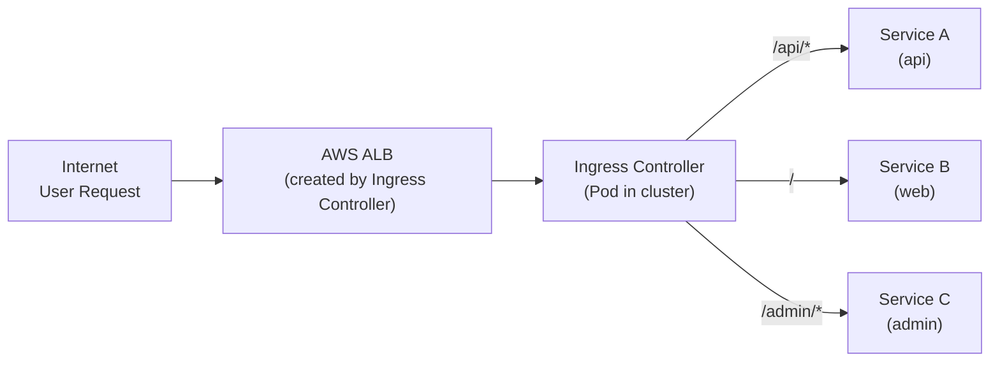

**Two pieces:**

1. **Ingress Resource** — Your YAML that defines routing rules
2. **Ingress Controller** — The actual software that implements the rules (you must install one)

### Ingress Controllers

| Controller                             | Creates         | Best For                                      |
| -------------------------------------- | --------------- | --------------------------------------------- |
| **AWS Load Balancer Controller** | Real AWS ALB    | EKS production (native AWS integration)       |
| **NGINX Ingress**                | Pod-based nginx | Multi-cloud, more config flexibility          |
| **Traefik**                      | Pod-based proxy | Auto-discovery, Let's Encrypt, simpler config |
| **Istio Gateway**                | Envoy-based     | When using Istio service mesh                 |

### Ingress YAML

```yaml
apiVersion: networking.k8s.io/v1
kind: Ingress
metadata:
  name: my-app-ingress
  annotations:
    # Tell AWS LB Controller to create an ALB
    kubernetes.io/ingress.class: alb
    alb.ingress.kubernetes.io/scheme: internet-facing
    alb.ingress.kubernetes.io/target-type: ip           # Route directly to pod IPs
    alb.ingress.kubernetes.io/certificate-arn: arn:aws:acm:...  # TLS cert
    alb.ingress.kubernetes.io/listen-ports: '[{"HTTPS":443}]'
    alb.ingress.kubernetes.io/ssl-redirect: "443"       # HTTP → HTTPS redirect
spec:
  rules:
  - host: api.myapp.com
    http:
      paths:
      - path: /
        pathType: Prefix
        backend:
          service:
            name: api-service
            port:
              number: 80
  - host: web.myapp.com
    http:
      paths:
      - path: /
        pathType: Prefix
        backend:
          service:
            name: web-service
            port:
              number: 80
  - host: myapp.com
    http:
      paths:
      - path: /api
        pathType: Prefix
        backend:
          service:
            name: api-service
            port:
              number: 80
      - path: /admin
        pathType: Prefix
        backend:
          service:
            name: admin-service
            port:
              number: 80
      - path: /
        pathType: Prefix
        backend:
          service:
            name: web-service
            port:
              number: 80
```

### Full Traffic Flow (External → Pod)

```
User → DNS (Route 53) → ALB (443/HTTPS) → Target Group → Pod IP:8080
                                                          │
                                              (ALB routes directly to pod IP
                                               when target-type=ip, bypassing
                                               NodePort entirely)
```

---

## 9. Storage — PV, PVC, StorageClass, CSI

### Storage Concepts

```
StorageClass          "What kind of storage?" (gp3, io2, EFS)
     │
     ▼
PersistentVolume (PV) "A specific piece of storage" (50Gi EBS volume)
     │
     ▼
PersistentVolumeClaim "I need 50Gi of gp3 storage" (request by a Pod)
     │
     ▼
Pod                   "Mount this claim at /data"
```

Think of it like renting an apartment:

- **StorageClass** = Type of apartment (studio, 1-bedroom, penthouse)
- **PV** = A specific apartment unit
- **PVC** = Your lease agreement ("I need a 1-bedroom")
- **Pod** = You moving in

### StorageClass

```yaml
apiVersion: storage.k8s.io/v1
kind: StorageClass
metadata:
  name: gp3
provisioner: ebs.csi.aws.com     # EBS CSI Driver
parameters:
  type: gp3                       # EBS volume type
  encrypted: "true"
  fsType: ext4
reclaimPolicy: Delete              # Delete EBS volume when PVC is deleted
volumeBindingMode: WaitForFirstConsumer  # Don't create until a pod needs it
allowVolumeExpansion: true         # Allow resizing
```

### PersistentVolumeClaim

```yaml
apiVersion: v1
kind: PersistentVolumeClaim
metadata:
  name: app-data
spec:
  accessModes:
  - ReadWriteOnce                  # One node at a time (EBS limitation)
  storageClassName: gp3
  resources:
    requests:
      storage: 50Gi
```

### Using Storage in a Pod

```yaml
apiVersion: v1
kind: Pod
metadata:
  name: my-app
spec:
  containers:
  - name: app
    image: my-app:v1
    volumeMounts:
    - name: data
      mountPath: /app/data         # Where it appears inside the container
  volumes:
  - name: data
    persistentVolumeClaim:
      claimName: app-data          # Reference to the PVC above
```

### CSI — Container Storage Interface

CSI is a **standard interface** that lets storage vendors write plugins for K8s without modifying K8s core.

**EBS CSI Driver — How It Works:**

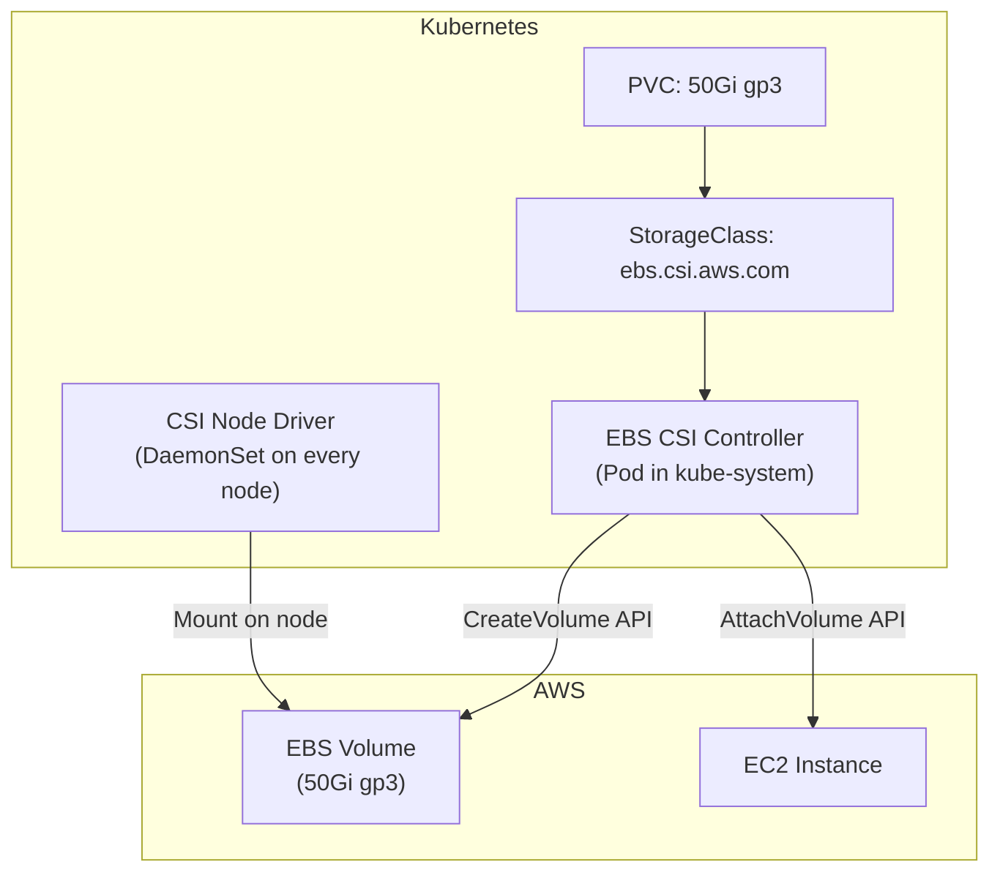

**Installing EBS CSI Driver on EKS:**

```bash
# 1. Create IAM role for the driver (needs ec2:CreateVolume, etc.)
# 2. Install as EKS managed addon
aws eks create-addon \
  --cluster-name my-cluster \
  --addon-name aws-ebs-csi-driver \
  --service-account-role-arn arn:aws:iam::123456789:role/ebs-csi-role
```

### Access Modes

| Mode                    | Abbrev | Meaning               | EBS | EFS |
| ----------------------- | ------ | --------------------- | --- | --- |
| **ReadWriteOnce** | RWO    | One node reads/writes | ✅  | ✅  |
| **ReadOnlyMany**  | ROX    | Many nodes read       | ❌  | ✅  |
| **ReadWriteMany** | RWX    | Many nodes read/write | ❌  | ✅  |

> **Key:** EBS is RWO only (one node at a time). If you need shared storage across pods on different nodes, use **EFS** (NFS-based).

---

## 10. Configuration — ConfigMaps & Secrets

### ConfigMap — Non-Sensitive Configuration

```yaml
apiVersion: v1
kind: ConfigMap
metadata:
  name: app-config
data:
  DATABASE_HOST: "aurora.cluster.us-east-1.rds.amazonaws.com"
  LOG_LEVEL: "info"
  MAX_CONNECTIONS: "100"
  nginx.conf: |                  # Multi-line values (entire config files)
    server {
      listen 80;
      location / {
        proxy_pass http://backend:8080;
      }
    }
```

**Using in a Pod:**

```yaml
# As environment variables:
env:
- name: DATABASE_HOST
  valueFrom:
    configMapKeyRef:
      name: app-config
      key: DATABASE_HOST

# As a mounted file:
volumeMounts:
- name: config
  mountPath: /etc/nginx/nginx.conf
  subPath: nginx.conf
volumes:
- name: config
  configMap:
    name: app-config
```

### Secret — Sensitive Configuration

```yaml
apiVersion: v1
kind: Secret
metadata:
  name: db-credentials
type: Opaque
data:
  username: YWRtaW4=            # base64 encoded "admin"
  password: cEBzc3cwcmQ=        # base64 encoded "p@ssw0rd"
```

> ⚠️ **WARNING:** Kubernetes Secrets are only **base64 encoded, NOT encrypted** by default. Anyone with read access to the namespace can decode them. For real security, use:
>
> 1. **EKS envelope encryption** (KMS key encrypts etcd secrets)
> 2. **External Secrets Operator** → syncs from AWS Secrets Manager
> 3. **Sealed Secrets** → encrypts secrets before committing to Git

---

## 11. RBAC — Who Can Do What

### RBAC Model

```
WHO            can do    WHAT           on    WHERE
───            ──────    ────           ──    ─────
User/Group     verbs     resources            namespace
ServiceAccount           (pods, svc,          (or cluster-wide)
                          deployments)
```

### Four RBAC Objects

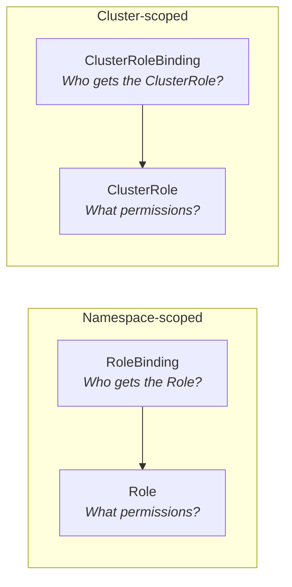

| Object                       | Scope     | Purpose                               |
| ---------------------------- | --------- | ------------------------------------- |
| **Role**               | Namespace | Define permissions within a namespace |
| **RoleBinding**        | Namespace | Grant a Role to a user/group/SA       |
| **ClusterRole**        | Cluster   | Define permissions cluster-wide       |
| **ClusterRoleBinding** | Cluster   | Grant a ClusterRole cluster-wide      |

### Example: Developer Can Deploy but Not Delete

```yaml
# Step 1: Create a Role
apiVersion: rbac.authorization.k8s.io/v1
kind: Role
metadata:
  name: developer
  namespace: staging
rules:
- apiGroups: ["apps"]
  resources: ["deployments"]
  verbs: ["get", "list", "watch", "create", "update", "patch"]
  # Note: no "delete" — developers can't delete deployments
- apiGroups: [""]
  resources: ["pods", "pods/log"]
  verbs: ["get", "list", "watch"]
- apiGroups: [""]
  resources: ["services"]
  verbs: ["get", "list"]

---
# Step 2: Bind the Role to a user
apiVersion: rbac.authorization.k8s.io/v1
kind: RoleBinding
metadata:
  name: developer-binding
  namespace: staging
subjects:
- kind: User
  name: pushparaj@company.com
  apiGroup: rbac.authorization.k8s.io
roleRef:
  kind: Role
  name: developer
  apiGroup: rbac.authorization.k8s.io
```

### Common RBAC Verbs

| Verb       | Meaning                                           |
| ---------- | ------------------------------------------------- |
| `get`    | Read a single resource                            |
| `list`   | List multiple resources                           |
| `watch`  | Stream changes in real-time                       |
| `create` | Create new resources                              |
| `update` | Modify existing resources                         |
| `patch`  | Partially modify resources                        |
| `delete` | Delete resources                                  |
| `exec`   | Execute commands in containers (`kubectl exec`) |

### ServiceAccount — Identity for Pods

```yaml
apiVersion: v1
kind: ServiceAccount
metadata:
  name: api-service-account
  namespace: production
  annotations:
    # IRSA: This SA can assume an AWS IAM role
    eks.amazonaws.com/role-arn: arn:aws:iam::123456789:role/api-role
```

Every pod runs as a ServiceAccount. If you don't specify one, it uses `default` (which often has too many permissions).

---

## 12. Security — Pod Security, Network Policies, IRSA

### Pod Security Standards

Three levels, from permissive to restrictive:

| Level                | What It Allows                                           | Use Case                             |
| -------------------- | -------------------------------------------------------- | ------------------------------------ |
| **Privileged** | Anything (root, host network, all capabilities)          | System components (CSI drivers, CNI) |
| **Baseline**   | Prevents known privilege escalations                     | Most workloads                       |
| **Restricted** | Strictest (non-root, no capabilities, read-only root fs) | Security-sensitive workloads         |

```yaml
# Enforce Restricted on a namespace
apiVersion: v1
kind: Namespace
metadata:
  name: production
  labels:
    pod-security.kubernetes.io/enforce: restricted
    pod-security.kubernetes.io/warn: restricted
    pod-security.kubernetes.io/audit: restricted
```

### Network Policies — Firewall for Pods

```yaml
apiVersion: networking.k8s.io/v1
kind: NetworkPolicy
metadata:
  name: api-network-policy
  namespace: production
spec:
  podSelector:
    matchLabels:
      app: api                    # Apply to pods with label app=api
  policyTypes:
  - Ingress
  - Egress
  ingress:
  - from:
    - podSelector:
        matchLabels:
          app: web               # Only web pods can call the API
    ports:
    - port: 8080
  egress:
  - to:
    - podSelector:
        matchLabels:
          app: database          # API can only call the database
    ports:
    - port: 5432
  - to:                          # Allow DNS resolution
    - namespaceSelector: {}
    ports:
    - port: 53
      protocol: UDP
```

**Without NetworkPolicy:** Every pod can talk to every other pod (flat network, no isolation).
**With NetworkPolicy:** Only allowed traffic passes. Like a firewall ruleset.

> **Important:** NetworkPolicies require a CNI that supports them (Calico, Cilium). The default AWS VPC CNI does NOT enforce NetworkPolicies without an additional component.

### IRSA — IAM Roles for Service Accounts

**Problem:** Pods need AWS permissions (read S3, write DynamoDB). Without IRSA, ALL pods on a node share the node's IAM role.

**IRSA Solution:**

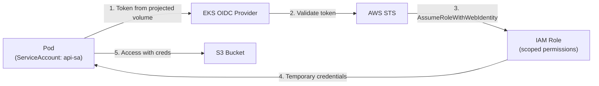

**Setup:**

```yaml
# ServiceAccount with IAM role annotation
apiVersion: v1
kind: ServiceAccount
metadata:
  name: api-sa
  annotations:
    eks.amazonaws.com/role-arn: arn:aws:iam::123456789:role/api-role
---
# Pod using the ServiceAccount
apiVersion: v1
kind: Pod
metadata:
  name: api
spec:
  serviceAccountName: api-sa    # ← Use this SA
  containers:
  - name: api
    image: my-api:v1
    # AWS SDK automatically uses the projected token
    # No access keys needed!
```

**IAM Role Trust Policy:**

```json
{
  "Version": "2012-10-17",
  "Statement": [{
    "Effect": "Allow",
    "Principal": {
      "Federated": "arn:aws:iam::123456789:oidc-provider/oidc.eks.us-east-1.amazonaws.com/id/ABCDEF"
    },
    "Action": "sts:AssumeRoleWithWebIdentity",
    "Condition": {
      "StringEquals": {
        "oidc.eks.us-east-1.amazonaws.com/id/ABCDEF:sub": "system:serviceaccount:production:api-sa"
      }
    }
  }]
}
```

---

## 13. Custom Resource Definitions (CRDs) & Operators

### What Are CRDs?

CRDs let you **extend Kubernetes with your own resource types**. Out of the box, K8s knows about Pods, Services, Deployments. With CRDs, you can teach it about `Certificate`, `VirtualService`, `PostgresCluster`, etc.

```
Built-in Resources:              CRDs (custom):
  Pod                             Certificate (cert-manager)
  Service                        VirtualService (Istio)
  Deployment                     IngressRoute (Traefik)
  ConfigMap                      PostgresCluster (Zalando operator)
  Secret                         ExternalSecret (ESO)
  Ingress                        Canary (Flagger)
```

### CRD Example

```yaml
# Step 1: Define the CRD (what the resource looks like)
apiVersion: apiextensions.k8s.io/v1
kind: CustomResourceDefinition
metadata:
  name: memorywriters.agentcore.io
spec:
  group: agentcore.io
  versions:
  - name: v1
    served: true
    storage: true
    schema:
      openAPIV3Schema:
        type: object
        properties:
          spec:
            type: object
            properties:
              confidenceThreshold:
                type: number
              knowledgeBaseId:
                type: string
  scope: Namespaced
  names:
    plural: memorywriters
    singular: memorywriter
    kind: MemoryWriter

---
# Step 2: Create an instance of your custom resource
apiVersion: agentcore.io/v1
kind: MemoryWriter
metadata:
  name: prod-writer
spec:
  confidenceThreshold: 0.7
  knowledgeBaseId: "KB_PROD_123"
```

### Operators — CRDs with Brains

An **Operator** = CRD + Controller. The CRD defines the resource. The Controller watches for changes and takes action.

```
You create: PostgresCluster (CRD instance)
     │
     ▼
Operator Controller (running as a Pod) watches for PostgresCluster resources
     │
     ▼
Operator automatically:
  • Creates a StatefulSet with 3 Postgres pods
  • Sets up replication between primary and replicas
  • Creates Services for primary and read-only endpoints
  • Manages backups on a schedule
  • Handles failover if primary dies
```

**Popular Operators in Production:**

| Operator                            | CRDs It Creates                 | What It Automates                              |
| ----------------------------------- | ------------------------------- | ---------------------------------------------- |
| **cert-manager**              | Certificate, Issuer             | TLS certificate lifecycle (Let's Encrypt, ACM) |
| **External Secrets Operator** | ExternalSecret, SecretStore     | Sync secrets from AWS Secrets Manager          |
| **Prometheus Operator**       | ServiceMonitor, PrometheusRule  | Monitoring configuration                       |
| **ArgoCD**                    | Application, AppProject         | GitOps deployments                             |
| **Istio**                     | VirtualService, DestinationRule | Traffic management                             |
| **Flagger**                   | Canary                          | Progressive delivery                           |

---

## 14. Istio Service Mesh

### What Problem Does Istio Solve?

```
Without Mesh:                        With Istio:
App A → App B (HTTP, no encryption)  App A → Sidecar → Sidecar → App B
                                              (mTLS, retry, circuit break,
                                               tracing, metrics — all
                                               WITHOUT changing app code)
```

### How Istio Works — Sidecar Pattern

```
┌──────────── Pod ────────────┐
│                              │
│  ┌──────────┐  ┌──────────┐ │
│  │ Your App │  │ Envoy    │ │
│  │ Container│←→│ Sidecar  │ │
│  │ Port 8080│  │ Proxy    │ │
│  └──────────┘  └──────────┘ │
│                     ↕        │
│              All traffic     │
│              goes through    │
│              Envoy proxy     │
└──────────────────────────────┘
```

Istio injects an **Envoy sidecar proxy** into every pod. ALL network traffic (inbound and outbound) passes through Envoy. This gives Istio control over:

| Capability                   | How                                                     |
| ---------------------------- | ------------------------------------------------------- |
| **mTLS**               | Automatic mutual TLS between all services (zero config) |
| **Traffic Management** | Canary releases, traffic splitting, mirroring           |
| **Retries**            | Automatic retry on failure (configurable)               |
| **Circuit Breaking**   | Stop calling a failing service                          |
| **Observability**      | Metrics, traces, access logs — all automatic           |
| **Authorization**      | "Service A can call Service B but not Service C"        |

### Istio Architecture

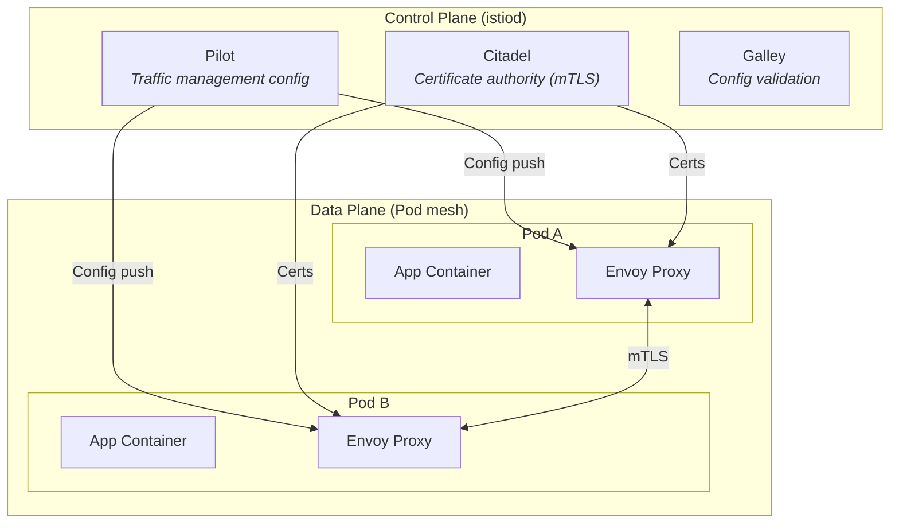

### Istio CRDs in Action

**VirtualService — Traffic Routing:**

```yaml
apiVersion: networking.istio.io/v1alpha3
kind: VirtualService
metadata:
  name: api-routing
spec:
  hosts:
  - api-service
  http:
  - match:
    - headers:
        x-canary:
          exact: "true"
    route:
    - destination:
        host: api-service
        subset: v2                # Canary version
  - route:
    - destination:
        host: api-service
        subset: v1                # Stable version
      weight: 90
    - destination:
        host: api-service
        subset: v2
      weight: 10                  # 10% canary traffic
```

**DestinationRule — Define Subsets & Circuit Breaking:**

```yaml
apiVersion: networking.istio.io/v1alpha3
kind: DestinationRule
metadata:
  name: api-destination
spec:
  host: api-service
  trafficPolicy:
    connectionPool:
      tcp:
        maxConnections: 100       # Circuit breaker: max connections
    outlierDetection:
      consecutive5xxErrors: 5     # Eject pod after 5 consecutive 5xx errors
      interval: 30s
      baseEjectionTime: 30s
  subsets:
  - name: v1
    labels:
      version: v1
  - name: v2
    labels:
      version: v2
```

### Istio vs No Istio — When to Use?

| Need Istio When                                  | Don't Need Istio When                   |
| ------------------------------------------------ | --------------------------------------- |
| 10+ microservices                                | < 5 services                            |
| Need mTLS between all services                   | Basic HTTP is acceptable                |
| Complex traffic management (canary, mirroring)   | Rolling updates are sufficient          |
| Regulatory requirement for encryption in transit | Internal non-sensitive traffic          |
| Need service-level authorization policies        | Namespace-level NetworkPolicies suffice |

> **Warning:** Istio adds ~30MB memory per sidecar and ~2ms latency per hop. For small clusters, this overhead may not be justified.

---

## 15. Observability — FluentBit, Prometheus, Grafana

### Three Pillars

```
Metrics ───── "What's happening?" ───── Prometheus + Grafana
Logs ──────── "Why it happened?" ────── FluentBit + CloudWatch/OpenSearch
Traces ────── "Where it happened?" ──── X-Ray / OpenTelemetry
```

### FluentBit — Log Collection

FluentBit runs as a **DaemonSet** (one pod per node), collects container logs, and ships them to a destination.

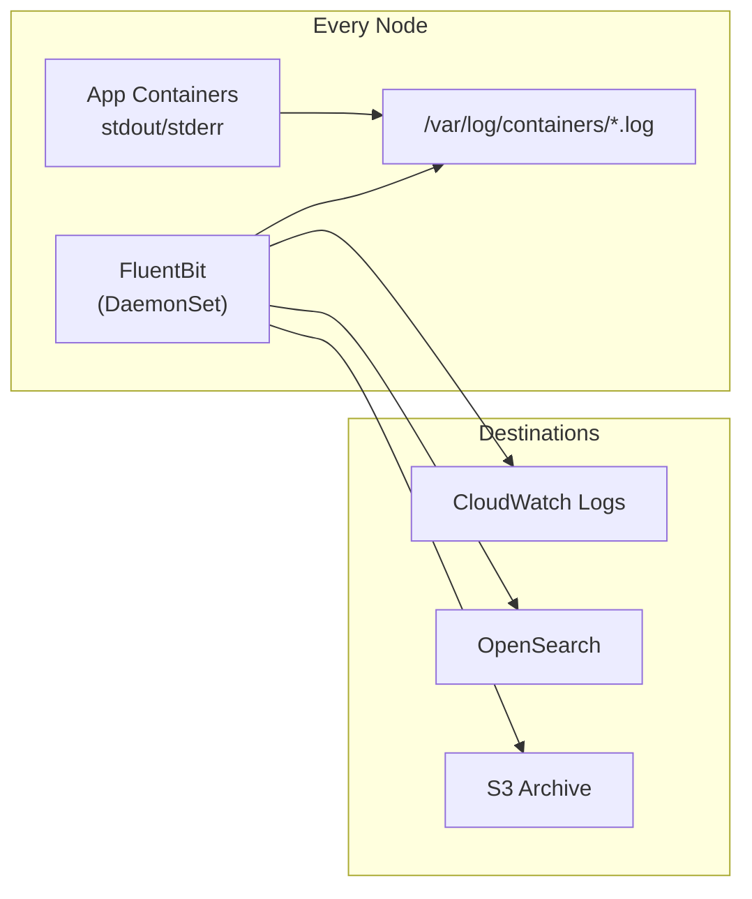

**FluentBit ConfigMap:**

```yaml
apiVersion: v1
kind: ConfigMap
metadata:
  name: fluent-bit-config
  namespace: logging
data:
  fluent-bit.conf: |
    [SERVICE]
        Flush         5
        Log_Level     info
        Parsers_File  parsers.conf

    [INPUT]
        Name              tail
        Tag               kube.*
        Path              /var/log/containers/*.log
        Parser            docker
        Mem_Buf_Limit     5MB
        Refresh_Interval  10

    [FILTER]
        Name                kubernetes
        Match               kube.*
        Kube_URL            https://kubernetes.default.svc:443
        Merge_Log           On
        K8S-Logging.Parser  On

    [OUTPUT]
        Name                cloudwatch_logs
        Match               *
        region              us-east-1
        log_group_name      /eks/my-cluster/containers
        log_stream_prefix   from-fluent-bit-
        auto_create_group   true
```

**Why FluentBit over Fluentd?**

- FluentBit: ~15MB memory, C-based, lightweight, perfect for sidecar/DaemonSet
- Fluentd: ~100MB memory, Ruby-based, more plugins, better for aggregation
- Common pattern: FluentBit (collect on nodes) → Fluentd (aggregate centrally)

### Prometheus + Grafana — Metrics

```
┌─────────────────────────────────────────────────────────┐
│                                                         │
│  Prometheus Server (scrapes metrics every 15s)          │
│       │                                                 │
│       ├── Scrape: kubelet /metrics                      │
│       ├── Scrape: node-exporter /metrics                │
│       ├── Scrape: kube-state-metrics /metrics           │
│       ├── Scrape: your-app /metrics (custom)            │
│       └── Scrape: istio-proxy /stats/prometheus         │
│                                                         │
│  Storage: Local TSDB (time-series database)             │
│  Retention: 15 days (default)                           │
│                                                         │
│  Grafana (visualization)                                │
│       └── Dashboards: Node health, Pod metrics,         │
│           request rates, error rates, latency           │
│                                                         │
│  Alertmanager (alerting)                                │
│       └── Routes alerts to PagerDuty, Slack, email      │
└─────────────────────────────────────────────────────────┘
```

**ServiceMonitor (Prometheus Operator CRD):**

```yaml
apiVersion: monitoring.coreos.com/v1
kind: ServiceMonitor
metadata:
  name: api-monitor
  namespace: monitoring
spec:
  selector:
    matchLabels:
      app: api
  endpoints:
  - port: metrics            # Scrape /metrics endpoint on "metrics" port
    interval: 15s
  namespaceSelector:
    matchNames:
    - production
```

---

## 16. ArgoCD — GitOps Deployments

### What is GitOps?

**Git is the single source of truth for desired state.** No `kubectl apply` from laptops. No CI/CD pushing manifests. Instead:

```
Developer pushes YAML to Git → ArgoCD detects change → ArgoCD syncs to cluster
```

### How ArgoCD Works

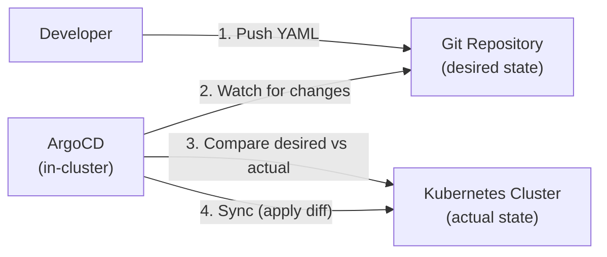

### ArgoCD Application

```yaml
apiVersion: argoproj.io/v1alpha1
kind: Application
metadata:
  name: my-api
  namespace: argocd
spec:
  project: default
  source:
    repoURL: https://github.com/my-org/k8s-manifests.git
    targetRevision: main
    path: overlays/production       # Kustomize overlay
  destination:
    server: https://kubernetes.default.svc
    namespace: production
  syncPolicy:
    automated:
      prune: true                   # Delete resources removed from Git
      selfHeal: true                # Revert manual kubectl changes
    syncOptions:
    - CreateNamespace=true
    retry:
      limit: 5
      backoff:
        duration: 5s
        factor: 2
        maxDuration: 3m
```

### ArgoCD + CI/CD Integration

```
┌─────── CI (GitHub Actions) ────────┐    ┌──── CD (ArgoCD) ────────────┐
│                                     │    │                             │
│  1. Run tests                       │    │  4. Detect image tag change │
│  2. Build Docker image              │    │  5. Sync to cluster         │
│  3. Update image tag in Git repo ───┼───→│  6. Progressive rollout     │
│     (manifests/prod/deploy.yaml)    │    │  7. Health check            │
│                                     │    │                             │
└─────────────────────────────────────┘    └─────────────────────────────┘
```

**CI does NOT deploy. CI updates Git. ArgoCD deploys from Git.**

### Why ArgoCD Over `kubectl apply` in CI/CD?

| Feature                   | kubectl in CI/CD | ArgoCD (GitOps)            |
| ------------------------- | ---------------- | -------------------------- |
| **Drift detection** | None             | Continuous reconciliation  |
| **Rollback**        | Complex script   | `git revert`             |
| **Audit trail**     | CI logs only     | Full Git history           |
| **Self-healing**    | None             | Auto-revert manual changes |
| **Multi-cluster**   | Manual setup     | Built-in                   |
| **Visibility**      | Check CI logs    | Real-time UI dashboard     |

---

## 17. Autoscaling — HPA, VPA, Karpenter

### Three Levels of Autoscaling

```
Level 1: Pod scaling (HPA/VPA)    — How many/how big are the pods?
Level 2: Node scaling (Karpenter) — How many/what type of nodes?
Level 3: Cluster scaling           — How many clusters? (multi-cluster)
```

### HPA — Horizontal Pod Autoscaler

**Scales the NUMBER of pods** based on metrics:

```yaml
apiVersion: autoscaling/v2
kind: HorizontalPodAutoscaler
metadata:
  name: api-hpa
spec:
  scaleTargetRef:
    apiVersion: apps/v1
    kind: Deployment
    name: api
  minReplicas: 3
  maxReplicas: 50
  metrics:
  - type: Resource
    resource:
      name: cpu
      target:
        type: Utilization
        averageUtilization: 70     # Scale up when avg CPU > 70%
  - type: Resource
    resource:
      name: memory
      target:
        type: Utilization
        averageUtilization: 80
  behavior:
    scaleUp:
      stabilizationWindowSeconds: 30    # Wait 30s before scaling up more
      policies:
      - type: Pods
        value: 4                         # Add at most 4 pods at a time
        periodSeconds: 60
    scaleDown:
      stabilizationWindowSeconds: 300   # Wait 5 min before scaling down
      policies:
      - type: Percent
        value: 10                        # Remove at most 10% of pods at a time
        periodSeconds: 60
```

### VPA — Vertical Pod Autoscaler

**Adjusts the SIZE of pods** (CPU/memory requests):

```yaml
apiVersion: autoscaling.k8s.io/v1
kind: VerticalPodAutoscaler
metadata:
  name: api-vpa
spec:
  targetRef:
    apiVersion: apps/v1
    kind: Deployment
    name: api
  updatePolicy:
    updateMode: "Auto"             # Auto-adjust (restarts pods)
  resourcePolicy:
    containerPolicies:
    - containerName: api
      minAllowed:
        cpu: "100m"
        memory: "128Mi"
      maxAllowed:
        cpu: "2"
        memory: "2Gi"
```

> **Warning:** VPA and HPA on the same metric (CPU) conflict. Use HPA for scaling pod count, VPA for right-sizing individual pods.

### Karpenter — Intelligent Node Autoscaler

**Karpenter replaces Cluster Autoscaler.** It provisions right-sized nodes in ~30 seconds.

```yaml
apiVersion: karpenter.sh/v1beta1
kind: NodePool
metadata:
  name: general
spec:
  template:
    spec:
      requirements:
      - key: kubernetes.io/arch
        operator: In
        values: ["amd64", "arm64"]          # Allow Graviton (cheaper)
      - key: karpenter.sh/capacity-type
        operator: In
        values: ["spot", "on-demand"]       # Prefer Spot (60-90% cheaper)
      - key: karpenter.k8s.aws/instance-family
        operator: In
        values: ["m6g", "m6i", "m5", "c6g", "c6i", "r6g"]
      - key: karpenter.k8s.aws/instance-size
        operator: In
        values: ["medium", "large", "xlarge", "2xlarge"]
  limits:
    cpu: "100"                              # Max 100 CPU across all nodes
    memory: "200Gi"
  disruption:
    consolidationPolicy: WhenUnderutilized  # Remove under-used nodes
    expireAfter: 720h                       # Replace nodes every 30 days
```

**Karpenter vs Cluster Autoscaler:**

| Feature                         | Cluster Autoscaler            | Karpenter                            |
| ------------------------------- | ----------------------------- | ------------------------------------ |
| **Speed**                 | 2-3 minutes                   | 30 seconds                           |
| **Right-sizing**          | Pre-defined ASG instance type | Chooses best instance per pod        |
| **Spot support**          | Basic                         | Advanced (diversification, fallback) |
| **Consolidation**         | None                          | Automatic bin-packing                |
| **Node group management** | Manual ASG configs            | Declarative NodePools                |

---

## 18. Helm — Package Manager

### What is Helm?

Helm is the **"apt/yum for Kubernetes"** — it packages YAML manifests into reusable **charts**.

```
Without Helm:                      With Helm:
deployment.yaml                    helm install my-app ./my-chart \
service.yaml                        --set replicas=3 \
ingress.yaml                        --set image.tag=v2.1.0
configmap.yaml
hpa.yaml
serviceaccount.yaml
networkpolicy.yaml
...manually apply each one
```

### Chart Structure

```
my-chart/
├── Chart.yaml              # Metadata (name, version, description)
├── values.yaml             # Default configuration values
├── templates/              # Kubernetes YAML templates
│   ├── deployment.yaml
│   ├── service.yaml
│   ├── ingress.yaml
│   ├── hpa.yaml
│   ├── _helpers.tpl        # Template helper functions
│   └── NOTES.txt           # Post-install instructions
└── charts/                 # Sub-chart dependencies
```

### Templating

**values.yaml (defaults):**

```yaml
replicaCount: 3
image:
  repository: my-registry/api
  tag: "latest"
  pullPolicy: IfNotPresent
service:
  type: ClusterIP
  port: 80
resources:
  requests:
    cpu: 100m
    memory: 128Mi
```

**templates/deployment.yaml (template):**

```yaml
apiVersion: apps/v1
kind: Deployment
metadata:
  name: {{ .Release.Name }}
spec:
  replicas: {{ .Values.replicaCount }}
  template:
    spec:
      containers:
      - name: app
        image: "{{ .Values.image.repository }}:{{ .Values.image.tag }}"
        resources:
          {{- toYaml .Values.resources | nindent 10 }}
```

### Common Helm Commands

```bash
helm repo add bitnami https://charts.bitnami.com/bitnami  # Add a chart repo
helm search repo nginx                                      # Search for charts
helm install my-release bitnami/nginx                       # Install a chart
helm upgrade my-release bitnami/nginx --set replicaCount=5  # Update
helm rollback my-release 1                                  # Rollback to revision 1
helm uninstall my-release                                   # Remove
helm list                                                   # List installed releases
```

---

## 19. Putting It All Together — Full EKS Stack

### How Every Component Connects

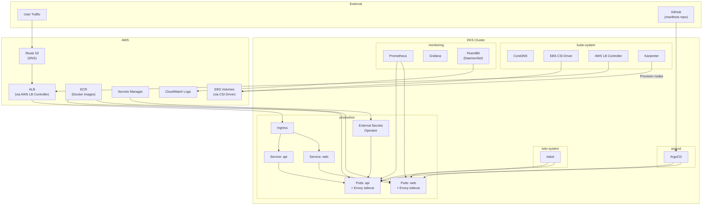

### Component Integration Summary

| Component                           | What It Does                         | Installed As                       | Namespace        |
| ----------------------------------- | ------------------------------------ | ---------------------------------- | ---------------- |
| **CoreDNS**                   | Cluster DNS resolution               | EKS Managed Addon                  | kube-system      |
| **kube-proxy**                | Service networking (iptables)        | EKS Managed Addon                  | kube-system      |
| **VPC CNI**                   | Pod networking (VPC IPs)             | EKS Managed Addon                  | kube-system      |
| **EBS CSI Driver**            | Persistent volume provisioning       | EKS Managed Addon                  | kube-system      |
| **AWS LB Controller**         | Creates ALB/NLB from Ingress/Service | Helm Chart                         | kube-system      |
| **Karpenter**                 | Node autoscaling                     | Helm Chart                         | kube-system      |
| **ArgoCD**                    | GitOps deployment                    | Helm Chart                         | argocd           |
| **Prometheus**                | Metrics collection                   | Helm Chart (kube-prometheus-stack) | monitoring       |
| **Grafana**                   | Metrics visualization                | Part of kube-prometheus-stack      | monitoring       |
| **FluentBit**                 | Log shipping to CloudWatch           | Helm Chart / DaemonSet             | logging          |
| **External Secrets Operator** | Sync Secrets Manager → K8s Secrets  | Helm Chart                         | external-secrets |
| **cert-manager**              | TLS certificate management           | Helm Chart                         | cert-manager     |
| **Istio**                     | Service mesh (mTLS, traffic mgmt)    | istioctl / Helm                    | istio-system     |

### The Request Flow — Every Hop

```
1. User types api.myapp.com
2. DNS (Route 53) resolves to ALB IP
3. ALB terminates TLS (ACM certificate)
4. ALB routes to target group (pod IPs, registered by AWS LB Controller)
5. Traffic hits Envoy sidecar (Istio) in the pod
6. Envoy applies policies (mTLS, retry, rate limit)
7. Envoy forwards to app container on localhost:8080
8. App reads config from ConfigMap (mounted as file)
9. App reads secrets from K8s Secret (synced from Secrets Manager by ESO)
10. App queries Aurora (credentials from IRSA, no hardcoded keys)
11. App writes to S3 (permissions from IRSA)
12. App returns response → Envoy → ALB → User
13. FluentBit ships app logs to CloudWatch
14. Prometheus scrapes /metrics from the app and Envoy sidecar
15. Grafana displays dashboards
16. If app crashes → kubelet restarts it
17. If traffic spikes → HPA scales pods → Karpenter scales nodes
```

---

## Quick Reference Card

### Essential kubectl Commands

```bash
# Cluster info
kubectl cluster-info
kubectl get nodes -o wide

# Pods
kubectl get pods -n production
kubectl describe pod <name> -n production
kubectl logs <pod-name> -n production -f          # Stream logs
kubectl logs <pod-name> -c <container-name>        # Specific container
kubectl exec -it <pod-name> -- /bin/sh             # Shell into pod

# Deployments
kubectl get deployments -n production
kubectl rollout status deployment/api -n production
kubectl rollout history deployment/api -n production
kubectl rollout undo deployment/api -n production  # Rollback

# Services
kubectl get svc -n production
kubectl get endpoints <svc-name> -n production     # Which pods are behind it?

# Debugging
kubectl get events -n production --sort-by='.lastTimestamp'
kubectl top pods -n production                     # CPU/memory usage
kubectl top nodes

# RBAC
kubectl auth can-i create pods -n production       # Can I?
kubectl auth can-i create pods -n production --as=developer@company.com

# Apply/Delete
kubectl apply -f manifest.yaml
kubectl delete -f manifest.yaml
kubectl diff -f manifest.yaml                      # Preview changes
```

---

## 20. Troubleshooting — Cluster, Node, Pod & Service Issues

This section covers the **most common issues** you'll face in production, organized by scope (Cluster → Node → Pod → Service/Networking). Each entry has the **symptom**, **root cause**, **diagnostic commands**, and **solution**.

### Debugging Flowchart — Where to Start

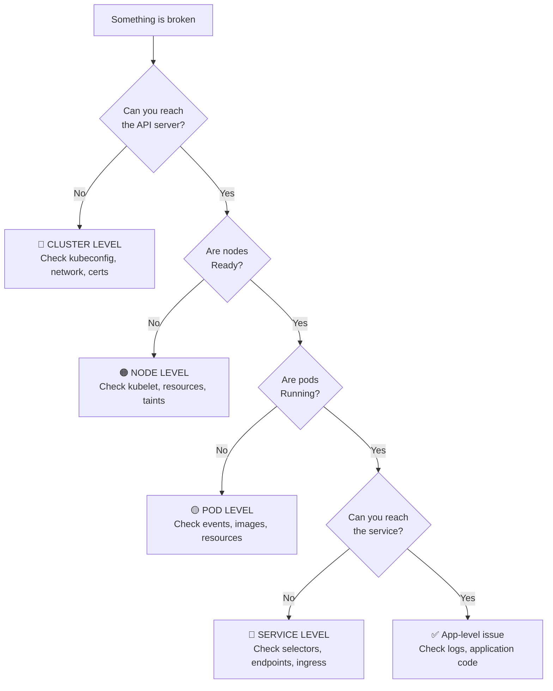

---

### 🔴 Cluster-Level Issues

#### Issue 1: `kubectl` commands timeout — "Unable to connect to the server"

| Aspect                | Detail                                                                                                                                                                                                                                                |
| --------------------- | ----------------------------------------------------------------------------------------------------------------------------------------------------------------------------------------------------------------------------------------------------- |
| **Symptom**     | `kubectl get nodes` hangs or returns `connection refused` / `i/o timeout`                                                                                                                                                                       |
| **Root Causes** | 1. Wrong kubeconfig context``2. API server is down (self-managed) or unreachable``3. Network/firewall blocking port 443``4. Expired client certificates``5. VPN not connected (private API endpoint)                      |
| **Diagnosis**   | `kubectl config current-context` — verify correct cluster`kubectl cluster-info` — check API server URL`curl -k https://<api-server-endpoint>` — test connectivity`aws eks get-token --cluster-name <name>` — test EKS auth |
| **Solution**    | Update kubeconfig:`aws eks update-kubeconfig --name <cluster>`Check security group allows your IP on port 443``Connect VPN if API endpoint is private``Renew certificates if expired                                             |

#### Issue 2: etcd is unhealthy / cluster data corruption

| Aspect                | Detail                                                                                                                     |
| --------------------- | -------------------------------------------------------------------------------------------------------------------------- |
| **Symptom**     | API server returns 500 errors, pods stuck in unknown states, stale data                                                    |
| **Root Causes** | etcd disk full, etcd member quorum lost, network partition between etcd members                                            |
| **Diagnosis**   | `etcdctl endpoint health``etcdctl endpoint status --write-out=table`Check etcd disk: `df -h /var/lib/etcd` |
| **Solution**    | Compact etcd history:`etcdctl compact <rev>`Defragment: `etcdctl defrag`Restore from snapshot if corrupted   |
| **EKS Note**    | ⚠️**You never deal with this on EKS** — AWS manages etcd. One major advantage of managed K8s.                     |

#### Issue 3: All nodes show `NotReady`

| Aspect                | Detail                                                                                                                                                                      |
| --------------------- | --------------------------------------------------------------------------------------------------------------------------------------------------------------------------- |
| **Symptom**     | `kubectl get nodes` shows all nodes `NotReady`                                                                                                                          |
| **Root Causes** | 1. Cluster networking (CNI) broken``2. API server → node communication broken``3. kubelet crashed on all nodes``4. Cloud provider integration failure |
| **Diagnosis**   | `kubectl describe node <name>` — check Conditions section``SSH to node: `systemctl status kubelet`Check CNI: `ls /etc/cni/net.d/`                        |
| **Solution**    | Restart kubelet:`systemctl restart kubelet`Reinstall CNI plugin if config missing``Check VPC CNI daemonset: `kubectl get ds -n kube-system aws-node`        |

#### Issue 4: CoreDNS is down — DNS resolution fails cluster-wide

| Aspect                | Detail                                                                                                                                                                                                                                                        |
| --------------------- | ------------------------------------------------------------------------------------------------------------------------------------------------------------------------------------------------------------------------------------------------------------- |
| **Symptom**     | Pods can't resolve service names (`nslookup kubernetes.default` fails from inside a pod)                                                                                                                                                                    |
| **Root Causes** | CoreDNS pods crashed, CoreDNS ConfigMap misconfigured, resource exhaustion on nodes running CoreDNS                                                                                                                                                           |
| **Diagnosis**   | `kubectl get pods -n kube-system -l k8s-app=kube-dns``kubectl logs -n kube-system -l k8s-app=kube-dns`Test from pod: `kubectl exec -it <pod> -- nslookup kubernetes.default`                                                                  |
| **Solution**    | Restart CoreDNS:`kubectl rollout restart deployment/coredns -n kube-system`Check CoreDNS ConfigMap: `kubectl get cm coredns -n kube-system -o yaml`Scale up CoreDNS if under load: `kubectl scale deploy coredns -n kube-system --replicas=3` |

#### Issue 5: RBAC denials — "forbidden: User cannot..."

| Aspect                | Detail                                                                                                                                                                        |
| --------------------- | ----------------------------------------------------------------------------------------------------------------------------------------------------------------------------- |
| **Symptom**     | `Error from server (Forbidden): pods is forbidden: User "X" cannot list resource "pods" in namespace "Y"`                                                                   |
| **Root Causes** | Missing RoleBinding/ClusterRoleBinding, wrong namespace, wrong subject name                                                                                                   |
| **Diagnosis**   | `kubectl auth can-i list pods -n production --as=user@company.com``kubectl get rolebindings -n production``kubectl describe rolebinding <name> -n production` |
| **Solution**    | Create or fix RoleBinding with correct subject and namespace``For EKS: update `aws-auth` ConfigMap or EKS access entries                                             |

---

### 🟠 Node-Level Issues

#### Issue 6: Node shows `NotReady`

| Aspect                | Detail                                                                                                                                                                                                                                                                             |
| --------------------- | ---------------------------------------------------------------------------------------------------------------------------------------------------------------------------------------------------------------------------------------------------------------------------------- |
| **Symptom**     | `kubectl get nodes` shows one or more nodes as `NotReady`                                                                                                                                                                                                                      |
| **Root Causes** | 1. kubelet stopped/crashed``2. Node ran out of disk (DiskPressure)``3. Node ran out of memory (MemoryPressure)``4. Node has too many PIDs (PIDPressure)``5. Container runtime (containerd) crashed``6. Network loss between node and API server |
| **Diagnosis**   | `kubectl describe node <name>` → look at `Conditions` section``SSH to node:`systemctl status kubelet``df -h`(disk)`free -m`(memory)`journalctl -u kubelet --since "10 minutes ago"`                                                      |
| **Solution**    | Restart kubelet:`systemctl restart kubelet`Clean up disk: `docker system prune` or `crictl rmi --prune`Drain and replace node if hardware issue: `kubectl drain <node> --ignore-daemonsets --delete-emptydir-data`                                               |

#### Issue 7: Node has `DiskPressure`

| Aspect                | Detail                                                                                                                                                                                                                                     |
| --------------------- | ------------------------------------------------------------------------------------------------------------------------------------------------------------------------------------------------------------------------------------------ |
| **Symptom**     | Node condition shows `DiskPressure=True`, pods evicted                                                                                                                                                                                   |
| **Root Causes** | 1. Container images filling up disk``2. Container logs too large (no log rotation)``3. EmptyDir volumes consuming disk``4. Unused images not garbage collected                                                        |
| **Diagnosis**   | SSH to node:`df -h /` and `df -h /var/lib/containerd``du -sh /var/log/pods/*``crictl images` (list cached images)                                                                                                   |
| **Solution**    | Clean unused images:`crictl rmi --prune`Clean old container logs: `find /var/log/pods -name '*.log' -mtime +7 -delete`Increase node root volume size (Terraform/ASG)``Configure kubelet garbage collection thresholds |

#### Issue 8: Pods stuck in `Pending` — "Insufficient cpu" or "Insufficient memory"

| Aspect                | Detail                                                                                                                                                                                                                                             |
| --------------------- | -------------------------------------------------------------------------------------------------------------------------------------------------------------------------------------------------------------------------------------------------- |
| **Symptom**     | Pod stays `Pending`. Events show `0/5 nodes are available: 5 Insufficient cpu`                                                                                                                                                                 |
| **Root Causes** | 1. No node has enough free resources to fit the pod``2. Resource requests are too high``3. Cluster autoscaler/Karpenter is not scaling up``4. Node has taints that the pod doesn't tolerate                                   |
| **Diagnosis**   | `kubectl describe pod <name>` → Events section`kubectl get nodes -o custom-columns=NAME:.metadata.name,CPU:.status.allocatable.cpu,MEM:.status.allocatable.memory``kubectl describe node <name>` → check `Allocated resources` |
| **Solution**    | 1. Lower resource requests if over-requested``2. Add more nodes (or fix Karpenter/CA configuration)``3. Check node taints: `kubectl get nodes -o json \| jq '.items[].spec.taints'`4. Add tolerations to pod spec if needed    |

#### Issue 9: Node is `SchedulingDisabled` (cordoned)

| Aspect                | Detail                                                                                                                             |
| --------------------- | ---------------------------------------------------------------------------------------------------------------------------------- |
| **Symptom**     | `kubectl get nodes` shows `SchedulingDisabled`. New pods won't schedule there.                                                 |
| **Root Causes** | Someone ran `kubectl cordon <node>`, or node is being drained for maintenance/upgrade                                            |
| **Diagnosis**   | `kubectl get nodes` — check status`kubectl describe node <name>` — check for taint `node.kubernetes.io/unschedulable` |
| **Solution**    | If intentional (maintenance): wait for drain to complete``If accidental: `kubectl uncordon <node>`                        |

#### Issue 10: Kubelet certificate expired

| Aspect                | Detail                                                                                                                                          |
| --------------------- | ----------------------------------------------------------------------------------------------------------------------------------------------- |
| **Symptom**     | Node shows `NotReady`, kubelet logs show `x509: certificate has expired`                                                                    |
| **Root Causes** | Kubelet TLS certificates not auto-rotated, cluster CA expired                                                                                   |
| **Diagnosis**   | SSH to node:`openssl x509 -in /var/lib/kubelet/pki/kubelet-client-current.pem -noout -dates`                                                  |
| **Solution**    | Enable auto-rotation: kubelet flag `--rotate-certificates=true`For EKS: replace the node (managed node groups handle this automatically) |

---

### 🟡 Pod-Level Issues

#### Issue 11: Pod stuck in `Pending`

| Aspect                | Detail                                                                                                                                                                                                                                                                   |
| --------------------- | ------------------------------------------------------------------------------------------------------------------------------------------------------------------------------------------------------------------------------------------------------------------------ |
| **Symptom**     | Pod stays in `Pending` state indefinitely                                                                                                                                                                                                                              |
| **Root Causes** | 1. Insufficient resources (CPU/memory) on all nodes``2. PVC not bound (storage not available)``3. Node selector / affinity has no matching nodes``4. Taints on all nodes with no matching toleration``5. ResourceQuota exceeded in namespace |
| **Diagnosis**   | `kubectl describe pod <name>` → check Events at bottom`kubectl get pvc` → check if Bound`kubectl get events --sort-by='.lastTimestamp'`                                                                                                                |
| **Solution**    | Match error message to root cause above and fix                                                                                                                                                                                                                          |

#### Issue 12: Pod stuck in `ContainerCreating`

| Aspect                | Detail                                                                                                                                                                               |
| --------------------- | ------------------------------------------------------------------------------------------------------------------------------------------------------------------------------------ |
| **Symptom**     | Pod moves from `Pending` to `ContainerCreating` but never reaches `Running`                                                                                                    |
| **Root Causes** | 1. Image pull taking too long (large image)``2. Volume mount failing (EBS not attaching)``3. ConfigMap/Secret referenced doesn't exist``4. Init container stuck |
| **Diagnosis**   | `kubectl describe pod <name>` → Events`kubectl get events -n <ns> --field-selector involvedObject.name=<pod>`                                                              |
| **Solution**    | Fix missing ConfigMap/Secret``Check CSI driver if volume issue``Pre-pull large images on nodes                                                                         |

#### Issue 13: `ImagePullBackOff` / `ErrImagePull`

| Aspect                | Detail                                                                                                                                                                                                                                                        |
| --------------------- | ------------------------------------------------------------------------------------------------------------------------------------------------------------------------------------------------------------------------------------------------------------- |
| **Symptom**     | Pod shows `ImagePullBackOff` or `ErrImagePull`                                                                                                                                                                                                            |
| **Root Causes** | 1. Image name/tag is wrong (typo)``2. Image doesn't exist in registry``3. No credentials for private registry (missing imagePullSecret)``4. Node can't reach registry (network/firewall)``5. ECR token expired (12-hour validity) |
| **Diagnosis**   | `kubectl describe pod <name>` → look for exact error message``Test pull manually: `docker pull <image>` or `crictl pull <image>` on the node                                                                                                    |
| **Solution**    | Fix image name/tag``Create imagePullSecret: `kubectl create secret docker-registry ...`For ECR: ensure node IAM role has `ecr:GetAuthorizationToken` + `ecr:BatchGetImage`Check VPC endpoints for ECR if private subnets               |

#### Issue 14: `CrashLoopBackOff`

| Aspect                | Detail                                                                                                                                                                                                                                                                                             |
| --------------------- | -------------------------------------------------------------------------------------------------------------------------------------------------------------------------------------------------------------------------------------------------------------------------------------------------- |
| **Symptom**     | Pod starts, crashes, K8s restarts it, crashes again. Backoff timer: 10s → 20s → 40s → 80s → 160s → 300s (5 min max)                                                                                                                                                                           |
| **Root Causes** | 1. Application error (exception on startup)``2. Missing environment variable or config``3. Wrong command/args in container spec``4. Liveness probe failing too quickly``5. OOMKilled (memory limit too low)``6. Dependent service not available (database, API) |
| **Diagnosis**   | `kubectl logs <pod> --previous` — see logs from the CRASHED container`kubectl describe pod <name>` → check `Last State` for exit code``Exit code 137 = OOMKilled``Exit code 1 = Application error``Exit code 0 = Normal exit (wrong for a long-running service)  |
| **Solution**    | Read the logs! 90% of CrashLoopBackOff is application-level.``If OOM: increase memory limit``If liveness probe: increase `initialDelaySeconds`If missing config: check ConfigMap/Secret exists                                                                                |

#### Issue 15: `OOMKilled` (Exit Code 137)

| Aspect                | Detail                                                                                                                                                                                                                                |
| --------------------- | ------------------------------------------------------------------------------------------------------------------------------------------------------------------------------------------------------------------------------------- |
| **Symptom**     | Container killed,`Last State: Terminated, Reason: OOMKilled, Exit Code: 137`                                                                                                                                                        |
| **Root Causes** | Container used more memory than the `resources.limits.memory` allows                                                                                                                                                                |
| **Diagnosis**   | `kubectl describe pod <name>` → check `Last State``kubectl top pod <name>` — current memory usage                                                                                                                        |
| **Solution**    | 1. Increase memory limit (if app legitimately needs more)``2. Fix memory leak in application``3. Use VPA to right-size automatically``4. Set JVM heap: `-Xmx` should be 75% of container limit (for Java apps) |

#### Issue 16: Pod evicted — `The node was low on resource: ephemeral-storage`

| Aspect                | Detail                                                                                                                                                                                                       |
| --------------------- | ------------------------------------------------------------------------------------------------------------------------------------------------------------------------------------------------------------ |
| **Symptom**     | Pod status:`Evicted`, message about ephemeral storage or disk pressure                                                                                                                                     |
| **Root Causes** | Pod writing too much to emptyDir or container writable layer (logs, temp files)                                                                                                                              |
| **Diagnosis**   | `kubectl describe pod <name>` → Eviction message``Set ephemeral storage limits to prevent this                                                                                                     |
| **Solution**    | Add ephemeral-storage limits:`resources: {limits: {ephemeral-storage: "2Gi"}}```Write to persistent volumes instead of container filesystem``Configure log rotation in your application |

#### Issue 17: Init container stuck

| Aspect                | Detail                                                                                                                       |
| --------------------- | ---------------------------------------------------------------------------------------------------------------------------- |
| **Symptom**     | Pod stuck in `Init:0/1` or `Init:CrashLoopBackOff`                                                                       |
| **Root Causes** | Init container is waiting for a dependency (database, config), crashing, or has wrong command                                |
| **Diagnosis**   | `kubectl logs <pod> -c <init-container-name>``kubectl describe pod <name>` → Init Containers section               |
| **Solution**    | Fix the init container command/script``Ensure dependency is available``Add timeout/retry logic to init scripts |

---

### 🔵 Service & Networking Issues

#### Issue 18: Service has no endpoints

| Aspect                | Detail                                                                                                                                                                                                                                                                                 |
| --------------------- | -------------------------------------------------------------------------------------------------------------------------------------------------------------------------------------------------------------------------------------------------------------------------------------- |
| **Symptom**     | `kubectl get endpoints <svc>` returns empty. Service returns `connection refused` or no response.                                                                                                                                                                                  |
| **Root Causes** | 1.**Label mismatch** — Service selector doesn't match pod labels (MOST COMMON)``2. No pods running that match the selector``3. Pods exist but none are Ready (readiness probe failing)``4. Pods in wrong namespace                                         |
| **Diagnosis**   | `kubectl get endpoints <svc> -n <ns>` — empty means no matching Ready pods`kubectl get svc <svc> -o yaml` — check `selector``kubectl get pods -l app=api -n <ns>` — do pods with matching labels exist?`kubectl get pods -n <ns>` — are pods Ready (1/1)? |
| **Solution**    | Fix label mismatch (most common fix)``Ensure pods are Running AND Ready``Check readiness probe isn't failing                                                                                                                                                             |

#### Issue 19: `Connection refused` when calling service from another pod

| Aspect                | Detail                                                                                                                                                                                                                          |
| --------------------- | ------------------------------------------------------------------------------------------------------------------------------------------------------------------------------------------------------------------------------- |
| **Symptom**     | `curl http://my-service:80` from pod returns `Connection refused`                                                                                                                                                           |
| **Root Causes** | 1. Service port doesn't match targetPort``2. App is listening on different port than `containerPort`3. App is listening on `127.0.0.1` instead of `0.0.0.0`4. Service endpoints are empty (see Issue 18) |
| **Diagnosis**   | `kubectl exec -it <pod> -- curl http://my-service:80``kubectl get endpoints my-service``kubectl exec -it <target-pod> -- netstat -tlnp` (what ports is the app actually listening on?)                          |
| **Solution**    | Fix port mapping: Service `port` → `targetPort` → container `containerPort` must match``Ensure app binds to `0.0.0.0`, not `127.0.0.1`                                                                       |

#### Issue 20: LoadBalancer Service stuck in `Pending` (External IP never assigned)

| Aspect                | Detail                                                                                                                                                                                                                                                                           |
| --------------------- | -------------------------------------------------------------------------------------------------------------------------------------------------------------------------------------------------------------------------------------------------------------------------------- |
| **Symptom**     | `kubectl get svc` shows `EXTERNAL-IP: <pending>` indefinitely                                                                                                                                                                                                                |
| **Root Causes** | 1. Cloud controller manager not running or misconfigured``2. AWS Load Balancer Controller not installed``3. IAM permissions missing (can't create ELB)``4. Subnet tagging missing (controller can't find subnets)``5. Service quota reached for ELBs |
| **Diagnosis**   | `kubectl describe svc <name>` → Events section`kubectl logs -n kube-system -l app.kubernetes.io/name=aws-load-balancer-controller```Check AWS console for failed LB creation                                                                                    |
| **Solution**    | Install AWS LB Controller if missing``Tag subnets:`kubernetes.io/cluster/<name>=shared``kubernetes.io/role/elb=1` (public) or `kubernetes.io/role/internal-elb=1` (private)``Check IAM role permissions                                            |

#### Issue 21: Ingress not routing traffic / 404 errors

| Aspect                | Detail                                                                                                                                                                                                                                                       |
| --------------------- | ------------------------------------------------------------------------------------------------------------------------------------------------------------------------------------------------------------------------------------------------------------ |
| **Symptom**     | Ingress created but returns 404, 502, or doesn't route at all                                                                                                                                                                                                |
| **Root Causes** | 1. No Ingress Controller installed``2. Ingress class annotation wrong or missing``3. Backend service doesn't exist or has no endpoints``4. Path matching rules incorrect (Prefix vs Exact)``5. TLS certificate issues            |
| **Diagnosis**   | `kubectl get ingress <name>` — check ADDRESS column (should show ALB DNS)`kubectl describe ingress <name>` → Events`kubectl get svc -n kube-system` — is ingress controller running?``Check ALB target group health in AWS console |
| **Solution**    | Install ingress controller if missing``Fix `ingressClassName` or annotation``Ensure backend service has Ready endpoints``Check target group health checks in ALB settings                                                             |

#### Issue 22: DNS resolution fails inside pods

| Aspect                | Detail                                                                                                                                                                                                              |
| --------------------- | ------------------------------------------------------------------------------------------------------------------------------------------------------------------------------------------------------------------- |
| **Symptom**     | `nslookup` or service calls fail with `Name or service not known`                                                                                                                                               |
| **Root Causes** | 1. CoreDNS pods down``2. Pod's `dnsPolicy` set to `None` or `Default` (uses node DNS, not cluster DNS)``3. Network policy blocking DNS (port 53/UDP)``4. CoreDNS ConfigMap misconfigured |
| **Diagnosis**   | From inside pod:`nslookup kubernetes.default.svc.cluster.local``kubectl get pods -n kube-system -l k8s-app=kube-dns`Check pod spec: `dnsPolicy` should be `ClusterFirst`                          |
| **Solution**    | Ensure CoreDNS is running with ≥2 replicas``Set `dnsPolicy: ClusterFirst` in pod spec``Allow egress to kube-dns on UDP/TCP 53 in NetworkPolicies                                                   |

#### Issue 23: Cross-namespace service communication fails

| Aspect                | Detail                                                                                                                      |
| --------------------- | --------------------------------------------------------------------------------------------------------------------------- |
| **Symptom**     | Pod in namespace A can't reach service in namespace B                                                                       |
| **Root Causes** | 1. Using short DNS name (won't resolve cross-namespace)``2. Network policy blocking cross-namespace traffic          |
| **Diagnosis**   | Test with FQDN:`curl http://my-service.namespace-b.svc.cluster.local`Check NetworkPolicies in both namespaces        |
| **Solution**    | Use FQDN:`<service>.<namespace>.svc.cluster.local`Add NetworkPolicy rules allowing ingress from the source namespace |

#### Issue 24: Intermittent 5xx errors or connection timeouts

| Aspect                | Detail                                                                                                                                                                                                                                                                                                                                   |
| --------------------- | ---------------------------------------------------------------------------------------------------------------------------------------------------------------------------------------------------------------------------------------------------------------------------------------------------------------------------------------- |
| **Symptom**     | Requests randomly fail with 502/503/504 or timeouts                                                                                                                                                                                                                                                                                      |
| **Root Causes** | 1. Pods restarting during rolling update (no readiness probe)``2. Readiness probe too aggressive (marks pods ready before app is warm)``3. Connection pool exhaustion to downstream service``4. HPA scaling too slowly for traffic spike``5. kube-proxy iptables pointing to terminated pod (race condition) |
| **Diagnosis**   | `kubectl get pods -w` — watch for restarts during errors`kubectl describe pod` — check readiness probe config`kubectl top pods` — check if pods are resource-constrained``Check ALB target group health                                                                                                        |
| **Solution**    | Add `readinessProbe` with appropriate timing``Add `preStop` lifecycle hook for graceful shutdown:`lifecycle: {preStop: {exec: {command: ["sleep", "15"]}}}```This gives kube-proxy time to update endpoints before pod terminates                                                                               |

---

### 🟣 Storage Issues

#### Issue 25: PVC stuck in `Pending`

| Aspect                | Detail                                                                                                                                                                                                                                         |
| --------------------- | ---------------------------------------------------------------------------------------------------------------------------------------------------------------------------------------------------------------------------------------------- |
| **Symptom**     | `kubectl get pvc` shows `STATUS: Pending`                                                                                                                                                                                                  |
| **Root Causes** | 1. StorageClass doesn't exist``2. CSI driver not installed (EBS CSI)``3. `WaitForFirstConsumer` — PVC waits until a pod uses it``4. No available capacity in AZ``5. IAM permissions missing for volume creation |
| **Diagnosis**   | `kubectl describe pvc <name>` → Events`kubectl get storageclass` — does the referenced class exist?`kubectl get pods -n kube-system -l app.kubernetes.io/name=aws-ebs-csi-driver`                                            |
| **Solution**    | Install EBS CSI driver``Create the StorageClass``Check IAM role for CSI driver has `ec2:CreateVolume`, `ec2:AttachVolume`If `WaitForFirstConsumer`: create the pod that references the PVC                            |

#### Issue 26: Pod can't mount volume — `Multi-Attach error`

| Aspect                | Detail                                                                                                                                                                                                                           |
| --------------------- | -------------------------------------------------------------------------------------------------------------------------------------------------------------------------------------------------------------------------------- |
| **Symptom**     | `Multi-Attach error for volume "pvc-xxx" Volume is already attached to node Y`                                                                                                                                                 |
| **Root Causes** | EBS volumes are `ReadWriteOnce` — can only attach to ONE node at a time. Previous pod on a different node still has the volume.                                                                                               |
| **Diagnosis**   | `kubectl describe pod <name>` → Events`kubectl get pv <pv-name> -o yaml` — check which node it's attached to                                                                                                          |
| **Solution**    | Wait for previous pod to terminate and detach the volume``If previous pod is stuck: force delete it `kubectl delete pod <name> --force --grace-period=0`For shared storage: use EFS (ReadWriteMany) instead of EBS |

---

### Master Debugging Commands Cheat Sheet

```bash
# ── Cluster Health ──────────────────────────────────
kubectl cluster-info                                 # API server reachable?
kubectl get componentstatuses                        # Control plane health (deprecated but useful)
kubectl get nodes -o wide                            # Node status + IPs + version
kubectl top nodes                                    # Node CPU/memory usage

# ── Pod Debugging ───────────────────────────────────
kubectl describe pod <pod> -n <ns>                   # THE most useful command
kubectl logs <pod> -n <ns>                           # Current container logs
kubectl logs <pod> -n <ns> --previous                # Logs from CRASHED container
kubectl logs <pod> -n <ns> -c <container>            # Specific container in multi-container pod
kubectl exec -it <pod> -n <ns> -- /bin/sh            # Shell into running container
kubectl get events -n <ns> --sort-by='.lastTimestamp' # Recent events in namespace

# ── Service Debugging ───────────────────────────────
kubectl get endpoints <svc> -n <ns>                  # Are there backend pods?
kubectl get svc <svc> -n <ns> -o yaml                # Check selector, ports
kubectl run debug --rm -it --image=busybox -- /bin/sh # Spin up a debug pod
# Inside debug pod:
  nslookup <service>.<namespace>.svc.cluster.local    # DNS working?
  wget -qO- http://<service>:<port>/healthz           # Can we reach the service?

# ── Node Debugging ──────────────────────────────────
kubectl describe node <node>                         # Conditions, allocatable, taints
kubectl get pods --field-selector spec.nodeName=<node> -A  # All pods on a node
kubectl drain <node> --ignore-daemonsets              # Evacuate pods before maintenance
kubectl cordon <node>                                # Stop scheduling, keep existing pods
kubectl uncordon <node>                              # Resume scheduling

# ── Network Debugging ──────────────────────────────
kubectl run netshoot --rm -it --image=nicolaka/netshoot -- /bin/bash
# Inside netshoot pod:
  curl -v http://my-service.production.svc.cluster.local:80
  dig my-service.production.svc.cluster.local
  tcpdump -i any port 8080
  iperf3 -c <pod-ip>                                  # Bandwidth test
```

---

## 21. AWS EKS — Contrast & Similarity with Vanilla K8s

### What is EKS?

Amazon EKS is a **managed Kubernetes service**. AWS runs and manages the **control plane** (API server, etcd, scheduler, controller manager). You manage the **worker nodes** (or use Fargate to avoid even that).

### EKS vs Vanilla (Self-Managed) Kubernetes

#### What AWS Manages For You (Contrast)

| Component                      | Vanilla K8s (You Manage)                       | EKS (AWS Manages)                                                          |
| ------------------------------ | ---------------------------------------------- | -------------------------------------------------------------------------- |
| **API Server**           | Install, configure, scale, HA, patch           | ✅ Fully managed, multi-AZ                                                 |
| **etcd**                 | Run 3-5 node cluster, backup, restore, monitor | ✅ Fully managed, encrypted, backed up                                     |
| **Scheduler**            | Install, configure, patch                      | ✅ Fully managed                                                           |
| **Controller Manager**   | Install, configure, patch                      | ✅ Fully managed                                                           |
| **TLS Certificates**     | Generate, rotate, manage CA                    | ✅ Managed, auto-rotated                                                   |
| **Control Plane HA**     | Manual multi-master setup                      | ✅ 3 AZs by default                                                        |
| **K8s Version Upgrades** | Download, test, roll out to each component     | ✅`aws eks update-cluster-version` (still requires addon + node updates) |
| **Audit Logging**        | Configure, store, rotate                       | ✅ One-click to CloudWatch                                                 |

#### What YOU Still Manage (Similarity)

| Component                                | Vanilla K8s                        | EKS                                                         | Same?                    |
| ---------------------------------------- | ---------------------------------- | ----------------------------------------------------------- | ------------------------ |
| **Worker Nodes**                   | EC2 instances, OS patches, kubelet | EC2 instances, OS patches, kubelet (or Fargate)             | ✅ Same (unless Fargate) |
| **Pod Scheduling**                 | Identical                          | Identical                                                   | ✅ Same                  |
| **Deployments, Services, Ingress** | Standard K8s YAML                  | Standard K8s YAML                                           | ✅ Same                  |
| **RBAC**                           | Standard K8s RBAC                  | Standard K8s RBAC + aws-auth ConfigMap / EKS Access Entries | 🟡 Similar               |
| **Networking**                     | Choose CNI                         | VPC CNI (default) or bring your own                         | 🟡 Similar               |
| **Storage**                        | Install CSI drivers                | Install CSI drivers (EBS/EFS/FSx)                           | ✅ Same                  |
| **Monitoring**                     | Install Prometheus, etc.           | Install Prometheus, etc. (or use Container Insights)        | ✅ Same                  |
| **Helm Charts**                    | Standard Helm                      | Standard Helm                                               | ✅ Same                  |
| **kubectl**                        | Standard                           | Standard (with AWS auth plugin)                             | ✅ Same                  |

### EKS-Specific Concepts (Not in Vanilla K8s)

#### 1. EKS Managed Node Groups

```
Vanilla K8s:                            EKS:
You: "Provision 3 EC2 instances,         You: "Give me a node group with 3 nodes"
install kubelet, join to cluster,        EKS: Creates ASG, configures kubelet,
configure CNI, monitor health..."        joins to cluster, handles updates
```

| Feature           | Self-Managed Nodes    | Managed Node Groups   | Fargate             |
| ----------------- | --------------------- | --------------------- | ------------------- |
| Node provisioning | You (EC2 + userdata)  | AWS (ASG managed)     | AWS (serverless)    |
| OS patching       | You                   | AWS (AMI updates)     | AWS (fully managed) |
| Kubelet config    | You                   | AWS                   | AWS                 |
| Scaling           | You (CA or Karpenter) | You (CA or Karpenter) | Automatic per-pod   |
| Cost control      | Full                  | Full                  | Per-pod billing     |
| SSH access        | Yes                   | Yes                   | No                  |
| DaemonSets        | Yes                   | Yes                   | No                  |
| GPU/custom AMI    | Yes                   | Yes                   | No                  |

#### 2. EKS Authentication — The `aws-auth` ConfigMap

In vanilla K8s, authentication is via client certificates or OIDC. In EKS, it uses **AWS IAM:**

```
kubectl command → AWS STS (get token) → EKS API Server (validate IAM identity)
                                             ↓
                                    aws-auth ConfigMap / EKS Access Entries
                                    (map IAM role/user → K8s RBAC user/group)
```

```yaml
# aws-auth ConfigMap (kube-system namespace)
apiVersion: v1
kind: ConfigMap
metadata:
  name: aws-auth
  namespace: kube-system
data:
  mapRoles: |
    - rolearn: arn:aws:iam::123456789:role/EKS-Worker-Node-Role
      username: system:node:{{EC2PrivateDNSName}}
      groups:
        - system:bootstrappers
        - system:nodes
    - rolearn: arn:aws:iam::123456789:role/Developer-Role
      username: developer
      groups:
        - dev-group
```

> **EKS Access Entries (newer, recommended):** Replace `aws-auth` ConfigMap with API-based access management. Safer — can't lock yourself out by deleting the ConfigMap.

#### 3. VPC CNI — EKS Default Networking

**Vanilla K8s** uses overlay networks (Calico, Flannel) where pod IPs are NOT VPC-routable.
**EKS VPC CNI** assigns real VPC IPs to pods — they're directly routable from RDS, ElastiCache, Lambda, etc.

```
Vanilla K8s (Calico overlay):           EKS (VPC CNI):
 Pod IP: 192.168.1.5 (overlay)          Pod IP: 10.0.1.15 (real VPC IP)
 RDS can't reach pod directly            RDS CAN reach pod directly
 Need NodePort/LB to expose              Pod is a first-class VPC citizen
```

**Advantage:** No overlay = better performance, simpler debugging, native security groups.
**Disadvantage:** IP address exhaustion in large clusters (solved by prefix delegation).

#### 4. IRSA — IAM Roles for Service Accounts

**Vanilla K8s:** No native AWS integration. You'd mount AWS access keys as secrets (bad practice).
**EKS IRSA:** Pods assume IAM roles via OIDC federation — no credentials stored anywhere.

This is one of EKS's **biggest advantages** over vanilla K8s on AWS.

#### 5. EKS Managed Addons

| Addon                  | What It Does            | Vanilla K8s Equivalent                 |
| ---------------------- | ----------------------- | -------------------------------------- |
| `vpc-cni`            | Pod networking          | Install Calico/Flannel/Cilium yourself |
| `coredns`            | Cluster DNS             | Install CoreDNS yourself               |
| `kube-proxy`         | Service networking      | Install kube-proxy yourself            |
| `aws-ebs-csi-driver` | EBS volume provisioning | Install CSI driver yourself            |
| `aws-efs-csi-driver` | EFS shared storage      | Install CSI driver yourself            |
| `adot`               | OpenTelemetry collector | Install OTel yourself                  |

Managed addons get **automatic updates** that are compatible with your cluster version.

#### 6. Fargate — Serverless Pods (EKS-Only)

```
Traditional EKS:                     EKS on Fargate:
 You manage EC2 nodes                  AWS manages everything
 kubelet runs on your nodes            AWS runs a micro-VM per pod
 You pay for idle node capacity        You pay per pod (CPU + memory)
 DaemonSets run on every node          DaemonSets NOT supported
```

**Fargate Profile:**

```yaml
# Terraform
resource "aws_eks_fargate_profile" "app" {
  cluster_name           = aws_eks_cluster.main.name
  fargate_profile_name   = "app-profile"
  pod_execution_role_arn = aws_iam_role.fargate.arn

  selector {
    namespace = "production"
    labels = {
      compute = "fargate"    # Only pods with this label run on Fargate
    }
  }

  subnet_ids = var.private_subnet_ids
}
```

**Fargate Limitations:**

- ❌ No DaemonSets (no FluentBit DaemonSet — use sidecar pattern instead)
- ❌ No GPU workloads
- ❌ No privileged containers
- ❌ Max 4 vCPU and 30 GB memory per pod
- ❌ ~30-60 second cold start per pod
- ❌ No persistent volumes (EBS) — only EFS
- ❌ No SSH to the underlying compute

**When to use Fargate:**

- ✅ Batch jobs, CronJobs (no idle cost)
- ✅ Low-traffic services (don't want to pay for idle nodes)
- ✅ Security-sensitive workloads (stronger isolation — each pod gets its own micro-VM)
- ✅ When you want zero node management

---

### EKS-Specific Issues & Troubleshooting

#### EKS Issue 1: `aws-auth` ConfigMap deleted — Locked out of cluster

| Aspect               | Detail                                                                                                                                                                                                                                                             |
| -------------------- | ------------------------------------------------------------------------------------------------------------------------------------------------------------------------------------------------------------------------------------------------------------------ |
| **Symptom**    | Nobody can authenticate to the cluster.`kubectl` returns `Unauthorized`.                                                                                                                                                                                       |
| **Root Cause** | Someone deleted or corrupted the `aws-auth` ConfigMap                                                                                                                                                                                                            |
| **Solution**   | The cluster creator's IAM identity always has access (it's in the EKS control plane, not in `aws-auth`).``Log in as the cluster creator and recreate `aws-auth`.``**Prevention:** Use EKS Access Entries instead of `aws-auth` ConfigMap |

#### EKS Issue 2: Pods can't pull from ECR — `ImagePullBackOff`

| Aspect               | Detail                                                                                                                                                |
| -------------------- | ----------------------------------------------------------------------------------------------------------------------------------------------------- |
| **Symptom**    | `Failed to pull image: no basic auth credentials`                                                                                                   |
| **Root Cause** | Node IAM role missing ECR permissions, or VPC endpoints not configured for private subnets                                                            |
| **Solution**   | Add policy to node role:`AmazonEC2ContainerRegistryReadOnly`For private subnets: create VPC endpoints for `ecr.api`, `ecr.dkr`, and `s3` |

#### EKS Issue 3: VPC CNI IP exhaustion — Pods stuck in `Pending`

| Aspect               | Detail                                                                                                                                                                                                                           |
| -------------------- | -------------------------------------------------------------------------------------------------------------------------------------------------------------------------------------------------------------------------------- |
| **Symptom**    | `Failed to assign an IP address to container`                                                                                                                                                                                  |
| **Root Cause** | Subnet ran out of available IP addresses for pod networking                                                                                                                                                                      |
| **Solution**   | Enable prefix delegation:`kubectl set env daemonset aws-node -n kube-system ENABLE_PREFIX_DELEGATION=true`Add secondary CIDR to VPC (100.64.0.0/16)``Use custom networking to put pods in separate, larger subnets |

#### EKS Issue 4: EKS upgrade breaks addons

| Aspect               | Detail                                                                                                                                                                                                                                                     |
| -------------------- | ---------------------------------------------------------------------------------------------------------------------------------------------------------------------------------------------------------------------------------------------------------- |
| **Symptom**    | After cluster version upgrade, CoreDNS, kube-proxy, or VPC CNI stops working                                                                                                                                                                               |
| **Root Cause** | Addons not updated to match new K8s version                                                                                                                                                                                                                |
| **Solution**   | Always upgrade addons AFTER upgrading the control plane:`aws eks update-addon --cluster-name <name> --addon-name vpc-cni --resolve-conflicts OVERWRITE```Check compatible versions:`aws eks describe-addon-versions --addon-name coredns` |

#### EKS Issue 5: ALB Ingress not creating — `failed to build model due to ingress class not found`

| Aspect               | Detail                                                                                                                                                                                                                  |
| -------------------- | ----------------------------------------------------------------------------------------------------------------------------------------------------------------------------------------------------------------------- |
| **Symptom**    | Ingress created but no ALB appears. Events show ingress class errors.                                                                                                                                                   |
| **Root Cause** | AWS Load Balancer Controller not installed, or using deprecated `kubernetes.io/ingress.class` annotation instead of `ingressClassName`                                                                              |
| **Solution**   | Install AWS LB Controller via Helm``Use `spec.ingressClassName: alb` instead of annotation``Ensure subnets tagged correctly:`kubernetes.io/cluster/<name>=shared` + `kubernetes.io/role/elb=1` |

#### EKS Issue 6: IRSA not working — Pods using node role instead

| Aspect               | Detail                                                                                                                                                                                                                                                                               |
| -------------------- | ------------------------------------------------------------------------------------------------------------------------------------------------------------------------------------------------------------------------------------------------------------------------------------ |
| **Symptom**    | Pod makes AWS API calls using the node's IAM role instead of the ServiceAccount role                                                                                                                                                                                                 |
| **Root Cause** | 1. OIDC provider not created for cluster``2. ServiceAccount annotation missing `eks.amazonaws.com/role-arn`3. IAM role trust policy doesn't reference the correct OIDC provider``4. Pod not using the annotated ServiceAccount                                  |
| **Solution**   | Verify OIDC:`aws eks describe-cluster --name <name> --query cluster.identity.oidc`Check SA annotation: `kubectl get sa <name> -o yaml`Check IAM role trust policy conditions match SA name and namespace``Ensure pod spec has `serviceAccountName: <sa-name>` |

---

### EKS Architecture Diagram

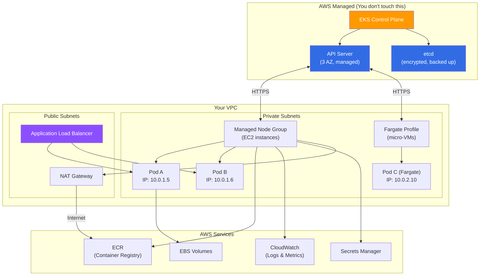

---

### EKS Pricing

| Component                   | Cost                                                   | Notes                              |
| --------------------------- | ------------------------------------------------------ | ---------------------------------- |
| **EKS Control Plane** | $0.10/hour ($73/month)                                 | Per cluster, regardless of size    |
| **EC2 Worker Nodes**  | Standard EC2 pricing                                   | m6g.large ≈ $56/mo On-Demand      |
| **Fargate**           | $0.04048/vCPU/hour + $0.004445/GB/hour                 | Per pod, no idle cost              |
| **NAT Gateway**       | $0.045/hour + $0.045/GB processed                      | Can be expensive with high traffic |
| **ALB**               | $0.0225/hour + LCU charges | ~$16/month base + traffic |                                    |

> **Cost Tip:** The EKS control plane fee ($73/mo) is fixed. The real cost driver is EC2 nodes. Use Karpenter with Spot instances to reduce node costs by 60-90%.

---

> **Last Updated:** May 2026 | **Author:** Built for Pushparaj Naik
> **Tip:** Bookmark this doc. Come back to it as you encounter each concept in real projects. Reading it all at once is overwhelming — but having it as a reference is invaluable.
