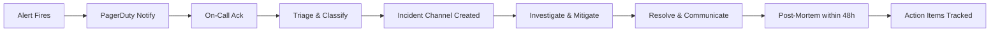

# 🎯 UST Global — Sr. Cloud Manager Interview Preparation

> **Role:** Sr. Cloud Manager | **Location:** Bangalore | **Focus:** AWS Expert Track
> **Experience Level:** 13+ years | **Prepared for:** Pushparaj Naik

---

## Table of Contents

1. [Cloud Platform Engineering & Architecture](#1-cloud-platform-engineering--architecture)
2. [Infrastructure-as-Code (Terraform)](#2-infrastructure-as-code-terraform)
3. [Container Orchestration (EKS / Kubernetes)](#3-container-orchestration-eks--kubernetes)
4. [CI/CD Pipelines & Automation](#4-cicd-pipelines--automation)
5. [Cloud Operations (CloudOps) & SRE](#5-cloud-operations-cloudops--sre)
6. [Cloud Security & Compliance (CloudSecOps)](#6-cloud-security--compliance-cloudsecops)
7. [Cost Optimization & FinOps](#7-cost-optimization--finops)
8. [Strategic & Cross-Functional Leadership](#8-strategic--cross-functional-leadership)
9. [People Leadership & Team Management](#9-people-leadership--team-management)
10. [Scenario-Based & Behavioral Questions](#10-scenario-based--behavioral-questions)

---

## 1. Cloud Platform Engineering & Architecture

### Q1. Walk us through how you would architect a highly available, fault-tolerant application on AWS for a mission-critical enterprise workload

**Answer:**

I follow a multi-layered resilience strategy:

**Network Layer:**

- Multi-AZ VPC with public/private/data subnets across 3 AZs minimum
- Transit Gateway for multi-VPC connectivity (hub-spoke topology)
- Route 53 with health checks and failover routing for DNS-level resilience
- AWS Global Accelerator for global traffic management with anycast IPs

**Compute Layer:**

- EKS across multiple AZs with Karpenter for intelligent node autoscaling
- Fargate for burst workloads to avoid under-provisioning
- Auto Scaling Groups with mixed instance policies (Spot + On-Demand)
- Pod Disruption Budgets (PDBs) and pod anti-affinity for spread scheduling

**Data Layer:**

- Aurora Multi-AZ with read replicas (or Aurora Global Database for DR)
- ElastiCache Redis with Multi-AZ and automatic failover
- S3 with cross-region replication for critical data
- DynamoDB Global Tables for multi-region active-active patterns

**Application Layer:**

- Circuit breaker patterns using AWS App Mesh or Istio service mesh
- SQS/SNS for decoupled async processing (dead letter queues for failed messages)
- API Gateway with throttling, caching, and WAF integration

**Observability:**

- CloudWatch Container Insights + Prometheus/Grafana for metrics
- X-Ray or OpenTelemetry for distributed tracing
- Centralized logging via CloudWatch Logs → OpenSearch

**RPO/RTO targets** drive the specific architecture. For RPO < 1 min, we use synchronous replication (Aurora Multi-AZ). For RPO < 1 hour, async replication (S3 CRR, Aurora Global DB).

---

### Q2. How do you design for scalability on AWS? What patterns do you use?

**Answer:**

I categorize scalability into four dimensions:

1. **Horizontal Scaling (Compute):**
   - EKS with Horizontal Pod Autoscaler (HPA) based on custom CloudWatch metrics (not just CPU)
   - Karpenter for node-level scaling — it provisions right-sized nodes in seconds vs. minutes with Cluster Autoscaler
   - Fargate profiles for unpredictable burst workloads

2. **Data Scaling:**
   - Aurora Serverless v2 for variable-traffic databases (scales 0.5→128 ACU)
   - DynamoDB on-demand mode with DAX caching layer
   - Read replicas and Connection Pooling via RDS Proxy

3. **Event-Driven Scaling:**
   - SQS → Lambda for queue-based processing (concurrency scales automatically)
   - EventBridge for event-driven architectures with fan-out patterns
   - Step Functions for complex workflow orchestration

4. **Edge Scaling:**
   - CloudFront for static asset caching (30+ global edge locations)
   - Lambda@Edge for edge compute (authentication, redirects, A/B testing)
   - API Gateway with regional and edge-optimized endpoints

**Key Principle:** I always prefer **scale-out over scale-up**. Stateless services behind load balancers, shared-nothing architectures, and asynchronous processing patterns.

---

### Q3. How do you ensure performance, availability, and resilience in cloud platforms?

**Answer:**

I use a framework I call **PAR** (Performance, Availability, Resilience):

**Performance:**

- Establish SLOs: p50 < 100ms, p99 < 500ms for API responses
- Use caching at every layer: CloudFront → API Gateway cache → ElastiCache → Aurora query cache
- Right-size instances using AWS Compute Optimizer recommendations
- Implement connection pooling (RDS Proxy) to avoid connection exhaustion

**Availability:**

- Design for 99.99% (52 min downtime/year) using multi-AZ architectures
- Deploy across ≥ 3 AZs for quorum-based systems
- Use health checks at every layer (Route 53, ALB, EKS liveness/readiness probes)
- Implement graceful degradation — feature flags to disable non-critical features under load

**Resilience:**

- Chaos engineering with AWS Fault Injection Simulator (FIS)
- Inject AZ failures, network latency, and instance termination in staging
- Automated runbooks via Systems Manager for self-healing
- Regular DR drills (quarterly for critical, annually for standard)

---

### Q4. Explain the AWS Well-Architected Framework and how you apply it in practice

**Answer:**

The framework has **6 pillars** and I apply them through a structured review process:

| Pillar | Key Practice | How I Enforce It |
|--------|-------------|-----------------|
| **Operational Excellence** | IaC, runbooks, post-mortems | Terraform for everything, blameless retrospectives |
| **Security** | Least privilege, encryption, logging | IAM policies per-resource, KMS, CloudTrail mandatory |
| **Reliability** | Multi-AZ, auto-healing, DR | EKS PDBs, Aurora Multi-AZ, quarterly DR drills |
| **Performance Efficiency** | Right-sizing, caching, serverless | Compute Optimizer, ElastiCache, Lambda for event-driven |
| **Cost Optimization** | Reserved/Spot, right-sizing, tagging | Savings Plans, Karpenter Spot, mandatory cost tags |
| **Sustainability** | Efficient workloads, managed services | Graviton instances (40% better price-performance) |

**In Practice:** I run quarterly Well-Architected Reviews using the AWS Well-Architected Tool, generate a backlog of High/Medium findings, and track remediation as Sprint items. This is non-negotiable for production workloads.

---

### Q5. How do you handle capacity management and planning?

**Answer:**

My approach involves three time horizons:

**Real-Time (0-1 hour):**

- Auto Scaling (HPA, Karpenter) handles immediate demand spikes
- CloudWatch alarms trigger scaling events before saturation

**Short-Term (1-90 days):**

- CloudWatch anomaly detection to predict demand trends
- Load testing before major releases (k6 or Locust against staging)
- Buffer capacity planning: 30% headroom for unexpected spikes

**Long-Term (quarterly/annually):**

- Business growth forecasting → capacity modeling
- Reserved Instance / Savings Plans purchasing decisions
- Architecture evolution planning (e.g., migrating to serverless to remove capacity ceiling)

---

### Q6. What is your approach to multi-account AWS strategy?

**Answer:**

I implement **AWS Organizations** with a landing zone pattern:

```
Management Account (billing, SCPs)
├── Security OU
│   ├── Log Archive Account (CloudTrail, Config, VPC Flow Logs)
│   └── Security Tooling Account (GuardDuty, SecurityHub, Inspector)
├── Infrastructure OU
│   ├── Shared Services Account (Transit Gateway, DNS, AD)
│   └── Network Account (VPCs, Direct Connect, VPN)
├── Workload OUs
│   ├── Dev Account
│   ├── Staging Account
│   └── Production Account
└── Sandbox OU
    └── Developer Sandboxes (budget-capped)
```

**Key Governance:**

- **Service Control Policies (SCPs):** Deny certain regions, enforce tagging, prevent public S3
- **AWS Control Tower:** Guardrails for automated compliance
- **Cross-Account Roles:** Specific roles with assume-role for CI/CD pipelines
- **Centralized Billing:** Consolidated billing for volume discounts + per-account cost allocation

---

### Q7. How do you handle disaster recovery on AWS?

**Answer:**

I align DR strategy to RPO/RTO requirements and cost tolerance:

| Strategy | RPO | RTO | Cost | When to Use |
|----------|-----|-----|------|-------------|
| **Backup & Restore** | Hours | Hours | $ | Dev/staging, non-critical |
| **Pilot Light** | Minutes | 15-30 min | $$ | Standard production |
| **Warm Standby** | Near-zero | Minutes | $$$ | Business-critical |
| **Active-Active** | Zero | Near-zero | $$$$ | Mission-critical, SLA-bound |

**My typical production setup (Warm Standby):**

- Aurora Global Database (cross-region, RPO < 1s)
- S3 Cross-Region Replication (async)
- EKS cluster pre-provisioned in DR region (1 node, scaled down)
- Infrastructure codified in Terraform — can rebuild from scratch in 15 min
- Route 53 health checks with automated failover
- Quarterly DR drills — document recovery time, fix any drift

---

## 2. Infrastructure-as-Code (Terraform)

### Q8. Describe your IaC strategy and why you chose Terraform

**Answer:**

**Why Terraform over CloudFormation:**

1. **Multi-cloud readiness** — Even for AWS-only today, Terraform skills transfer across providers
2. **State management** — Explicit state file enables `plan` before `apply` (deterministic changes)
3. **Module ecosystem** — Rich public registry + reusable internal modules
4. **HCL readability** — More concise than JSON/YAML CloudFormation templates
5. **Provider ecosystem** — Manage AWS + GitHub + Datadog + PagerDuty in one workflow

**My IaC Strategy:**

- **Monorepo per environment tier** — Bootstrap, Shared Infra, Workload modules
- **Remote state in S3** with DynamoDB locking (never local state)
- **Module-per-concern** — Each module owns one logical component (VPC, EKS, RDS)
- **Workspaces for environments** or separate state files per env
- **Atlantis or GitHub Actions** for Terraform plan/apply in CI/CD
- **Sentinel/OPA policies** for pre-apply governance checks

---

### Q9. How do you structure a Terraform project for a large-scale AWS environment?

**Answer:**

```
terraform/
├── bootstrap/                    # One-time: S3 state bucket, DynamoDB lock
├── shared-infra/                 # VPC, Transit Gateway, DNS zones
│   ├── main.tf
│   ├── variables.tf
│   ├── outputs.tf
│   ├── providers.tf
│   ├── backend.tf
│   └── modules/
│       ├── vpc/                  # VPC, subnets, NAT, IGW
│       ├── transit-gateway/      # Cross-VPC connectivity
│       └── dns/                  # Route 53 zones
├── platform/                     # EKS, RDS, ElastiCache
│   └── modules/
│       ├── eks-cluster/
│       ├── aurora-cluster/
│       └── elasticache/
└── workloads/                    # Application-specific infra
    ├── app-a/
    └── app-b/
```

**Key Principles:**

1. **Layered dependencies** — Bootstrap → Shared → Platform → Workloads
2. **Data sources for cross-layer references** — Use `terraform_remote_state` data source
3. **Variables validated** — Use `validation` blocks for input constraints
4. **Outputs are the API** — Every module publishes ARNs, IDs, endpoints
5. **`prevent_destroy` on critical resources** — Aurora, S3 state bucket, DynamoDB tables

---

### Q10. How do you manage Terraform state in production?

**Answer:**

**State Backend:**

- S3 bucket with versioning, KMS encryption, public access blocked
- DynamoDB table for state locking (prevents concurrent applies)
- One state file per logical component (not one monolithic state)

**State Security:**

- Sensitive outputs marked `sensitive = true`
- State bucket access restricted to CI/CD IAM role only
- State file versioning for rollback
- No secrets in state — use `aws_secretsmanager_secret_version` data source

**Operational Procedures:**

- `terraform plan` runs on every PR (Atlantis or GitHub Actions)
- `terraform apply` only from CI/CD pipeline, never from laptops
- State file backup: S3 versioning + cross-region replication
- `terraform import` for brownfield resources — document every import

**Anti-patterns I avoid:**

- Never use local state in team environments
- Never store passwords as Terraform variables (use Secrets Manager)
- Never use `count` when `for_each` is more appropriate (state stability)

---

### Q11. How do you handle Terraform module versioning and governance?

**Answer:**

**Module Registry:**

- Internal modules published to a private Terraform registry (or Git tags)
- Semantic versioning: `module "vpc" { source = "git::...?ref=v2.3.1" }`
- Breaking changes require major version bump

**Governance:**

- **Pre-commit hooks:** `terraform fmt`, `terraform validate`, `tflint`
- **Policy-as-Code:** OPA/Rego or HashiCorp Sentinel for:
  - All S3 buckets must have encryption enabled
  - All RDS instances must be Multi-AZ
  - No `0.0.0.0/0` ingress rules on security groups
  - All resources must have mandatory tags (`Project`, `Owner`, `CostCenter`)
- **Code Review:** Every Terraform change requires a `plan` output reviewed by a peer
- **Drift Detection:** Weekly `terraform plan` runs to detect manual console changes

---

### Q12. How do you handle secrets in Terraform?

**Answer:**

I follow a layered approach:

1. **Never hardcode secrets** — No passwords, API keys, or tokens in `.tf` files
2. **Input variables marked `sensitive`** — `variable "password" { sensitive = true }`
3. **AWS Secrets Manager or SSM Parameter Store** — Create the secret outside Terraform, reference via data source:

   ```hcl
   data "aws_secretsmanager_secret_version" "db_password" {
     secret_id = "prod/aurora/master-password"
   }
   ```

4. **CI/CD injection** — Secrets provided as environment variables in the pipeline (`TF_VAR_password`)
5. **`.gitignore` everything sensitive** — `*.tfvars`, `.env`, `*.pem`
6. **State encryption** — S3 backend with KMS encryption (state file contains resolved secrets)

---

### Q13. How do you manage Terraform across multiple environments (dev/staging/prod)?

**Answer:**

**My preferred approach — Separate State Files + Shared Modules:**

```
environments/
├── dev/
│   ├── main.tf         # module "vpc" { source = "../../modules/vpc" }
│   ├── terraform.tfvars
│   └── backend.tf      # key = "dev/terraform.tfstate"
├── staging/
│   ├── main.tf
│   ├── terraform.tfvars
│   └── backend.tf      # key = "staging/terraform.tfstate"
└── prod/
    ├── main.tf
    ├── terraform.tfvars
    └── backend.tf      # key = "prod/terraform.tfstate"
```

**Why not Workspaces?**

- Workspaces share the same backend config and module source — risk of accidental `terraform apply` in wrong workspace
- Separate directories make CI/CD pipelines clearer (per-environment approval gates)
- Different environments may need different provider versions or backends

**Environment-Specific Configuration:**

- `terraform.tfvars` per environment (instance sizes, replica counts, etc.)
- Prod has `prevent_destroy`, multi-AZ enabled, larger instances
- Dev uses smaller instances, single-AZ, Spot where possible

---

### Q14. Explain Terraform `plan`, `apply`, and `destroy` lifecycle and safeguards you implement

**Answer:**

**Lifecycle:**

1. `terraform init` — Download providers, initialize backend
2. `terraform plan -out=tfplan` — Preview changes, save plan file
3. `terraform apply tfplan` — Apply the saved plan (deterministic)
4. `terraform destroy` — Remove all managed resources

**Safeguards:**

- **Plan file:** Always save with `-out` and apply the saved plan (prevents drift between plan/apply)
- **Manual approval gates:** Prod apply requires 2-person approval in CI/CD
- **`prevent_destroy` lifecycle:** On critical resources (Aurora, S3 state)
- **`create_before_destroy`:** For zero-downtime resource replacement
- **State locking:** DynamoDB prevents concurrent applies
- **Targeted apply:** `terraform apply -target=module.vpc` for surgical changes
- **Import before manage:** Use `terraform import` for existing resources before modifying

---

## 3. Container Orchestration (EKS / Kubernetes)

### Q15. How do you architect an EKS cluster for production workloads?

**Answer:**

**Cluster Configuration:**

- **Control plane:** AWS-managed (no etcd management burden)
- **Node groups:** Managed Node Groups with Karpenter for scaling
- **Networking:** VPC CNI plugin with custom networking (pods in dedicated subnets)
- **Addons:** CoreDNS, kube-proxy, VPC CNI, EBS CSI driver — all managed addons
- **Version:** Stay within N-1 of latest (upgrade quarterly)

**Node Strategy:**

```
Nodepool: System (On-Demand, m6g.large)
  → CoreDNS, kube-proxy, monitoring agents
  → Taint: CriticalAddonsOnly

Nodepool: General (80% Spot, 20% On-Demand, Karpenter)
  → Application workloads
  → Instance flexibility: m6g, m6i, m5, c6g, c6i, r6g families

Nodepool: GPU (On-Demand, g5.xlarge)
  → ML inference workloads (if needed)
```

**Security:**

- IRSA (IAM Roles for Service Accounts) — no node-level IAM permissions
- Pod Security Standards (Restricted) enforced via admission controller
- Network Policies via Calico or Cilium
- Secrets encrypted with KMS envelope encryption
- Private API endpoint (no public access to kube-apiserver)

**Observability:**

- Container Insights for node/pod metrics
- Prometheus + Grafana for custom dashboards
- Fluentd/Fluent Bit → CloudWatch Logs or OpenSearch
- AWS X-Ray / OpenTelemetry for distributed tracing

---

### Q16. How do you handle EKS upgrades?

**Answer:**

EKS upgrades are the most disruptive operational task. My process:

**Pre-Upgrade:**

1. Review [EKS upgrade guide](https://docs.aws.amazon.com/eks/latest/userguide/update-cluster.html) and release notes
2. Check deprecated API versions: `kubectl deprecations` or Pluto tool
3. Test upgrade path in staging cluster first (identical configuration)
4. Validate all addons compatibility (CoreDNS, VPC CNI, kube-proxy, CSI drivers)
5. Verify Karpenter/HPA/VPA compatibility with target version

**Upgrade Process (Blue-Green approach):**

1. Upgrade control plane: `aws eks update-cluster-version --name prod --kubernetes-version 1.30`
2. Wait for control plane upgrade (15-30 min)
3. Create new managed node group with new AMI version
4. Cordon + drain old nodes: `kubectl cordon <node> && kubectl drain <node>`
5. Verify all workloads rescheduled on new nodes
6. Delete old node group
7. Upgrade managed addons to compatible versions

**Post-Upgrade:**

- Run full smoke test suite
- Verify metrics pipeline (Prometheus scraping, CloudWatch)
- Check for CrashLoopBackOff or OOMKilled pods
- Monitor p99 latency for 24 hours

**Rollback Plan:**

- Control plane upgrade is irreversible — this is why staging testing is critical
- Nodes can be rolled back by creating node groups with old AMI
- Keep old node group for 24h before deletion

---

### Q17. Explain IRSA (IAM Roles for Service Accounts) and why it matters

**Answer:**

**Problem:** Without IRSA, all pods on a node share the same IAM permissions (node-level IAM role). A compromised pod gets access to ALL permissions assigned to that node.

**IRSA Solution:**

1. Create an IAM OIDC provider for the EKS cluster
2. Create an IAM role with a trust policy referencing the OIDC provider + specific ServiceAccount
3. Annotate the Kubernetes ServiceAccount with the IAM role ARN
4. The AWS SDK in the pod assumes that role via web identity token federation

```yaml
apiVersion: v1
kind: ServiceAccount
metadata:
  name: my-app
  annotations:
    eks.amazonaws.com/role-arn: arn:aws:iam::123456789:role/my-app-role
```

**Why it matters:**

- **Least privilege:** Each microservice gets only the permissions it needs
- **No long-lived credentials:** Tokens auto-rotate (1-hour expiry)
- **Audit trail:** CloudTrail shows which ServiceAccount made which API call
- **Blast radius:** Compromised pod can only access its own scoped permissions

I configure IRSA for every workload — no exceptions. The node-level IAM role should have minimal permissions (ECR pull, CloudWatch logs, VPC CNI).

---

### Q18. How do you implement autoscaling in EKS?

**Answer:**

Three levels of autoscaling:

**1. Pod-Level (HPA — Horizontal Pod Autoscaler):**

```yaml
apiVersion: autoscaling/v2
kind: HorizontalPodAutoscaler
metadata:
  name: api-hpa
spec:
  scaleTargetRef:
    apiVersion: apps/v1
    kind: Deployment
    name: api
  minReplicas: 3
  maxReplicas: 50
  metrics:
  - type: Pods
    pods:
      metric:
        name: http_requests_per_second  # Custom metric via Prometheus Adapter
      target:
        type: AverageValue
        averageValue: 100
  behavior:
    scaleUp:
      stabilizationWindowSeconds: 30
    scaleDown:
      stabilizationWindowSeconds: 300  # Slow scale-down to prevent flapping
```

**2. Node-Level (Karpenter — preferred over Cluster Autoscaler):**

- Provisions right-sized nodes in ~30s (vs. 2-3 min for Cluster Autoscaler)
- Supports mixed instance types and Spot with disruption budgets
- Consolidation: Automatically bin-packs pods to fewer nodes when demand drops

**3. Event-Driven (KEDA — Kubernetes Event-Driven Autoscaler):**

- Scales based on SQS queue depth, Kafka lag, CloudWatch metrics
- Scales to zero for batch workloads (no idle pods)

**My preference:** HPA (custom metrics) + Karpenter + KEDA where applicable.

---

### Q19. How do you manage Kubernetes secrets securely?

**Answer:**

**Native K8s Secrets are NOT secure by default** — they're base64-encoded, not encrypted at rest without KMS envelope encryption.

**My approach:**

1. **EKS Envelope Encryption:** Enable KMS-based encryption for etcd secrets

   ```hcl
   encryption_config {
     provider { key_arn = aws_kms_key.eks_secrets.arn }
     resources = ["secrets"]
   }
   ```

2. **External Secrets Operator (ESO):** Sync secrets from AWS Secrets Manager into K8s:

   ```yaml
   apiVersion: external-secrets.io/v1beta1
   kind: ExternalSecret
   spec:
     refreshInterval: 1h
     secretStoreRef:
       name: aws-secrets-manager
     target:
       name: db-credentials
     data:
     - secretKey: password
       remoteRef:
         key: prod/aurora/master-password
   ```

3. **Benefits:**
   - Single source of truth (Secrets Manager)
   - Automatic rotation without pod restart
   - Audit trail via CloudTrail
   - No secrets in Git, no secrets in Terraform state

---

### Q20. How do you handle networking in EKS?

**Answer:**

**VPC CNI Plugin (AWS default):**

- Each pod gets a real VPC IP address (not overlay)
- Pods are directly routable from other VPC resources (RDS, ElastiCache)
- Challenge: IP address exhaustion in large clusters

**IP Exhaustion Mitigation:**

1. **Custom networking:** Pods in dedicated /19 subnets (8190 IPs per subnet)
2. **Prefix delegation:** Assign /28 prefixes to ENIs (16 IPs per prefix, more pods per node)
3. **Secondary CIDR:** Add 100.64.0.0/16 CIDR to VPC for pod networking

**Service Mesh (optional but valuable):**

- AWS App Mesh or Istio for mTLS, traffic management, observability
- Particularly useful for canary deployments and circuit breaking

**Ingress:**

- AWS Load Balancer Controller for ALB Ingress (L7) and NLB (L4)
- One ALB per Ingress class, with path-based routing to services
- SSL termination at ALB with ACM certificates

---

## 4. CI/CD Pipelines & Automation

### Q21. How do you design a CI/CD pipeline for a cloud-native application on AWS?

**Answer:**

**Pipeline Architecture:**

```
Developer PR → GitHub Actions → Build → Test → Security Scan → 
  → Deploy to Dev (auto) → Integration Tests →
  → Deploy to Staging (auto) → E2E Tests → Performance Tests →
  → Deploy to Prod (manual approval) → Smoke Tests → Canary Release
```

**Toolchain:**

| Stage | Tool | Purpose |
|-------|------|---------|
| Source | GitHub | Version control, PR workflow |
| Build | GitHub Actions / CodeBuild | Docker image build, Terraform plan |
| Unit Test | pytest / Jest | Application tests |
| SAST | SonarQube / Semgrep | Static code analysis |
| Container Scan | Trivy / ECR scan | CVE scanning for Docker images |
| IaC Scan | Checkov / tfsec | Terraform security validation |
| Registry | ECR | Private Docker image registry |
| Deploy | ArgoCD / Helm | GitOps Kubernetes deployment |
| Infra Deploy | Terraform via GitHub Actions | Infrastructure changes |
| Approval | GitHub Environment Protection | Manual prod approval |
| Monitoring | CloudWatch / Grafana | Post-deploy verification |

**Key Principles:**

1. **Everything as code** — Pipeline definition, tests, deploy configs
2. **Immutable artifacts** — Docker image tagged with Git SHA, promoted across environments
3. **Shift left** — Security scanning in CI, not after deploy
4. **Progressive delivery** — Canary → 10% → 50% → 100% traffic shift

---

### Q22. Explain your approach to GitOps for Kubernetes deployments

**Answer:**

**GitOps with ArgoCD:**

```
Git Repo (desired state) → ArgoCD watches → Syncs to EKS cluster
```

**Repository Structure:**

```
k8s-manifests/
├── base/                    # Kustomize base manifests
│   ├── deployment.yaml
│   ├── service.yaml
│   └── kustomization.yaml
├── overlays/
│   ├── dev/                 # Dev-specific patches
│   ├── staging/
│   └── prod/
│       ├── kustomization.yaml
│       ├── replicas-patch.yaml
│       └── resources-patch.yaml
```

**Why GitOps over push-based deploys:**

1. **Git as single source of truth** — `kubectl apply` from CI/CD is push-based and doesn't detect drift
2. **Self-healing** — ArgoCD continuously reconciles desired state vs. actual
3. **Audit trail** — Every change is a Git commit with author, timestamp, and approval
4. **Rollback** — `git revert` is a rollback; ArgoCD detects and applies

**ArgoCD Configuration:**

- Application-of-Apps pattern (one ArgoCD Application per microservice)
- Auto-sync for dev/staging, manual sync for prod
- Sync waves for ordered deployments (CRDs before applications)
- Health checks: ArgoCD waits for pod readiness before marking sync successful

---

### Q23. How do you implement automated testing in CI/CD?

**Answer:**

**Testing Pyramid:**

```
         ╱ E2E Tests (few, slow, expensive) ╲
        ╱   Integration Tests (moderate)     ╲
       ╱     Unit Tests (many, fast, cheap)   ╲
      ╱_______________________________________╲
```

| Layer | Tools | What It Tests | Run When |
|-------|-------|---------------|----------|
| **Unit** | pytest, Jest | Business logic, functions | Every commit |
| **Integration** | pytest + moto/localstack | AWS service interactions | Every PR |
| **Contract** | Pact | API contract compatibility | Every PR |
| **IaC Validation** | Checkov, tfsec, `terraform validate` | Terraform security & structure | Every PR |
| **Container Security** | Trivy, ECR native scan | CVEs in Docker images | Every build |
| **E2E** | Cypress, Selenium | Full user flows | Post-deploy to staging |
| **Performance** | k6, Locust | Load testing, p99 latency | Pre-prod release |
| **Chaos** | AWS FIS, Litmus | Resilience verification | Weekly in staging |

**My test reports:** Rich HTML dashboards with Chart.js — pass/fail distribution, category breakdown, duration bars. Similar to the pattern I implemented in my recent projects.

---

### Q24. How do you handle deployment strategies (Blue-Green, Canary, Rolling)?

**Answer:**

| Strategy | Risk Level | Rollback Speed | When to Use |
|----------|-----------|---------------|-------------|
| **Rolling Update** | Medium | Minutes | Standard K8s deployments, stateless services |
| **Blue-Green** | Low | Seconds | Databases, infrastructure changes |
| **Canary** | Lowest | Seconds | High-traffic APIs, user-facing services |

**My preferred approach — Canary with Flagger:**

```yaml
apiVersion: flagger.app/v1beta1
kind: Canary
spec:
  targetRef:
    apiVersion: apps/v1
    kind: Deployment
    name: api
  progressDeadlineSeconds: 600
  analysis:
    interval: 30s
    threshold: 5
    maxWeight: 50
    stepWeight: 10      # 10% → 20% → 30% → 40% → 50% → promote
    metrics:
    - name: request-success-rate
      thresholdRange:
        min: 99           # Auto-rollback if success rate drops below 99%
    - name: request-duration
      thresholdRange:
        max: 500          # Auto-rollback if p99 exceeds 500ms
```

**Automated rollback triggers:**

- Error rate > 1%
- p99 latency > 500ms
- Pod restart count increases
- Custom CloudWatch alarm triggers

---

## 5. Cloud Operations (CloudOps) & SRE

### Q25. How do you establish an incident management process?

**Answer:**

**Incident Classification:**

| Severity | Impact | Response Time | Example |
|----------|--------|---------------|---------|
| **SEV-1** | Production down, revenue impact | 15 min | Complete outage |
| **SEV-2** | Degraded performance, partial outage | 30 min | 50% error rate |
| **SEV-3** | Minor impact, workaround available | 4 hours | Non-critical feature broken |
| **SEV-4** | No user impact | Next business day | Monitoring gap |

**Incident Response Process:**



**Key Practices:**

1. **PagerDuty integration** with CloudWatch alarms for automated paging
2. **Dedicated Slack/Teams incident channel** per SEV-1/2
3. **Incident Commander (IC)** runs the response, separate from engineers debugging
4. **Blameless post-mortems** — Focus on systems, not people
5. **Action items have owners and deadlines** — Tracked in Jira with "Post-Mortem" label

---

### Q26. How do you build observability for cloud platforms?

**Answer:**

**The Three Pillars + Events:**

| Pillar | Tool | What It Tells You |
|--------|------|-------------------|
| **Metrics** | CloudWatch + Prometheus/Grafana | What's happening (rates, saturation) |
| **Logs** | CloudWatch Logs + OpenSearch | Why it's happening (error context) |
| **Traces** | X-Ray / OpenTelemetry | Where it's happening (service-to-service) |
| **Events** | EventBridge + CloudTrail | Who did what (audit, change tracking) |

**Metric Strategy (USE + RED):**

For infrastructure — **USE Method:**

- **Utilization:** CPU, memory, disk usage
- **Saturation:** Queue depth, connection pool exhaustion
- **Errors:** 5xx rates, failed health checks

For services — **RED Method:**

- **Rate:** Requests per second
- **Errors:** Error rate percentage
- **Duration:** p50, p95, p99 latency

**Dashboards I build:**

1. **Executive dashboard:** Availability SLA %, cost trends, incident count
2. **Service dashboard:** RED metrics per microservice
3. **Infrastructure dashboard:** USE metrics per node/pod
4. **Cost dashboard:** Daily spend, anomaly detection, top services

---

### Q27. How do you create and maintain runbooks?

**Answer:**

**Runbook Structure:**

```markdown
# [Service Name] — [Procedure Name]
## Purpose: What this runbook does and when to use it
## Prerequisites: Access, tools, permissions needed
## Steps:
  1. Diagnostic command
  2. Verification step
  3. Remediation action
  4. Verification of fix
## Rollback: How to undo if remediation fails
## Escalation: Who to contact if steps don't resolve
## Last Tested: Date and outcome
```

**Key Practices:**

1. **Runbooks live in Git** — Version controlled, PR-reviewed
2. **Linked to alarms** — Every CloudWatch alarm has a runbook link in the description
3. **Tested quarterly** — Runbooks that haven't been tested are untrusted
4. **Automate runbooks** — SSM Automation documents for common remediation (restart service, scale up, failover)
5. **Measure MTTR** — Track time from alarm to resolution; runbooks should reduce this

I demonstrated this approach in my AgentCore project — the [RUNBOOK.md](file:///Users/pushparajnaik/Desktop/Pushparaj%20Naik/TerraformCode/AWS_DevOps_K8s_clean/AgentCore/RUNBOOK.md) includes troubleshooting flowcharts, alarm response procedures, and disaster recovery steps.

---

### Q28. How do you handle environment management across dev/staging/prod?

**Answer:**

**Principles:**

1. **Prod-like staging** — Same architecture, smaller scale (reduces "works on staging" failures)
2. **IaC-driven** — All environments defined in Terraform, differences only in `terraform.tfvars`
3. **Data isolation** — Never use production data in lower environments (use anonymized snapshots)
4. **Access controls** — Dev: broad access, Staging: limited, Prod: read-only except CI/CD

**Environment Differences:**

| Dimension | Dev | Staging | Prod |
|-----------|-----|---------|------|
| **EKS Nodes** | 2 (Spot) | 3 (Mixed) | 6+ (On-Demand primary) |
| **Aurora** | Single instance | Multi-AZ | Multi-AZ + Read Replicas |
| **Monitoring** | Basic CW | Full stack | Full + PagerDuty |
| **Deploys** | Auto on merge | Auto on merge | Manual approval |
| **Data** | Synthetic | Anonymized prod | Real |
| **Cost** | ~$200/mo | ~$800/mo | $3000+/mo |

---

### Q29. How do you drive continuous improvement in CloudOps?

**Answer:**

**Framework: Measure → Identify → Improve → Verify**

**Metrics I Track:**

- **MTTR:** Mean Time to Resolve incidents (target: < 30 min for SEV-1)
- **MTTD:** Mean Time to Detect (target: < 5 min)
- **Change Failure Rate:** % of deployments causing incidents (target: < 5%)
- **Deployment Frequency:** Times per day/week (target: daily)
- **Lead Time:** Code commit to production (target: < 4 hours)

**Improvement Practices:**

1. **Post-mortem action items** — Every incident generates preventive improvements
2. **Toil tracking** — Any manual task done > 2x gets automated
3. **Error budget policy** — If SLO is at risk, freeze features, prioritize reliability
4. **Quarterly OKRs** — E.g., "Reduce MTTR from 45 min to 20 min by Q4"
5. **Gamedays** — Monthly chaos engineering exercises to find weaknesses

---

## 6. Cloud Security & Compliance (CloudSecOps)

### Q30. How do you embed security into CI/CD (DevSecOps)?

**Answer:**

**Shift-Left Security Pipeline:**

```
Code Commit → Pre-Commit Hooks → CI Pipeline → Deploy
                 │                    │
                 ├─ gitleaks          ├─ SAST (Semgrep/SonarQube)
                 ├─ terraform fmt     ├─ SCA (Dependabot/Snyk)
                 └─ commitlint        ├─ Container Scan (Trivy)
                                      ├─ IaC Scan (Checkov/tfsec)
                                      ├─ DAST (OWASP ZAP) [staging]
                                      └─ License Compliance
```

**Key Integrations:**

1. **ECR Image Scanning:** Automatic on push, block deploy if Critical CVEs found
2. **Checkov in Terraform plan:** Fail PR if S3 bucket without encryption, SG with 0.0.0.0/0
3. **Dependabot/Renovate:** Automated dependency update PRs
4. **Secret scanning:** gitleaks pre-commit + GitHub secret scanning
5. **DAST:** OWASP ZAP against staging after deploy

**Policy Enforcement:**

- PR cannot merge if any HIGH/CRITICAL finding is unresolved
- Exceptions require security team approval with time-bound waivers
- Weekly vulnerability dashboard review with development leads

---

### Q31. How do you implement IAM best practices on AWS?

**Answer:**

**Core Principles:**

1. **Least Privilege:** Every role has only the permissions needed, scoped to specific resources

   ```json
   {
     "Effect": "Allow",
     "Action": "s3:GetObject",
     "Resource": "arn:aws:s3:::my-specific-bucket/*"
   }
   ```

   Not `"Resource": "*"` — ever.

2. **No Long-Lived Credentials:**
   - IAM Roles everywhere (EC2 instance profiles, EKS IRSA, Lambda execution roles)
   - No IAM user access keys for applications
   - Rotate human user credentials via SSO (AWS IAM Identity Center)

3. **Service Control Policies (SCPs):**
   - Deny all regions except required ones
   - Deny root account usage (except billing)
   - Require IMDSv2 for EC2 instances (prevent SSRF token theft)

4. **IAM Access Analyzer:**
   - Continuous analysis of policies for overly permissive access
   - External access findings → immediate investigation
   - Policy validation during Terraform plan

5. **Permission Boundaries:**
   - Limit what delegated admins can create (prevent privilege escalation)
   - CI/CD roles have boundaries that prevent creating admin roles

---

### Q32. How do you handle cloud security tooling (CSPM, CWPP, SIEM)?

**Answer:**

| Category | Tool | Purpose |
|----------|------|---------|
| **CSPM** | AWS Security Hub + Config | Continuous compliance posture assessment |
| **CWPP** | GuardDuty + Inspector | Threat detection for workloads (EC2, EKS, Lambda) |
| **SIEM** | CloudTrail → OpenSearch / Splunk | Security event correlation and investigation |
| **Secret Mgmt** | Secrets Manager + KMS | Secret rotation, encryption key management |
| **Identity** | IAM Identity Center (SSO) | Centralized human access with MFA |
| **Network** | Network Firewall + WAF | Traffic filtering, OWASP protection |

**AWS Security Hub Configuration:**

- Enable CIS AWS Foundations Benchmark
- Enable AWS Foundational Security Best Practices
- Aggregate findings from GuardDuty, Inspector, Macie, IAM Access Analyzer
- Auto-remediation via EventBridge → Lambda for common findings (e.g., public S3 bucket)

**GuardDuty EKS Integration:**

- EKS Audit Log Monitoring (detects privilege escalation, suspicious API calls)
- EKS Runtime Monitoring (detects crypto mining, reverse shells in containers)
- Malware Protection for S3 (scans uploaded files)

---

### Q33. How do you ensure compliance with regulatory standards on AWS?

**Answer:**

**Compliance Framework:**

```
Regulatory Standard → AWS Config Rules → Remediation → Evidence Collection
                           ↓
                     Security Hub Findings
                           ↓
                     Dashboard & Reporting
```

**AWS Services for Compliance:**

| Standard | AWS Service | How |
|----------|------------|-----|
| SOC 2 | Config + CloudTrail | Continuous evidence collection |
| PCI DSS | Config Conformance Packs | Pre-built rule sets |
| HIPAA | KMS + S3 encryption + VPC | Data protection controls |
| ISO 27001 | Security Hub + Audit Manager | Assessment automation |

**My Implementation:**

1. **AWS Config Rules** — 150+ managed rules covering encryption, networking, IAM, logging
2. **AWS Audit Manager** — Automated evidence collection mapped to compliance frameworks
3. **Conformance Packs** — Pre-built rule sets for SOC 2, PCI DSS, HIPAA
4. **CloudTrail:** All API calls logged, multi-region, log file validation enabled
5. **Config Aggregator:** Cross-account compliance view in management account

---

### Q34. How do you harden a cloud environment?

**Answer:**

**Hardening Checklist:**

**Identity:**

- [ ] MFA enforced for all human users (IAM Identity Center)
- [ ] No root account usage (SCP enforcement)
- [ ] IRSA for all EKS workloads (no node-level IAM)
- [ ] IMDSv2 required for all EC2 instances

**Network:**

- [ ] No public subnets for data or application tiers
- [ ] VPC Flow Logs enabled (sent to S3 for retention)
- [ ] Security groups: no 0.0.0.0/0 ingress (except ALB on 80/443)
- [ ] AWS PrivateLink for service-to-service communication

**Data:**

- [ ] S3: SSE-KMS encryption, public access blocked, versioning enabled
- [ ] RDS: Multi-AZ, encryption at rest, SSL connections enforced
- [ ] EBS: Encrypted by default (account-level setting)
- [ ] DynamoDB: AWS-managed encryption, point-in-time recovery enabled

**Compute:**

- [ ] EKS: Private API endpoint, envelope encryption, pod security standards
- [ ] Lambda: VPC placement for data access, no wildcard IAM permissions
- [ ] ECR: Image scanning enabled, immutable tags

**Logging & Monitoring:**

- [ ] CloudTrail: Multi-region, log file validation, S3 delivery
- [ ] GuardDuty: All detectors enabled (S3, EKS, Lambda, RDS, Malware)
- [ ] Config: Recording all resource types
- [ ] VPC Flow Logs: All VPCs, all subnets

---

## 7. Cost Optimization & FinOps

### Q35. How do you implement cloud cost optimization?

**Answer:**

**Three-Layer Strategy:**

**Layer 1 — Visibility (Day 1):**

- Enable Cost Explorer with hourly granularity
- Mandatory tagging: `Project`, `Owner`, `Environment`, `CostCenter`
- Tag compliance enforcement via AWS Config rules + SCP
- Weekly cost review dashboard for engineering leads

**Layer 2 — Optimization (Ongoing):**

- **Right-sizing:** Compute Optimizer recommendations, quarterly review
- **Pricing models:** Savings Plans (compute) + RIs (RDS, ElastiCache, OpenSearch)
- **Spot instances:** Karpenter with Spot for non-critical EKS workloads (60-90% savings)
- **Storage tiering:** S3 Intelligent Tiering, EBS gp3 over gp2
- **Graviton:** ARM-based instances (40% better price-performance)
- **Serverless where possible:** Lambda over always-on EC2 for event-driven workloads

**Layer 3 — Governance (Strategic):**

- **AWS Budgets:** Alarms at 80% and 100% of monthly target
- **Cost Anomaly Detection:** ML-based alerts for unusual spend
- **Chargeback/Showback:** Per-team cost reports aligned to business units
- **Architecture reviews:** Cost section in every design document

---

### Q36. How do you handle cloud budgeting and forecasting?

**Answer:**

**Process:**

1. **Baseline:** Analyze last 6 months of Cost Explorer data
2. **Growth factor:** Multiply by business growth projection (e.g., 1.3x for 30% growth)
3. **Optimization offset:** Subtract expected savings from right-sizing, Spot, Savings Plans
4. **Buffer:** Add 15% for unknowns
5. **Monthly tracking:** Actual vs. forecast, variance analysis

**Tools:**

- **AWS Cost Explorer** for historical trends and forecasting
- **AWS Budgets** for threshold alerts (email + Slack notification)
- **Custom dashboards** in QuickSight for executive reporting
- **Kubecost** for per-namespace Kubernetes cost allocation

**Savings Plans Strategy:**

- Commit to 1-year No Upfront first (flexibility)
- Upgrade to 3-year All Upfront for stable baseline workloads (up to 72% savings)
- Compute Savings Plans (not EC2 — more flexible across instance families)

---

## 8. Strategic & Cross-Functional Leadership

### Q37. How do you create and execute a Cloud Engineering roadmap?

**Answer:**

**Roadmap Framework:**

```
Vision (12 months) → Themes (quarterly) → Epics (monthly) → Stories (sprint)
```

**Example Quarterly Themes:**

- **Q1:** Foundation — Landing zone, multi-account, IaC standards
- **Q2:** Platform — EKS cluster, CI/CD pipelines, observability
- **Q3:** Security — CloudSecOps integration, compliance automation
- **Q4:** Optimization — Cost governance, self-service, chaos engineering

**Stakeholder Alignment:**

1. **Architecture team** — Design reviews, technology decisions
2. **Development teams** — Platform requirements, developer experience
3. **Security team** — Compliance requirements, threat modeling
4. **Finance** — Budget alignment, FinOps practices
5. **Leadership** — Business objectives, risk tolerance

**Execution:**

- Roadmap reviewed monthly with stakeholders
- OKRs per quarter with measurable outcomes
- Technical debt given 20% of sprint capacity
- Retrospectives to adjust priorities

---

### Q38. How do you drive cloud adoption across an organization?

**Answer:**

**Adoption Framework:**

1. **Executive Sponsorship:** Cloud strategy approved by CTO/CIO with clear business outcomes
2. **Cloud Center of Excellence (CCoE):**
   - Reference architectures and patterns
   - Reusable Terraform modules (internal registry)
   - CI/CD pipeline templates (golden paths)
3. **Developer Experience (DevEx):**
   - Self-service platform (internal developer portal)
   - Documentation and cookbooks
   - Slack channel for real-time support
4. **Training & Certification:**
   - AWS certification sponsorship (Solutions Architect, DevOps Engineer)
   - Monthly lunch-and-learn sessions
   - Hands-on workshops in sandbox accounts
5. **Migration Support:**
   - Assessment workshops (7-R migration strategies)
   - Dedicated migration team for complex workloads
   - Post-migration optimization reviews

---

### Q39. How do you champion Agile and DevOps practices?

**Answer:**

**DevOps Culture Pillars (CALMS):**

- **Culture:** Blameless post-mortems, shared ownership, cross-functional teams
- **Automation:** Everything-as-Code, CI/CD, automated testing, infrastructure provisioning
- **Lean:** Eliminate waste, reduce WIP, value stream mapping
- **Measurement:** DORA metrics (deployment frequency, lead time, MTTR, change failure rate)
- **Sharing:** Knowledge sharing sessions, internal tech blogs, architecture decision records

**DORA Metrics Targets:**

| Metric | Current (typical) | Target (Elite) |
|--------|-------------------|----------------|
| Deployment Frequency | Weekly | Multiple times per day |
| Lead Time for Changes | 1 week | < 1 day |
| Time to Restore Service | 1 hour | < 10 minutes |
| Change Failure Rate | 15% | < 5% |

**How I implement:**

1. **Automate the toil** — Any manual process done > 2x gets a Jira story to automate
2. **Measure continuously** — DORA metrics dashboard, reviewed monthly
3. **Reward improvement** — Recognize teams that hit SLO targets
4. **Small batches** — Feature flags over long-running branches
5. **Feedback loops** — Post-deploy monitoring dashboards visible to the team

---

### Q40. How do you manage vendor relationships with AWS?

**Answer:**

**Relationship Tiers:**

| Activity | Frequency | Participants |
|----------|-----------|-------------|
| **Technical Account Manager (TAM)** | Weekly | Cloud team leads |
| **Business Review** | Quarterly | VP Engineering + AWS Account Team |
| **Well-Architected Review** | Semi-annually | AWS SA + Architecture team |
| **Executive Briefing** | Annually | CTO + AWS leadership |

**Key Practices:**

1. **Enterprise Support Plan** — Critical for production (< 15 min response for SEV-1)
2. **TAM Engagement:** Monthly infrastructure review, proactive guidance on new services
3. **AWS Credits:** Negotiate credits for POCs and migrations (especially during contract renewal)
4. **SLA Tracking:** Monitor AWS service health vs. published SLAs, claim credits when breached
5. **Contract Negotiation:** Enterprise Discount Program (EDP) for 1-3 year commitments at scale
6. **Multi-cloud Leverage:** Mention multi-cloud evaluation during renewal for better pricing (even if AWS-primary)

---

## 9. People Leadership & Team Management

### Q41. How do you build a high-performing cloud engineering team?

**Answer:**

**Team Structure (for a 15-person team):**

```
Sr. Cloud Manager (You)
├── Cloud Engineering Lead
│   ├── 2x Sr. Cloud Engineers (IaC, EKS, Networking)
│   ├── 2x Cloud Engineers (Terraform modules, CI/CD)
│   └── 1x Cloud Security Engineer
├── CloudOps Lead
│   ├── 2x Sr. SRE Engineers (Incident management, observability)
│   ├── 2x SRE Engineers (Monitoring, runbooks, automation)
│   └── 1x CloudOps Engineer (L1/L2 support, on-call)
└── Platform Engineering Lead
    ├── 2x Platform Engineers (Developer tools, self-service)
    └── 1x Automation Engineer (Scripts, bots, ChatOps)
```

**Hiring Principles:**

1. **Hire for fundamentals** — Networking, Linux, problem-solving over tool-specific skills
2. **T-shaped engineers** — Deep in one area (EKS, Terraform, Security), broad across others
3. **Culture fit** — Ownership mindset, curiosity, willingness to be on-call

**Retention:**

- Clear career ladder (IC track parallel to management track)
- Conference budget ($2-3K/year per person)
- Certification incentives (paid exams + bonus)
- Innovation time (10-20% for learning/internal tools)
- Regular 1:1s (weekly) and career conversations (quarterly)

---

### Q42. How do you assess and close skill gaps in your team?

**Answer:**

**Skill Matrix:**

| Skill Area | Level 1 (Aware) | Level 2 (Practitioner) | Level 3 (Expert) | Level 4 (Thought Leader) |
|-----------|----------------|----------------------|-------------------|--------------------------|
| Terraform | Reads HCL | Writes modules | Designs module architecture | Creates governance frameworks |
| EKS/K8s | Deploys pods | Manages clusters | Designs platform strategy | Contributes upstream |
| Security | Follows policies | Implements controls | Designs security architecture | Drives CloudSecOps program |
| CI/CD | Uses pipelines | Creates pipelines | Designs pipeline strategy | Creates golden paths |
| Python | Reads scripts | Writes automation | Creates frameworks | Builds tooling platforms |

**Gap Closure Process:**

1. **Self-assessment** — Team members rate themselves (validated by lead)
2. **Gap analysis** — Compare team matrix vs. project requirements
3. **Learning plans** — Per-person, mix of:
   - AWS certification paths (SA-Pro, DevOps-Pro, Security-Specialty)
   - Hands-on projects (rotate through different domains)
   - Pair programming with experts
   - External training (A Cloud Guru, Linux Academy, KodeKloud)
4. **Track progress** — Quarterly skill matrix review
5. **Celebrate growth** — Internal "Cloud Champion of the Month" recognition

---

### Q43. How do you manage on-call rotations for 24×7 support?

**Answer:**

**On-Call Structure:**

```
Week 1: Engineer A (Primary) + Engineer D (Secondary)
Week 2: Engineer B (Primary) + Engineer A (Secondary)
Week 3: Engineer C (Primary) + Engineer B (Secondary)
Week 4: Engineer D (Primary) + Engineer C (Secondary)
```

**Rules:**

1. **Minimum 4 people in rotation** — No one is on-call more than 1 week per month
2. **On-call compensation** — Extra pay or comp time for after-hours pages
3. **Escalation path:** Primary → Secondary → Lead → Manager
4. **Response SLA:** SEV-1: 15 min ack, SEV-2: 30 min ack
5. **Runbooks for everything** — On-call engineer should never need to "figure it out"
6. **Post-on-call review** — Monday standup: what happened, what needs fixing
7. **Reduce toil continuously** — If the same alert fires 3x, automate the remediation

**Tools:**

- PagerDuty for alerting and scheduling
- CloudWatch alarms → SNS → PagerDuty integration
- Slack incident channel with automated context (alarm details, runbook link, last deploy)

---

### Q44. How do you provide feedback and conduct performance reviews?

**Answer:**

**Continuous Feedback Model (not annual reviews):**

| Activity | Frequency | Format |
|----------|-----------|--------|
| 1:1 Check-ins | Weekly (30 min) | Career + work blockers |
| Project Feedback | After each project/sprint | Written (Slack or doc) |
| Peer Feedback | Quarterly | 360-degree survey |
| Performance Calibration | Semi-annually | Manager + skip-level |
| Career Conversation | Quarterly | Long-form (60 min) |

**1:1 Template:**

1. How are you doing? (Personal check-in)
2. What's blocking you this week?
3. What went well / what could be better?
4. Career growth: What do you want to learn next?
5. Feedback for me (as manager)?

**Performance Assessment Framework:**

- **Impact:** What did they deliver? Business value, not just activity.
- **Ownership:** Do they take responsibility without being asked?
- **Growth:** Are they improving their skills and helping others grow?
- **Collaboration:** How do peers and stakeholders rate working with them?

---

## 10. Scenario-Based & Behavioral Questions

### Q45. Describe a time you resolved a critical production incident

**Answer:**

**Situation:** Our primary Aurora database cluster in production experienced a sudden spike in connections, leading to connection pool exhaustion across 12 microservices on EKS. Error rates jumped to 40% within 5 minutes.

**Task:** As the incident commander, I needed to restore service within our 30-minute SLO for SEV-1.

**Action:**

1. **First 5 minutes:** Identified the root cause — a new deployment had a connection leak (opened DB connections without closing them in error paths)
2. **Minute 5-10:** Rolled back the deployment using ArgoCD (1-click revert to previous Git commit)
3. **Minute 10-15:** Scaled up Aurora from 4 ACU to 16 ACU temporarily to handle the backlog of queued requests
4. **Minute 15-20:** Monitored recovery — error rates dropped to < 1%, connection count normalized

**Result:**

- Service restored in 18 minutes (within SLO)
- Root cause: Missing `finally` block for database connection cleanup
- Post-mortem action items: Added connection pool monitoring alarm (alert at 80% capacity), added integration test for connection leak detection, implemented RDS Proxy as an additional safety layer

---

### Q46. Tell us about a time you drove a significant cloud migration or modernization

**Answer:**

**Situation:** Enterprise with 40+ Java monolith applications running on on-premises VMs, 2000+ deployments per year with 4-week release cycles.

**Task:** Lead the migration to AWS and modernization to container-based microservices.

**Action:**

**Phase 1 (3 months) — Foundation:**

- Built AWS Landing Zone with Control Tower (multi-account, SCPs, SSO)
- Established IaC with Terraform (reusable modules for VPC, EKS, RDS)
- Created CI/CD pipeline templates (GitHub Actions → ECR → ArgoCD → EKS)

**Phase 2 (6 months) — Migration:**

- Used 7-R framework to categorize applications:
  - 15 apps: Rehost (lift-and-shift to EC2, quick wins)
  - 20 apps: Replatform (containerize, move to EKS)
  - 5 apps: Retire
- Migrated databases using DMS (Database Migration Service)
- Used AWS Application Migration Service for EC2 migrations

**Phase 3 (6 months) — Modernization:**

- Top 10 apps refactored to microservices on EKS
- Event-driven patterns with SQS/SNS replaced synchronous integrations
- Implemented observability (Prometheus, Grafana, X-Ray)

**Result:**

- Release cycle reduced from 4 weeks to daily deployments
- Infrastructure cost reduced 35% (Spot, right-sizing, Graviton)
- MTTR improved from 2 hours to 20 minutes
- Team grew from 5 to 15 engineers with structured hiring plan

---

### Q47. How would you handle a situation where your team disagrees with a leadership decision?

**Answer:**

**Approach: Disagree and Commit (Amazon leadership principle)**

1. **Understand the decision:** Ask clarifying questions to understand the full context and constraints I may not be aware of
2. **Present data, not opinions:** If I disagree, I prepare a document with data (cost projections, risk analysis, technical trade-offs) and present alternatives
3. **Escalation is not failure:** If the decision stands after discussion, I commit 100% and execute with full energy
4. **Shield the team:** I don't pass leadership frustration down. I explain the "why" behind the decision and rally the team
5. **Track outcomes:** If the decision doesn't work out, I document learnings for future reference — not as "I told you so" but as organizational learning

**Example:** Leadership wanted to adopt a multi-cloud strategy (AWS + Azure) for vendor diversification. I presented the cost analysis showing 2x operational overhead for a marginal risk reduction. Decision was to proceed. I committed, hired an Azure-skilled engineer, established shared Terraform modules, and delivered on time. Later, the strategy was revised to AWS-primary with Azure for specific Microsoft workloads — a good outcome.

---

### Q48. How would you handle inheriting a team with significant technical debt?

**Answer:**

**Week 1-2: Assessment**

- 1:1 with every team member — understand pain points, morale, aspirations
- Audit the existing infrastructure — review Terraform state, monitoring, security posture
- Identify the top 3 risks (security vulnerabilities, single points of failure, no DR)
- Map the tech debt backlog with effort estimates

**Week 3-4: Prioritize**

- Classify debt: Critical (security), High (reliability), Medium (efficiency), Low (cosmetic)
- Create a "Tech Debt Sprint" — dedicate 1 sprint to fix the top 3 critical items
- Establish a 20% tech debt allocation in every future sprint

**Month 2-3: Stabilize**

- Fix monitoring gaps (you can't improve what you can't see)
- Establish CI/CD pipeline if missing
- Implement basic security hardening (IAM, encryption, logging)
- Create runbooks for the top 5 most common incidents

**Month 4-6: Transform**

- Introduce IaC for manual infrastructure
- Start automating toil (> 2 manual tasks → automate)
- Begin modernization roadmap (prioritized by business impact)

**Key Principle:** Don't try to fix everything at once. Build trust with quick wins, then tackle larger systemic issues.

---

### Q49. A critical deployment to production failed at 11 PM. Walk us through your response

**Answer:**

**Minute 0-5: Acknowledge & Assess**

- Acknowledge PagerDuty alert within SLA
- Open incident channel in Slack
- Quick assessment: What changed? (deployment) What's the impact? (check error rates, customer complaints)

**Minute 5-15: Decide — Fix Forward or Rollback**

- If the issue is understood and fix is simple (< 5 min): Fix forward
- If unclear or complex: **Rollback immediately** (ArgoCD revert or deployment rollback)
- My bias: **Always rollback first, investigate later.** Customer experience > debugging.

**Minute 15-30: Verify & Communicate**

- Verify rollback successful (error rates returning to baseline)
- Communicate to stakeholders: "Deployment rolled back. Service restored. Investigation in progress."
- Update status page if customer-facing

**Next Business Day: Root Cause Analysis**

- Review deployment diff (what changed)
- Check if staging tests caught the issue (if not, why not?)
- Write blameless post-mortem
- Action items: Better pre-deploy validation, enhanced staging tests, automated canary analysis

---

### Q50. How would you justify a significant cloud investment to senior leadership?

**Answer:**

**Business Case Structure:**

1. **Problem Statement:** "Current infrastructure has X hours of downtime per year, costing $Y in revenue and $Z in engineering time"

2. **Proposed Solution:** "Migrate to AWS managed services with automated scaling, reducing operational burden by 60%"

3. **Financial Analysis:**

| Category | Current (Annual) | Proposed (Annual) | Savings |
|----------|-----------------|-------------------|---------|
| Infrastructure | $500K (on-prem) | $350K (AWS) | 30% |
| Operations labor | $400K (manual ops) | $200K (automation) | 50% |
| Downtime cost | $200K (20h × $10K/h) | $50K (5h × $10K/h) | 75% |
| **Total** | **$1.1M** | **$600K** | **$500K/yr** |

1. **Non-Financial Benefits:**
   - Deploy daily vs. monthly (faster time to market)
   - Global scalability (enter new markets without infrastructure lead time)
   - Security posture improvement (managed services, automated compliance)

2. **Risk Mitigation:**
   - Start with pilot (3 applications, 3 months)
   - Prove ROI before full migration
   - Hybrid approach maintains fallback

**Key Principle:** Speak the language of the audience. With CFOs: TCO and ROI. With CTOs: velocity and innovation. With security: compliance and risk reduction.

---

## Bonus: Quick-Fire Questions

### Architecture

- **Q:** What's the difference between ALB and NLB? → **A:** ALB is Layer 7 (HTTP/HTTPS routing, path-based), NLB is Layer 4 (TCP/UDP, ultra-low latency, static IPs). Use ALB for web apps, NLB for gRPC, IoT, or when you need static IPs.

- **Q:** When would you use DynamoDB over Aurora? → **A:** DynamoDB for key-value access patterns, single-digit ms latency at any scale, serverless billing. Aurora for complex queries, JOINs, transactions, and when you need SQL compatibility.

- **Q:** What's the difference between SQS and SNS? → **A:** SQS is a queue (1 consumer pulls messages), SNS is pub/sub (1 message fans out to N subscribers). Often used together: SNS → SQS fan-out pattern.

### Terraform

- **Q:** `count` vs `for_each`? → **A:** `for_each` is almost always better. `count` is index-based, so deleting item[0] shifts all subsequent indices, causing unnecessary recreation. `for_each` uses keys, so deletions are surgical.

- **Q:** What is `terraform taint`? → **A:** Deprecated in favor of `terraform apply -replace=resource`. Forces recreation of a specific resource without modifying config.

### Kubernetes

- **Q:** `Deployment` vs `StatefulSet`? → **A:** Deployment for stateless workloads (interchangeable pods). StatefulSet for stateful (stable network identity, ordered deployment, persistent volumes — used for databases, Kafka).

- **Q:** What's a PodDisruptionBudget? → **A:** Limits how many pods can be voluntarily disrupted during node drains or upgrades. `minAvailable: 2` ensures at least 2 pods are always running during rolling updates.

### Security

- **Q:** What's the difference between KMS and CloudHSM? → **A:** KMS is shared-tenancy HSM managed by AWS (cheaper, easier). CloudHSM is dedicated hardware (required for some compliance standards like FIPS 140-2 Level 3). 99% of workloads use KMS.

- **Q:** What's AWS PrivateLink? → **A:** Creates a private connection between VPCs and AWS services without traversing the internet. Used to access S3, SQS, Secrets Manager from private subnets without NAT Gateway costs.

---

> **Last Updated:** May 2026 | **Prepared for:** Pushparaj Naik | **Target Role:** Sr. Cloud Manager, UST Global
