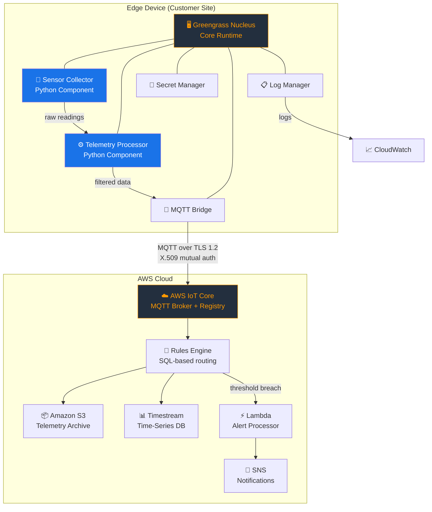
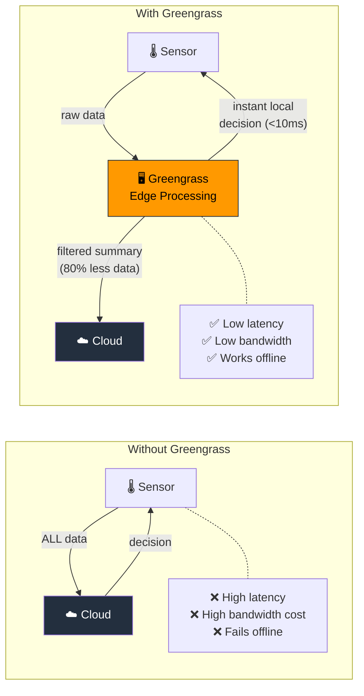
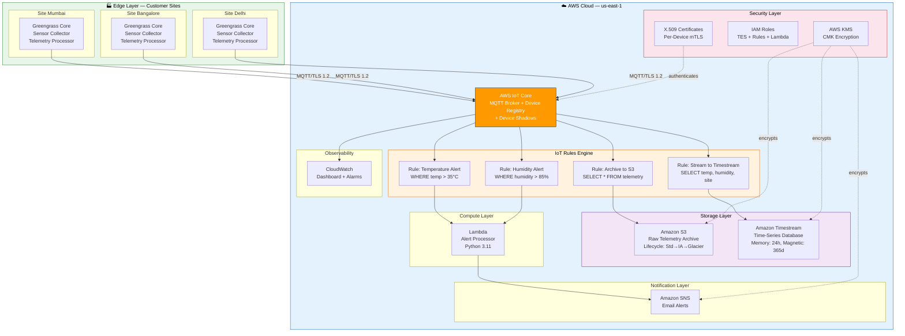
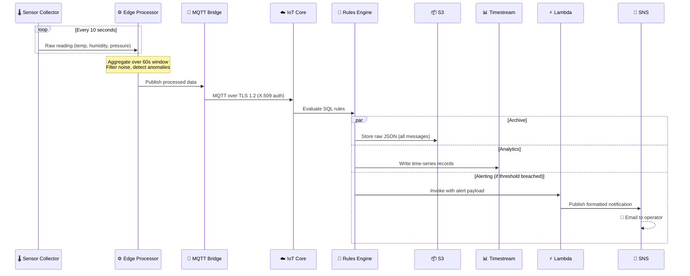
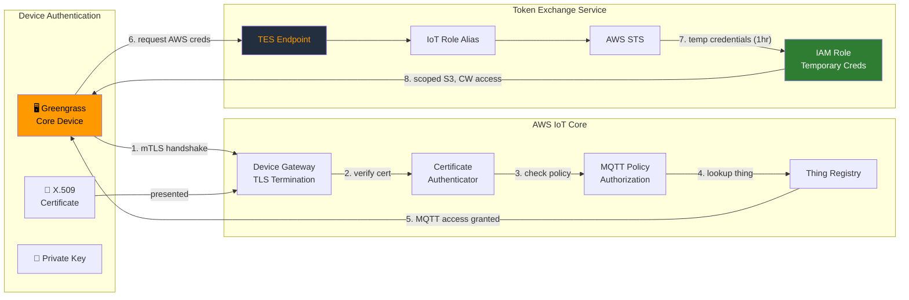

# AWS IoT Greengrass v2 — Enterprise PoC

> **Production-grade IoT edge connectivity using AWS IoT Core and Greengrass v2, featuring device security (X.509 certificates, IAM roles, MQTT policies) and telemetry flows between customer sites.**

[](https://terraform.io)
[](https://aws.amazon.com/greengrass/)
[](https://python.org)
[](LICENSE)

**Author:** Pushparaj Naik

---

## 📋 Table of Contents

- [What is AWS IoT Greengrass?](#what-is-aws-iot-greengrass)
- [Why IoT Greengrass Matters](#why-iot-greengrass-matters)
- [Key Benefits](#key-benefits-of-iot-greengrass)
- [Overview](#overview)
- [Architecture](#architecture)
- [Key Features](#key-features)
- [Project Structure](#project-structure)
- [Prerequisites](#prerequisites)
- [Quick Start](#quick-start)
- [Terraform Modules](#terraform-modules)
- [Greengrass Components](#greengrass-components)
- [Security Model](#security-model)
- [Monitoring &amp; Alerting](#monitoring--alerting)
- [Well-Architected Framework Alignment](#well-architected-framework-alignment)
- [Documentation](#documentation)

---

## What is AWS IoT Greengrass?

**AWS IoT Greengrass** is an open-source edge runtime and cloud service that enables you to build, deploy, and manage intelligent IoT applications on edge devices. It extends AWS cloud capabilities to local devices, allowing them to **act locally on the data they generate** while still using the cloud for management, analytics, and durable storage.

### The Problem It Solves

In traditional IoT architectures, **every piece of sensor data** must travel from the device → internet → cloud for processing. This creates critical challenges:

| Challenge                | Without Greengrass                               | With Greengrass                                        |
| ------------------------ | ------------------------------------------------ | ------------------------------------------------------ |
| **Latency**        | 100-500ms round-trip to cloud for every decision | <10ms local processing — decisions happen at the edge |
| **Connectivity**   | System fails when internet goes down             | Continues operating offline; syncs when reconnected    |
| **Bandwidth Cost** | All raw data transmitted to cloud ($$$)        | Only aggregated/filtered data sent (80-90% reduction)  |
| **Data Privacy**   | Sensitive data leaves the facility               | Data processed locally; only summaries leave the edge  |
| **Scale**          | Cloud must handle millions of messages/second    | Edge absorbs bulk processing; cloud handles analytics  |

### How It Works



### IoT Core vs IoT Greengrass — What's the Difference?

| Aspect                    | AWS IoT Core                                       | AWS IoT Greengrass                                            |
| ------------------------- | -------------------------------------------------- | ------------------------------------------------------------- |
| **Where it runs**   | AWS Cloud only                                     | Edge device + AWS Cloud                                       |
| **Purpose**         | Managed MQTT broker, device registry, rules engine | Edge runtime for local compute, ML inference, data processing |
| **Processing**      | Cloud-side only (Rules Engine, Lambda)             | **Local processing at the edge** + cloud integration    |
| **Offline support** | ❌ Requires internet                               | ✅ Continues operating without connectivity                   |
| **Components**      | Things, Certificates, Policies, Rules              | Nucleus + modular components (custom code, ML models, Lambda) |
| **Data handling**   | All data goes to cloud                             | Filter/aggregate at edge → send only what matters            |
| **Use together?**   | ✅ Greengrass uses IoT Core for cloud connectivity | ✅ IoT Core is the cloud "hub" for Greengrass edge devices    |

> **Key Insight:** IoT Core and Greengrass are **complementary**, not competing. IoT Core is the cloud backbone; Greengrass is the edge intelligence layer. This PoC uses **both together**.

---

## Why IoT Greengrass Matters

### 1. 🏭 Real-World Use Cases

| Industry                | Use Case                                        | How Greengrass Helps                                                           |
| ----------------------- | ----------------------------------------------- | ------------------------------------------------------------------------------ |
| **Manufacturing** | Predictive maintenance on factory equipment     | ML models run at the edge; detect anomalies in real-time without cloud latency |
| **Energy**        | Wind turbine telemetry across remote sites      | Operates offline; buffers data during connectivity loss                        |
| **Healthcare**    | Medical device monitoring in hospitals          | Sensitive patient data processed locally (HIPAA compliance)                    |
| **Agriculture**   | Smart irrigation across distributed farms       | Low-bandwidth sites only send aggregated daily summaries                       |
| **Retail**        | Smart store sensors (temperature, foot traffic) | Local alerting for perishable goods; cloud for trend analysis                  |

### 2. 🔌 The Edge Computing Advantage



---

## Key Benefits of IoT Greengrass

| #  | Benefit                           | Description                                                                 | Impact                                                                      |
| -- | --------------------------------- | --------------------------------------------------------------------------- | --------------------------------------------------------------------------- |
| 1  | **Local Processing**        | Run Python/Java/Node.js code directly on edge devices                       | Process data where it's generated — no cloud round-trip                    |
| 2  | **Offline Operation**       | Greengrass Nucleus includes disk spooler for message buffering              | Devices survive internet outages; data syncs when reconnected               |
| 3  | **Reduced Data Transfer**   | Edge aggregation and filtering before cloud upload                          | **80-90% bandwidth cost reduction**                                   |
| 4  | **Low-Latency Decisions**   | Local ML inference and rule evaluation                                      | Sub-10ms response time vs 100-500ms cloud round-trip                        |
| 5  | **Secure by Default**       | X.509 certificates, TES for temporary AWS credentials, no hardcoded secrets | Zero-trust security model from device to cloud                              |
| 6  | **Fleet Management**        | Deploy and update components across thousands of devices via Thing Groups   | OTA (Over-The-Air) updates without physical access                          |
| 7  | **AWS Service Integration** | Components can access S3, DynamoDB, SageMaker, Secrets Manager              | Edge devices get scoped AWS access via Token Exchange Service               |
| 8  | **Open Source**             | Greengrass Nucleus is open-source (Apache 2.0 license)                      | Inspect, modify, and contribute to the core runtime                         |
| 9  | **ML at the Edge**          | Run SageMaker Neo-compiled models on Greengrass                             | Real-time inference (image classification, anomaly detection) without cloud |
| 10 | **Modular Architecture**    | Component-based design — add/remove capabilities without rebuilding        | Deploy only what each device needs                                          |

### Cost Savings Example

```
Without Edge Processing (100 sensors, 1 msg/sec each):
  → 100 × 86,400 msgs/day = 8.64M msgs/day to cloud
  → IoT Core: ~$8.64/day = ~$259/month
  → S3 storage: ~$50/month
  → Total: ~$309/month

With Greengrass Edge Aggregation (60-second windows):
  → 100 × 1,440 aggregated msgs/day = 144K msgs/day to cloud
  → IoT Core: ~$0.14/day = ~$4.32/month
  → S3 storage: ~$1/month
  → Total: ~$5.32/month

  💰 Savings: ~$304/month (98% reduction)
```

---

## Overview

This project demonstrates a **production-grade IoT architecture** using AWS IoT Core and Greengrass v2, designed for enterprise environments with multiple customer sites. It implements:

- **Edge Computing** — Greengrass v2 components for local sensor data collection and processing
- **Secure Connectivity** — X.509 certificate-based mutual TLS authentication with least-privilege MQTT policies
- **Telemetry Pipeline** — MQTT → IoT Rules Engine → S3 (archive) + Timestream (analytics) + Lambda (alerting)
- **Fleet Management** — Thing Groups for multi-site device management and coordinated deployments
- **Infrastructure as Code** — 100% Terraform with modular, reusable architecture

---

## Architecture

### High-Level Architecture



### Telemetry Data Flow



### Device Security Flow



---

## Key Features

| Feature                       | Implementation                                                        |
| ----------------------------- | --------------------------------------------------------------------- |
| **Device Identity**     | X.509 certificates per device, IoT Thing Registry                     |
| **Secure Transport**    | Mutual TLS (mTLS) with ATS endpoint                                   |
| **MQTT Policies**       | Least-privilege — devices can only publish to their own topics       |
| **Edge Processing**     | Greengrass components aggregate data, reducing cloud transfer by ~80% |
| **Telemetry Archive**   | S3 with lifecycle (Standard → IA → Glacier → Expire)               |
| **Real-time Analytics** | Amazon Timestream for time-series queries                             |
| **Threshold Alerting**  | IoT Rules Engine → Lambda → SNS                                     |
| **Fleet Management**    | Thing Groups + Greengrass fleet deployments                           |
| **Encryption**          | KMS encryption for S3, Timestream, CloudWatch Logs, SNS               |
| **Monitoring**          | CloudWatch dashboard, alarms, structured logging                      |
| **IaC**                 | 7 Terraform modules, remote state, DynamoDB locking                   |
| **CI/CD**               | GitHub Actions — validate, scan, plan, apply                         |

---

## Project Structure

```
IOT_LemonGrass/
├── README.md                          # This file
├── .gitignore
├── docs/
│   ├── architecture.md                # Architecture deep-dive
│   ├── security.md                    # Security model documentation
│   ├── deployment-guide.md            # Step-by-step deployment
│   └── well-architected-review.md     # WAF alignment
├── terraform/
│   ├── main.tf                        # Root module (7 module composition)
│   ├── variables.tf                   # Input variables
│   ├── outputs.tf                     # Output values
│   ├── backend.tf                     # S3 remote state
│   ├── provider.tf                    # AWS + TLS providers
│   ├── modules/
│   │   ├── iot_core/                  # Things, Certs, Policies, Groups
│   │   ├── iot_greengrass/            # TES Role Alias, Deployments
│   │   ├── iot_rules/                 # Rules Engine + Actions
│   │   ├── storage/                   # S3 + Timestream
│   │   ├── lambda/                    # Alert Processor
│   │   ├── monitoring/                # CloudWatch + SNS
│   │   └── iam/                       # IAM Roles, KMS
│   └── environments/
│       ├── dev.tfvars
│       └── prod.tfvars
├── components/                        # Greengrass v2 components
│   ├── sensor_collector/              # Sensor data generator
│   └── telemetry_processor/           # Edge data processing
├── lambda/                            # Cloud Lambda functions
│   └── alert_processor/
├── scripts/                           # Deployment scripts
│   ├── setup_greengrass_device.sh
│   └── simulate_telemetry.py
└── .github/workflows/deploy.yml       # CI/CD pipeline
```

---

## Prerequisites

- **AWS CLI** v2 configured with appropriate credentials
- **Terraform** >= 1.5.0
- **Python** >= 3.11
- **S3 Bucket** for Terraform remote state (`iot-greengrass-terraform-state`)
- **DynamoDB Table** for state locking (`terraform-lock`)

---

## Quick Start

### 1. Clone and Configure

```bash
cd IOT_LemonGrass/terraform

# Review and customize variables
cp environments/dev.tfvars terraform.tfvars
# Edit terraform.tfvars with your email for alerts
```

### 2. Initialize and Deploy

```bash
terraform init
terraform plan -var-file=environments/dev.tfvars
terraform apply -var-file=environments/dev.tfvars
```

### 3. Test Telemetry

```bash
# Get the IoT endpoint from terraform output
IOT_ENDPOINT=$(terraform output -raw iot_endpoint)

# Simulate telemetry (dry-run mode)
python scripts/simulate_telemetry.py \
  --endpoint $IOT_ENDPOINT \
  --cert modules/iot_core/certs/site-mumbai-certificate.pem \
  --key modules/iot_core/certs/site-mumbai-private.key \
  --site site-mumbai \
  --count 50
```

### 4. Verify

- Check **S3** for archived telemetry data
- Check **Timestream** for queryable time-series data
- Check **CloudWatch Dashboard** for IoT metrics
- Check **email** for threshold alerts (if configured)

---

## Terraform Modules

| Module             | Resources                                                  | Purpose                          |
| ------------------ | ---------------------------------------------------------- | -------------------------------- |
| `iot_core`       | IoT Thing, Certificate, Policy, Thing Group                | Device identity & authentication |
| `iot_greengrass` | Role Alias, TES Policy, CloudWatch Logs                    | Edge runtime configuration       |
| `iot_rules`      | 4 Topic Rules (S3, Timestream, Temp Alert, Humidity Alert) | Telemetry routing & alerting     |
| `storage`        | S3 Bucket, Timestream DB + Table                           | Data storage & archival          |
| `lambda`         | Alert Processor Function                                   | Threshold alert processing       |
| `monitoring`     | SNS Topic, CloudWatch Dashboard, Alarms                    | Observability & notifications    |
| `iam`            | TES Role, Rules Role, Lambda Role, KMS Key                 | Security & encryption            |

---

## Greengrass Components

### Sensor Collector (`com.iotgreengrass.SensorCollector`)

- Simulates temperature, humidity, pressure readings
- Publishes to `dt/iot-greengrass/{site}/telemetry` via MQTT
- Configurable publish interval and sensor baselines

### Telemetry Processor (`com.iotgreengrass.TelemetryProcessor`)

- Edge-side aggregation over configurable time windows
- Local anomaly detection (temperature/humidity thresholds)
- Reduces cloud data transfer by publishing aggregates

---

## Security Model

See [docs/security.md](docs/security.md) for the complete security model.

**Key Security Controls:**

- ✅ X.509 certificate-based device authentication (mTLS)
- ✅ Least-privilege MQTT policies (devices restricted to own topics)
- ✅ Token Exchange Service for temporary AWS credentials
- ✅ KMS encryption for all data at rest
- ✅ TLS 1.2+ for all data in transit
- ✅ No hardcoded credentials — TES + IAM roles only
- ✅ S3 public access blocked, versioning enabled
- ✅ CloudTrail logging for all API calls

---

## Monitoring & Alerting

### CloudWatch Dashboard

- IoT messages published (success/failure)
- Rule action execution metrics
- Lambda invocations and errors
- Connected device count

### Alarms

- IoT Rule action failures > 5 in 10 minutes
- Lambda error rate threshold
- SNS notification on all alarms

---

## Well-Architected Framework Alignment

See [docs/well-architected-review.md](docs/well-architected-review.md) for the detailed review.

| Pillar                           | Score      | Key Implementation                             |
| -------------------------------- | ---------- | ---------------------------------------------- |
| **Operational Excellence** | ⭐⭐⭐⭐   | Terraform IaC, CI/CD, CloudWatch dashboards    |
| **Security**               | ⭐⭐⭐⭐⭐ | mTLS, least-privilege, KMS, no hardcoded creds |
| **Reliability**            | ⭐⭐⭐⭐   | QoS 1 MQTT, error actions, multi-AZ Timestream |
| **Performance**            | ⭐⭐⭐⭐   | Edge processing, Timestream for time-series    |
| **Cost Optimization**      | ⭐⭐⭐⭐   | S3 lifecycle, edge filtering, dev/prod configs |
| **Sustainability**         | ⭐⭐⭐⭐   | Edge processing reduces cloud compute          |

---

## Documentation

| Document                                                | Description                                               |
| ------------------------------------------------------- | --------------------------------------------------------- |
| [Architecture](docs/architecture.md)                       | Detailed architecture, data flows, component interactions |
| [Security](docs/security.md)                               | Security controls, certificate management, IAM model      |
| [Deployment Guide](docs/deployment-guide.md)               | Step-by-step deployment instructions                      |
| [Well-Architected Review](docs/well-architected-review.md) | AWS WAF alignment analysis                                |

---

## License

MIT License — Pushparaj Naik
