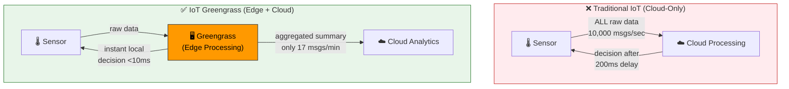
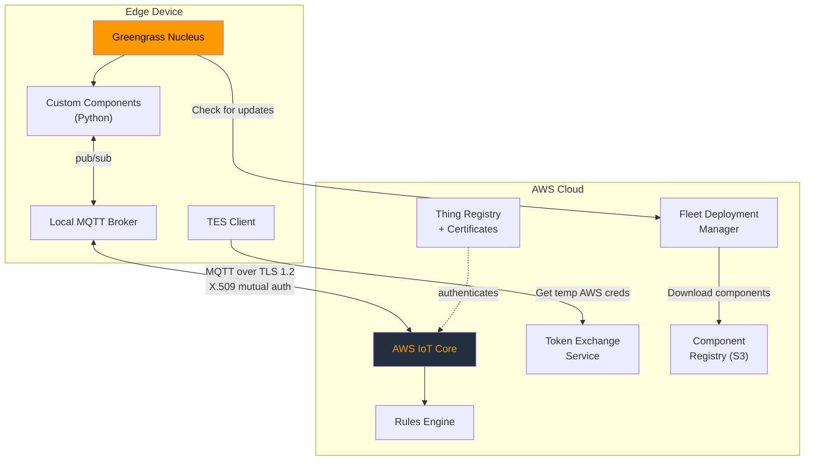
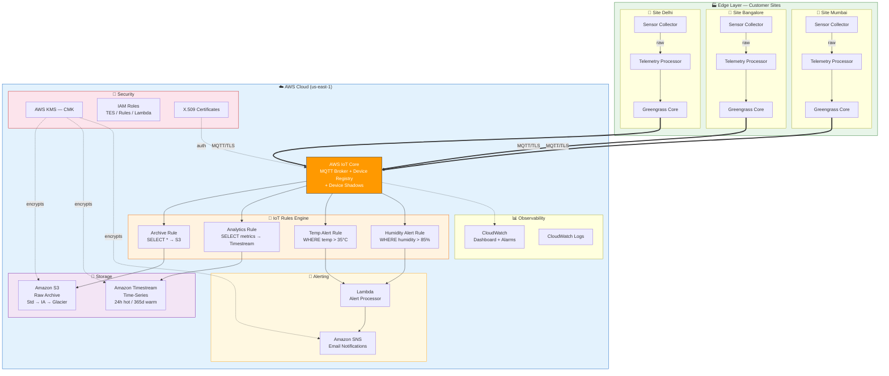
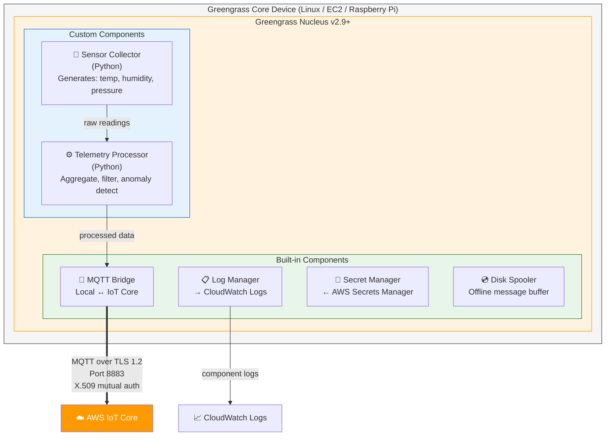
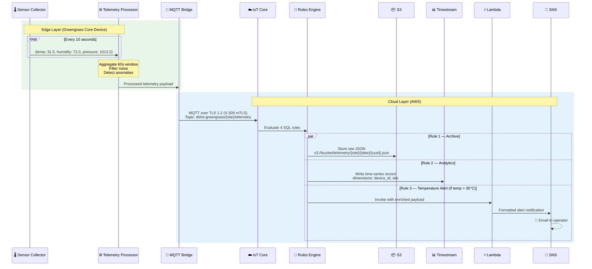
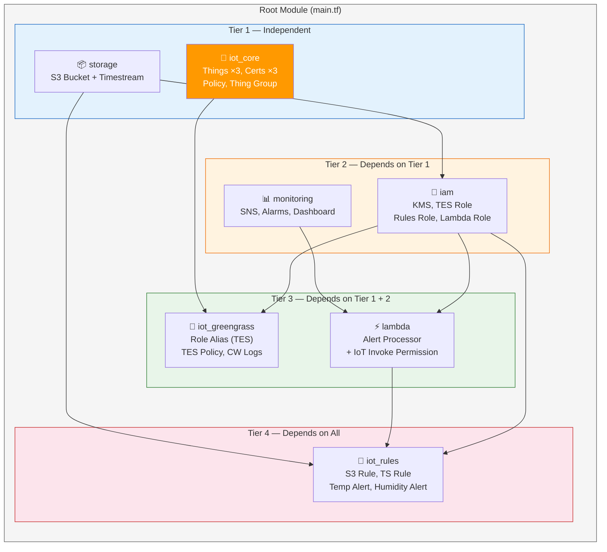
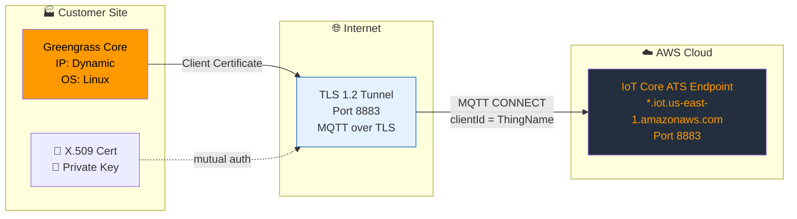

# Architecture — AWS IoT Greengrass v2 PoC

**Author:** Pushparaj Naik  
**Date:** May 2026  
**Version:** 1.0

---

## 1. What is AWS IoT Greengrass?

**AWS IoT Greengrass** is an open-source **edge runtime and cloud service** from AWS that brings cloud intelligence to edge devices. It allows IoT devices to collect, process, and act on data **locally** — at the point of generation — while seamlessly integrating with AWS cloud services for management, analytics, and long-term storage.

### Why Does It Exist?

Traditional IoT architectures require **every data point** to travel to the cloud for processing. This is problematic for three fundamental reasons:

1. **Latency** — A temperature sensor detecting a fire can't wait 200ms for a cloud round-trip to trigger a sprinkler
2. **Connectivity** — Remote sites (oil rigs, wind farms, rural factories) have unreliable internet
3. **Cost** — Sending 10,000 sensor readings/second to the cloud is prohibitively expensive

**IoT Greengrass solves all three** by running application logic directly on the edge device:



### Key Components of IoT Greengrass v2

| Component | Purpose | Where It Runs |
|-----------|---------|---------------|
| **Greengrass Nucleus** | Core runtime — manages component lifecycle, IPC, deployments | Edge device |
| **Custom Components** | Your application code (Python, Java, Node.js) | Edge device |
| **MQTT Bridge** | Routes messages between local MQTT and AWS IoT Core | Edge device |
| **Log Manager** | Uploads component logs to CloudWatch | Edge device |
| **Secret Manager** | Securely provides secrets from AWS Secrets Manager | Edge device |
| **Token Exchange Service** | Provides temporary AWS credentials to components | Edge device → Cloud |
| **IoT Core** | Managed MQTT broker, device registry, rules engine | Cloud |
| **Component Registry** | Stores component recipes and artifacts | Cloud |
| **Fleet Deployments** | Manages software deployments to device groups | Cloud |

### How IoT Core and Greengrass Work Together



> **Summary:** IoT Core handles cloud-side device management, authentication, and data routing. Greengrass handles edge-side processing, offline resilience, and local intelligence. They are **complementary services** that form a complete IoT platform.

---

## 2. Architecture Overview

This architecture implements a **hub-and-spoke IoT model** where edge devices at customer sites (spokes) securely publish telemetry data to AWS IoT Core (hub). The data flows through a serverless processing pipeline for storage, analytics, and alerting.

### Design Principles
- **Edge-first processing** — Filter and aggregate at the edge, not in the cloud
- **Security by design** — Zero-trust model with per-device certificates and least-privilege policies
- **Serverless backend** — No servers to manage; IoT Rules + Lambda + managed databases
- **Infrastructure as Code** — Every resource defined in Terraform, no ClickOps

---

## 3. Component Architecture

### 3.1 End-to-End Architecture



### 3.2 Edge Device Architecture



---

## 4. Data Flow

### 4.1 Telemetry Ingestion Flow



### 3.2 MQTT Topic Hierarchy

```
dt/iot-greengrass/
├── site-mumbai/
│   ├── telemetry          ← Raw sensor readings (published by device)
│   ├── aggregate          ← Aggregated data (published by edge processor)
│   ├── alert              ← Local anomaly alerts
│   └── command            ← Commands from cloud (subscribed by device)
├── site-bangalore/
│   ├── telemetry
│   ├── aggregate
│   ├── alert
│   └── command
└── site-delhi/
    ├── telemetry
    ├── aggregate
    ├── alert
    └── command
```

**Topic Naming Convention:** `dt/{project}/{site}/{type}`
- `dt` = data/telemetry prefix (AWS best practice)
- `{project}` = project name for namespace isolation
- `{site}` = customer site identifier
- `{type}` = message type (telemetry, aggregate, alert, command)

---

## 5. Terraform Module Architecture



---

## 6. Network Architecture

### 6.1 Connectivity Model



- **Protocol:** MQTT over TLS 1.2 (port 8883)
- **Authentication:** X.509 mutual TLS (certificate-based, no passwords)
- **Endpoint:** ATS (Amazon Trust Services) endpoint for improved certificate management
- **QoS:** Level 1 (At Least Once) — ensures message delivery

---

## 7. Scalability Considerations

| Dimension | Current PoC | Production Scale |
|-----------|-------------|-----------------|
| **Sites** | 3 (Mumbai, Bangalore, Delhi) | 100+ sites via fleet provisioning |
| **Devices per site** | 1 Greengrass Core | Multiple cores + client devices |
| **Message rate** | 6 msgs/min/device | Up to 100 msgs/sec/device |
| **Storage** | S3 + Timestream | Add Kinesis for high-throughput buffering |
| **Processing** | Lambda (async) | Step Functions for complex workflows |

### Scaling Path
1. **Fleet Provisioning** — Replace manual cert creation with `aws_iot_provisioning_template`
2. **Kinesis Data Streams** — Buffer high-volume telemetry before S3/Timestream
3. **IoT Analytics** — Advanced analytics pipeline for ML model training
4. **IoT SiteWise** — Industrial equipment monitoring with asset modeling

---

## 8. Cost Estimation (Dev Environment)

| Service | Monthly Cost (approx.) |
|---------|----------------------|
| IoT Core (3 devices, 6 msgs/min) | ~$0.50 |
| Timestream (6h memory, 30d magnetic) | ~$5.00 |
| S3 (< 1 GB telemetry/month) | ~$0.10 |
| Lambda (< 1000 invocations/month) | ~$0.00 (free tier) |
| CloudWatch (dashboard + logs) | ~$3.00 |
| SNS (email notifications) | ~$0.00 (free tier) |
| KMS (1 key) | $1.00 |
| **Total** | **~$9.60/month** |
