# Production Architecture — DevSecOps Pipeline

## Table of Contents

1. [System Overview](#1-system-overview)
2. [End-to-End Pipeline](#2-end-to-end-pipeline)
3. [AWS Infrastructure](#3-aws-infrastructure-layout)
4. [Network Topology](#4-network-topology)
5. [CI Pipeline Detail](#5-ci-pipeline---12-stage-detail)
6. [CD Pipeline &amp; GitOps](#6-cd-pipeline--gitops-flow)
7. [Security Architecture](#7-security-architecture---defense-in-depth)
8. [Cognito Authentication](#8-cognito-authentication-flow)
9. [Request Traffic Flow](#9-request-traffic-flow---edge-to-pod)
10. [VPC Endpoint Connectivity](#10-vpc-endpoint-connectivity)
11. [Terraform Dependency Graph](#11-terraform-resource-dependency-graph)
12. [Component Summary](#12-component-summary)

---

## 1. System Overview

This production-grade DevSecOps pipeline automates the entire software delivery lifecycle:

- **Source**: GitHub repository
- **CI**: GitHub Actions (build, test, SAST, SCA, container scan, ECR push)
- **CD**: GitHub Actions (update manifest) then ArgoCD (deploy to EKS)
- **Runtime**: Private EKS cluster behind ALB + WAF + API Gateway + Cognito
- **Auth**: GitHub OIDC (keyless CI/CD) + Cognito JWT (user auth)
- **Infrastructure**: 100% Terraform-managed

---

## 2. End-to-End Pipeline

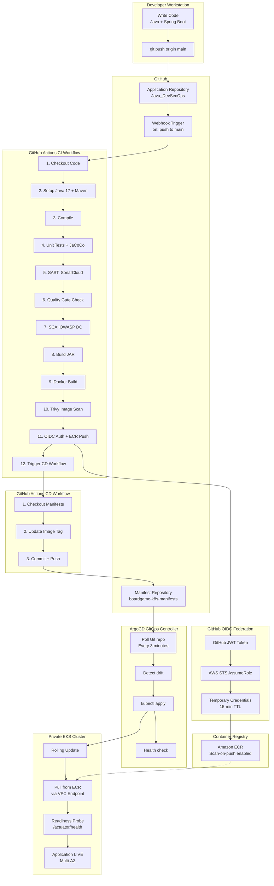

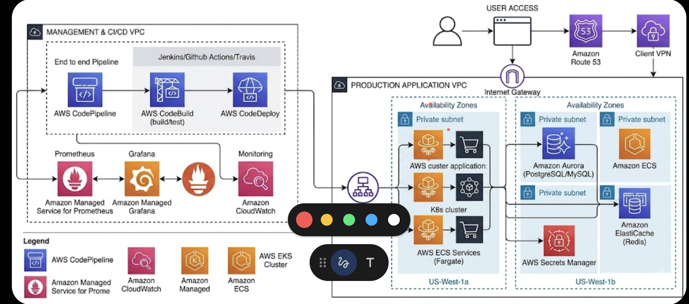

---

## 3. AWS Infrastructure Layout

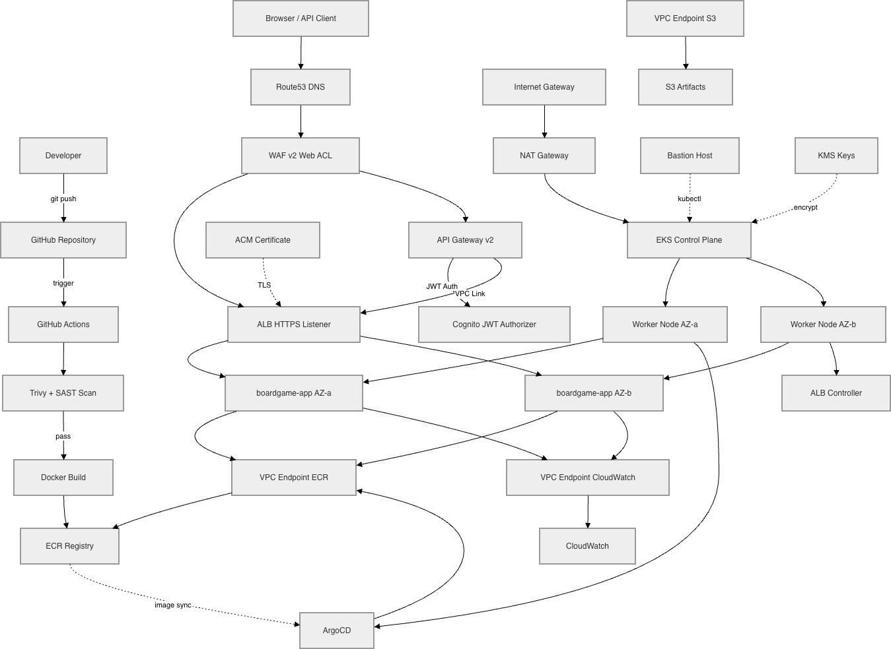

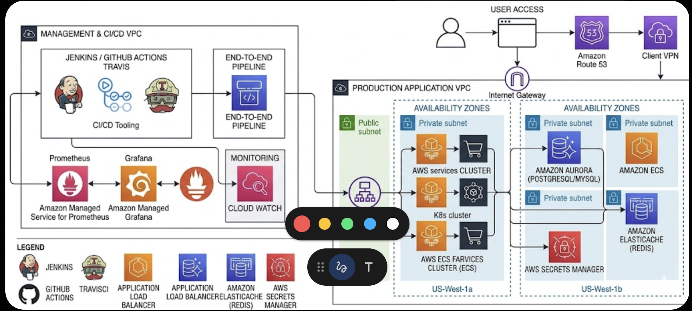

---

## 4. Network Topology

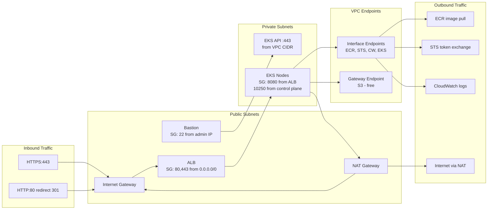

---

## 5. CI Pipeline — 12-Stage Detail

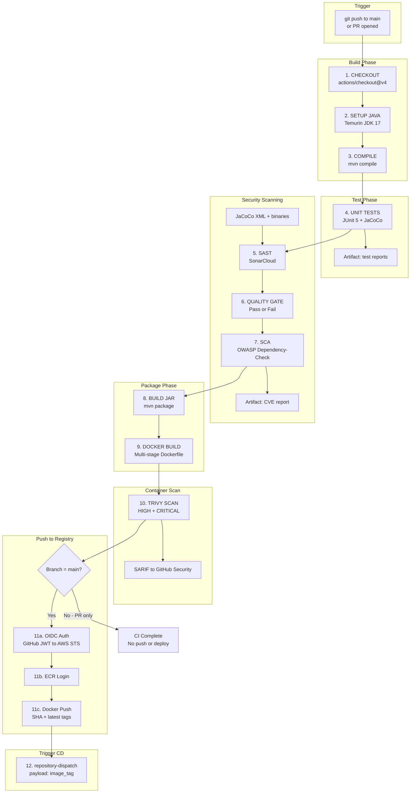

---

## 6. CD Pipeline & GitOps Flow

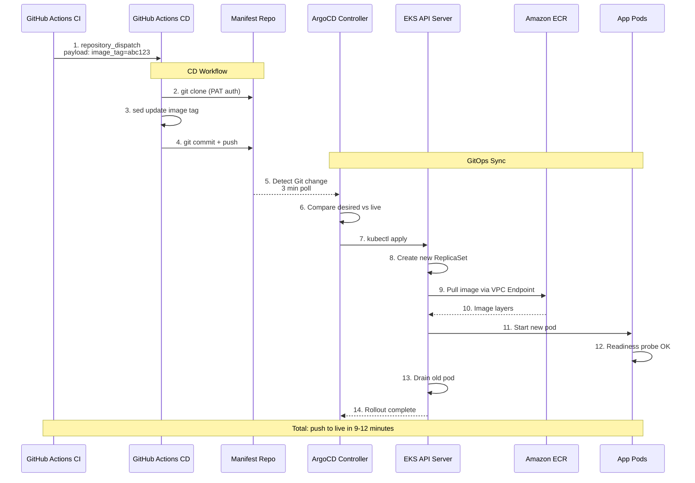

---

## 7. Security Architecture — Defense in Depth

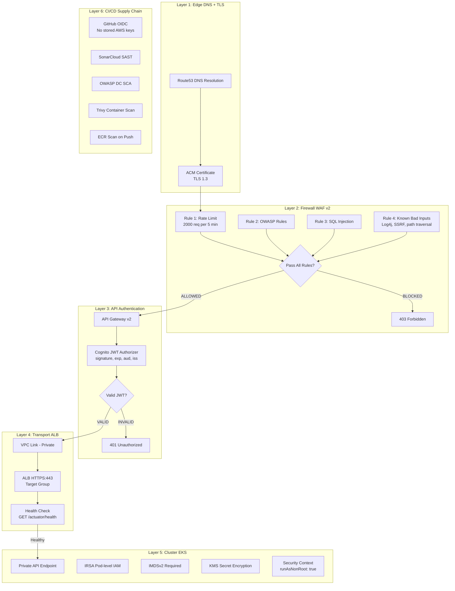

---

## 8. Cognito Authentication Flow

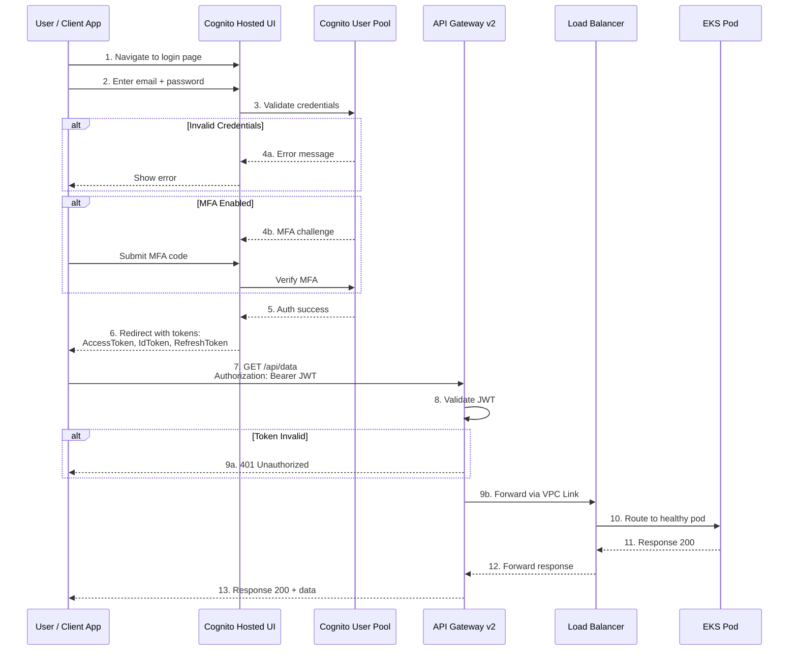

---

## 9. Request Traffic Flow — Edge to Pod

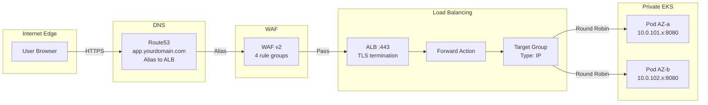

---

## 10. VPC Endpoint Connectivity

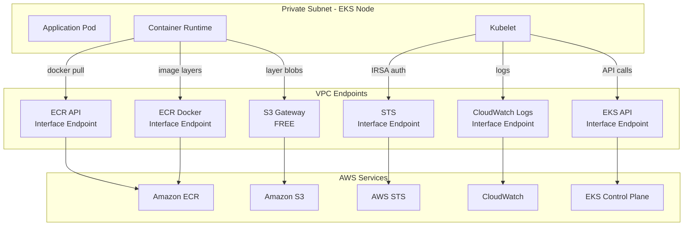

---

## 11. Terraform Resource Dependency Graph

```mermaid
graph TB
    VPC_T["aws_vpc"]
    PUB_SUB["aws_subnet.public x3"]
    PRIV_SUB["aws_subnet.private x3"]
    IGW_T["aws_internet_gateway"]
    NAT_T["aws_nat_gateway"]
    VPCE_T["aws_vpc_endpoint x6"]
    SG_BASTION["sg: bastion"]
    SG_ALB["sg: alb"]
    SG_EKS_C["sg: eks_cluster"]
    SG_EKS_N["sg: eks_nodes"]
    KMS_T["aws_kms_key"]
    IAM_CLUSTER["iam: eks_cluster"]
    IAM_NODES["iam: eks_nodes"]
    EKS_T["aws_eks_cluster"]
    EKS_NG["aws_eks_node_group"]
    OIDC_P["iam_oidc: eks"]
    IAM_LBC["iam: alb_controller"]
    HELM_LBC["helm: aws_lb_controller"]
    HELM_ARGO["helm: argocd"]
    ALB_T["aws_lb"]
    ALB_TG["aws_lb_target_group"]
    ALB_LIS["aws_lb_listener"]
    WAF_T["aws_wafv2_web_acl"]
    WAF_ASSOC["waf_association"]
    R53_Z["aws_route53_zone"]
    ACM_T["aws_acm_certificate"]
    R53_REC["aws_route53_record"]
    COG_T["cognito_user_pool"]
    COG_C["cognito_client"]
    APIGW_T["apigatewayv2_api"]
    APIGW_VL["apigatewayv2_vpc_link"]
    APIGW_AUTH["apigatewayv2_authorizer"]
    ECR_T["aws_ecr_repository"]
    GH_OIDC["iam_oidc: github"]
    GH_ROLE["iam: github_actions"]
    BASTION_T["aws_instance: bastion"]

    VPC_T --> PUB_SUB
    VPC_T --> PRIV_SUB
    VPC_T --> IGW_T
    PUB_SUB --> NAT_T
    VPC_T --> VPCE_T
    VPC_T --> SG_BASTION --> BASTION_T
    VPC_T --> SG_ALB --> ALB_T
    VPC_T --> SG_EKS_C
    VPC_T --> SG_EKS_N
    IAM_CLUSTER --> EKS_T
    SG_EKS_C --> EKS_T
    PRIV_SUB --> EKS_T
    KMS_T --> EKS_T
    EKS_T --> EKS_NG
    IAM_NODES --> EKS_NG
    SG_EKS_N --> EKS_NG
    EKS_T --> OIDC_P --> IAM_LBC --> HELM_LBC
    EKS_T --> HELM_ARGO
    PUB_SUB --> ALB_T --> ALB_TG --> ALB_LIS
    ACM_T --> ALB_LIS
    WAF_T --> WAF_ASSOC
    ALB_T --> WAF_ASSOC
    R53_Z --> ACM_T
    R53_Z --> R53_REC
    ALB_T --> APIGW_VL --> APIGW_T
    COG_T --> COG_C
    COG_T --> APIGW_AUTH --> APIGW_T
    ECR_T --> GH_ROLE
    GH_OIDC --> GH_ROLE
```

---

## 12. Component Summary

| Category        | Component       | Technology     | Key Details                   |
| :-------------- | :-------------- | :------------- | :---------------------------- |
| **CI**    | Build & Test    | GitHub Actions | Java 17, Maven, JaCoCo        |
| **CI**    | SAST            | SonarCloud     | Bugs, vulns, smells, coverage |
| **CI**    | SCA             | OWASP DC       | NVD CVE database              |
| **CI**    | Container Scan  | Trivy          | HIGH + CRITICAL               |
| **CI**    | Registry Push   | ECR            | OIDC auth, scan-on-push       |
| **CI**    | AWS Auth        | GitHub OIDC    | Keyless, 15-min temp creds    |
| **CD**    | Manifest Update | GitHub Actions | sed image tag, git push       |
| **CD**    | Deployment      | ArgoCD         | Auto-sync, self-heal, prune   |
| **Infra** | Compute         | EKS private    | Multi-AZ, KMS, IMDSv2         |
| **Infra** | Networking      | VPC            | 3 pub + 3 priv + 6 VPC EP     |
| **Infra** | Load Balancing  | ALB            | HTTPS, health checks          |
| **Infra** | Firewall        | WAF v2         | OWASP + SQLi + rate limit     |
| **Infra** | API             | API Gateway v2 | VPC Link, throttling          |
| **Infra** | DNS             | Route53        | ACM wildcard cert             |
| **Infra** | Auth            | Cognito        | JWT, MFA, hosted UI           |
| **Infra** | Registry        | ECR            | Lifecycle, scan-on-push       |
| **Infra** | IaC             | Terraform      | ~60 resources                 |
| **Infra** | Admin           | Bastion EC2    | t3.micro, kubectl             |

---

## Monthly Cost: ~$235 (GitHub Actions + SonarCloud = Free)
