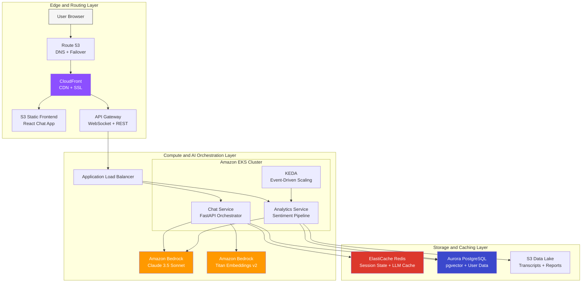
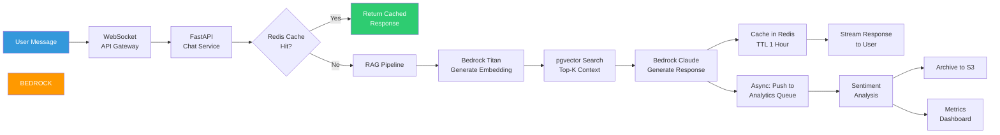
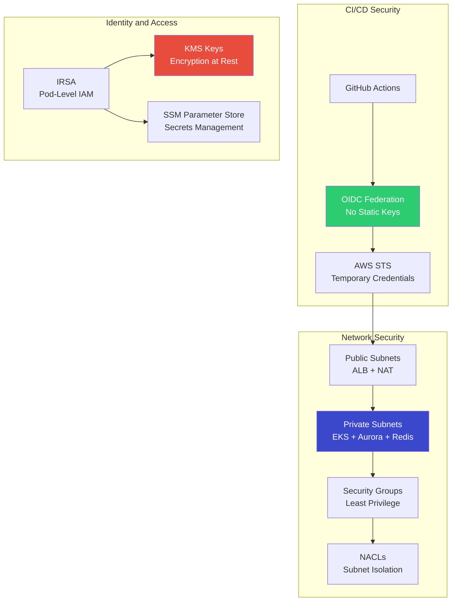

# 🤖 OmniPresenseAI — Omnichannel AI-Powered Customer Support & Analytics Platform

> **Next-gen, self-healing customer service system** — Generative AI answers customer queries via real-time WebSocket chat, routes complex issues to human agents via EKS, and runs real-time sentiment analytics on conversations.

[](https://www.terraform.io/)
[](https://www.python.org/)
[](https://aws.amazon.com/)
[](LICENSE)
[](.github/workflows/)

---

## 📋 Table of Contents

- [Overview](#overview)
- [Architecture](#architecture)
- [Tech Stack](#tech-stack)
- [Project Structure](#project-structure)
- [Quick Start](#quick-start)
- [Terraform Modules](#terraform-modules)
- [Microservices](#microservices)
- [Kubernetes](#kubernetes)
- [CI/CD Pipeline](#cicd-pipeline)
- [Cost Estimation](#cost-estimation)
- [Documentation](#documentation)
- [License](#license)

---

## Overview

This platform implements an **enterprise-grade AI customer support system** with three core capabilities:

| Capability | How It Works |
|-----------|--------------|
| **AI Chat** | WebSocket-based real-time chat powered by Amazon Bedrock (Claude 3.5 Sonnet) with RAG context from pgvector |
| **Human Escalation** | Automatic routing to human agents when AI confidence is low or customer sentiment turns negative |
| **Sentiment Analytics** | Async analysis pipeline scoring every conversation for sentiment, topics, and CSAT proxy metrics |

### Key Differentiators

| Feature | This Platform | Typical Solutions |
|---------|--------------|-------------------|
| **LLM Cost Optimization** | Redis cache layer saves ~40% Bedrock API costs | Direct API calls every time |
| **Zero Static Credentials** | GitHub OIDC + IRSA — no AWS keys anywhere | IAM users with long-lived keys |
| **Vector Database** | pgvector in Aurora (no extra service) | Separate OpenSearch/Pinecone |
| **Event-Driven Scaling** | KEDA scales on Redis queue depth | CPU-only HPA |
| **Infrastructure** | 100% Terraform with modular design | Manual console or partial IaC |

---

## Architecture

### High-Level System Architecture



### Data Flow — Chat Request Lifecycle



### Security Architecture



---

## Tech Stack

| Layer | Technology | Purpose |
|-------|-----------|---------|
| **Frontend** | React 18 + Vite | WebSocket chat widget |
| **API** | AWS API Gateway (WebSocket + REST) | Traffic management, throttling |
| **Compute** | Amazon EKS (Kubernetes 1.29+) | Microservice orchestration |
| **AI/LLM** | Amazon Bedrock (Claude 3.5 Sonnet) | Conversational AI responses |
| **Embeddings** | Amazon Bedrock (Titan Embeddings v2) | RAG vector generation |
| **Vector DB** | Aurora PostgreSQL + pgvector | Knowledge base retrieval |
| **Cache** | ElastiCache for Redis 7.x | Session state + LLM response cache |
| **Storage** | Amazon S3 (+ Glacier lifecycle) | Transcripts, reports, audit logs |
| **CDN** | Amazon CloudFront | Global frontend delivery |
| **DNS** | Route 53 | Domain management, failover |
| **IaC** | Terraform 1.7+ (modular) | Infrastructure as Code |
| **CI/CD** | GitHub Actions + OIDC | Zero-credential deployments |
| **Scaling** | KEDA + HPA | Event-driven + resource autoscaling |
| **Security** | IRSA, KMS, OIDC, private subnets | Defense in depth |

---

## Project Structure

```
OmniPresenseAI/
├── .github/workflows/              # CI/CD pipelines
│   ├── ci.yml                      # Lint, test, security scan
│   ├── cd-infra.yml                # Terraform plan/apply (OIDC)
│   └── cd-app.yml                  # Build → ECR → EKS deploy
├── terraform/
│   ├── envs/                       # Environment configurations
│   │   ├── prod/                   # Production (main.tf, backend.tf, etc.)
│   │   └── staging/                # Staging environment
│   └── modules/                    # Reusable Terraform modules
│       ├── networking/             # VPC, Subnets, NAT, Route53
│       ├── security/               # IAM, OIDC, KMS, Security Groups
│       ├── compute/                # EKS, Node Groups, IRSA, ALB Controller
│       ├── database/               # Aurora PostgreSQL, ElastiCache Redis
│       └── ai_cdn/                 # CloudFront, S3, API Gateway
├── src/
│   ├── chat-service/               # FastAPI — AI Chat Orchestrator
│   │   ├── app/                    # Application code
│   │   ├── tests/                  # Unit tests
│   │   ├── Dockerfile              # Multi-stage container build
│   │   └── requirements.txt
│   └── analytics-service/          # FastAPI — Sentiment Analytics
│       ├── app/                    # Application code
│       ├── tests/                  # Unit tests
│       ├── Dockerfile
│       └── requirements.txt
├── k8s/
│   ├── base/                       # K8s manifests (Deployments, Services, Ingress)
│   └── overlays/                   # Kustomize (prod/staging overrides)
├── docs/                           # Documentation suite
│   ├── architecture.md             # Detailed architecture (Mermaid diagrams)
│   ├── runbook.md                  # Operations runbook (SEV-1 to SEV-4)
│   ├── data-flow.md                # Request lifecycle documentation
│   ├── security.md                 # Security architecture
│   ├── cost-estimation.md          # AWS cost breakdown
│   └── adr/                        # Architecture Decision Records
├── scripts/                        # Bootstrap and helper scripts
├── .gitignore
├── LICENSE
└── README.md                       # ← You are here
```

---

## Quick Start

### Prerequisites

- AWS CLI v2 configured with appropriate permissions
- Terraform >= 1.7.0
- kubectl
- Docker
- Python 3.11+

### 1. Bootstrap AWS Account

```bash
# Create S3 backend + ECR repositories
chmod +x scripts/bootstrap.sh
./scripts/bootstrap.sh
```

### 2. Deploy Infrastructure

```bash
cd terraform/envs/prod
cp terraform.tfvars.example terraform.tfvars
# Edit terraform.tfvars with your values

terraform init
terraform plan -out=tfplan
terraform apply tfplan
```

### 3. Deploy Microservices

```bash
# Configure kubectl
./scripts/setup-kubeconfig.sh

# Apply K8s manifests
kubectl apply -k k8s/overlays/prod/
```

### 4. Seed Knowledge Base

```bash
cd scripts
pip install -r ../src/chat-service/requirements.txt
python seed-knowledge-base.py
```

---

## Terraform Modules

| Module | Resources | Key Features |
|--------|-----------|-------------|
| **networking** | VPC, 3 public + 3 private subnets, NAT GW, IGW, Route53 | Multi-AZ, VPC Flow Logs |
| **security** | IAM roles, GitHub OIDC, KMS keys, Security Groups | Zero static credentials |
| **compute** | EKS cluster, managed node groups, IRSA, ALB Controller | m6g.large (Graviton), 2-10 nodes |
| **database** | Aurora PostgreSQL (Serverless v2), ElastiCache Redis | pgvector, encryption at rest |
| **ai_cdn** | CloudFront, S3 (frontend + data), API Gateway | WebSocket + REST, OAC, WAF |

---

## Microservices

### Chat Service (Port 8000)

| Endpoint | Method | Purpose |
|----------|--------|---------|
| `/ws/chat/{session_id}` | WebSocket | Real-time chat with AI |
| `/api/v1/chat` | POST | REST fallback for chat |
| `/api/v1/sessions/{id}/history` | GET | Conversation history |
| `/health` | GET | Liveness probe |
| `/ready` | GET | Readiness probe (DB + Redis) |

### Analytics Service (Port 8001)

| Endpoint | Method | Purpose |
|----------|--------|---------|
| `/api/v1/analytics/sentiment` | POST | Analyze message sentiment |
| `/api/v1/analytics/metrics` | GET | Aggregated CSAT metrics |
| `/api/v1/analytics/transcripts/{id}` | GET | Retrieve archived transcript |
| `/health` | GET | Liveness probe |
| `/ready` | GET | Readiness probe |

---

## Kubernetes

- **Namespace:** `omni-ai` with resource quotas
- **Scaling:** HPA (CPU-based) for chat-service, KEDA (Redis queue) for analytics-service
- **Security:** Non-root containers, read-only rootfs, NetworkPolicies
- **Reliability:** PodDisruptionBudgets, multi-replica deployments
- **Ingress:** AWS ALB with path-based routing

---

## CI/CD Pipeline

```
Push to main
    │
    ├── terraform/** changed?
    │   └── cd-infra.yml: OIDC Auth → Plan → Apply
    │
    └── src/** changed?
        └── cd-app.yml: Build → ECR Push → EKS Deploy
```

All workflows use **GitHub OIDC federation** — zero AWS credentials stored in GitHub.

---

## Cost Estimation

| Service | Monthly Est. | Notes |
|---------|-------------|-------|
| EKS Cluster | $73 | Control plane |
| EC2 (2x m6g.large) | $140 | Graviton nodes |
| Aurora Serverless v2 | $90 | 0.5-4 ACU scaling |
| ElastiCache Redis | $48 | r6g.large single node |
| Bedrock (Claude 3.5) | ~$50-200 | Usage dependent |
| CloudFront + S3 | $15 | Static assets + data |
| API Gateway | $10 | WebSocket + REST |
| NAT Gateway | $32 | Single AZ |
| **Total** | **~$458-608/mo** | Production estimate |

> See [docs/cost-estimation.md](docs/cost-estimation.md) for detailed breakdown and optimization strategies.

---

## Documentation

| Document | Description |
|----------|-------------|
| [Architecture](docs/architecture.md) | Full system architecture with Mermaid diagrams |
| [Operations Runbook](docs/runbook.md) | SEV-1 to SEV-4 incident playbooks, Day-1/Day-2 ops |
| [Data Flow](docs/data-flow.md) | Request lifecycle, RAG pipeline, analytics flow |
| [Security](docs/security.md) | Network, IAM, encryption, compliance mapping |
| [Cost Estimation](docs/cost-estimation.md) | Per-service AWS cost breakdown |
| [ADR-001](docs/adr/001-pgvector-over-opensearch.md) | Why pgvector over OpenSearch |
| [ADR-002](docs/adr/002-keda-over-hpa.md) | Why KEDA over standard HPA |
| [ADR-003](docs/adr/003-bedrock-over-openai.md) | Why Bedrock over OpenAI |

---

## License

MIT License — Built by [Pushparaj Naik](https://github.com/pusnaik2016)
