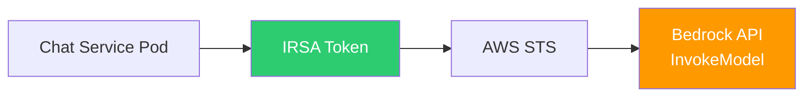

# ADR-003: Amazon Bedrock over OpenAI API

| Field | Value |
|-------|-------|
| **Status** | Accepted |
| **Date** | 2024-01-20 |
| **Decision Makers** | Pushparaj Naik |

---

## Context

OmniPresenseAI requires a large language model (LLM) for two core capabilities:
1. **Conversational AI** — generating customer support responses
2. **Sentiment analysis** — classifying message tone and emotion

Two primary options were evaluated:
1. **OpenAI API** (GPT-4, GPT-3.5 Turbo)
2. **Amazon Bedrock** (Claude 3.5 Sonnet, Titan Embeddings v2)

---

## Decision

We chose **Amazon Bedrock** with **Claude 3.5 Sonnet** for chat and sentiment, and **Titan Embeddings v2** for RAG vector generation.

---

## Rationale

### 1. Security — Data Never Leaves AWS

| Aspect | Bedrock | OpenAI API |
|--------|---------|-----------|
| Data residency | Within AWS account/region | Sent to OpenAI servers |
| Network path | VPC → Bedrock endpoint (private) | VPC → NAT → Internet → OpenAI |
| Authentication | IRSA (pod-level IAM) | API key (static secret) |
| Data usage for training | ❌ Not used | ❌ Not used (Enterprise) |
| SOC 2 / HIPAA | AWS BAA available | OpenAI BAA available |

**Key differentiator:** With Bedrock, customer support conversations never leave our AWS account. The API call travels within the AWS network, authenticated via IRSA with temporary credentials. No API keys to rotate or risk leaking.

### 2. IAM Integration (IRSA)

With Bedrock:
- No API keys to manage, rotate, or store
- Pod-level IAM via IRSA — each pod gets scoped temporary credentials
- Permissions enforced by IAM policy (can restrict to specific models)
- CloudTrail audit logging of every API call

With OpenAI:
- API key stored in secrets manager
- Shared across all pods
- No IAM-level access control
- Separate audit logging needed

### 3. Model Quality — Claude 3.5 Sonnet

At the time of decision, Claude 3.5 Sonnet matched or exceeded GPT-4 on key benchmarks relevant to our use case:

| Benchmark | Claude 3.5 Sonnet | GPT-4 |
|-----------|------------------|-------|
| MMLU | 88.7% | 86.4% |
| HumanEval (coding) | 92.0% | 67.0% |
| Reasoning | Comparable | Comparable |
| Customer support tone | Excellent | Excellent |
| Context window | 200K tokens | 128K tokens |

Claude's longer context window (200K tokens) is particularly useful for RAG — we can include more context documents without truncation.

### 4. Cost Comparison

| Model | Input (per 1M tokens) | Output (per 1M tokens) |
|-------|----------------------|----------------------|
| Claude 3.5 Sonnet | $3.00 | $15.00 |
| GPT-4 Turbo | $10.00 | $30.00 |
| GPT-3.5 Turbo | $0.50 | $1.50 |

Claude 3.5 Sonnet offers GPT-4-level quality at **70% lower cost** than GPT-4 Turbo.

### 5. Embedding Model — Titan v2

| Feature | Titan Embeddings v2 | OpenAI ada-002 |
|---------|---------------------|---------------|
| Dimensions | 1536 | 1536 |
| Cost per 1M tokens | $0.02 | $0.10 |
| AWS native | ✅ Yes | ❌ No |
| IRSA auth | ✅ Yes | ❌ API key |

Titan Embeddings v2 is 5× cheaper and stays within the AWS ecosystem.

---

## Trade-offs Accepted

- **Model selection:** Locked into Bedrock-available models (Claude, Titan, Llama, etc.). Cannot use GPT-4 or future OpenAI-exclusive models.
- **Region availability:** Bedrock model availability varies by AWS region. Must deploy in regions where Claude 3.5 Sonnet is available (us-east-1, us-west-2, etc.).
- **Rate limits:** Bedrock has per-account, per-model throttling limits. May need to request quota increases for high-traffic scenarios.
- **Vendor lock-in:** Deeper integration with AWS SDK. Switching to OpenAI would require code changes in `bedrock_client.py`.

---

## Consequences

- `bedrock_client.py` uses `boto3` Bedrock Runtime client
- IRSA roles include `bedrock:InvokeModel` and `bedrock:InvokeModelWithResponseStream` permissions
- No API keys stored anywhere in the system
- Region set to `us-east-1` (Claude 3.5 Sonnet availability)
- CloudTrail captures all Bedrock API invocations for audit
- If we need GPT-4 in the future, we can add an OpenAI adapter alongside Bedrock (strategy pattern in `bedrock_client.py`)
