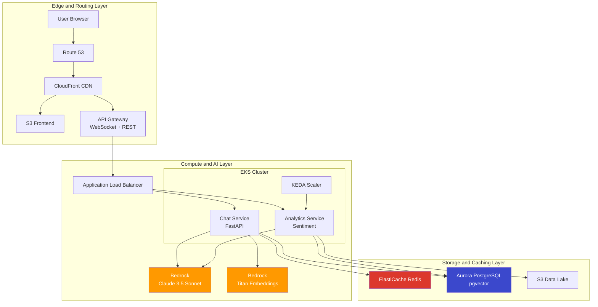
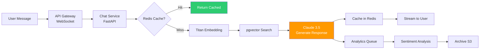
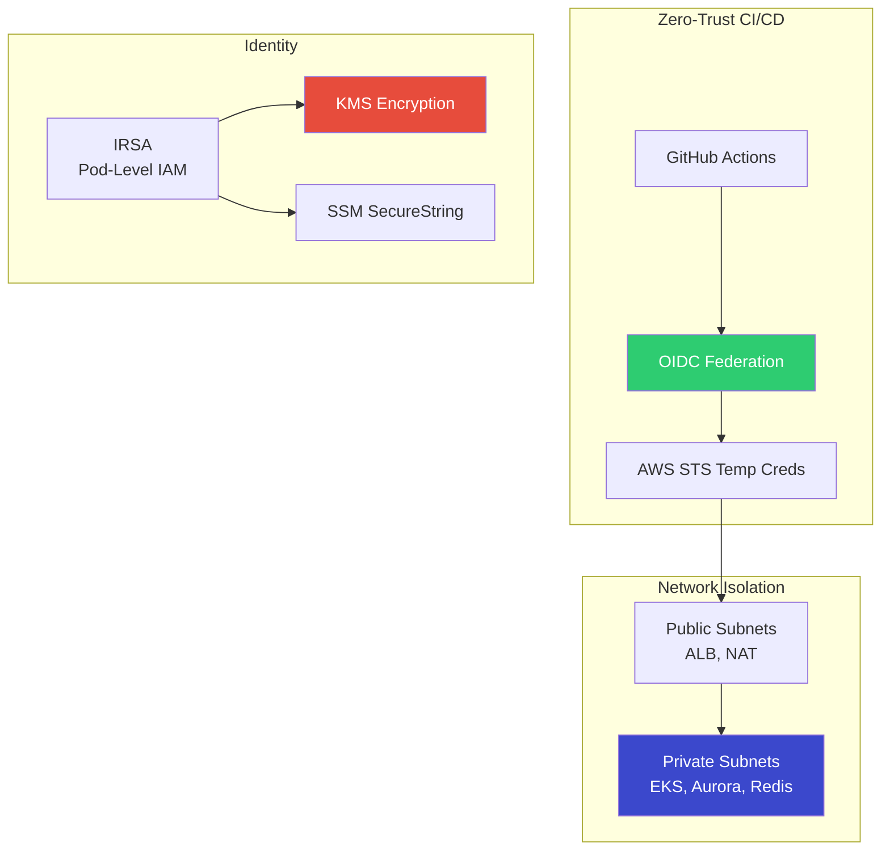
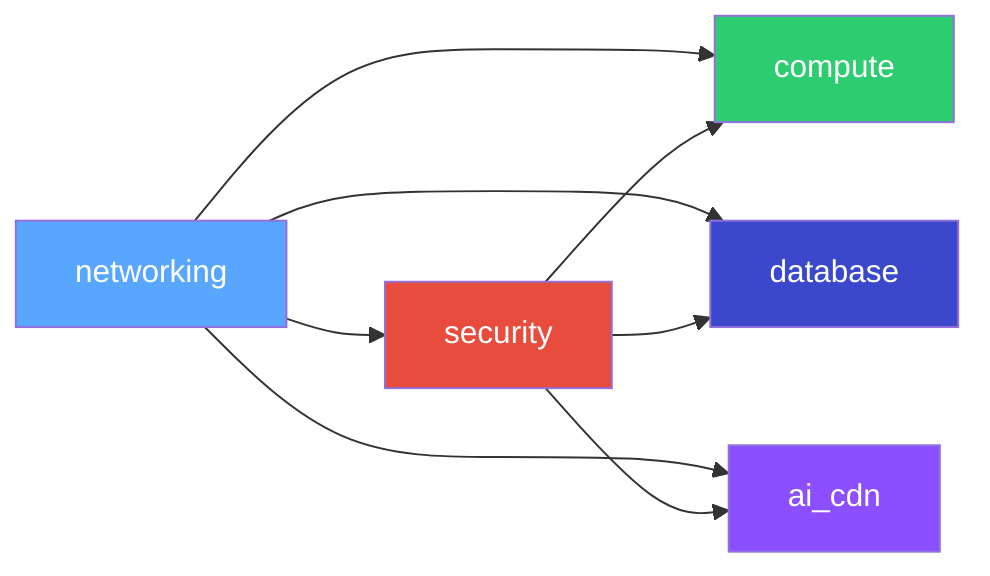

# Architecture — OmniPresenseAI

> Comprehensive architecture documentation for the Omnichannel AI-Powered Customer Support & Analytics Platform.

---

## System Overview

OmniPresenseAI is a **3-layer cloud-native architecture** built on AWS, designed for real-time AI-powered customer support with built-in analytics.

| Layer | Components | Purpose |
|-------|-----------|---------|
| **Edge & Routing** | Route 53, CloudFront, API Gateway, ALB | Traffic management, SSL, caching |
| **Compute & AI** | EKS, Bedrock (Claude 3.5 Sonnet), KEDA | Microservice orchestration, AI inference |
| **Storage & Caching** | Aurora PostgreSQL (pgvector), ElastiCache Redis, S3 | Persistence, vector search, caching |

---

## High-Level Architecture

---

## Data Flow — Chat Request Lifecycle

---

## Security Architecture

---

## AWS Service Inventory

| Service | Resource | Purpose | Encryption |
|---------|----------|---------|-----------|
| VPC | 10.0.0.0/16, 6 subnets, NAT | Network isolation | N/A |
| Route 53 | Hosted zone | DNS management | N/A |
| CloudFront | Distribution + OAC | CDN, SSL termination | TLS 1.3 |
| API Gateway | WebSocket + HTTP API | Traffic management | TLS |
| EKS | v1.29, Managed nodes | Container orchestration | KMS (secrets) |
| Bedrock | Claude 3.5 Sonnet | Conversational AI | AWS managed |
| Bedrock | Titan Embeddings v2 | Vector embeddings | AWS managed |
| Aurora | PostgreSQL 15.4 Serverless v2 | pgvector + transactional | KMS |
| ElastiCache | Redis 7.1, 2-node | Session + LLM cache | KMS + TLS |
| S3 | 2 buckets (frontend + transcripts) | Static assets + archival | KMS |
| KMS | 3 keys (EKS, Aurora, S3) | Encryption at rest | N/A |
| IAM | OIDC + IRSA + service roles | Identity management | N/A |

---

## Module Dependency Graph

| Module | Depends On | Resources Created |
|--------|-----------|-------------------|
| networking | — | VPC, subnets, NAT, Route53 |
| security | networking | IAM, OIDC, KMS, SGs, SSM |
| compute | networking, security | EKS, node groups, IRSA, ALB controller |
| database | networking, security | Aurora PostgreSQL, ElastiCache Redis |
| ai_cdn | networking, security | CloudFront, S3, API Gateway |
