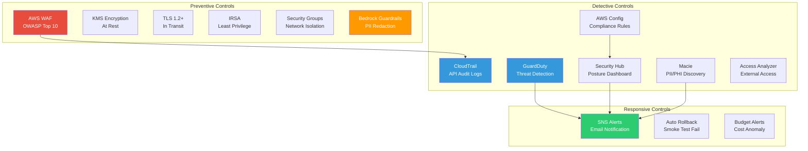
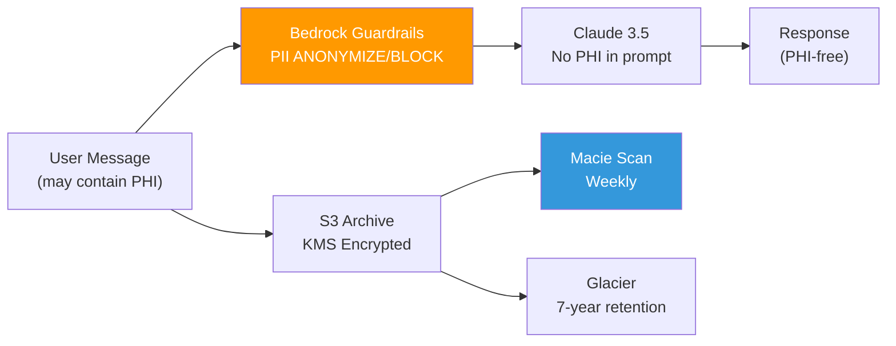
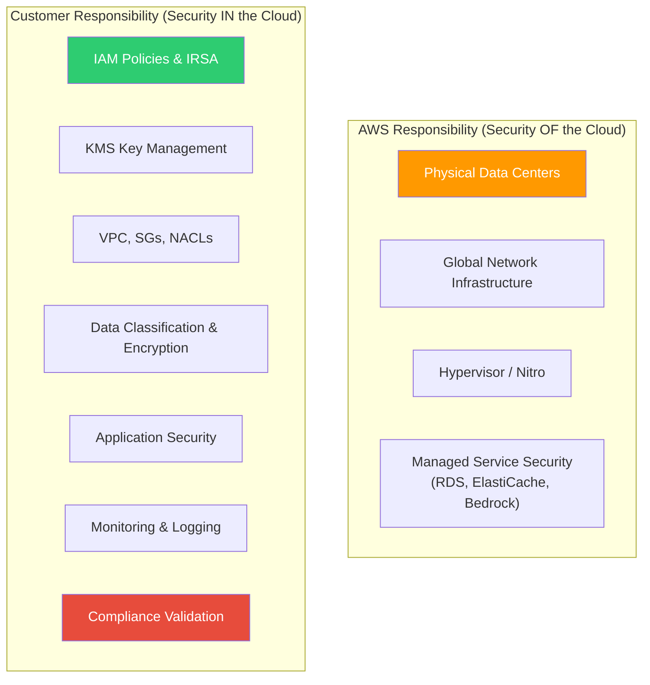

# Regulatory Compliance — OmniPresenseAI

> Control-to-resource mapping for HIPAA, PCI-DSS, SOX, and GDPR compliance.

---

## Table of Contents

1. [Compliance Overview](#compliance-overview)
2. [HIPAA Controls](#hipaa-controls)
3. [PCI-DSS Controls](#pci-dss-controls)
4. [SOX Controls](#sox-controls)
5. [GDPR Controls](#gdpr-controls)
6. [Data Classification](#data-classification)
7. [Shared Responsibility Model](#shared-responsibility-model)
8. [Audit Readiness Checklist](#audit-readiness-checklist)

---

## Compliance Overview



---

## HIPAA Controls

> Health Insurance Portability and Accountability Act — protecting PHI (Protected Health Information)

| HIPAA Rule | Requirement | AWS Control | Resource |
|------------|-------------|-------------|----------|
| §164.312(a)(1) | Access Control | IRSA + IAM least privilege | `security/irsa.tf` |
| §164.312(a)(2)(iv) | Encryption at rest | KMS (3 keys: EKS, Aurora, S3) | `security/kms.tf` |
| §164.312(b) | Audit Controls | CloudTrail (multi-region, data events) | `compliance/cloudtrail.tf` |
| §164.312(c)(1) | Integrity | S3 versioning, Aurora checksums | `ai_cdn/s3.tf` |
| §164.312(d) | Authentication | OIDC federation, IRSA, Redis AUTH | `security/oidc.tf` |
| §164.312(e)(1) | Transmission Security | TLS 1.2+ on all connections | `database/aurora.tf`, `elasticache.tf` |
| §164.308(a)(1)(ii)(D) | Info System Activity Review | CloudWatch Logs, Security Hub | `compliance/securityhub.tf` |
| §164.308(a)(5)(ii)(B) | Malicious Software Protection | GuardDuty malware scanning | `compliance/guardduty.tf` |
| §164.308(a)(6) | Security Incident Response | GuardDuty → SNS → Email alerts | `compliance/guardduty.tf` |
| §164.310(d)(2)(iv) | Data Backup | Aurora backup (7-day), S3 versioning | `database/aurora.tf` |
| PHI in AI | PII/PHI Redaction | Bedrock Guardrails (ANONYMIZE/BLOCK) | `ai_governance/bedrock_guardrails.tf` |
| PHI Discovery | Data Classification | Amazon Macie scheduled scans | `compliance/macie.tf` |

### HIPAA Data Flow



---

## PCI-DSS Controls

> Payment Card Industry Data Security Standard v3.2.1

| PCI-DSS Req | Requirement | AWS Control | Resource |
|-------------|-------------|-------------|----------|
| 1.x | Firewall / Network segmentation | VPC, private subnets, SGs, NACLs | `networking/main.tf` |
| 2.x | Default passwords | SSM SecureString, no defaults | `security/main.tf` |
| 3.x | Protect stored cardholder data | KMS encryption, Bedrock Guardrails BLOCK on CC numbers | `security/kms.tf`, `ai_governance/` |
| 4.x | Encrypt transmission | TLS 1.2+ everywhere | `database/`, `ai_cdn/` |
| 5.x | Anti-malware | GuardDuty EBS malware scanning | `compliance/guardduty.tf` |
| 6.6 | Web application firewall | AWS WAF v2 (OWASP rules) | `compliance/waf.tf` |
| 7.x | Restrict access (need-to-know) | IRSA, scoped IAM policies | `security/oidc.tf`, `compute/irsa.tf` |
| 8.x | Identify and authenticate | OIDC federation, no static credentials | `security/oidc.tf` |
| 10.x | Track and monitor access | CloudTrail + CloudWatch + VPC Flow Logs | `compliance/cloudtrail.tf` |
| 11.4 | Intrusion detection | GuardDuty | `compliance/guardduty.tf` |
| 11.5 | File integrity monitoring | AWS Config change tracking | `compliance/config.tf` |
| 12.x | Security policy | Security Hub standards (PCI-DSS v3.2.1) | `compliance/securityhub.tf` |

---

## SOX Controls

> Sarbanes-Oxley Act — financial reporting and IT controls

| SOX Control | Requirement | AWS Control | Resource |
|-------------|-------------|-------------|----------|
| ITGC — Access Management | Access reviews | IAM Access Analyzer | `compliance/access_analyzer.tf` |
| ITGC — Change Management | Change audit trail | CloudTrail, GitHub PR reviews | `compliance/cloudtrail.tf` |
| ITGC — Segregation of Duties | Separate deploy from approve | GitHub Environment protection rules | `.github/workflows/cd-*.yml` |
| ITGC — Operations | Monitoring and alerting | Security Hub, CloudWatch, GuardDuty | `compliance/securityhub.tf` |
| ITGC — Data Backup | Backup and recovery | Aurora backups (7-day), S3 versioning | `database/aurora.tf` |
| AU-3 — Audit Trail | Comprehensive logging | CloudTrail (multi-region, data events) | `compliance/cloudtrail.tf` |
| AU-6 — Audit Review | Centralized findings | Security Hub dashboard | `compliance/securityhub.tf` |
| AU-11 — Audit Retention | 7-year retention | S3 lifecycle → Glacier (2555 days) | `compliance/cloudtrail.tf` |

---

## GDPR Controls

> General Data Protection Regulation — EU data protection

| GDPR Article | Requirement | AWS Control | Resource |
|-------------|-------------|-------------|----------|
| Art. 5(1)(f) | Data integrity and confidentiality | KMS encryption, TLS, VPC isolation | `security/kms.tf` |
| Art. 17 | Right to erasure | S3 object deletion, Aurora DELETE queries | Application layer |
| Art. 25 | Data protection by design | Bedrock Guardrails (PII ANONYMIZE) | `ai_governance/bedrock_guardrails.tf` |
| Art. 28 | Data processor agreements | AWS DPA (signed at account level) | AWS account setup |
| Art. 30 | Records of processing | CloudTrail + Bedrock invocation logging | `compliance/cloudtrail.tf`, `ai_governance/bedrock_logging.tf` |
| Art. 32 | Security of processing | Full encryption stack (at rest + transit) | `security/kms.tf`, `database/` |
| Art. 33 | Breach notification (72 hours) | GuardDuty → SNS → immediate alerts | `compliance/guardduty.tf` |
| Art. 35 | Data protection impact assessment | Macie PII classification | `compliance/macie.tf` |
| Art. 44-49 | Cross-border transfers | Data residency within AWS region | Architecture decision |

### GDPR Data Subject Rights — Implementation

| Right | Mechanism | Status |
|-------|-----------|--------|
| Right of Access (Art. 15) | API endpoint to export user data | Application layer |
| Right to Rectification (Art. 16) | Aurora UPDATE queries | Application layer |
| Right to Erasure (Art. 17) | S3 object delete + Aurora DELETE + Redis flush | Application layer |
| Right to Portability (Art. 20) | JSON/CSV export API | Application layer |
| Right to Object (Art. 21) | Opt-out flag in user metadata | Application layer |

---

## Data Classification

| Data Type | Classification | Storage | Encryption | Retention | Compliance |
|-----------|---------------|---------|------------|-----------|------------|
| Chat messages | **Confidential** | Aurora + Redis | KMS (at rest) + TLS | 90 days (DB), 24h (Redis) | HIPAA, GDPR |
| Transcripts | **Confidential** | S3 | KMS SSE-S3 | 7 years (Glacier) | HIPAA, SOX |
| Sentiment scores | **Internal** | Aurora | KMS | 1 year | — |
| User metadata | **PII** | Aurora | KMS | Until deletion request | GDPR |
| Knowledge base | **Public** | Aurora (pgvector) | KMS | Indefinite | — |
| API logs | **Internal** | CloudWatch | KMS | 90 days | PCI-DSS |
| CloudTrail logs | **Audit** | S3 | KMS | 7 years | SOX, HIPAA |
| Bedrock invocations | **Confidential** | CloudWatch + S3 | KMS | 7 years | SOX, GDPR |

---

## Shared Responsibility Model



---

## Audit Readiness Checklist

### Pre-Audit Verification

- [ ] **CloudTrail**: Verify trail is active and logging to S3
  ```bash
  aws cloudtrail get-trail-status --name omnipresense-ai-prod-trail
  ```

- [ ] **GuardDuty**: Confirm detector is enabled, check findings
  ```bash
  aws guardduty list-detectors
  aws guardduty list-findings --detector-id <ID> --finding-criteria '{"Criterion":{"severity":{"Gte":7}}}'
  ```

- [ ] **Security Hub**: Review compliance score
  ```bash
  aws securityhub get-findings --filters '{"ComplianceStatus":[{"Value":"FAILED","Comparison":"EQUALS"}]}'
  ```

- [ ] **AWS Config**: Check rule compliance
  ```bash
  aws configservice describe-compliance-by-config-rule
  ```

- [ ] **Macie**: Review PII/PHI findings
  ```bash
  aws macie2 list-findings --finding-criteria '{"criterion":{"severity.description":{"eq":["High"]}}}'
  ```

- [ ] **Access Analyzer**: Check for external access findings
  ```bash
  aws accessanalyzer list-findings --analyzer-arn <ARN>
  ```

- [ ] **KMS**: Verify key rotation is enabled
  ```bash
  for key in eks-secrets aurora s3; do
    aws kms get-key-rotation-status --key-id alias/omnipresense-ai-prod-${key}
  done
  ```

- [ ] **WAF**: Check recent blocked requests
  ```bash
  aws wafv2 get-sampled-requests --web-acl-arn <ARN> --rule-metric-name omnipresense-ai-rate-limit --scope CLOUDFRONT --time-window '{"StartTime":"2024-01-01","EndTime":"2024-01-02"}' --max-items 10
  ```
