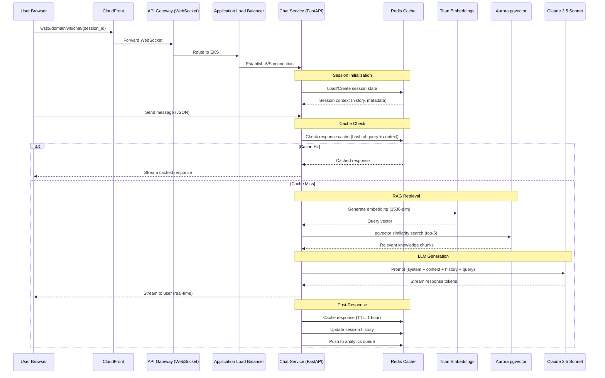
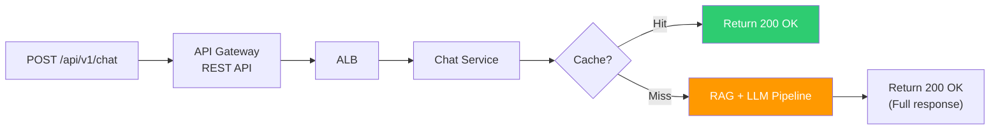
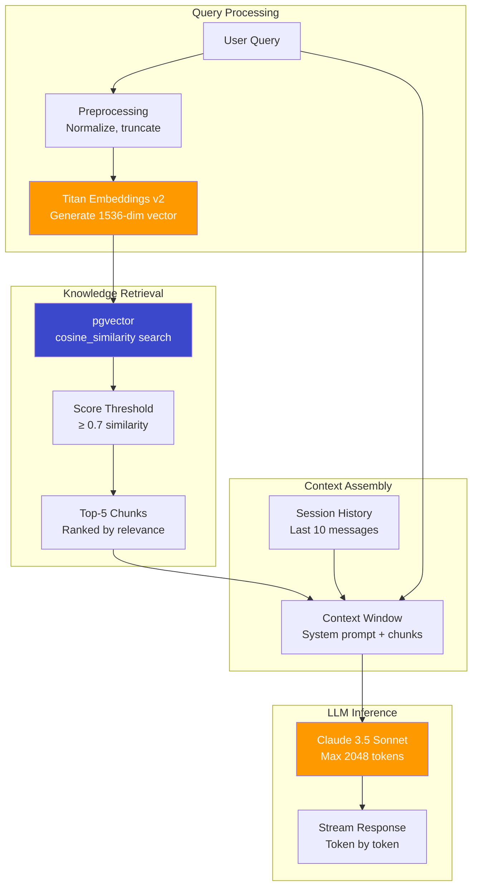
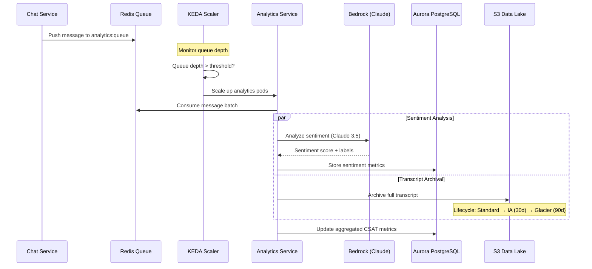
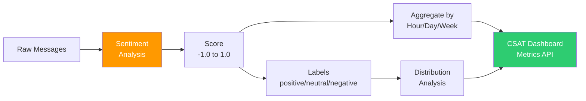
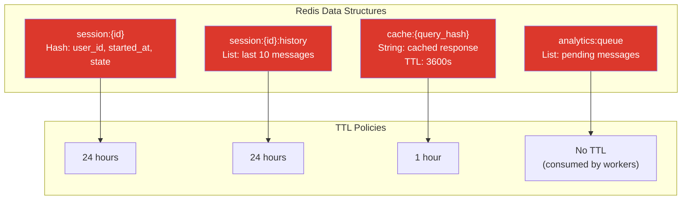
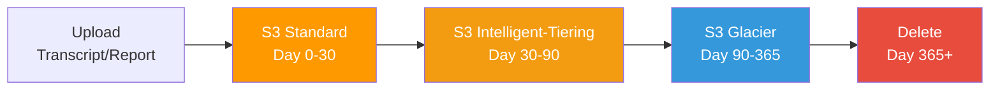

# Data Flow — OmniPresenseAI

> Request lifecycle documentation for the Omnichannel AI-Powered Customer Support & Analytics Platform.

---

## Table of Contents

1. [Chat Request Lifecycle](#chat-request-lifecycle)
2. [RAG Pipeline](#rag-pipeline)
3. [Analytics Pipeline](#analytics-pipeline)
4. [Session Management](#session-management)
5. [Data Retention & Lifecycle](#data-retention--lifecycle)

---

## Chat Request Lifecycle

### WebSocket Connection Flow



### REST Fallback Flow



---

## RAG Pipeline

### Embedding Generation & Vector Search



### Knowledge Base Schema (Aurora pgvector)

```sql
-- Knowledge documents table
CREATE TABLE knowledge_documents (
    id          UUID PRIMARY KEY DEFAULT gen_random_uuid(),
    title       VARCHAR(500) NOT NULL,
    content     TEXT NOT NULL,
    category    VARCHAR(100),
    embedding   vector(1536),    -- Titan Embeddings v2 output
    metadata    JSONB DEFAULT '{}',
    created_at  TIMESTAMPTZ DEFAULT NOW(),
    updated_at  TIMESTAMPTZ DEFAULT NOW()
);

-- HNSW index for fast similarity search
CREATE INDEX idx_knowledge_embedding
    ON knowledge_documents
    USING hnsw (embedding vector_cosine_ops)
    WITH (m = 16, ef_construction = 64);

-- Chat sessions table
CREATE TABLE chat_sessions (
    id          UUID PRIMARY KEY DEFAULT gen_random_uuid(),
    user_id     VARCHAR(255),
    started_at  TIMESTAMPTZ DEFAULT NOW(),
    ended_at    TIMESTAMPTZ,
    metadata    JSONB DEFAULT '{}'
);

-- Chat messages table
CREATE TABLE chat_messages (
    id          UUID PRIMARY KEY DEFAULT gen_random_uuid(),
    session_id  UUID REFERENCES chat_sessions(id),
    role        VARCHAR(20) NOT NULL, -- 'user' or 'assistant'
    content     TEXT NOT NULL,
    tokens_used INTEGER,
    latency_ms  INTEGER,
    created_at  TIMESTAMPTZ DEFAULT NOW()
);
```

---

## Analytics Pipeline

### Event-Driven Sentiment Analysis



### Metrics Aggregation Flow



### Analytics API Response Format

```json
{
  "period": "2024-01-15",
  "metrics": {
    "total_conversations": 1247,
    "avg_sentiment_score": 0.72,
    "sentiment_distribution": {
      "positive": 0.65,
      "neutral": 0.22,
      "negative": 0.13
    },
    "avg_response_time_ms": 1850,
    "avg_messages_per_session": 6.3,
    "resolution_rate": 0.84
  }
}
```

---

## Session Management

### Redis Session State



### Session Lifecycle

| Event | Redis Action | PostgreSQL Action |
|-------|-------------|-------------------|
| Connection open | Create `session:{id}` hash | INSERT into `chat_sessions` |
| Message received | Append to `session:{id}:history` | INSERT into `chat_messages` |
| Response generated | Set `cache:{hash}` with TTL | Update `tokens_used`, `latency_ms` |
| Connection close | Set `state=ended` | UPDATE `ended_at` |
| Session expired | Auto-deleted by TTL | Retained for analytics |

---

## Data Retention & Lifecycle

### S3 Lifecycle Policies



### Retention Summary

| Data Type | Storage | Hot Period | Warm Period | Cold/Archive | Deletion |
|-----------|---------|-----------|-------------|--------------|----------|
| Chat sessions | Aurora | 90 days | — | — | Soft delete |
| Chat messages | Aurora | 90 days | — | — | Soft delete |
| Knowledge docs | Aurora + pgvector | Indefinite | — | — | Manual |
| Transcripts | S3 | 30 days | 30-90 days | 90-365 days | 365 days |
| Sentiment reports | S3 | 30 days | 30-90 days | 90-365 days | 365 days |
| Redis sessions | ElastiCache | 24 hours | — | — | TTL expiry |
| Redis cache | ElastiCache | 1 hour | — | — | TTL expiry |
| CloudFront logs | S3 | 30 days | — | — | 90 days |
