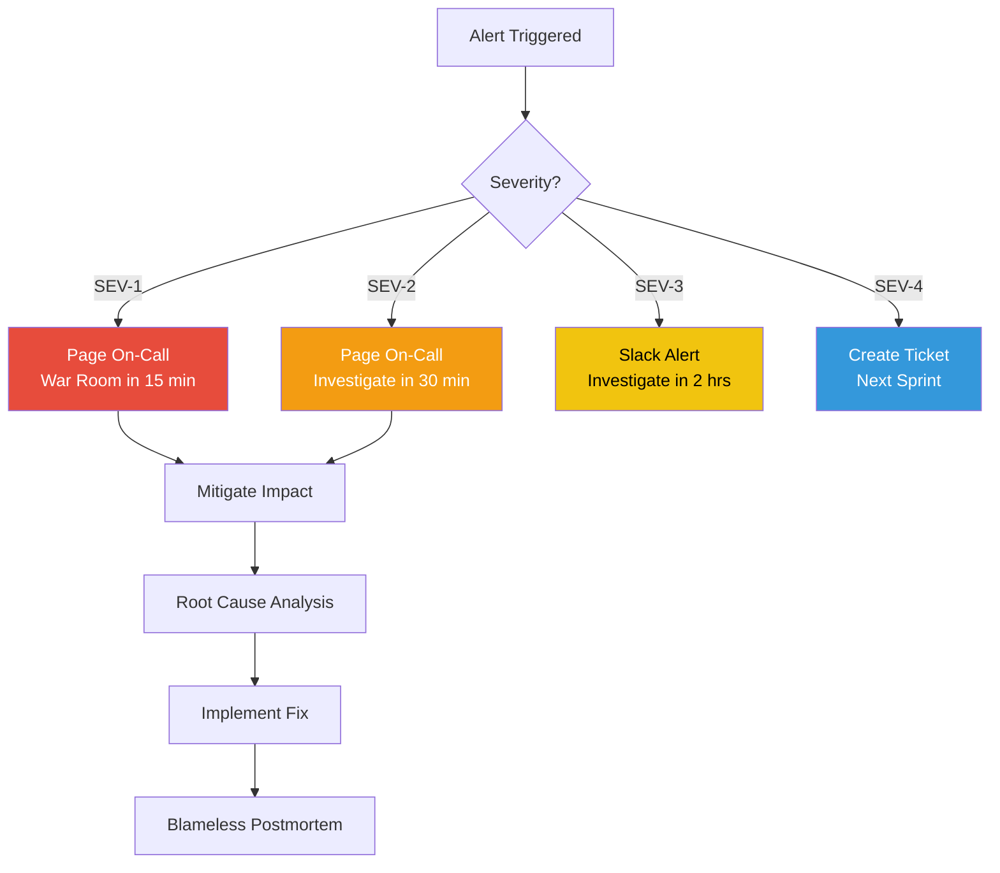

# Operations Runbook — OmniPresenseAI

> Day-1 / Day-2 operations and incident response playbooks for the OmniPresenseAI platform.

---

## Table of Contents

1. [Severity Definitions](#severity-definitions)
2. [Incident Response Matrix](#incident-response-matrix)
3. [SEV-1 Playbooks](#sev-1-playbooks)
4. [SEV-2 Playbooks](#sev-2-playbooks)
5. [SEV-3 Playbooks](#sev-3-playbooks)
6. [SEV-4 Playbooks](#sev-4-playbooks)
7. [Day-1 Operations](#day-1-operations)
8. [Day-2 Operations](#day-2-operations)
9. [Monitoring & Alerting](#monitoring--alerting)
10. [Rollback Procedures](#rollback-procedures)

---

## Severity Definitions

| Severity | Impact | Response Time | Escalation |
|----------|--------|---------------|------------|
| **SEV-1** | Platform outage, all users affected | < 15 min | On-call → Engineering Lead → VP |
| **SEV-2** | Major degradation, AI responses failing | < 30 min | On-call → Engineering Lead |
| **SEV-3** | Partial degradation, non-critical feature down | < 2 hours | On-call → Team channel |
| **SEV-4** | Minor issue, cosmetic or logging | Next business day | Ticket queue |

---

## Incident Response Matrix



---

## SEV-1 Playbooks

### 1.1 EKS Cluster Unreachable

**Symptoms:** `kubectl` commands timeout, all services 503.

**Steps:**

```bash
# 1. Verify AWS-side health
aws eks describe-cluster --name omnipresense-ai-prod --query 'cluster.status'

# 2. Check control plane logs
aws logs filter-log-events \
  --log-group-name /aws/eks/omnipresense-ai-prod/cluster \
  --start-time $(date -d '30 minutes ago' +%s000)

# 3. Refresh kubeconfig
aws eks update-kubeconfig --name omnipresense-ai-prod --region us-east-1

# 4. Check node status
kubectl get nodes -o wide

# 5. If nodes are NotReady, check ASG
aws autoscaling describe-auto-scaling-groups \
  --auto-scaling-group-names $(aws eks describe-nodegroup \
    --cluster-name omnipresense-ai-prod \
    --nodegroup-name general \
    --query 'nodegroup.resources.autoScalingGroups[0].name' --output text)
```

**Escalation:** If cluster is in `FAILED` state, contact AWS Support with Premium case.

---

### 1.2 Aurora Database Down

**Symptoms:** `chat-service` and `analytics-service` readiness probes failing, 500 errors on all API calls.

**Steps:**

```bash
# 1. Check Aurora cluster status
aws rds describe-db-clusters \
  --db-cluster-identifier omnipresense-ai-prod-aurora \
  --query 'DBClusters[0].Status'

# 2. Check recent events
aws rds describe-events \
  --source-type db-cluster \
  --duration 60

# 3. If failover needed
aws rds failover-db-cluster \
  --db-cluster-identifier omnipresense-ai-prod-aurora

# 4. Verify pod connectivity
kubectl exec -n omni-ai deploy/chat-service -- \
  python -c "import asyncpg; print('DB OK')"

# 5. Check Aurora Serverless capacity
aws rds describe-db-clusters \
  --db-cluster-identifier omnipresense-ai-prod-aurora \
  --query 'DBClusters[0].ServerlessV2ScalingConfiguration'
```

---

### 1.3 Complete AI Response Failure

**Symptoms:** All chat requests returning errors, Bedrock API calls failing.

**Steps:**

```bash
# 1. Check Bedrock service health
aws bedrock list-foundation-models --query 'modelSummaries[?modelId==`anthropic.claude-3-5-sonnet-20241022-v2:0`]'

# 2. Check IRSA role and permissions
kubectl describe sa chat-service -n omni-ai
kubectl exec -n omni-ai deploy/chat-service -- \
  python -c "import boto3; print(boto3.client('sts').get_caller_identity())"

# 3. Check Bedrock throttling metrics
aws cloudwatch get-metric-statistics \
  --namespace AWS/Bedrock \
  --metric-name ThrottledCount \
  --start-time $(date -u -d '1 hour ago' +%Y-%m-%dT%H:%M:%S) \
  --end-time $(date -u +%Y-%m-%dT%H:%M:%S) \
  --period 300 --statistics Sum

# 4. Restart chat-service pods (if IRSA token expired)
kubectl rollout restart deployment/chat-service -n omni-ai

# 5. If Bedrock is down in us-east-1, update region config
kubectl edit configmap chat-service-config -n omni-ai
# Change AWS_REGION to us-west-2 as fallback
```

---

## SEV-2 Playbooks

### 2.1 Redis Cache Failure

**Symptoms:** Increased latency, cache misses, session data lost.

```bash
# 1. Check ElastiCache status
aws elasticache describe-cache-clusters \
  --cache-cluster-id omnipresense-ai-prod-redis

# 2. Check Redis connectivity from pods
kubectl exec -n omni-ai deploy/chat-service -- \
  python -c "import redis; r = redis.Redis(); r.ping()"

# 3. Check Redis memory usage
aws cloudwatch get-metric-statistics \
  --namespace AWS/ElastiCache \
  --metric-name DatabaseMemoryUsagePercentage \
  --dimensions Name=CacheClusterId,Value=omnipresense-ai-prod-redis \
  --start-time $(date -u -d '1 hour ago' +%Y-%m-%dT%H:%M:%S) \
  --end-time $(date -u +%Y-%m-%dT%H:%M:%S) \
  --period 300 --statistics Average

# 4. If memory is full, flush non-critical keys
kubectl exec -n omni-ai deploy/chat-service -- \
  python -c "import redis; r = redis.Redis(); print(r.dbsize())"
```

### 2.2 High Latency on Chat Responses

**Symptoms:** P95 latency > 5s, users experiencing slow responses.

```bash
# 1. Check pod resource usage
kubectl top pods -n omni-ai

# 2. Check HPA status
kubectl get hpa -n omni-ai

# 3. Check if KEDA is scaling analytics
kubectl get scaledobject -n omni-ai

# 4. Check Bedrock latency
kubectl logs -n omni-ai deploy/chat-service --tail=100 | grep "bedrock_latency"

# 5. Force scale up if needed
kubectl scale deployment/chat-service --replicas=5 -n omni-ai
```

---

## SEV-3 Playbooks

### 3.1 Analytics Pipeline Delayed

**Symptoms:** Sentiment scores not updating, transcript archival behind.

```bash
# 1. Check analytics pods
kubectl get pods -n omni-ai -l app=analytics-service

# 2. Check KEDA trigger status
kubectl describe scaledobject analytics-scaler -n omni-ai

# 3. Check Redis queue depth
kubectl exec -n omni-ai deploy/analytics-service -- \
  python -c "import redis; r = redis.Redis(); print(r.llen('analytics:queue'))"

# 4. Check S3 archival
aws s3 ls s3://omnipresense-ai-prod-data/transcripts/ --recursive | tail -5
```

### 3.2 CloudFront Cache Miss Rate High

**Symptoms:** Origin requests spiking, increased latency for static assets.

```bash
# 1. Check CloudFront metrics
aws cloudwatch get-metric-statistics \
  --namespace AWS/CloudFront \
  --metric-name CacheHitRate \
  --dimensions Name=DistributionId,Value=<DIST_ID> \
  --start-time $(date -u -d '6 hours ago' +%Y-%m-%dT%H:%M:%S) \
  --end-time $(date -u +%Y-%m-%dT%H:%M:%S) \
  --period 3600 --statistics Average

# 2. Invalidate cache if stale
aws cloudfront create-invalidation \
  --distribution-id <DIST_ID> \
  --paths "/*"
```

---

## SEV-4 Playbooks

### 4.1 Log Volume Spike

```bash
# Check log group sizes
aws logs describe-log-groups \
  --log-group-name-prefix /aws/eks/omnipresense-ai \
  --query 'logGroups[].{Name:logGroupName, StoredBytes:storedBytes}'

# Adjust log retention if needed
aws logs put-retention-policy \
  --log-group-name /aws/eks/omnipresense-ai-prod/cluster \
  --retention-in-days 30
```

### 4.2 Certificate Renewal

```bash
# Check ACM certificate status
aws acm list-certificates --query 'CertificateSummaryList[?DomainName==`omnipresense.ai`]'

# ACM auto-renews DNS-validated certs — verify renewal status
aws acm describe-certificate --certificate-arn <ARN> \
  --query 'Certificate.RenewalSummary'
```

---

## Day-1 Operations

### Initial Deployment Checklist

1. **Bootstrap AWS Account**
   ```bash
   ./scripts/bootstrap.sh
   ```

2. **Deploy Infrastructure**
   ```bash
   cd terraform/envs/prod
   cp terraform.tfvars.example terraform.tfvars
   # Edit terraform.tfvars
   terraform init && terraform plan -out=tfplan && terraform apply tfplan
   ```

3. **Configure kubectl**
   ```bash
   ./scripts/setup-kubeconfig.sh
   ```

4. **Deploy K8s Manifests**
   ```bash
   kubectl apply -k k8s/overlays/prod/
   ```

5. **Seed Knowledge Base**
   ```bash
   cd scripts && python seed-knowledge-base.py
   ```

6. **Verify Deployment**
   ```bash
   kubectl get pods -n omni-ai
   kubectl get ingress -n omni-ai
   curl -s https://<domain>/health | jq .
   ```

---

## Day-2 Operations

### Routine Maintenance

| Task | Frequency | Command |
|------|-----------|---------|
| Check pod health | Daily | `kubectl get pods -n omni-ai` |
| Review HPA/KEDA status | Daily | `kubectl get hpa,scaledobject -n omni-ai` |
| Check Aurora capacity | Weekly | AWS Console → RDS → Serverless capacity |
| Review CloudWatch alarms | Weekly | AWS Console → CloudWatch → Alarms |
| Rotate Redis auth token | Quarterly | Update SSM → restart pods |
| Kubernetes version upgrade | Semi-annually | Terraform `kubernetes_version` bump |
| Review S3 lifecycle | Monthly | Check Glacier transitions |

### Scaling Guidelines

```bash
# Manual scale for expected traffic spike
kubectl scale deployment/chat-service --replicas=8 -n omni-ai

# Adjust HPA limits
kubectl patch hpa chat-service-hpa -n omni-ai \
  --patch '{"spec":{"maxReplicas": 15}}'

# Aurora capacity adjustment (via Terraform)
# Update aurora_max_capacity in terraform.tfvars
terraform apply
```

---

## Monitoring & Alerting

### Key Metrics to Monitor

| Metric | Source | Warning | Critical |
|--------|--------|---------|----------|
| Pod restarts | K8s | > 3/hour | > 10/hour |
| API latency (P95) | CloudWatch | > 3s | > 10s |
| Aurora ACU usage | CloudWatch | > 70% max | > 90% max |
| Redis memory | CloudWatch | > 70% | > 90% |
| Bedrock throttles | CloudWatch | > 5/min | > 20/min |
| Node CPU | K8s metrics | > 70% | > 90% |
| Error rate (5xx) | ALB | > 1% | > 5% |

---

## Rollback Procedures

### Application Rollback

```bash
# Rollback to previous deployment revision
kubectl rollout undo deployment/chat-service -n omni-ai
kubectl rollout undo deployment/analytics-service -n omni-ai

# Rollback to specific revision
kubectl rollout history deployment/chat-service -n omni-ai
kubectl rollout undo deployment/chat-service -n omni-ai --to-revision=<N>

# Verify rollback
kubectl rollout status deployment/chat-service -n omni-ai
```

### Infrastructure Rollback

```bash
# Terraform state rollback (use with caution)
cd terraform/envs/prod

# Check state history
aws s3api list-object-versions \
  --bucket omnipresense-ai-terraform-state \
  --prefix prod/terraform.tfstate

# Restore previous state version
aws s3api get-object \
  --bucket omnipresense-ai-terraform-state \
  --key prod/terraform.tfstate \
  --version-id <VERSION_ID> \
  terraform.tfstate.backup

# Re-apply known-good state
terraform plan -out=rollback.tfplan
terraform apply rollback.tfplan
```

### ECR Image Rollback

```bash
# List recent image tags
aws ecr describe-images \
  --repository-name omnipresense-ai/chat-service \
  --query 'sort_by(imageDetails,&imagePushedAt)[-5:].[imageTags[0],imagePushedAt]' \
  --output table

# Deploy specific image tag
kubectl set image deployment/chat-service \
  chat-service=<ACCOUNT>.dkr.ecr.us-east-1.amazonaws.com/omnipresense-ai/chat-service:<TAG> \
  -n omni-ai
```
