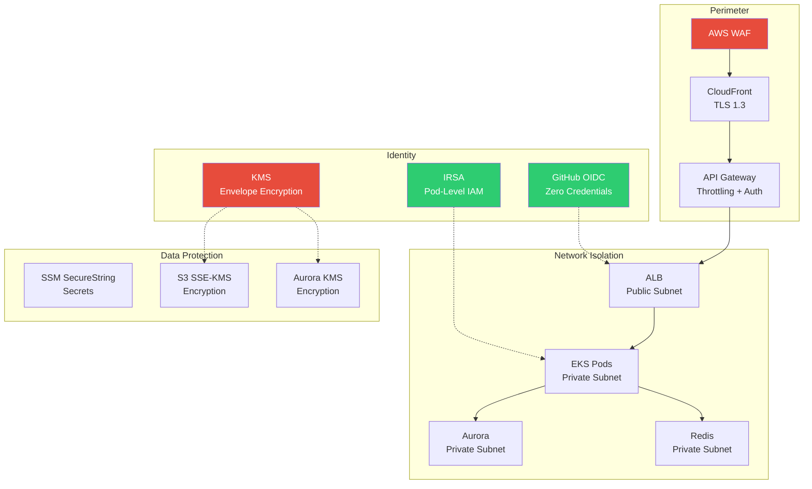
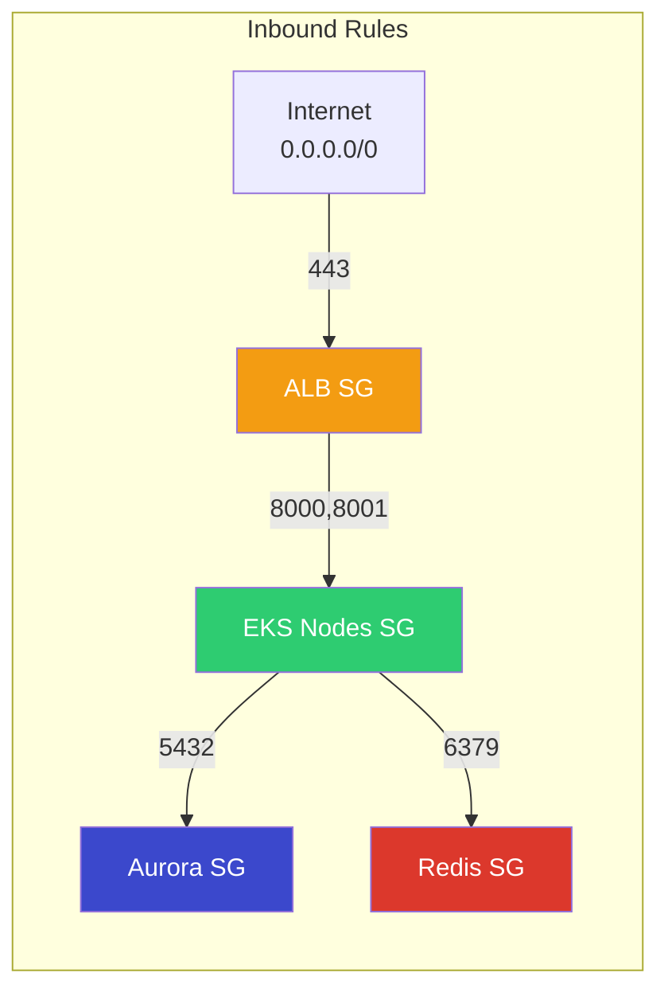
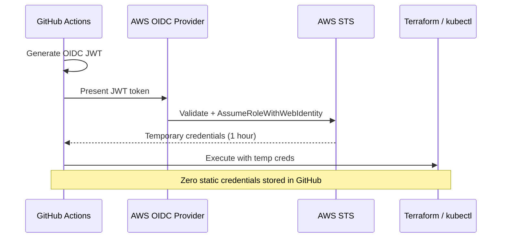
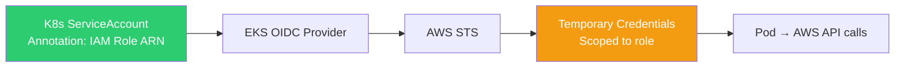
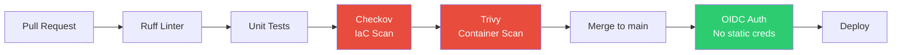

# Security Architecture — OmniPresenseAI

> Defense-in-depth security architecture for the Omnichannel AI-Powered Customer Support & Analytics Platform.

---

## Table of Contents

1. [Security Overview](#security-overview)
2. [Network Security](#network-security)
3. [Identity & Access Management](#identity--access-management)
4. [Encryption](#encryption)
5. [Secrets Management](#secrets-management)
6. [Container Security](#container-security)
7. [CI/CD Security](#cicd-security)
8. [Compliance Mapping](#compliance-mapping)

---

## Security Overview



---

## Network Security

### VPC Architecture

| Component | CIDR/Config | Purpose |
|-----------|-------------|---------|
| VPC | `10.0.0.0/16` | Isolated network (65,536 IPs) |
| Public Subnets (3) | `10.0.1.0/24`, `10.0.2.0/24`, `10.0.3.0/24` | ALB, NAT Gateway |
| Private Subnets (3) | `10.0.11.0/24`, `10.0.12.0/24`, `10.0.13.0/24` | EKS, Aurora, Redis |
| NAT Gateway | Single AZ (cost optimization) | Outbound internet for private subnets |
| Internet Gateway | — | Inbound for public subnets |

### Security Groups



| Security Group | Inbound | Source | Port |
|---------------|---------|--------|------|
| ALB | HTTPS | `0.0.0.0/0` | 443 |
| EKS Nodes | App traffic | ALB SG | 8000, 8001 |
| EKS Nodes | Cluster comms | Self | All |
| Aurora | PostgreSQL | EKS Nodes SG | 5432 |
| Redis | Redis | EKS Nodes SG | 6379 |

### Network Policies (Kubernetes)

```yaml
# Only chat-service can reach Aurora and Redis
# Only ALB can reach service ports
# Inter-pod traffic denied by default
```

Implemented in `k8s/base/network-policies.yaml`:
- `chat-service` → Aurora (5432), Redis (6379), Bedrock (443)
- `analytics-service` → Aurora (5432), S3 (443), Bedrock (443)
- Deny all other inter-namespace traffic

### VPC Flow Logs

- **Destination:** CloudWatch Logs
- **Traffic type:** REJECT only (minimize cost)
- **Retention:** 30 days
- **Purpose:** Network forensics, anomaly detection

---

## Identity & Access Management

### OIDC Federation (CI/CD)



**Trust Policy Conditions:**
- `token.actions.githubusercontent.com:sub` → `repo:pusnaik2016/OmniPresenseAI:ref:refs/heads/main`
- `token.actions.githubusercontent.com:aud` → `sts.amazonaws.com`
- Only `main` branch can assume the deploy role

### IRSA (Pod-Level IAM)

| Service Account | IAM Role | Permissions |
|----------------|----------|-------------|
| `chat-service` | `omnipresense-ai-chat-irsa` | Bedrock InvokeModel, SSM GetParameter, S3 GetObject |
| `analytics-service` | `omnipresense-ai-analytics-irsa` | Bedrock InvokeModel, S3 PutObject, SSM GetParameter |

**IRSA Flow:**
1. K8s ServiceAccount annotated with IAM role ARN
2. EKS injects OIDC-signed JWT into pod
3. AWS SDK exchanges JWT for temporary credentials
4. Pod assumes role with **only** its assigned permissions



### Least Privilege Policies

All IAM policies follow least privilege:
- Resource-level ARN restrictions (not `*`)
- Action-level granularity (e.g., `bedrock:InvokeModel` only, not `bedrock:*`)
- Condition keys where applicable (e.g., `aws:RequestedRegion`)

---

## Encryption

### KMS Key Hierarchy

| Key Alias | Purpose | Rotation | Used By |
|-----------|---------|----------|---------|
| `omnipresense-ai-eks` | EKS Secrets encryption | Annual (auto) | EKS control plane |
| `omnipresense-ai-aurora` | Aurora encryption at rest | Annual (auto) | Aurora cluster |
| `omnipresense-ai-s3` | S3 bucket encryption | Annual (auto) | S3 frontend + data |

### Encryption in Transit

| Connection | Protocol | Min Version |
|-----------|----------|-------------|
| User → CloudFront | TLS | 1.3 |
| CloudFront → API GW | TLS | 1.2 |
| ALB → EKS pods | TLS | 1.2 |
| EKS → Aurora | TLS | 1.2 (enforced via `rds.force_ssl`) |
| EKS → Redis | TLS | 1.2 (in-transit encryption enabled) |
| EKS → Bedrock | TLS | 1.2 (AWS SDK default) |

### Encryption at Rest

| Service | Method | Key |
|---------|--------|-----|
| Aurora PostgreSQL | AES-256 | KMS CMK (`omnipresense-ai-aurora`) |
| ElastiCache Redis | AES-256 | KMS CMK (AWS managed) |
| S3 Buckets | SSE-KMS | KMS CMK (`omnipresense-ai-s3`) |
| EKS Secrets | Envelope encryption | KMS CMK (`omnipresense-ai-eks`) |

---

## Secrets Management

### SSM Parameter Store

| Parameter Path | Type | Purpose |
|---------------|------|---------|
| `/omnipresense-ai/prod/aurora/master-password` | SecureString | Aurora master password |
| `/omnipresense-ai/prod/redis/auth-token` | SecureString | Redis AUTH token |

**Access Pattern:**
- Stored as `SecureString` (encrypted with KMS)
- Referenced by Terraform via SSM ARN (never in plain text)
- Pods read at startup via IRSA + SSM `GetParameter`
- No secrets in environment variables, ConfigMaps, or Git

### Secrets Never In:

- ❌ GitHub Secrets (except `AWS_DEPLOY_ROLE_ARN` and `AWS_ACCOUNT_ID`)
- ❌ Terraform `.tfvars` files (use SSM references)
- ❌ Docker images
- ❌ Kubernetes ConfigMaps
- ❌ Application logs

---

## Container Security

### Dockerfile Best Practices

Both microservices follow:

```dockerfile
# Multi-stage build (minimize image size)
FROM python:3.11-slim AS builder
# ... install dependencies ...

FROM python:3.11-slim
# Non-root user
RUN useradd -r -s /bin/false appuser
USER appuser

# Read-only filesystem
# (enforced via K8s securityContext)
```

### Kubernetes Security Context

```yaml
securityContext:
  runAsNonRoot: true
  runAsUser: 1000
  readOnlyRootFilesystem: true
  allowPrivilegeEscalation: false
  capabilities:
    drop: [ALL]
```

### Image Scanning

- **Trivy** scans in CI pipeline (CRITICAL + HIGH severity)
- **ECR image scanning** enabled on push
- Base image `python:3.11-slim` — minimal attack surface

---

## CI/CD Security

### Pipeline Security Controls



| Control | Tool | Stage |
|---------|------|-------|
| Code linting | Ruff | PR CI |
| Unit tests | pytest | PR CI |
| IaC security scan | Checkov | PR CI |
| Dependency vulnerability scan | Trivy | PR CI |
| Credential-less deployment | GitHub OIDC | CD |
| Environment protection | GitHub Environments | CD |

---

## Compliance Mapping

### SOC 2 Type II Controls

| Control | Implementation |
|---------|---------------|
| CC6.1 — Logical access | IRSA, OIDC, least privilege IAM |
| CC6.2 — Network security | VPC, private subnets, SGs, NACLs |
| CC6.3 — Data in transit | TLS 1.2+ everywhere |
| CC6.4 — Data at rest | KMS encryption (Aurora, S3, EKS) |
| CC7.1 — Change management | GitHub PR reviews, CI gates |
| CC7.2 — System monitoring | CloudWatch, VPC Flow Logs |
| CC8.1 — Vulnerability management | Trivy, Checkov in CI |

### AWS Well-Architected Alignment

| Pillar | Key Controls |
|--------|-------------|
| **Security** | OIDC, IRSA, KMS, VPC isolation, WAF |
| **Reliability** | Multi-AZ, PDB, HPA/KEDA, Aurora Serverless |
| **Performance** | CloudFront CDN, Redis cache, Graviton instances |
| **Cost Optimization** | Serverless Aurora, single NAT, S3 lifecycle |
| **Operational Excellence** | IaC (Terraform), CI/CD, monitoring |
| **Sustainability** | Graviton (ARM), right-sized instances |
