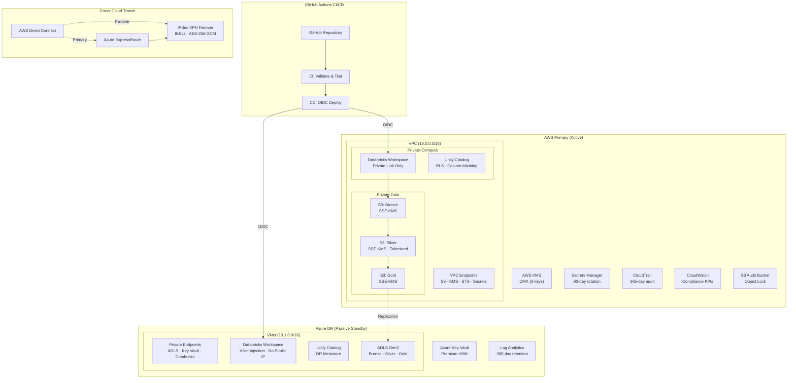

# Enterprise Multi-Cloud Medallion Data Platform

> **Active-Passive Pilot Light** | AWS Primary → Azure Disaster Recovery  
> **Compliance**: HIPAA · SOC 2 · PCI-DSS | **IaC**: Terraform + Databricks Asset Bundles

---

## Architecture Overview



## Quick Start

### Prerequisites

- Terraform >= 1.6.0
- Databricks CLI >= 0.210.0
- AWS CLI configured with appropriate IAM credentials
- Azure CLI authenticated (`az login`)
- Python >= 3.12

### Deploy Infrastructure

```bash
# AWS Primary
cd terraform/environments/production
terraform init
terraform plan -var-file=terraform.tfvars -out=plan.out
terraform apply plan.out

# Azure DR Standby
cd terraform/environments/dr-standby
terraform init
terraform plan -var-file=terraform.tfvars -out=plan.out
terraform apply plan.out
```

### Deploy Databricks Pipelines

```bash
cd databricks

# Validate both targets
databricks bundle validate -t aws_production
databricks bundle validate -t azure_dr_standby

# Deploy
databricks bundle deploy -t aws_production
databricks bundle deploy -t azure_dr_standby  # Paused schedule
```

### Run Tests

```bash
cd databricks
pip install pytest
pytest tests/ -v
```

## Project Structure

```
medallion-multicloud-platform/
├── terraform/
│   ├── environments/          # Root compositions per environment
│   │   ├── production/        # AWS Primary (active)
│   │   └── dr-standby/        # Azure DR (passive)
│   └── modules/               # Reusable Terraform modules
│       ├── aws-networking/    # VPC, VPC Endpoints, Direct Connect
│       ├── aws-security/      # KMS, Secrets Manager, IAM, CloudTrail
│       ├── aws-storage/       # S3 Medallion Buckets (Object Lock audit)
│       ├── aws-databricks/    # Workspace, Unity Catalog, Secret Scopes
│       ├── aws-monitoring/    # CloudWatch, Config, Compliance Dashboard
│       ├── azure-networking/  # VNet, NSGs, ExpressRoute
│       ├── azure-security/    # Key Vault, CMKs, Managed Identity
│       ├── azure-storage/     # ADLS Gen2, Private Endpoints
│       ├── azure-databricks/  # Workspace, Unity Catalog, Secret Scopes
│       ├── azure-monitoring/  # Log Analytics, Alerts
│       ├── cross-cloud-transit/ # DirectConnect ↔ ExpressRoute, IPSec VPN
│       └── secrets-rotation/  # Lambda + Azure Functions (90-day)
├── databricks/
│   ├── databricks.yml         # DAB manifest (aws_production + azure_dr_standby)
│   ├── src/                   # PySpark medallion pipeline
│   │   ├── bronze_ingestion.py
│   │   ├── silver_transformation.py  # PII tokenization
│   │   ├── gold_aggregation.py
│   │   └── utils/             # Encryption, DQ, Secrets helpers
│   ├── tests/                 # pytest unit tests
│   └── schemas/               # JSON schema definitions
├── .github/workflows/
│   ├── ci-validate.yml        # PR: pytest, SAST, bundle validate
│   └── cd-deploy.yml          # Push to main: OIDC → multi-cloud deploy
└── docs/                      # Architecture, Compliance, Runbooks
```

## Compliance Summary

| Standard | Key Controls | Implementation |
|----------|-------------|----------------|
| **HIPAA** | ePHI encryption, access audit | CMK encryption, PII tokenization, CloudTrail/Log Analytics |
| **SOC 2** | Access control, change management | OIDC federation, Unity Catalog RBAC, Config drift detection |
| **PCI-DSS** | Cardholder data protection | PAN format-preserving encryption, network segmentation, SAST gate |

## Documentation

- [Design & Requirements](docs/design-requirements.md) — Functional and non-functional requirements
- [Architecture Decision Records](docs/architecture.md) — Key design decisions with rationale
- [Compliance Matrix](docs/compliance-matrix.md) — HIPAA/SOC 2/PCI-DSS control-to-resource mapping
- [Operational Runbook](docs/operational-runbook.md) — Day-2 operations procedures
- [DR Failover Runbook](docs/dr-failover-runbook.md) — Disaster recovery activation procedures

## License

Proprietary — Internal use only. All compliance documentation subject to regulatory review.
