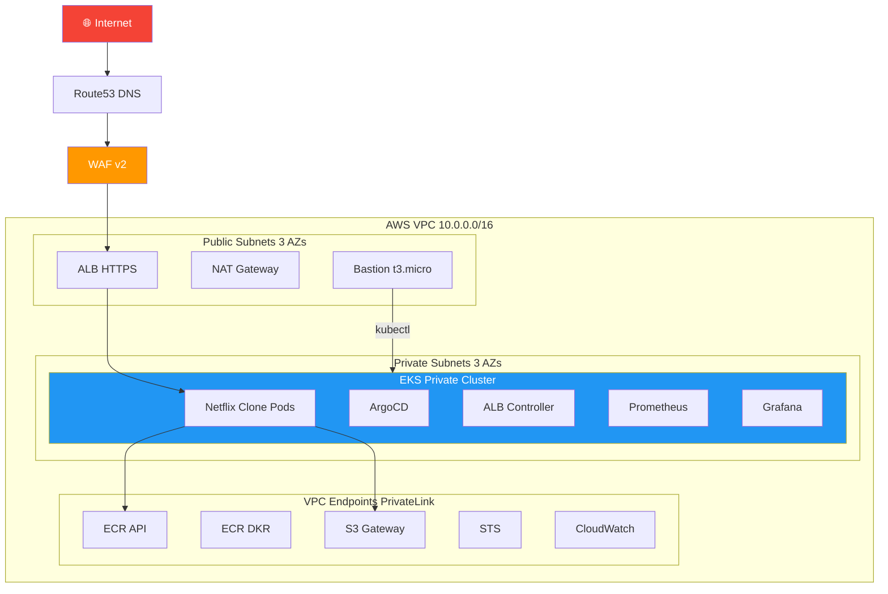
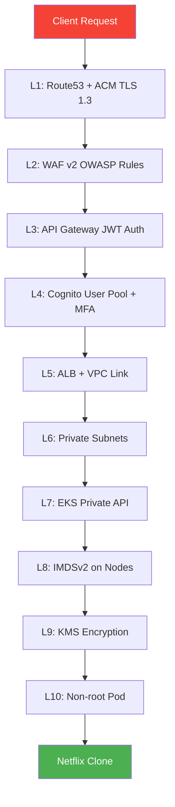
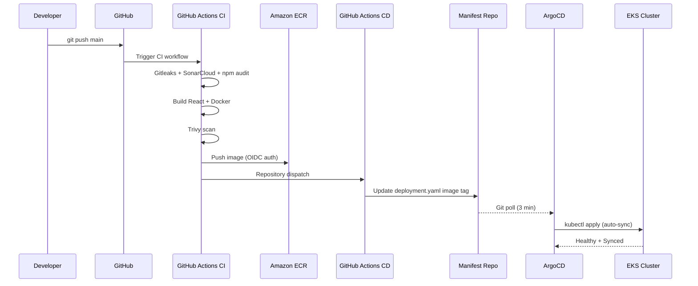
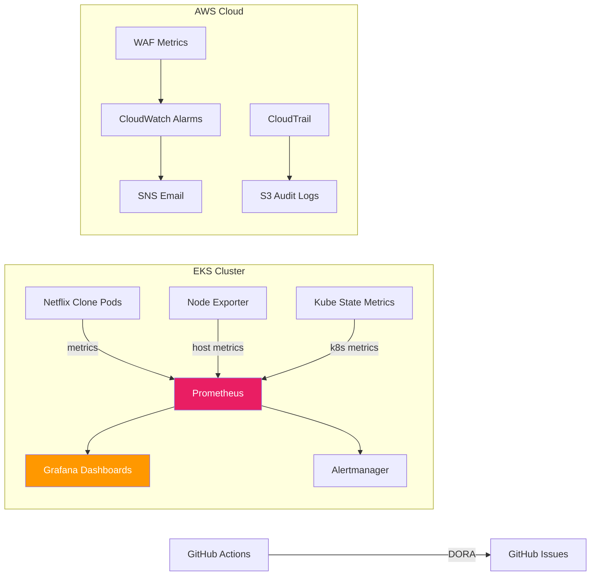

# 🏗️ Architecture — Netflix Clone DevSecOps

## CI/CD Pipeline Flow

```mermaid
graph LR
    A["Developer Push"] --> B["GitHub Actions CI"]
    B --> C["Gitleaks"]
    C --> D["SonarCloud SAST"]
    D --> E["npm audit SCA"]
    E --> F["React Build"]
    F --> G["Docker Build"]
    G --> H["Trivy Scan"]
    H --> I["ECR Push via OIDC"]
    I --> J["Trigger CD"]
    J --> K["Update Manifest Repo"]
    K --> L["ArgoCD Auto-Sync"]
    L --> M["EKS Deployment"]

    style A fill:#4CAF50,color:#fff
    style I fill:#FF9800,color:#fff
    style M fill:#2196F3,color:#fff
```

## Infrastructure Architecture

```mermaid
graph TB
    Internet["🌐 Internet"] --> Route53["Route53 DNS"]
    Route53 --> WAF["WAF v2"]
    WAF --> ALB["ALB HTTPS"]

    subgraph VPC["AWS VPC 10.0.0.0/16"]
        subgraph Public["Public Subnets 3 AZs"]
            ALB
            NAT["NAT Gateway"]
            Bastion["Bastion t3.micro"]
        end

        subgraph Private["Private Subnets 3 AZs"]
            subgraph EKS["EKS Private Cluster"]
                Pods["Netflix Clone Pods"]
                ArgoCD["ArgoCD"]
                ALBCtrl["ALB Controller"]
                Prom["Prometheus"]
                Graf["Grafana"]
            end
        end

        subgraph Endpoints["VPC Endpoints PrivateLink"]
            ECR_API["ECR API"]
            ECR_DKR["ECR DKR"]
            S3_EP["S3 Gateway"]
            STS_EP["STS"]
            CW_EP["CloudWatch"]
        end
    end

    ALB --> Pods
    Bastion -->|kubectl| EKS
    Pods --> ECR_API
    Pods --> S3_EP

    style Internet fill:#f44336,color:#fff
    style WAF fill:#FF9800,color:#fff
    style EKS fill:#2196F3,color:#fff
```

## Security Stack

```mermaid
graph TD
    Client["Client Request"] --> L1["L1: Route53 + ACM TLS 1.3"]
    L1 --> L2["L2: WAF v2 OWASP Rules"]
    L2 --> L3["L3: API Gateway JWT Auth"]
    L3 --> L4["L4: Cognito User Pool + MFA"]
    L4 --> L5["L5: ALB + VPC Link"]
    L5 --> L6["L6: Private Subnets"]
    L6 --> L7["L7: EKS Private API"]
    L7 --> L8["L8: IMDSv2 on Nodes"]
    L8 --> L9["L9: KMS Encryption"]
    L9 --> L10["L10: Non-root Pod"]
    L10 --> App["Netflix Clone"]

    style Client fill:#f44336,color:#fff
    style App fill:#4CAF50,color:#fff
```

## GitOps Deployment Flow

```mermaid
sequenceDiagram
    participant Dev as Developer
    participant GH as GitHub
    participant CI as GitHub Actions CI
    participant ECR as Amazon ECR
    participant CD as GitHub Actions CD
    participant Git as Manifest Repo
    participant Argo as ArgoCD
    participant EKS as EKS Cluster

    Dev->>GH: git push main
    GH->>CI: Trigger CI workflow
    CI->>CI: Gitleaks + SonarCloud + npm audit
    CI->>CI: Build React + Docker
    CI->>CI: Trivy scan
    CI->>ECR: Push image (OIDC auth)
    CI->>CD: Repository dispatch
    CD->>Git: Update deployment.yaml image tag
    Git-->>Argo: Git poll (3 min)
    Argo->>EKS: kubectl apply (auto-sync)
    EKS-->>Argo: Healthy + Synced
```

## Monitoring Architecture

```mermaid
graph LR
    subgraph EKS["EKS Cluster"]
        App["Netflix Clone Pods"] -->|metrics| Prom["Prometheus"]
        Nodes["Node Exporter"] -->|host metrics| Prom
        KSM["Kube State Metrics"] -->|k8s metrics| Prom
        Prom --> Grafana["Grafana Dashboards"]
        Prom --> AM["Alertmanager"]
    end

    subgraph AWS["AWS Cloud"]
        CW["CloudWatch Alarms"] --> SNS["SNS Email"]
        CT["CloudTrail"] --> S3["S3 Audit Logs"]
        WAF_M["WAF Metrics"] --> CW
    end

    GHA["GitHub Actions"] -->|DORA| Issues["GitHub Issues"]

    style Grafana fill:#FF9800,color:#fff
    style Prom fill:#E91E63,color:#fff
```
